#  Ⅰ 学习资料


##  学习资源


> ### Golang


博客：


[Go语言圣经 ]([介绍-地鼠文档 (topgoer.cn)](https://www.topgoer.cn/docs/gopl-zh/gopl-zh-1d29qo5qbk3js))：相当于Go基础的官方文档

[Effective Go](https://www.topgoer.cn/docs/effective/effective-1d2caa9cejtoe)

[极客时间 TonyBai Go语言第一课](E:\I can do all things!\Go\极客时间课程\0 Go新手\1 Go语言第一课): 基础知识详解

[Go专家编程]([前言-地鼠文档 (topgoer.cn)](https://www.topgoer.cn/docs/gozhuanjia/gogfjhk)):Go进阶学习，针对Go语法中的底层实现讲解

[Go语言原本]([Changkun Ou | Go 语言原本 (golang.design)](https://golang.design/under-the-hood/)) : 讨论 Go 语言源码工程中的技术原理及其演进历程的书籍

[Golang修养之路刘丹冰]([封面 · Golang修养之路 · 看云 (kancloud.cn)](https://www.kancloud.cn/aceld/golang/1858955))： 针对Golang专题性热门技术深入理解

[Concurrency in Go]([前序-地鼠文档 (topgoer.cn)](https://www.topgoer.cn/docs/concurrency/concurrency-1clil1p5dplf0))

[极客时间并发编程实战]([Effective Go](https://www.topgoer.cn/docs/effective/effective-1d2caa9cejtoe)) ：大量并发原语底层介绍

[go语言高级编程](https://chai2010.cn/advanced-go-programming-book/)

[Go语言设计与实现](https://draveness.me/golang/)


[gin框架中文文档]([简介-地鼠文档 (topgoer.cn)](https://www.topgoer.cn/docs/ginkuangjia/ginkuangjia-1c50hfaag99k2))

[beego框架中文文档]([简介-地鼠文档 (topgoer.cn)](https://www.topgoer.cn/docs/beegozhongwenwendang/beegozhongwenwendang-1c5087bb5qpst))


视频：

[幼麟实验室]([【幼麟实验室】Golang合辑_哔哩哔哩_bilibili](https://www.bilibili.com/video/BV1hv411x7we?p=1)) ：一个小视频对应一个知识点，强化记忆

[b站刘丹冰]([刘丹冰Aceld的个人空间_哔哩哔哩_bilibili](https://space.bilibili.com/373073810)) : 精炼利索的讲解


> ### 计算机基础


- 数据结构与算法

[解析数据结构和算法](https://www.topgoer.cn/docs/data-structures-questions/data-structures-questions-1d94smov8irdb) ：Golang的数据结构算法及基础知识合集

[代码随想录](https://programmercarl.com/) ： 以此为主要，精通，然后后面三个做参考补充

[LC&CIG](https://doocs.gitee.io/leetcode/#/) : 覆盖了剑指系列，然后是专题,包括了代码随想录没有的排序，图论等

[labuladong](https://labuladong.gitee.io/algo/)

[宫水三叶](https://github.com/SharingSource/LogicStack-LeetCode/wiki)


- 计算机网络

[b站湖科大教书匠]([湖科大教书匠的个人空间_哔哩哔哩_bilibili](https://space.bilibili.com/360996402?spm_id_from=333.337.0.0))

[小林coding]([小林coding - 博客园 (cnblogs.com)](https://www.cnblogs.com/xiaolincoding/))

[图解HTTP](E:\I can do all things!\学习书籍)

 [图解TCP/IP](E:\I can do all things!\学习书籍)


- 操作系统：

书籍：深入理解操作系统

[小林coding]([小林coding - 博客园 (cnblogs.com)](https://www.cnblogs.com/xiaolincoding/))


- 设计模式：

大话设计模式


- 数据库

[极客时间redis技术实战](E:\I can do all things!\Go\极客时间课程\2 高级Go语言工程师\3 Redis核心技术实战)

[MYSQL必知必会](E:\I can do all things!\学习书籍)

[极客时间MYSQL实战45讲](E:\I can do all things!\Go\极客时间课程\3 八股文系列)


- Linux

[linux就该这么学](E:\I can do all things!\学习书籍)

[极客时间Linux实战技能](E:\I can do all things!\Go\极客时间课程\1 初级Go语言工程师\2 Linux 实战技能)


---

---

# Ⅱ GO基础语法学习

---

`根据 李文周博客，TonyBaiGo语言第一课 整理而来`

---

## 0 Go的前世今生


> #### Go 语言是怎样诞生的？

 	    **Go 语言的创始人**有三位，分别是图灵奖获得者、C 语法联合发明人、Unix 之父肯·汤普森（Ken Thompson），Plan 9 操作系统领导者、UTF-8 编码的最初设计者罗伯·派克（Rob Pike），以及 Java 的 HotSpot 虚拟机和 Chrome 浏览器的 JavaScript V8 引擎的设计者之一罗伯特·格瑞史莫（Robert Griesemer）
 	
 	**之所以有这种想法，是因为**当时的谷歌内部主要使用 C++ 语言构建各种系统，但 C++ 的巨大复杂性、编译构建速度慢以及在编写服务端程序时对并发支持的不足
 	
 	**主要思路是**，在 C 语言的基础上，修正一些明显的缺陷，删除一些被诟病较多的特性，增加一些缺失的功能，比如，使用 import 替代 include、去掉宏、增加垃圾回收、支持接口等


> #### Go语言的设计哲学


1. **简单**	

Go 语言的设计者们在语言设计之初，就拒绝了走语言特性融合的道路，选择了“做减法”并致力于打造一门简单的编程语言。

- 仅有 25 个关键字，主流编程语言最少；

- 内置垃圾收集，降低开发人员内存管理的心智负担；

- 首字母大小写决定可见性，无需通过额外关键字修饰；

- 变量初始为类型零值，避免以随机值作为初值的问题；

- 内置数组边界检查，极大减少越界访问带来的安全隐患；

- 内置并发支持，简化并发程序设计；

- 内置接口类型，为组合的设计哲学奠定基础；

- 原生提供完善的工具链，开箱即用；

- … …


2. **显示**

   在 Go 语言中，不同类型变量是不能在一起进行混合计算的，这是**因为 Go 希望开发人员明确知道自己在做什么**，这与 C 语言的“信任程序员”原则完全不同，因此你需要以显式的方式通过转型统一参与计算各个变量的类型。

   除此之外，Go 设计者所崇尚的显式哲学还直接决定了 Go 语言错误处理的形态：Go 语言采用了显式的基于值比较的错误处理方案，函数 / 方法中的错误都会通过 return 语句显式地返回，并且通常调用者不能忽略对返回的错误的处理

   

3. **组合**

 这个设计哲学和我们各个程序之间的耦合有关，Go 语言不像 C++、Java 等主流面向对象语言，我们在 Go 中是找不到经典的面向对象语法元素、类型体系和继承机制的，Go 推崇的是组合的设计哲学。

在诠释组合之前，我们需要先来了解一下 Go 在语法元素设计时，是如何为“组合”哲学的应用奠定基础的。

在 Go 语言设计层面，Go 设计者为开发者们提供了正交的语法元素，以供后续组合使用，包括：

- Go 语言无类型层次体系，各类型之间是相互独立的，没有子类型的概念；

- 每个类型都可以有自己的方法集合，类型定义与方法实现是正交独立的；

- 实现某个接口时，无需像 Java 那样采用特定关键字修饰；

- 包之间是相对独立的，没有子包的概念。

我们可以看到，无论是包、接口还是一个个具体的类型定义，Go 语言其实是为我们呈现了这样的一幅图景：一座座没有关联的“孤岛”，但每个岛内又都很精彩。那么现在摆在面前的工作，就是在这些孤岛之间以最适当的方式建立关联，并形成一个整体。**而 Go 选择采用的组合方式，也是最主要的方式。**

Go 语言为支撑组合的设计提供了**类型嵌入**（Type Embedding）。通过类型嵌入，我们可以将已经实现的功能嵌入到新类型中，以快速满足新类型的功能需求，这种方式有些类似经典面向对象语言中的“继承”机制，但在原理上却与面向对象中的继承完全不同，这是一种 Go 设计者们精心设计的“语法糖”。

被嵌入的类型和新类型两者之间没有任何关系，甚至相互完全不知道对方的存在，更没有经典面向对象语言中的那种父类、子类的关系，以及向上、向下转型（Type Casting）。通过新类型实例调用方法时，方法的匹配主要取决于方法名字，而不是类型。这种组合方式，我称之为**垂直组合**，即通过类型嵌入，快速让一个新类型“复用”其他类型已经实现的能力，实现功能的垂直扩展。

**水平组合**是一种能力委托（Delegate），我们通常使用接口类型来实现水平组合。	Go 语言中的接口是一个创新设计，它只是方法集合，并且它与实现者之间的关系无需通过显式关键字修饰，它让程序内部各部分之间的耦合降至最低，同时它也是连接程序各个部分之间“纽带”

4. **并发**

“并发”这个设计哲学的出现有它的背景，你也知道 CPU 都是靠提高主频（即时钟频率）来改进性能的，但是现在这个做法已经遇到了瓶颈。主频提高导致 CPU 的功耗和发热量剧增，反过来制约了 CPU 性能的进一步提高。2007 年开始，处理器厂商的竞争焦点从主频转向了多核。

在这种大背景下，Go 的设计者在决定去创建一门新语言的时候，果断将面向多核、原生支持并发作为了新语言的设计原则之一。并且，Go 放弃了传统的基于操作系统线程的并发模型，而采用了**用户层轻量级线程**，Go 将之称为 **goroutine。**

goroutine 占用的资源非常小，Go 运行时默认为每个 goroutine 分配的栈空间仅 2KB。goroutine 调度的切换也不用陷入（trap）操作系统内核层完成，代价很低。因此，一个 Go 程序中可以创建成千上万个并发的 goroutine。而且，所有的 Go 代码都在 goroutine 中执行，哪怕是 go 运行时的代码也不例外。


5. **面向工程**

Go 语言设计的初衷，就是面向解决真实世界中 Google 内部大规模软件开发存在的各种问题，为这些问题提供答案，这些问题包括：程序构建慢、依赖管理失控、代码难于理解、跨语言构建难等。

Go 在语法设计细节上做了精心的打磨。比如：

- 重新设计编译单元和目标文件格式，实现 Go 源码快速构建，让大工程的构建时间缩短到类似动态语言的交互式解释（import方式）的编译速度；

- 如果源文件导入它不使用的包，则程序将无法编译。这可以充分保证任何 Go 程序的依赖树是精确的。这也可以保证在构建程序时不会编译额外的代码，从而最大限度地缩短编译时间；

- 去除包的循环依赖，循环依赖会在大规模的代码中引发问题，因为它们要求编译器同时处理更大的源文件集，这会减慢增量构建；

- 包路径是唯一的，而包名不必唯一的。导入路径必须唯一标识要导入的包，而名称只是包的使用者如何引用其内容的约定。“包名称不必是唯一的”这个约定，大大降低了开发人员给包起唯一名字的心智负担；

- 故意不支持默认函数参数。因为在规模工程中，很多开发者利用默认函数参数机制，向函数添加过多的参数以弥补函数 API 的设计缺陷，这会导致函数拥有太多的参数，降低清晰度和可读性；

- 增加类型别名（type alias），支持大规模代码库的重构。

在标准库方面，Go 被称为“自带电池”的编程语言。如果说一门编程语言是“自带电池”，则说明这门语言标准库功能丰富，多数功能不需要依赖外部的第三方包或库，Go 语言恰恰就是这类编程语言。


---

##                                                                                         ==GO基础之框架构成==

---

## 1 变量，常量及运算符


### 1.1 变量

​								**Go 语言崇尚“做一件事只用一种方法”，但变量声明却似乎是一个例外**。

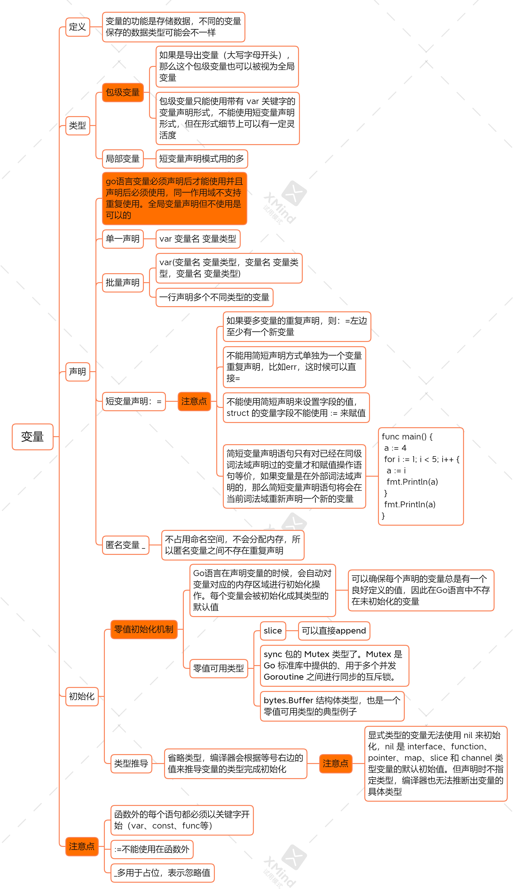


### 1.2 常量


### 1.3 运算符


分类：算术，关系，逻辑，位，赋值


**注意点：`++`（自增）和`--`（自减）在Go语言中是单独的语句，并不是运算符**


## 2 代码块与作用域


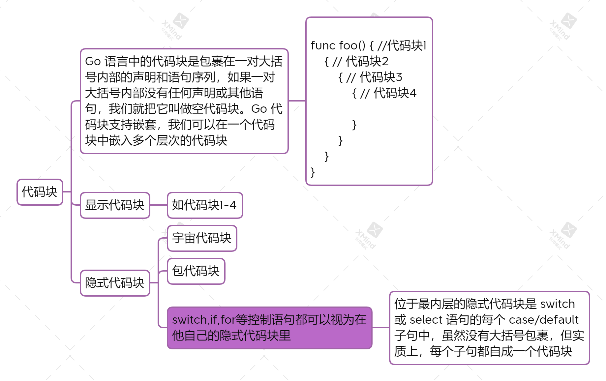

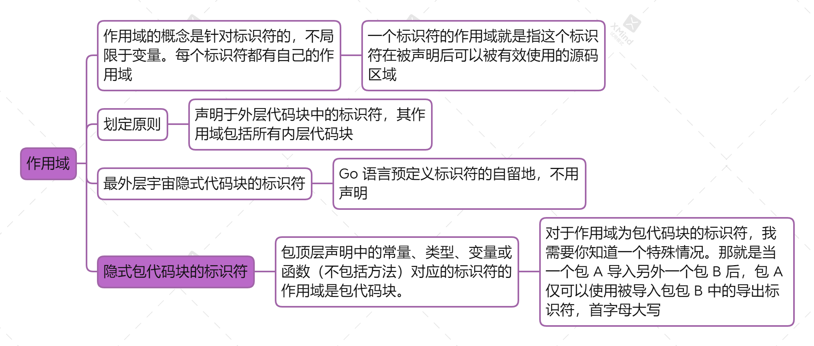


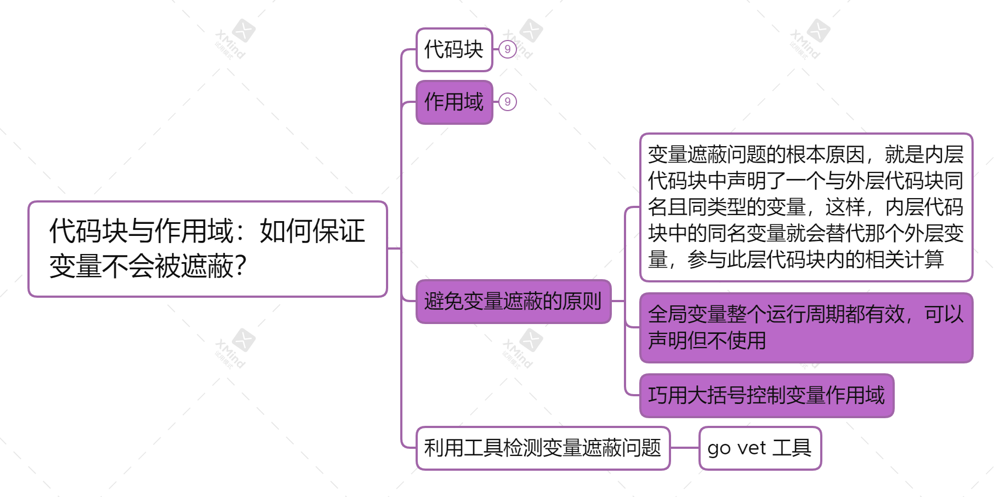


## 3 流程控制

### 3.1 if

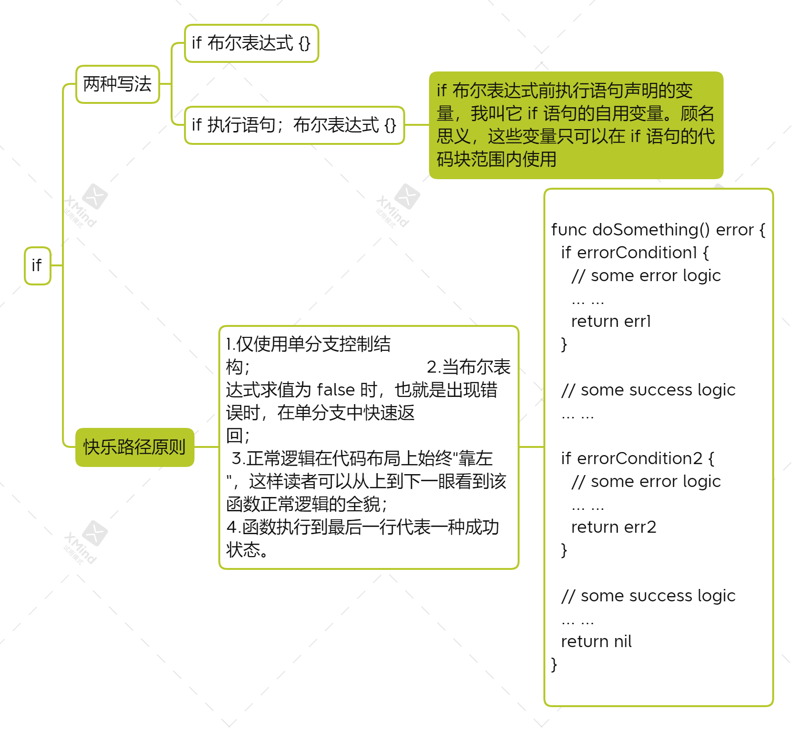

**易错点：**

**1.两个if语句如果是并列关系，这两个if快不能相互影响，否则要写成if elseif 形式**

```go
if count > max  {
            result = []int{node.Val}
            max = count
        }
        if count == max {
            result = append(result, node.Val)
        }
```

上面的if里面的max设置会影响下面if的判断！！！


### **3.2 for**


### 3.3 switch


### 3.4 跳转标签


### 3.5 slect

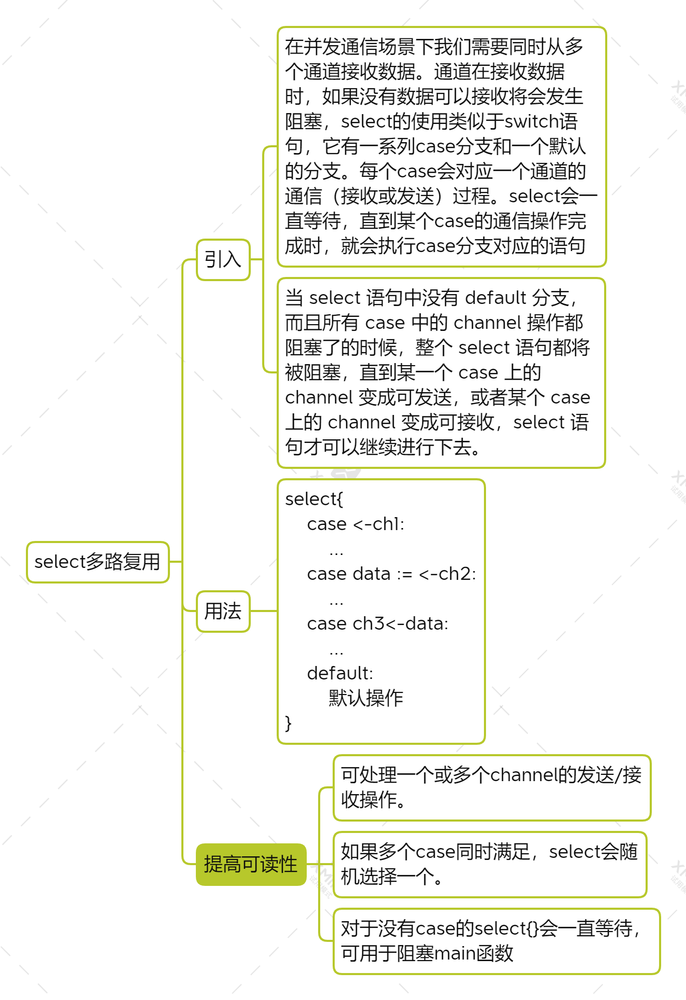


---

##                                                                                    ==GO基础之数据类型==

---

## 4 基本类型

​                                                                **类型转换法则：强制类型转化type(表达式)**

### 4.1 整型

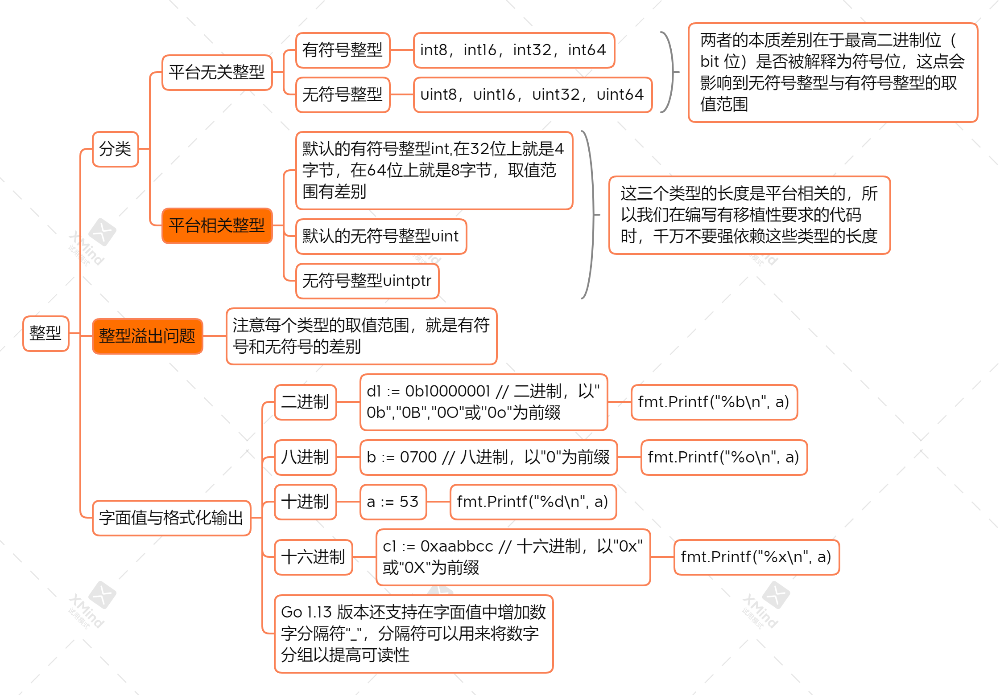


### 4.2 浮点型

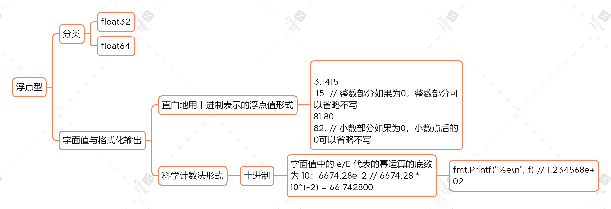


### 4.3 复数和布尔型

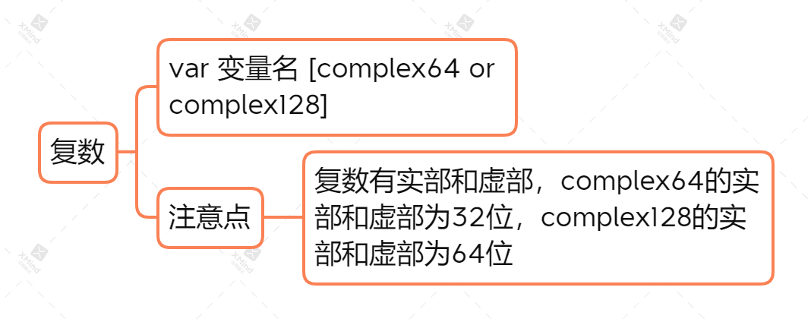

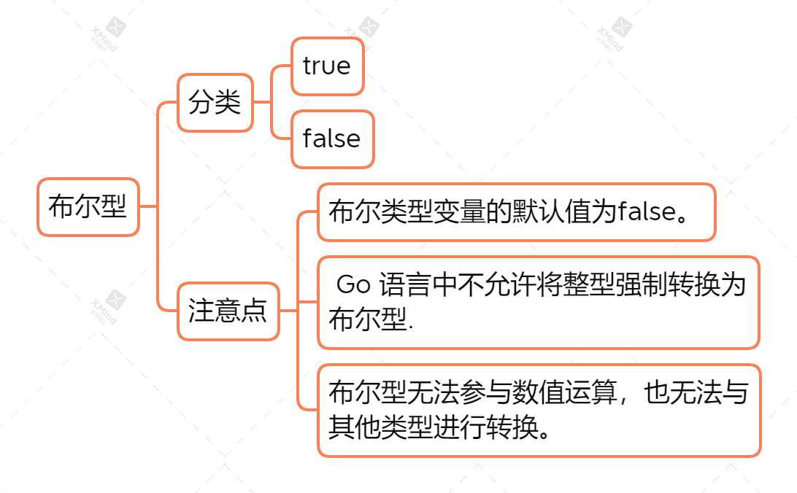


### 4.4 创建自定义的数值类型


### 4.5 string:原生支持

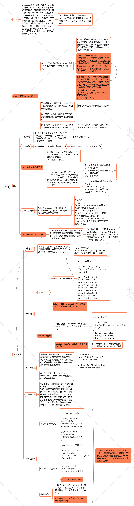


## 5 数组


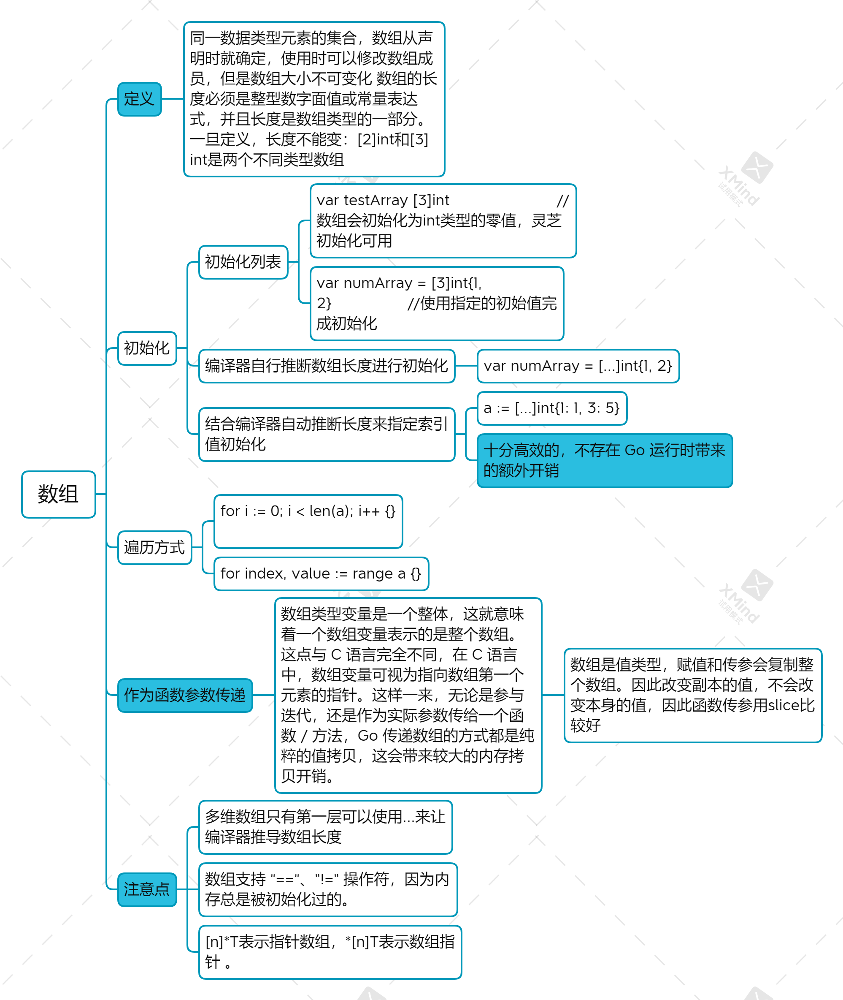


## 6 slice


### 6.1 定义与内部实现原理


### 6.2 初始化

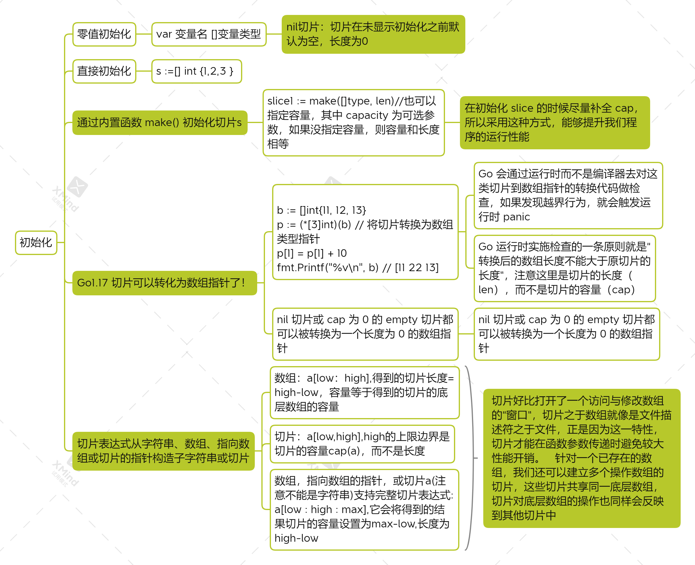


### 6.3 与数组区别

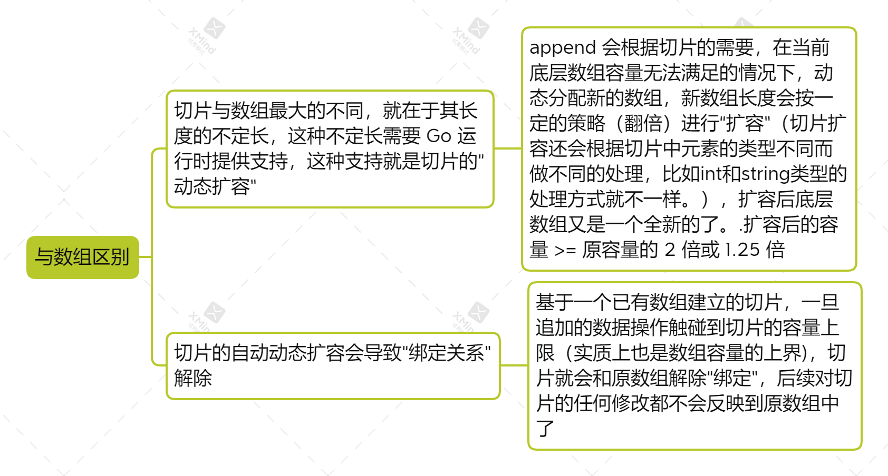


### 6.4 基本操作


## 7 container包的容器

### container/list

Go 语言的链表实现在标准库的`container/list`代码包中。这个代码包中有两个公开的程序实体——`List`和`Element`，List 实现了一个双向链表（以下简称链表），而 Element 则代表了链表中元素的结构。其实`List`在内部就是一个循环链表。它的根元素永远不会持有任何实际的元素值，而该元素的存在就是为了连接这个循环链表的首尾两端。所以也可以说，**`List`的零值是一个只包含了根元素，但不包含任何实际元素值的空链表。**

我们首先先了解List的这四种方法

```go
func (l *List) MoveBefore(e, mark *Element)
func (l *List) MoveAfter(e, mark *Element)
 
func (l *List) MoveToFront(e *Element)
func (l *List) MoveToBack(e *Element)
```

在这些方法中，“给定的元素”都是`*Element`类型的，`*Element`类型是`Element`类型的指针类型，`*Element`的值就是元素的指针

那么如果我们自己生成这样的值，然后把它作为“给定的元素”传给链表的方法，那么会发生什么？链表会接受它吗？

这里，给出一个**典型回答**：不会接受，这些方法将不会对链表做出任何改动。因为我们自己生成的`Element`值并不在链表中，所以也就谈不上“在链表中移动元素”。更何况链表不允许我们把自己生成的`Element`值插入其中。

我们该如何使用链表来操作增删改查呢？

在`List`包含的方法中，用于插入新元素的那些方法都只接受`interface{}`类型的值。这些方法在内部会使用`Element`值，包装接收到的新元素。这样做正是为了避免直接使用我们自己生成的元素，主要原因是避免链表的内部关联，遭到外界破坏，这对于链表本身以及我们这些使用者来说都是有益的。所以我们应该用以下方法 : **这些方法都会把一个`Element`值的指针作为结果返回，它们就是链表留给我们的安全“接口”。 拿到这些内部元素的指针，我们就可以去调用前面提到的用于移动元素的方法了**

```go
func (l *List) Front() *Element
func (l *List) Back() *Element
 
func (l *List) InsertBefore(v interface{}, mark *Element) *Element//分别用于在指定的元素之前和之后插入新元素，

func (l *List) InsertAfter(v interface{}, mark *Element) *Element
 
func (l *List) PushFront(v interface{}) *Element //分别用于在链表的最前端和最后端插入新元素。
func (l *List) PushBack(v interface{}) *Element
```


> **为什么链表可以开箱即用呢？**

`List`和`Element`都是结构体类型。结构体类型有一个特点，那就是它们的零值都会是拥有特定结构，但是没有任何定制化内容的值，相当于一个空壳。值中的字段也都会被分别赋予各自类型的零值。并且和slice等一样是零值初始化可用类型。

**零值初始化类型：**实际上是有一种延迟初始化机制。我们可以理解为把初始化操作延后，仅在实际需要的时候才进行。延迟初始化的优点在于“延后”，它可以分散初始化操作带来的计算量和存储空间消耗

在这里的链表实现中，一些方法是无需对是否初始化做判断的。比如`Front`方法和`Back`方法，一旦发现链表的长度为`0`, 直接返回`nil`就好了。又比如，在用于删除元素、移动元素，以及一些用于插入元素的方法中，只要判断一下传入的元素中指向所属链表的指针，是否与当前链表的指针相等就可以了。如果不相等，就一定说明传入的元素不是这个链表中的，后续的操作就不用做了。反之，就一定说明这个链表已经被初始化了。

原因在于，链表的`PushFront`方法、`PushBack`方法、`PushBackList`方法以及`PushFrontList`方法总会先判断链表的状态，并在必要时进行初始化，这就是延迟初始化。而且，我们在向一个空的链表中添加新元素的时候，肯定会调用这四个方法中的一个，这时新元素中指向所属链表的指针，一定会被设定为当前链表的指针。所以，指针相等是链表已经初始化的充分必要条件。


## 8 Map

### 8.1 定义与内部实现原理


### 8.2 初始化


### 8.3 基本操作

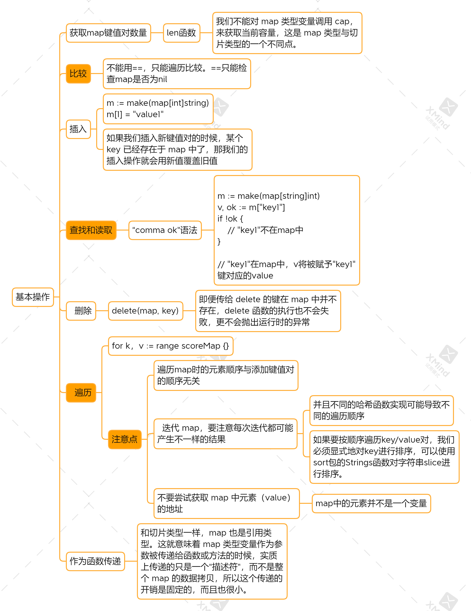


### 8.4 map在并发下安全实现

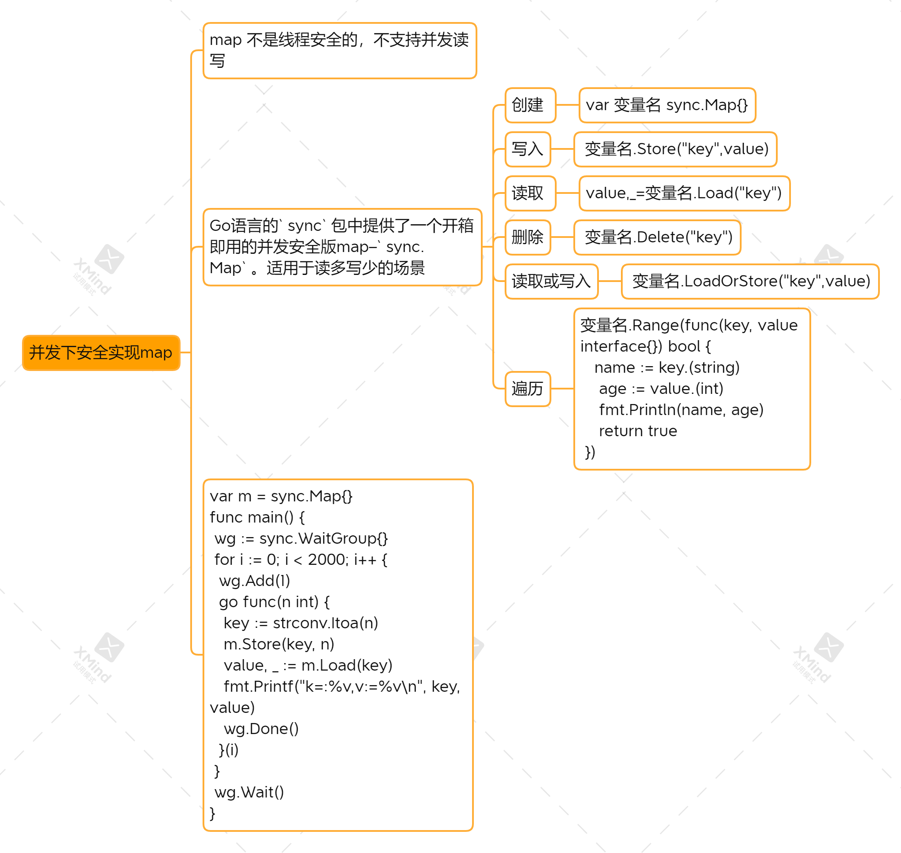


## 9 一等公民：函数

### 9.1 定义


**只要声明函数的返回值变量名称，就会在函数初始化时候为之赋值为0，而且在函数体作用域可见**

### 9.2 头等函数（一等公民）


### 9.3 利用多返回值进行错误处理

#### 9.3.1 C错误处理机制


#### 9.3.2 Go错误处理机制


#### 9.3.3 Go错误处理常见策略


### 9.4 让函数更简洁健壮

#### 9.4.1 健壮性原则


#### 9.4.2 panic


#### 9.4.3 简洁：defer


defer考点：

- **defer 最大的功能是 panic 后依然有效**
  所以defer可以保证你的一些资源一定会被关闭，从而避免一些异常出现的问题

  ​	defer遇见panic,不捕获

```
func main() {
    defer_call()

    fmt.Println("main 正常结束")
}

func defer_call() {
    defer func() { fmt.Println("defer: panic 之前1") }()
    defer func() { fmt.Println("defer: panic 之前2") }()

    panic("异常内容")  //触发defer出栈

	defer func() { fmt.Println("defer: panic 之后，永远执行不到") }()
}
defer: panic 之前2
defer: panic 之前1
panic: 异常内容
//... 异常堆栈信息
```

​			defer遇见panic，捕获异常

```
func main() {
    defer_call()

    fmt.Println("main 正常结束")
}

func defer_call() {

    defer func() {
        fmt.Println("defer: panic 之前1, 捕获异常")
        if err := recover(); err != nil {
            fmt.Println(err)
        }
    }()

    defer func() { fmt.Println("defer: panic 之前2, 不捕获") }()

    panic("异常内容")  //触发defer出栈

	defer func() { fmt.Println("defer: panic 之后, 永远执行不到") }()
}
defer: panic 之前2, 不捕获
defer: panic 之前1, 捕获异常
异常内容
main 正常结束
```

​			defer中包含panic

```
func main()  {

    defer func() {
       if err := recover(); err != nil{
           fmt.Println(err)
       }else {
           fmt.Println("fatal")
       }
    }()

    defer func() {
        panic("defer panic")
    }()

    panic("panic")
}
//defer panic
panic仅有最后一个可以被revover捕获。

触发panic("panic")后defer顺序出栈执行，第一个被执行的defer中 会有panic("defer panic")异常语句，这个异常将会覆盖掉main中的异常panic("panic")，最后这个异常被第二个执行的defer捕获到
```

- **函数返回值命名结合defer**

```GO
func returnButDefer() (t int) {  //t初始化0， 并且作用域为该函数全域

    defer func() {
        t = t * 10
    }()

    return 1
}

func main() {
    fmt.Println(returnButDefer())
}
```

 该`returnButDefer()`本应的返回值是`1`，但是在return之后，又被defer的匿名func函数执行，所以`t=t*10`被执行，最后`returnButDefer()`返回给上层`main()`的结果为`10`

- **那些函数可以哪些不可以作为defer函数？**

对于自定义的函数或方法，defer 可以给与无条件的支持。append、cap、len、make、new、imag 等内置函数都是不能直接作为 deferred 函数的，而 close、copy、delete、print、recover 等内置函数则可以直接被 defer 设置为 deferred 函数。不过，对于那些不能直接作为 deferred 函数的内置函数，我们可以使用一个包裹它的匿名函数来间接满足要求，以 append 为例是这样的：

```go
defer func(){
    _ = append(sl, 11)
}()
```

- **defer后面表达式求值时机：**defer 关键字后面的表达式，是在将 deferred 函数注册到 deferred 函数栈的时候进行求值的。

例1

```go
func foo1() {
 for i := 0; i <= 3; i++ {
 defer fmt.Println(i)
 }
}
func foo2() {
 for i := 0; i <= 3; i++ {
 defer func(n int) {
 fmt.Println(n)
 }(i)
 }
}
func foo3() {
    for i := 0; i <= 3; i++ {
 defer func() {
 fmt.Println(i)
 }()
 }
}
func main() {
 fmt.Println("foo1 result:")
 foo1()
 fmt.Println("\nfoo2 result:")
 foo2()
 fmt.Println("\nfoo3 result:")
 foo3()
}

```

这里，我们一个个分析 foo1、foo2 和 foo3 中 **defer 后的表达式**的求值时机

首先是 foo1。foo1 中 **defer 后面直接用的是 fmt.Println 函数，**每当 defer 将 **fmt.Println 注册到 deferred 函数栈**的时候，都会对 Println 后面的参数进行求值。根据上述代码逻辑，依次压入 deferred 函数栈的函数是：

```go
fmt.Println(0)
fmt.Println(1)
fmt.Println(2)
fmt.Println(3)

```

foo2 中 defer 后面接的是一个带有一个参数的匿名函数。**每当 defer 将匿名函数注册到 deferred 函数栈的时候，都会对该匿名函数的参数进行求值。**根据上述代码逻辑，依次压入 deferred 函数栈的函数是：

```go
func(0)  也就可以理解为：fmt.Println(0)
func(1)
func(2)
func(3)
```

foo3 中 defer 后面接的是一个不带参数的匿名函数。根据上述代码逻辑，依次压入 deferred 函数栈的函数是：

```go
func() 也就可以理解为： fmt.Println(i)
func()
func()
func()
```

当 foo3 返回后，deferred 函数被调度执行时，上述压入栈的 deferred 函数将以 LIFO 次序出栈执行。匿名函数会以闭包的方式访问外围函数的变量 i，并通过 Println 输出 i 的值，此时 i 的值为 4，因此 foo3 的输出结果为：都为4。

**总结：**我们可以看到，无论以何种形式将函数注册到 defer 中，**deferred 函数的参数值都是在注册的时候进行求值的**，如果是闭包引用，在注册的时候是没有参数的，所以没求值，只有执行的时候根据实际来。**但我们要弄懂defer函数到底是什么。**

经典比方例2：

```go
func Trace(name string) func() {
    println("enter:", name)
    return func() {
        println("exit:", name)
    }
}
func main() {
    defer Trace("main")()
    foo()
}
```

**这里被压入栈的函数==的trace里面的闭包函数，（错的）==（也可以理解为trace函数但参数确定了，就是Trace函数），闭包引用的也是备份参数，首先在注册trace函数的时候就确定了参数并备份，返回了一个闭包函数压入栈，这里闭包函数虽然是引用传值，但参数备份一直在那没变**。

例3

```go
func calc(index string, a, b int) int {
	ret := a + b
	fmt.Println(index, a, b, ret)
	return ret
}
func main() {
	x := 1
	y := 2
	defer calc("AA", x, calc("A", x, y))
	x = 10
	defer calc("BB", x, calc("B", x, y))
	y = 20
}
//A 1 2 3
//B 10 2 12
//BB 10 12 22
//AA 1 3 4
```

**例4：**

```go
func F(n int) func() int {
	return func() int {
		n++
		fmt.Println("里面的：", n)
		return n
	}
}
func main() {
	f := F(5)
	defer func() {
		fmt.Println("第一个：", f())
	}()
	defer fmt.Println("第二个", f()) //defer后跟的函数，如果有参数的话会先计算参数的值
	i := f()
	fmt.Println(i)
}
//里面的： 6
///里面的： 7
//7
//第二个 6
//里面的， ： 8
//第一个： 8
```

这个题就有难度了，但是任何时候我们都要清楚**defer函数的参数和defer函数对外部变量的引用方式**。

首先`f := F(5)`定义了一个闭包函数，函数对外部变量为闭包引用。

第一个defer函数是`fun()()`只有对外部变量f有一个闭包引用需要根据实际的f()来确定。

第二个defer函数是` fmt.Println("第二个", f())`，此时有参数`f()`，确定此时参数为`F(5)()`，所以会输出`里面的6`,并把参数结果备份即`return 6`。

然后`i := f()`，注意是对n的闭包引用，此时n初始为6，所以会输出`里面的：7`，紧接着i=7,输出7

最后先打印`第二个 6`，因为这是之前保存的参数。然后会执行第一个defer函数是`fun()()`，先执行`f()`,注意是对n的闭包引用。此时输出`里面的：8`，紧接着打印`第一个：8`

这个题型稍微改一下：

```go
func F(n int) func() int {
	return func() int {
		n++
		fmt.Println("里面的：", n)
		return n
	}
}

func main() {
defer func() {
		fmt.Println("第一个：", F(5)())
	}()
	defer fmt.Println("第二个", F(5)()) //defer后跟的函数，如果有参数的话会先计算参数的值
	i := F(5)()
	fmt.Println(i)
}
//里面的： 6
// 里面的： 6
// 6
// 第二个 6  
// 里面的： 6
// 第一个： 6
```

这是为什么呢？

这是与闭包函数运行实例调用方式有关！！！见9.2小节知识点


## 10 方法 : Go的组合哲学


### 10.1 本质及定义

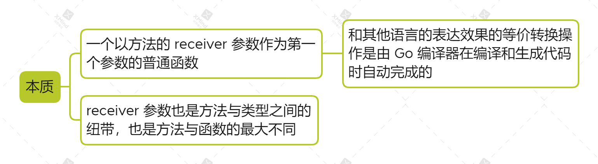


### 10.2 如何选择reciver

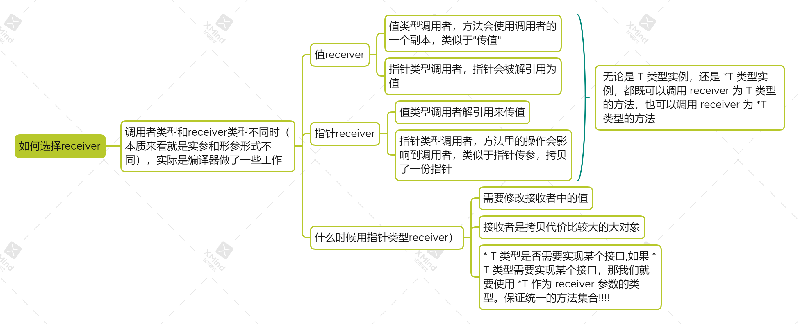

### 10.3 方法集合


### 10.4 类型嵌入实现继承：扩展方法集合

 

#### 10.4.1 自己设计：显示嵌入


#### 10.4.2  显示“类型嵌入”


## 11 指针


**引用类型变量只有声明并分配内存后才能使用，对于值类型已经默认分配好内存。所以要用到new和make。**

make和new：

**相同点：**堆空间的分配

**不同点**：make只用于slice,map,channel的初始化。new用于引用类型的内存分配初始化，初始化值为0，一般用的少，因为像函数，接口，指针都可以采用短语句声明以及结构体字面量达到目的（为什么说结构体字面量是因为有些引用变量会嵌套在结构体中，结构体不是引用类型变量）


## 12 面向对象：结构体


### 12.1 定义

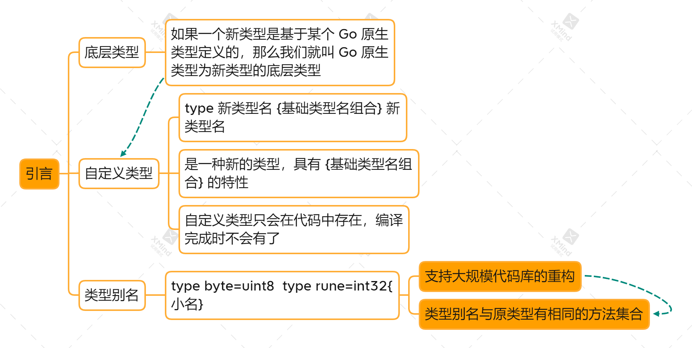


### 12.2 声明及初始化

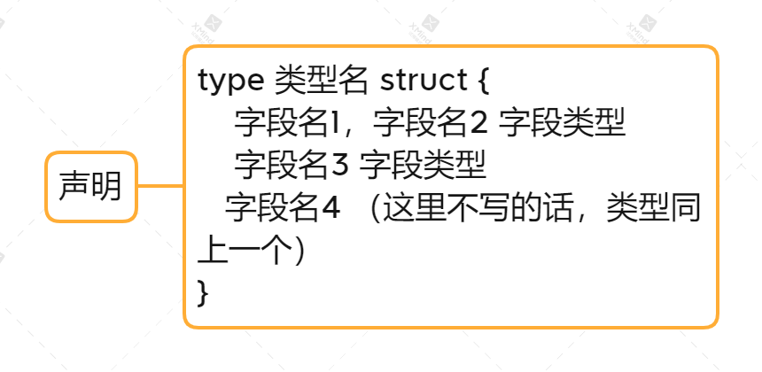


### 12.3 结构体内存布局

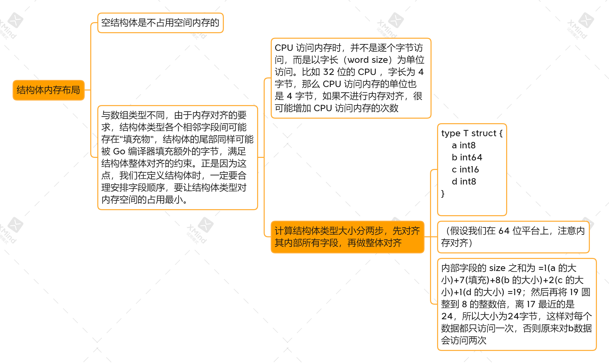

### 12.4 结构体与json序列化

**Json序列化**指，将具有key-value(键 -> 值)结构的数据类型，例如：go语言中的map, slice，struct...序列化成json格式的字符串的操作。json是一种主流的数据传输格式，灵活轻便


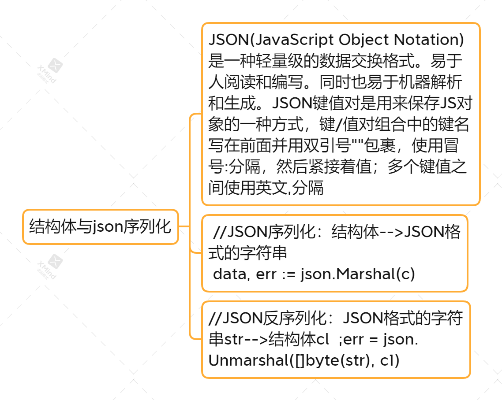

### 12.5 结构体tag

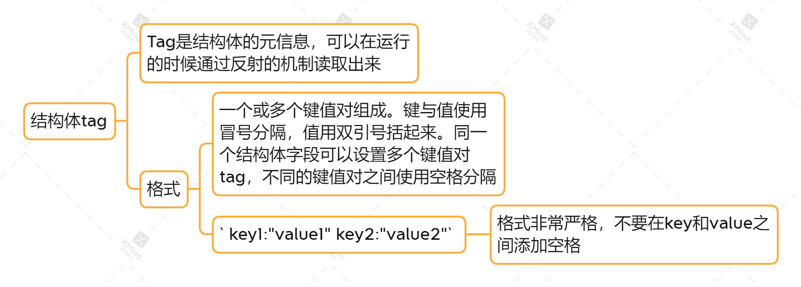


## 13 实现多态：接口


### 13.1 定义


注意点：**即接口嵌入接口有方法重合的情况下方法不能重载**


​		**接口嵌套，如果子父接口有一样的方法，则调用父接口方法会覆盖子接口的方法。**

### 13.2 多态：接口实现


### 13.3 接口应用模式


### 13.4 面向对象设计原则

在面向对象设计中，需要按照以下六个原则进行设计，代码才具有可读性/可扩展性等，实现**高内聚低耦合**。

- [开闭原则](https://zhuanlan.zhihu.com/p/261369966)
- 单一职责原则
- [依赖倒置原则](https://zhuanlan.zhihu.com/p/261389880)
- 接口分离原则
- [迪米特法则](https://zhuanlan.zhihu.com/p/261409682)
- 里氏替换原则


> ##### 开闭原则


一个软件实体如类，模块和函数应该对扩展开放，对修改关闭。

- 用抽象构建框架，用实现扩展细节
- 不以改动原有类的方式来实现新需求，而是应该以实现事先抽象出来的接口（或具体类继承抽象类）的方式来实现。

```go
o1---f1 o2---f2
o3{o1,o2}---f3{f1,f2}
```

```go
type o1 struct {}
func (o1 *o1) f1{
}

type o2 struct {}
func (o2 *o2) f2 {
}
type o3 struct {
	o1 *o1
	o2 *o2
}
func Newo3() *o3 {
}

func (o3 *o3) check() {
	if o3.o2.f2 {
        o3.o1.f1()
	}
}
```

打个比方就是两个对象对应两个方法，现在这两个对象嵌套在o3中，然后o3实现了一个方法f3，f3中利用了o1,o2的方法，现在如果o3对象的方法要在增加个功能，那现在就要改动o3---f3。当然肯定要在外围增加一个o4---f4。

```go
type O1 struct {
	Is []I   // 注册存储不同告警功能模块
}
type ApiStatInfo struct {
}
// 设计接口
type I interface {
	f()
}
// 构造函数
func NewO1() *O1{
	return &O1{
		Is:make([]I,0),
	}
}

func (O1 *O1) addI(I I) {
	O1.Is = append(O1.Is,I)
}

func (O1 *O1) f() {
	for _,I := range O1.Is {
		I.f()
	}
}

// 实现AlertHandler接口，按照TPS规则
type i struct {
}
func Newi(i) *i{
}
func (i *i) f() {
}

func TestO1(t *testing.T) {
	01 := New01()
	I := new(I)
	O1.addI(NewI(I))
	O1.f()
}
```

现在就是相当于弄出一个接口，扩展的部分都实现这个接口，然后所需处理的部分其实 就是一个接口切片对象。


> ##### 依赖倒转原则

- 耦合度高的模块设计


```go
// === > 奔驰汽车 <===
type Benz struct {
}
func (this *Benz) Run() {
}

// === > 宝马汽车  <===
type BMW struct {
}
func (this *BMW) Run() {

}


//===> 司机张三  <===
type Zhang3 struct {
	//...
}
func (zhang3 *Zhang3) DriveBenZ(benz *Benz) {
	benz.Run()
}

func (zhang3 *Zhang3) DriveBMW(bmw *BMW) {
	bmw.Run()
}

//===> 司机李四 <===
type Li4 struct {
	//...
}
func (li4 *Li4) DriveBenZ(benz *Benz) {
	benz.Run()
}
func (li4 *Li4) DriveBMW(bmw *BMW) {
	bmw.Run()
}

func main() {
	//业务1 张3开奔驰
	benz := &Benz{}
	zhang3 := &Zhang3{}
	zhang3.DriveBenZ(benz)

	//业务2 李四开宝马
	bmw := &BMW{}
	li4 := &Li4{}
	li4.DriveBMW(bmw)
}
```


- 面向抽象层依赖倒转


```
// ===== >   抽象层  < ========
type Car interface {
	Run()
}

type Driver interface {
	Drive(car Car)
}

// ===== >   实现层  < ========
type BenZ struct {
	//...
}

func (benz * BenZ) Run() {
	fmt.Println("Benz is running...")
}

type Bmw struct {
	//...
}

func (bmw * Bmw) Run() {
	fmt.Println("Bmw is running...")
}

type Zhang_3 struct {
	//...
}

func (zhang3 *Zhang_3) Drive(car Car) {
	fmt.Println("Zhang3 drive car")
	car.Run()
}

type Li_4 struct {
	//...
}

func (li4 *Li_4) Drive(car Car) {
	fmt.Println("li4 drive car")
	car.Run()
}


// ===== >   业务逻辑层  < ========
func main() {
	//张3 开 宝马
	var bmw Car
	bmw = &Bmw{}

	var zhang3 Driver
	zhang3 = &Zhang_3{}

	zhang3.Drive(bmw)

	//李4 开 奔驰
	var benz Car
	benz = &BenZ{}

	var li4 Driver
	li4 = &Li_4{}

	li4.Drive(benz)
}
```


---

---

---

#                                             Ⅲ GO标准库学习

---

---

## 1 fmt


> #### 向外输出

- **fmt.Print**

```go
func Print(a ...interface{}) (n int, err error)
func Printf(format string, a ...interface{}) (n int, err error)
func Println(a ...interface{}) (n int, err error)
```

`Print`系列函数会将内容输出到系统的标准输出，区别在于`Print`函数直接输出内容，`Printf`函数支持格式化输出字符串，`Println`函数会在输出内容的结尾添加一个换行符。


- **fmt.Fprint**

```go
func Fprint(w io.Writer, a ...interface{}) (n int, err error)
func Fprintf(w io.Writer, format string, a ...interface{}) (n int, err error)
func Fprintln(w io.Writer, a ...interface{}) (n int, err error)
```

`Fprint`系列函数会将内容输出到一个`io.Writer`接口类型的变量`w`(**注意，只要满足`io.Writer`接口的类型都支持写入**)中，我们通常用这个函数往文件中写入内容

举例：

```go
// 向标准输出写入内容
fmt.Fprintln(os.Stdout, "向标准输出写入内容")
fileObj, err := os.OpenFile("./xx.txt", os.O_CREATE|os.O_WRONLY|os.O_APPEND, 0644)
if err != nil {
	fmt.Println("打开文件出错，err:", err)
	return
}
name := "沙河小王子"
// 向打开的文件句柄中写入内容
fmt.Fprintf(fileObj, "往文件中写如信息：%s", name)
```


- **fmt.Sprint**

```go
func Sprint(a ...interface{}) string
func Sprintf(format string, a ...interface{}) string
func Sprintln(a ...interface{}) string
```

`Sprint`系列函数会把传入的数据生成并返回一个字符串


- **fmt.Errof**

```go
func Errorf(format string, a ...interface{}) error
```

`Errorf`函数根据format参数生成格式化字符串并返回一个包含该字符串的错误,通常使用这种方式来自定义错误类型

```go
e := errors.New("原始错误e")
w := fmt.Errorf("Wrap了一个错误%w", e)
```

Go1.13版本为`fmt.Errorf`函数新加了一个`%w`占位符用来生成一个可以包裹Error的Wrapping Error。


> #### 格式化占位符

- **通用占位符**

| 占位符 |                说明                |
| :----: | :--------------------------------: |
|   %v   |          值的默认格式表示          |
|  %+v   | 类似%v，但输出结构体时会添加字段名 |
|  %#v   |           值的Go语法表示           |
|   %T   |            打印值的类型            |
|   %%   |               百分号               |

- **数据类型**

| 占位符 |              说明              |
| :----: | :----------------------------: |
|   %t   |          true或false           |
|   %b   |          表示为二进制          |
|   %o   |          表示为八进制          |
|   %d   |          表示为十进制          |
|   %e   |  科学计数法，如-1234.456e+78   |
|   %s   |    直接输出字符串或者[]byte    |
|   %p   | 表示为十六进制，并加上前导的0x |
|   %f   |       默认宽度，默认精度       |
|  %9f   |        宽度9，默认精度         |


> #### 获取输入

- **fmt.Scan**

```go
func Scan(a ...interface{}) (n int, err error)
func Scanf(format string, a ...interface{}) (n int, err error)
func Scanln(a ...interface{}) (n int, err error)
```

Scan从标准输入扫描文本，读取由空白符分隔的值保存到传递给本函数的参数中，换行符视为空白符。`fmt.Scanf`不同于`fmt.Scan`简单的以空格作为输入数据的分隔符，`fmt.Scanf`为输入数据指定了具体的输入内容格式，只有按照格式输入数据才会被扫描并存入对应变量。`fmt.Scanf`不同于`fmt.Scan`简单的以空格作为输入数据的分隔符，`fmt.Scanf`为输入数据指定了具体的输入内容格式，只有按照格式输入数据才会被扫描并存入对应变量。

函数返回成功扫描的数据个数和遇到的任何错误。如果读取的数据个数比提供的参数少，会返回一个错误报告原因


- **bufio.NewReader**

```go
file, err := os.Open("./xx.txt")
reader := bufio.NewReader(file)
line, err := reader.ReadString('\n') //注意是字符
```


- **fmt.Fscan**

```go
func Fscan(r io.Reader, a ...interface{}) (n int, err error)
func Fscanln(r io.Reader, a ...interface{}) (n int, err error)
func Fscanf(r io.Reader, format string, a ...interface{}) (n int, err error)
```

这几个函数功能分别类似于`fmt.Scan`、`fmt.Scanf`、`fmt.Scanln`三个函数，只不过它们不是从标准输入中读取数据而是从`io.Reader`中读取数据


- **fmt.Sscan**

```go
func Sscan(str string, a ...interface{}) (n int, err error)
func Sscanln(str string, a ...interface{}) (n int, err error)
func Sscanf(str string, format string, a ...interface{}) (n int, err error)
```

这几个函数功能分别类似于`fmt.Scan`、`fmt.Scanf`、`fmt.Scanln`三个函数，只不过它们不是从标准输入中读取数据而是从指定字符串中读取数据


## 2 文件操作


> #### 打开,关闭,新建文件

- **os.Open**

```go
file, err := os.Open(filename)
```

如果文件不存在，就会返回错误，如果存在就以**只读**的方式打开文件


- **os.OpenFile**

```go
func OpenFile(name string, flag int, perm FileMode) (*File, error) {
	...
}
```

`os.OpenFile()`函数能够以指定模式打开文件，从而实现文件写入相关功能。`name`：要打开的文件名 `flag`：打开文件的模式`perm`：文件权限，一个八进制数。r（读）04，w（写）02，x（执行）01

|     模式      |                             含义                             |
| :-----------: | :----------------------------------------------------------: |
| `os.O_WRONLY` |                             只写                             |
| `os.O_CREATE` |                           创建文件                           |
| `os.O_RDONLY` |                             只读                             |
|  `os.O_RDWR`  |                             读写                             |
| `os.O_TRUNC`  |                             清空                             |
| `os.O_APPEND` |                             追加                             |
| ``os.O_EXCL`  | 如果使用O_CREAT时文件存在，就返回错误信息，它可以测试文件是否存在 |


- **file.close**

```go
defer f.Close()
```


- **os.Create**

```go
f, err := os.Create(filename)
```

如果文件已经存在，那么 `os.Create()` 会将文件清空


> #### 读取文件

- **file.Read**

```go
file, err := os.Open(filename)
func (f *File) Read(b []byte) (n int, err error)
```

它接收一个字节切片，返回读取的字节数和可能的具体错误，读到文件末尾时会返回`0`和`io.EOF`.但是使用该方法时需要预先分配空间，用于存储读取的文件内容。我们当然可以提前获取文件的大小，但是这种方式仍然不如 `ioutil.ReadAll()` 方便。甚至可以直接使用 `ioutil.ReadFile()`

举例：

```go
// 使用Read方法读取数据
	var tmp = make([]byte, 128)
	n, err := file.Read(tmp)
	if err == io.EOF {
		fmt.Println("文件读完了")
		return
	}
```


- **ioutil.ReadAll**

```go
file, err := os.Open(filename)
content, err := ioutil.ReadAll(file)
```

- **ioutil.ReadFile**

```go
content, err := ioutil.ReadFile(filename)
```

注意这里和ReadAll的区别，它接受的直接是文件路径参数


- **bufio.NewReader**

```go
file, err := os.Open("./xx.txt")
reader := bufio.NewReader(file)
line, err := reader.ReadString('\n') //注意是字符
```


> #### 写入操作

- **Write和WriteString**

```go
file, err := os.OpenFile("xx.txt", os.O_CREATE|os.O_TRUNC|os.O_WRONLY, 0666)
file.Write([]byte(str))       //写入字节切片数据
file.WriteString("hello 小王子") //直接写入字符串数据
```


- **bufio.NewWriter**

```go
file, err := os.OpenFile("xx.txt", os.O_CREATE|os.O_TRUNC|os.O_WRONLY, 0666)
writer := bufio.NewWriter(file)
for i := 0; i < 10; i++ {
writer.WriteString("hello沙河\n") //将数据先写入缓存
}
writer.Flush() //将缓存中的内容写入文件
```


- **ioutil.WriteFile**

```go
err := ioutil.WriteFile("./xx.txt", []byte(str), 0666)
```


> #### 获取文件路径


- **os.Args**

程序获取运行时给出的参数，可以通过os包来实现:

```go
func main () {
	for idx, args := range os.Args {
		fmt.Println("参数" + strconv.Itoa(idx) + ":", args)
	}
}
```

```go
$go run main.go 1 3 -X ?
参数0: /tmp/go-build116558042/command-line-arguments/_obj/exe/main
参数1: 1
参数2: 3
参数3: -X
参数4: ?
```

可以看到，命令行参数包括了程序路径本身，以及通常意义上的参数。
程序中os.Args的类型是 **[]string** ，也就是字符串切片。所以可以在for循环的range中遍历，还可以用 **len(os.Args)** 来获取其数量。


- **filepath.Ext**

```
func Ext(path string) string
```

**返回值：**它返回指定路径使用的文件扩展名,如‘.go’

## 3 time


> #### 获取时间对象及其时间戳

首先，我们需要了解的是Go 语言中使用`time.Time`类型表示时间。

```go
now := time.Now() // 获取当前时间

year := now.Year()     // 年
month := now.Month()   // 月
day := now.Day()       // 日
hour := now.Hour()     // 小时
minute := now.Minute() // 分钟
second := now.Second() // 秒
```


> #### 时间操作

我们需要了解的是：`time.Duration`是`time`包定义的一个类型，它代表两个时间点之间经过的时间，以纳秒为单位。time 包中定义的时间间隔类型的常量如下：

```go
const (
    Nanosecond  Duration = 1
    Microsecond          = 1000 * Nanosecond
    Millisecond          = 1000 * Microsecond
    Second               = 1000 * Millisecond
    Minute               = 60 * Second
    Hour                 = 60 * Minute
)
```

`time.Duration`表示1纳秒，`time.Second`表示1秒。

然后了解以下操作：

|                函数                |                     表意                     |
| :--------------------------------: | :------------------------------------------: |
| func (t Time) Add(d Duration) Time |        一个时间加若干单位时间后的时间        |
| func (t Time) Sub(u Time) Duration |              返回一个时间段t-u               |
|  func (t Time) Equal(u Time) bool  |             判断两个时间是否相同             |
| func (t Time) Before(u Time) bool  | 如果t代表的时间点在u之前，返回真；否则返回假 |
|  func (t Time) After(u Time) bool  |       func (t Time) After(u Time) bool       |


> #### 定时器


定时器实质是单向通道，time.Timer结构体类型中有一个time.Time类型的单向channel

```go
type Timer struct {
    C <-chan Time
    r runtimeTimer
}
```

**time.NewTimer:** 

初始化 Timer 方法为NewTimer

```go
t := time.NewTimer(time.Second * 2)
	defer t.Stop()
	for {
		<-t.C
		fmt.Println("timer running...")
		// 需要重置Reset 使 t 重新开始计时
		t.Reset(time.Second * 2)
    }
```

这里使用NewTimer定时器需要t.Reset重置计数时间才能接着执行

defer t.Stop()在这里并不会停止定时器。这是因为Stop会停止Timer，停止后，Timer不会再被发送，但是Stop不会关闭通道，防止读取通道发生错误。
如果想停止定时器，只能让go程序自动结束。

**time.NewTicker:**

ticker只要定义完成后，不需要其他操作就可以定时执行。
这里的defer t.Stop()和上面示例相似，也不会停止定时器，解决办法一样。定时器的本质上是一个通道（channel）

```go
t := time.NewTicker(time.Second*2)
defer t.Stop()
for {
    <- t.C
    fmt.Println("Ticker running...")
}	
```

**time.After:**

time.After()表示多长时间长的时候后返回一条`time.Time`类型的通道消息。但是在取出channel内容之前不阻塞，后续程序可以继续执行。

```go
func After(d Duration) <-chan Time {
   return NewTimer(d).C
}
```

```go
t := time.After(time.Second * 3)
   fmt.Printf("t type=%T\n", t)
   //阻塞3秒
   fmt.Println("t=", <-t)
```


> #### 时间格式化

`time.Format`函数能够将一个时间对象格式化输出为指定布局的文本表示形式，需要注意的是 Go 语言中时间格式化的布局不是常见的`Y-m-d H:M:S`，而是使用 `2006-01-02 15:04:05.000`（记忆口诀为2006 1 2 3 4 5）

- 如果想格式化为12小时格式，需在格式化布局中添加`PM`。
- 小数部分想保留指定位数就写0，如果想省略末尾可能的0就写 9


## 4 strconv

strconv包实现了基本数据类型与其字符串表示的转换


> #### string与int类型互相转换：Atoi,Itoa

```go
func Atoi(s string) (i int, err error)
func Itoa(i int) string
```


> #### string与给定类型互相转换：Parse

```go
func ParseBool(str string) (value bool, err error)
func ParseInt(s string, base int, bitSize int) (i int64, err error)
func ParseUint(s string, base int, bitSize int) (n uint64, err error)
func ParseFloat(s string, bitSize int) (f float64, err error)
```

- `ParseUint`类似`ParseInt`但不接受正负号，用于无符号整型
- base指定进制（2到36），如果base为0，则会从字符串前置判断，”0x”是16进制，”0”是8进制，否则是10进制
- bitSize指定结果必须能无溢出赋值的整数类型，0、8、16、32、64 分别代表 int、int8、int16、int32、int64；
- 返回的err是*NumErr类型的，如果语法有误，err.Error = ErrSyntax；如果结果超出类型范围err.Error = ErrRange


> #### 给定类型与string互相转换：Format

```go
func FormatBool(b bool) string
func FormatInt(i int64, base int) string
func FormatUint(i uint64, base int) string
func FormatUint(i uint64, base int) string
func FormatFloat(f float64, fmt byte, prec, bitSize int) string
```

- bitSize表示f的来源类型（32：float32、64：float64），会据此进行舍入


## 5 log


> #### 使用logger

log包定义了Logger类型，该类型提供了一些格式化输出的方法。本包也提供了一个预定义的“标准”logger对象，可以通过调用函数print系列，fatal系列，panic系列来使用，比自行创建一个logger对象更容易使用。

例如下，通过log包调用上面提供的方法：

```go
log.Println("这是一条很普通的日志。")//2017/06/19 14:04:17 这是一条很普通的日志。
v := "很普通的"
log.Printf("这是一条%s日志。\n", v)//2017/06/19 14:04:17 这是一条很普通的日志。
log.Fatalln("这是一条会触发fatal的日志。")//2017/06/19 14:04:17 这是一条会触发fatal的日志。
log.Panicln("这是一条会触发panic的日志。")
```

**注意点：logger会打印每条日志信息的日期、时间，默认输出到系统的标准错误。Fatal系列函数会在写入日志信息后调用os.Exit(1)。Panic系列函数会在写入日志信息后panic**


> #### 配置logger

   标准的logger配置：默认情况下的logger只会提供日志的时间信息，但是很多情况下我们希望得到更多信息，比如记录该日志的文件名和行号等。`log`标准库中为我们提供了定制这些设置的方法。

```go
func Flags() int//返回标准logger的输出配置
func SetFlags(flag int)//设置标准logger的输出配置
func Prefix() string//查看标准logger的输出前缀
func SetPrefix(prefix string)//用来设置输出前缀
func SetOutput(w io.Writer)//设置标准logger的输出目的地，默认是标准错误输出
```

> ##### flag选项

```go
const (
    // 控制输出日志信息的细节，不能控制输出的顺序和格式。
    // 输出的日志在每一项后会有一个冒号分隔：例如2009/01/23 01:23:23.123123 /a/b/c/d.go:23: message
    Ldate         = 1 << iota     // 日期：2009/01/23
    Ltime                         // 时间：01:23:23
    Lmicroseconds                 // 微秒级别的时间：01:23:23.123123（用于增强Ltime位）
    Llongfile                     // 文件全路径名+行号： /a/b/c/d.go:23
    Lshortfile                    // 文件名+行号：d.go:23（会覆盖掉Llongfile）
    LUTC                          // 使用UTC时间
    LstdFlags     = Ldate | Ltime // 标准logger的初始值
)
```

```go
func main() {
	log.SetFlags(log.Llongfile | log.Lmicroseconds | log.Ldate)
	log.Println("这是一条很普通的日志。")//2017/06/19 14:05:17.494943 .../log_demo/main.go:11: 这是一条很普通的日志。
    log.SetPrefix("[小王子]")
	log.Println("这是一条很普通的日志。")//[小王子]2017/06/19 14:05:57.940542 .../log_demo/main.go:13: 这是一条很普通的日志。
    logFile, err := os.OpenFile("./xx.log", os.O_CREATE|os.O_WRONLY|os.O_APPEND, 0644)
	if err != nil {
		fmt.Println("open log file failed, err:", err)
		return
	}
	log.SetOutput(logFile)
    log.Println("这是一条很普通的日志。")
}
```

**注意点：如果你要使用标准的logger，我们通常会把上面的配置操作写到`init`函数中**

```go
func init() {
	logFile, err := os.OpenFile("./xx.log", os.O_CREATE|os.O_WRONLY|os.O_APPEND, 0644)
	if err != nil {
		fmt.Println("open log file failed, err:", err)
		return
	}
	log.SetOutput(logFile)
	log.SetFlags(log.Llongfile | log.Lmicroseconds | log.Ldate)
}
```


> #### 创建logger

不使用预定义对象，使用自己创建的logger对象：`log`标准库中还提供了一个创建新logger对象的构造函数–`New`，支持我们创建自己的logger示例

```go
func New(out io.Writer, prefix string, flag int) *Logger//参数out设置日志信息写入的目的地。参数prefix会添加到生成的每一条日志前面。参数flag定义日志的属性（时间、文件等等）,返回一个logger对象
```

例如：

```go
func main() {
	logger := log.New(os.Stdout, "<New>", log.Lshortfile|log.Ldate|log.Ltime)
	logger.Println("这是自定义的logger记录的日志。")//<New>2017/06/19 14:06:51 main.go:34: 这是自定义的logger记录的日志。
}
```


## 6 net/http

​     

​     go语言内置的net/http包就提供了http客户端和服务端的实现。http（超文本传输协议）最初的目的是提供一种发布和接收HTML页面的方法。

​     我们的浏览器其实就是一个发送和接收HTTP协议数据的客户端，我们平时通过浏览器访问网页其实就是从网站的服务器接收HTTP数据，然后浏览器会按照HTML、CSS等规则将网页渲染展示出来。


### 6.1 http客户端


> ##### 客户端发出http/https请求

​      Get、Head、Post和PostForm函数发出HTTP/HTTPS请求。**注意点：这些函数也可以带参数，具体用法可查询标准库**

```go
//右边发出请求，得到左边的响应
resp, err := http.Get("http://example.com/")
...
resp, err := http.Post("http://example.com/upload", "image/jpeg", &buf)
...
resp, err := http.PostForm("http://example.com/form",
	url.Values{"key": {"Value"}, "id": {"123"}})
```

**注意点：程序在使用完response后必须关闭相应的主体**

```go
resp, err := http.Get("http://example.com/")
if err != nil {
	// handle error
}
defer resp.Body.Close()
body, err := ioutil.ReadAll(resp.Body)
```


### 6.2 http服务端


> ##### 默认的Server

ListenAndServe函数使用指定的监听地址和处理器启动一个HTTP服务端。处理器参数通常是nil，这表示采用包变量DefaultServeMux作为处理器。

Handle和HandleFunc函数可以向DefaultServeMux添加处理器

```go
http.Handle("/foo", fooHandler)
http.HandleFunc("/bar", func(w http.ResponseWriter, r *http.Request) {
	fmt.Fprintf(w, "Hello, %q", html.EscapeString(r.URL.Path))
})
log.Fatal(http.ListenAndServe(":8080", nil))
```

示例如下：

```go
// http server

func sayHello(w http.ResponseWriter, r *http.Request) {
	fmt.Fprintln(w, "Hello 沙河！")
}

func main() {
	http.HandleFunc("/", sayHello)
	err := http.ListenAndServe(":9090", nil)
	if err != nil {
		fmt.Printf("http server failed, err:%v\n", err)
		return
	}
}
```


## 7 http/template

   `html/template`包实现了数据驱动的模板，用于生成可防止代码注入的安全的HTML内容,Go语言中输出HTML的场景都应使用`html/template`这个包。

### 7.1 模板与渲染


​    在一些前后端不分离的Web架构中，我们通常需要在后端将一些数据渲染到HTML文档中，从而实现动态的网页（网页的布局和样式大致一样，但展示的内容并不一样）效果。

​    我们这里说的模板可以理解为事先定义好的HTML文档文件，模板渲染的作用机制可以简单理解为文本替换操作–使用相应的数据去替换HTML文档中事先准备好的标记。

​     很多编程语言的Web框架中都使用各种模板引擎，比如Python语言中Flask框架中使用的jinja2模板引擎。


### 7.2 Go的模板引擎


Go语言内置的文本模板引擎text/template和html文档模板引擎html/template。作用机制如下：

1. 模板文件，后缀通常为.tmpl和.tpl。使用utf8编码
2. 模板文件中使用{{}}包裹和标识需要传入的数据
3. 传给模板的数据通过（.）来访问。如果是复杂类型数据，通过{{.fieldname}}来访问它的字段
4. 除{{}}包裹的内容，其他内容不做修改原样输出


### 7.3 模板引擎使用


**使用步骤：1. 定义模板文件   2. 解析模板文件  3. 渲染模板文件**


> ##### 定义


```html
<!DOCTYPE html>
<html lang="zh-CN">
<head>
    <meta charset="UTF-8">
    <meta name="viewport" content="width=device-width, initial-scale=1.0">
    <meta http-equiv="X-UA-Compatible" content="ie=edge">
    <title>Hello</title>
</head>
<body>
    <p>Hello {{.}}</p>
</body>
</html>
```


> ##### 解析


```go
func (t *Template) Parse(src string) (*Template, error)//使用func New(name string) *Template函数创建一个名为name的模板，然后对其调用上面的方法去解析模板字符串或模板文件，这里Parse函数的参数实际上就是要解析的文件的字符串形式：Parse(string(通过read方法读取tmpl文件))，具体用法见下面自定义函数的语法
func ParseFiles(filenames ...string) (*Template, error)
func ParseGlob(pattern string) (*Template, error)//解析多个模板文件
```

**易错点：解析多个模板文件一定要注意用ParseGlob，文件路径名：文件夹用两个星号，文件用一个星号来代替**


> ##### 渲染


```go
func (t *Template) Execute(wr io.Writer, data interface{}) error
func (t *Template) ExecuteTemplate(wr io.Writer, name string, data interface{}) error
```


解析和渲染示例如下：

```go
// main.go

func sayHello(w http.ResponseWriter, r *http.Request) {
	// 解析指定文件生成模板对象
	tmpl, err := template.ParseFiles("./hello.tmpl")
	if err != nil {
		fmt.Println("create template failed, err:", err)
		return
	}
	// 利用给定数据渲染模板，并将结果写入w
	tmpl.Execute(w, "沙河小王子")
}
func main() {
	http.HandleFunc("/", sayHello)//作用：注册了请求/的路由规则。第一个参数变量就是一个路由器，它用来匹配url跳转到其相应的handle函数
	err := http.ListenAndServe(":9090", nil)
	if err != nil {
		fmt.Println("HTTP server failed,err:", err)
		return
	}
}
```


### 7.4 模板语法


> ##### {{.}}

模板语法都包含在`{{`和`}}`中间，其中`{{.}}`中的点表示当前对象。

当我们传入一个结构体对象时，我们可以根据`.`来访问结构体的对应字段。**注意点：这里结构体字段名一定要首字母大写，因为外部要访问**


> ##### 注释

{{/*注释内容*/}}

**注意点：可以多行注释，但必须紧贴分界符始止，不能嵌套**


> ##### pipeline

**注意点：是产生数据的操作，传递数据，只要能产生数据的都是pipeline.**


> ##### 变量

可以在模板中声明变量，用来保存传入模板的数据或其它语句生成的结果，这样就可以在后续代码中使用该变量了

```template
$obj := {{.}}//后续在代码中使用obj这个变量名就行了
```


> ##### 移除空格

使用`{{-`语法去除模板内容左侧的所有空白符号， 使用`-}}`去除模板内容右侧的所有空白符号

```template
{{- .Name -}}
```

**注意点：-要紧靠{{和}}，同时与模板值之间要使用空格**


> ##### 条件判断


> ##### range


> ##### with


> ##### 预定义函数


> ##### 比较函数


> ##### 自定义函数

```go

func sayHello(w http.ResponseWriter, r *http.Request) {
          //1.定义模板
    //2.解析模板
    a,_:=ioutil.ReadFile("tmpl文件路径名")
    function:=func(参数列表)(返回值列表){}//自定义函数，要么有一个返回值，要么有两个返回值，第二个返回值必须是error类型
    b,_:=template.New("同上tmpl文件路径名")//创建了一个这样的模板，然后用parse方法解析
    b.Funcs(template.FuncMap{"function":function})//在解析模板之前，一定要告诉模板引擎，我现在多了一个自定义的函数kua
    b.Parse(string(a))//这里如果用ParseFile的解析方法，那参数直接为“tmpl文件路径名”
    //3.渲染模板
    b.Execute(w,结果)
}
```

**使用：在模板文件`hello.tmpl`中按照如下方式使用我们自定义的`kua`函数了：{{kua .Name}}**


> ##### 嵌套template


> ##### 继承template


> ##### 修改默认的标识符


## 8  Context

**引言知识点：控制并发有三种经典的方式，一种是WaitGroup，一种是channel结合select，另外一种就是Context**

WaitGroup:这种方式是控制多个goroutine同时完成.

在实际的业务中，我们可能会有这么一种场景：需要我们**主动的优雅的**通知某一个goroutine结束。比如我们开启一个后台goroutine一直做事情，比如监控，现在不需要了，就需要通知这个监控goroutine结束，不然它会一直跑，就泄漏了。

### 8.1 why

举例说明：如何**主动的优雅的**结束子协程？除开goroutine 自己跑完结束退出有定义全局变量和结构体通道结合select的方法。而**二者的弊端**为：使用全局变量在跨包调用时不容易实现规范和统一，可能很多goroutine需要维护一个共用的channel。

```go
//全局变量方式：使用全局变量在跨包调用时不容易统一，如果worker中再启动goroutine，就不太好控制了。
var exit bool
func worker() {
	for {
		fmt.Println("worker")
		time.Sleep(time.Second)
		if exit {
			break
		}
	}
	wg.Done()
}
func main() {
	wg.Add(1)
	go worker()
	time.Sleep(time.Second * 3) // sleep3秒以免程序过快退出
	exit = true                 // 修改全局变量实现子goroutine的退出
	wg.Wait()
	fmt.Println("over")
}

//channel方式 存在的问题：1. 使用全局变量在跨包调用时不容易实现规范和统一，需要维护一个共用的channel
func worker(exitChan chan struct{}) {
	LOOP:
		for {
			fmt.Println("worker")
			time.Sleep(time.Second)
			select {
			case <-exitChan: // 等待接收上级通知
				break LOOP
			default:
			}
		}
		wg.Done()
	}

	func main() {
		var exitChan = make(chan struct{})
		wg.Add(1)
		go worker(exitChan)
		time.Sleep(time.Second * 3) // sleep3秒以免程序过快退出
		exitChan <- struct{}{}      // 给子goroutine发送退出信号
		close(exitChan)
		wg.Wait()
		fmt.Println("over")
	}
```

**优雅的关闭：用context方法：**

```go
//使用Context：当子goroutine又开启另外一个goroutine时，只需要将ctx传入即可
func worker(ctx context.Context) {
	go worker2(ctx)
LOOP:
	for {
		fmt.Println("worker")
		time.Sleep(time.Second)
		select {
		case <-ctx.Done(): // 等待上级通知
			break LOOP
		default:
		}
	}
	wg.Done()
}

func worker2(ctx context.Context) {
LOOP:
	for {
		fmt.Println("worker2")
		time.Sleep(time.Second)
		select {
		case <-ctx.Done(): // 等待上级通知
			break LOOP
		default:
		}
	}
}
func main() {
	ctx, cancel := context.WithCancel(context.Background())
	wg.Add(1)
	go worker(ctx)
	time.Sleep(time.Second * 3)
	cancel() // 通知子goroutine结束
	wg.Wait()
	fmt.Println("over")
}

```


### 8.2 what

标准库`context`，它定义了`Context`类型，专门用来简化 对于处理单个请求的多个 goroutine 之间传递上下文信息,如:数据、取消信号、截止时间等相关操作，这些操作可能涉及多个 API 调用。

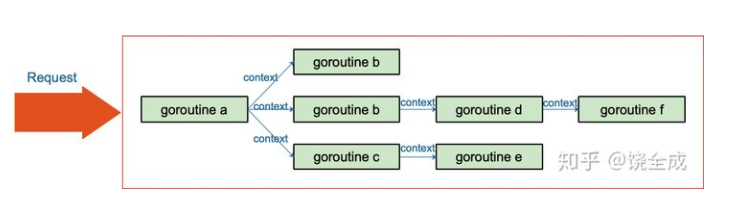

对服务器传入的请求应该创建上下文，而对服务器的传出调用应该接受上下文。它们之间的函数调用链必须传递上下文，或者可以使用`WithCancel`、`WithDeadline`、`WithTimeout`或`WithValue`创建的派生上下文。当一个上下文被取消时，它派生的所有上下文也被取消。

**总结：context 用来解决 goroutine 之间`退出通知`、`元数据传递`的功能。是 goroutine 的上下文，包含 goroutine 的运行状态、环境、现场等信息。**


```go
type Context interface {
    Deadline() (deadline time.Time, ok bool)//返回当前Context被取消的时间，也就是完成工作的截止时间
    Done() <-chan struct{}//返回一个Channel，这个Channel会在当前工作完成或者上下文被取消之后关闭，多次调用Done方法会返回同一个Channel；
    Err() error//返回当前Context结束的原因，它只会在Done返回的Channel被关闭时才会返回非空的值；
    Value(key interface{}) interface{}//从Context中返回键对应的值，对于同一个上下文来说，多次调用Value 并传入相同的Key会返回相同的结果，该方法仅用于传递跨API和进程间跟请求域的数据；
}
```

> ##### Background()和TODO（）函数

Go内置两个函数：`Background()`和`TODO()`，这两个函数分别返回一个实现了`Context`接口的`background`和`todo`。我们代码中最开始都是以这两个内置的上下文对象作为最顶层的`partent context`，衍生出更多的子上下文对象。

`Background()`主要用于main函数、初始化以及测试代码中，作为Context这个树结构的最顶层的Context，也就是根Context。

`TODO()`，它目前还不知道具体的使用场景，如果我们不知道该使用什么Context的时候，可以使用这个。

`background`和`todo`本质上都是`emptyCtx`结构体类型，是一个不可取消，没有设置截止时间，没有携带任何值的Context。

### 8.3 With系列函数

> #### WithCancel

```go
func WithCancel(parent Context) (ctx Context, cancel CancelFunc)//WithCancel返回带有新Done通道的父节点的副本。当调用返回的cancel函数或当关闭父上下文的Done通道时，将关闭返回上下文的Done通道，无论先发生什么情况。

//取消此上下文将释放与其关联的资源，因此代码应该在此上下文中运行的操作完成后立即调用cancel。
```

```go
func main() {
	ctx, clear := context.WithCancel(context.Background())
	message := make(chan int)
	go son(ctx, message)
	for i := 0; i < 10; i++ {
		message <- i
	}
	fmt.Println("1")
	clear() //// 当我们弄完之后调用cancel
	fmt.Println("2")
	time.Sleep(time.Second)
	fmt.Println("主进程结束")
}
func son(ctx context.Context, msg chan int) {
	t := time.Tick(time.Second)
	for _ = range t {
		select {
		case m := <-msg:
			fmt.Printf("收到值%d\n", m)
		case <-ctx.Done(): //Done方法需要返回一个Channel，这个Channel会在当前工作完成或者上下文被取消之后关闭
			fmt.Println("结束")
			return // return结束该goroutine，防止泄露
		}
	}
}

```


> #### WithDeadline

```go
func WithDeadline(parent Context, deadline time.Time) (Context, CancelFunc)//返回父上下文的副本，并将deadline调整为不迟于d。当截止日过期时，当调用返回的cancel函数时，或者当父上下文的Done通道关闭时，返回上下文的Done通道将被关闭，以最先发生的情况为准。  取消此上下文将释放与其关联的资源，因此代码应该在此上下文中运行的操作完成后立即调用cancel。
```

```go
func main() {
	d := time.Now().Add(50 * time.Microsecond) //定义了一个50毫秒之后过期的deadline
	ctx, cancel := context.WithDeadline(context.Background(), d)
	defer cancel()
	select { //让主程序陷入等待：等待1秒后打印overslept退出或者等待ctx过期后退出。
	case <-time.After(time.Second):
		fmt.Println("overslepy")
	case <-ctx.Done(): //ctx 50毫秒后就会过期，所以ctx.Done()会先接收到context到期通知，并且会打印ctx.Err()的内容。
		fmt.Println(ctx.Err())
	}
}
```


> #### WithTimeout

```go
func WithTimeout(parent Context, timeout time.Duration) (Context, CancelFunc)
```

```go
var wg sync.WaitGroup
func worker(ctx context.Context) {
LOOP:
	for {
		fmt.Println("db connecting ...")
		time.Sleep(time.Millisecond * 10) // 假设正常连接数据库耗时10毫秒
		select {
		case <-ctx.Done(): // 50毫秒后自动调用
			break LOOP
		default:
		}
	}
	fmt.Println("worker done!")
	wg.Done()
}
func main() {
	// 设置一个50毫秒的超时
	ctx, cancel := context.WithTimeout(context.Background(), time.Millisecond*50)
	wg.Add(1)
	go worker(ctx)
	time.Sleep(time.Second * 5)
	cancel() // 通知子goroutine结束
	wg.Wait()
	fmt.Println("over")
}
```


>#### WithValue

```go
func WithValue(parent Context, key, val interface{}) Context
```

注意点：1. 所提供的键key必须是可比较的，并且不应该是`string`类型或任何其他内置类型，以避免使用上下文在包之间发生冲突,`WithValue`的用户应该为键定义自己的类型。


### 8.4 Context使用注意事项

1. 推荐以参数的方式显示传递Context
2. 以Context作为参数的函数方法，应该把Context作为第一个参数
3. 给一个函数方法传递Context参数的时候，不要传递nil，不知道传递什么就传context.Background()
4. Context是线程安全的，可以放心在多个goroutine中传递
5. Context的Value相关方法应该传递请求域的必要数据，不应该用于传递可选参数


## 9 flag 

Go语言内置的`flag`包实现了命令行参数的解析，`flag`包使得开发命令行工具更为简单

> #### init函数常用定义命令行参数方法

1. `flag.Type(flag名, 默认值, 帮助信息)*Type`**注意点：返回的是对应类型的指针**

   ```go
   name := flag.String("name", "张三", "姓名")
   age := flag.Int("age", 18, "年龄")
   married := flag.Bool("married", false, "婚否")
   delay := flag.Duration("d", 0, "时间间隔")
   ```

2. `flag.TypeVar(Type指针，flag名, 默认值, 帮助信息)*Type`

   ```go
   var name string
   var age int
   var married bool
   var delay time.Duration
   flag.StringVar(&name, "name", "张三", "姓名")
   flag.IntVar(&age, "age", 18, "年龄")
   flag.BoolVar(&married, "married", false, "婚否")
   flag.DurationVar(&delay, "d", 0, "时间间隔")
   ```

> #### 主函数解析参数及一些其它函数

通过以上两种方法定义好命令行flag参数后，需要通过调用`flag.Parse()`来对命令行参数进行解析

```go
flag.Args()  ////返回命令行参数后的其他参数，以[]string类型
flag.NArg()  //返回命令行参数后的其他参数个数
flag.NFlag() //返回使用的命令行参数个数
```

​	示例：

```go
func main() {
	//定义命令行参数方式1
	var name string
	var age int
	var married bool
	var delay time.Duration
	flag.StringVar(&name, "name", "张三", "姓名")
	flag.IntVar(&age, "age", 18, "年龄")
	flag.BoolVar(&married, "married", false, "婚否")
	flag.DurationVar(&delay, "d", 0, "延迟的时间间隔")

	//解析命令行参数
	flag.Parse()
	fmt.Println(name, age, married, delay)
	//返回命令行参数后的其他参数
	fmt.Println(flag.Args())
	//返回命令行参数后的其他参数个数
	fmt.Println(flag.NArg())
	//返回使用的命令行参数个数
	fmt.Println(flag.NFlag())
}
```


## 10 sort

sort包的底层实现是多种排序的算法，例如快排，插入等等。调用时并不公开，也无需定义用那种算法。
sort包内部会根据实际情况，自动选择最高效的排序算法。


> #### 实现

- **原理：**

  ​	 1. 如果掌握多种底层排序算法的话，应该可以提炼出排序算法的三要素，即序列长度，两个元素比较结果，两个元素交换方式。
  ​     2. go语言sort包就是这么做的，提供三个方法，用来实现三要素。分别是Len，Less,Swap
  ​     3. 调用的时候不需要查看底层如何实现，只需要用户定义出三要素，go语言就会按照底层最高效的算法按照用户定义的三要素对序列进行排序

          4. 在实际工程开发中，对string，int等排序应该非常多。sort包提供了更加便捷的方法，不用用户自己定义三要素，可直接调用进行排序。

- **实现要求：**

  为了让sort包能识别序列，对序列进行排序，就必须让序列实现sort.interface{}接口。

  只有实现了sort.interface{}接口的序列，sort包才能进行排序，就是排序三要素，Len，Less，Swap。这三个方法,然后调用sort.Sort()方法，可根据定义对序列最终排序。

  sort包定义了sort.Reverse()方法，对当前定义的排序规则取反，也就是反向排序。

- **实例：**

```go
//定义序列类型，只要此类型实现了sort.interface{}接口(实现三要素方法)，就可以对此类型排序
type TestStringList []string

//元素个数
func (t TestStringList) Len() int {
    return len(t)
}

//比较结果
func (t TestStringList) Less(i, j int) bool {
    return t[i] < t[j]
}

//交换方式
func (t TestStringList) Swap(i, j int) {
    t[i], t[j] = t[j], t[i]
}

func SortPackageDemo() {

    stringList := TestStringList{
        "1-php",
        "2-java",
        "3-golang",
        "4-c",
        "5-cpp",
        "6-python",
    }

    //按照定义的规则排序
    sort.Sort(stringList)
    fmt.Println(stringList)
    //返回值
    //[1-php 2-java 3-golang 4-c 5-cpp 6-python]

    //按照定义的规则反向排序
    sort.Sort(sort.Reverse(stringList))
    fmt.Println(stringList)
    //返回值
    //[6-python 5-cpp 4-c 3-golang 2-java 1-php]
}

注意：这种排序方式，对任何实现了sort.interface{}接口的序列，都可以排序
```

​    

> #### sort包常见便捷排序

Go 1.8之后的版本，Go语言在 sort 包中提供了 sort.Slice() 函数进行更为简便的排序方法。  sort.Slice() 函数只要求传入需要排序的数据，以及一个排序时对元素的回调函数。

```go
sort.Slice(tmp,func(i,j int){
        return tmp[i]<tmp[j]
}
```

**实例：**

```go
func demoSortSlice(){
    a := []int{6,3,9,8,1,2,5,7}
    sort.Slice(a, func(i, j int) bool {
        return a[i]>a[j]
    })
    fmt.Println(a)
    //[9 8 7 6 5 3 2 1]
}
```


## 11 runtime

#### 11.1 前言知识

Go 语言的 goroutine 是由 运行时（runtime）调度和管理的。尽管 Go 编译器产生的是本地可执行代码，这些代码仍旧运行在 Go 的 runtime（这部分的代码可以在 runtime 包中找到）当中。Go 语言的 runtime 类似 Java 和 .NET 语言所用到的虚拟机，它负责管理包括内存分配、垃圾回收、栈处理、goroutine、channel、切片（slice）、map 和反射（reflection）等等。

**函数调用栈：**

我们按照编程语言的语法定义的函数，会被编译器编译为一堆堆机器指令，写入可执行文件。程序执行时可执行文件被加载到内存，这些机器指令对应到虚拟地址空间中，位于代码段。
如果在一个函数中调用另一个函数，编译器就会对应生成一条**call**指令，程序执行到这条指令时，就会跳转到被调用函数入口处开始执行，而每个函数的最后都有一条**ret**指令，负责在函数结束后跳回到调用处，继续执行。

**函数栈帧：**

函数执行时需要有足够的内存空间，供它存放局部变量、参数等数据，这段空间对应到虚拟地址空间的栈。栈，只有一个口可供进出，先入栈的在底，后入栈的在顶，最后入栈的最早被取出。运行时栈，上面是高地址，向下增长，栈底通常被称为**“栈基”**，栈顶被称为**“栈指针”**。

分配给函数的栈空间被称为**“函数栈帧”**，Go语言中函数栈帧布局是这样的，先是调用者栈基地址，然后是函数的局部变量，最后是被调用函数的返回值和参数。


BP of callee和SP of callee标识被调用函数执行时，栈基寄存器和栈指针寄存器指向的位置，但是注意“BP of caller”不一定会存在，有些情况下可能会被优化掉，也有可能是平台不支持

举个例子：

```
func A() {   
    var a1, a2, r1, r2 int64   
    a1, a2 = 1, 2  
    r1, r2 = B(a1, a2)   
    r1 = C(a1)   
    println(r1, r2)
}
func B(p1, p2 int64) (int64, int64) {  
    return p2, p1
}
func C(p1 int64) int64 { 
    return p1
}
```

函数A的栈帧布局如下图所示，局部变量之后的空间用于存放被调用函数的返回值和参数，接下来要调用函数B，所以先有两个int64类型的变量空间用作B的返回值，再有两个int64类型的变量空间用于存放传递给B的参数


注意观察参数的顺序，先入栈第二个参数，再入栈第一个参数，返回值也是一样，上面是第二个返回值的空间，然后才是第一个返回值的空间。
其实这也好解释，因为这些是被调用函数的返回值和参数，被调用函数是通过栈指针加上偏移值这样相对寻址的方式来定位到自己的参数和返回值的，这样由下至上正好先找到第一个参数，再找到第二个参数。所以参数和返回值采用由右至左的入栈顺序比较合适。

**Go语言中，函数栈帧是一次性分配的**，也就是在函数开始执行的时候分配足够大的栈帧空间。就像上例中函数A一样，它要调用两个函数，除了调用者栈基地址、局部变量以外，再有四个int64的空间用作被调用函数的参数与返回值就足够了。
一次性分配函数栈帧的主要原因是避免栈访问越界，如下图所示，三个goroutine初始分配的栈空间是一样的，如果g2剩余的栈空间不够执行接下来的函数，若函数栈帧是逐步扩张的，那么执行期间就可能发生栈访问越界。


#### 11.2 具体函数用法


```go
func Stack(buf []byte, all bool) int
```

Stack将调用其的go程的调用栈踪迹格式化后写入到buf中并返回写入的字节数。若all为true，函数会在写入当前go程的踪迹信息后，将其它所有go程的调用栈踪迹都格式化写入到buf中。


```go
func Caller(skip int) (pc uintptr, file string, line int, ok bool)
```

`Caller`报告当前go程调用栈所执行的函数的文件和行号信息。实参`skip`为上溯的[栈帧](https://so.csdn.net/so/search?q=栈帧&spm=1001.2101.3001.7020)数，0表示`Caller`的调用者，当前函数（`Caller`所在的调用栈），1表示上一层函数。第一个返回值代表的是程序计数（pc）；第二个和第三个参数代表对应函数所在的源文件名以及所在行数，这里我们暂时不需要；最后一个参数代表是否能成功获取这些信息，如果获取失败，我们抛出 panic。

根据pc获取函数名：根据返回的调用栈标识符`pc`，我们可以获取对应的函数名。需要用到一个函数和一个方法，签名如下：

```go
func FuncForPC(pc uintptr) *Func

func (*Func) Name
```


## 12 strings


```go
func Fields(str string) []string
```

返回值：str的子字符串切片或如果str仅包含空格的空白切片。


```go
func TrimPrefix(s, prefix string) string
```

返回：s中如果有prefix前缀则去掉后返回


## 13 bytes


```go
func IndexByte(s []byte, c byte) int
```

字符c在s中第一次出现的位置，不存在则返回-1。


```go
func TrimPrefix(s, prefix []byte) []byte
```

返回去除s可能的前缀prefix的子切片。（共用底层数组）


- bytes.buffer:是一个缓冲byte类型的**缓冲器**

1·、使用bytes.NewBuffer创建：参数是[]byte的话，缓冲器里就是这个slice的内容；如果参数是nil的话，就是创建一个空的缓冲器。

2、bytes.NewBufferString创建

3、bytes.Buffer{} 

```go
func (b *Buffer) Bytes() []byte { return b.buf[b.off:] }
```


---

---

#                                                      Ⅳ Go进阶

---

---

## 高级特性


### 逃逸分析


#### 逃逸分析是什么

在编译原理中，分析指针动态范围的方法称之为逃逸分析。通俗来讲，当一个对象的指针被多个方法或线程引用时，我们称这个指针发生了逃逸。

Go语言的逃逸分析是**编译器**执行静态代码分析后，对内存管理进行的优化和简化，它可以决定一个变量是分配到堆还栈上。

#### 逃逸分析作用

C/C++中动态分配的内存需要我们手动释放，导致我们平时在写程序时，如履薄冰。这样做有他的好处：程序员可以完全掌控内存。但是缺点也是很多的：经常出现忘记释放内存，导致内存泄露。所以，很多现代语言都加上了垃圾回收机制。

Go的垃圾回收，让堆和栈对程序员保持透明。真正解放了程序员的双手，让他们可以专注于业务，“高效”地完成代码编写。把那些内存管理的复杂机制交给编译器，而程序员可以去享受生活。

逃逸分析这种“骚操作”把变量合理地分配到它该去的地方。即使你是用new申请到的内存，如果我发现你竟然在退出函数后没有用了，那么就把你丢到栈上，毕竟栈上的内存分配比堆上快很多；反之，即使你表面上只是一个普通的变量，但是经过逃逸分析后发现在退出函数之后还有其他地方在引用，那我就把你分配到堆上。如果变量都分配到堆上，堆不像栈可以自动清理。它会引起Go频繁地进行垃圾回收，而垃圾回收会占用比较大的系统开销（占用CPU容量的25%）

堆和栈相比，堆适合不可预知大小的内存分配。但是为此付出的代价是分配速度较慢，而且会形成内存碎片。栈内存分配则会非常快。栈分配内存只需要两个CPU指令：“PUSH”和“RELEASE”，分配和释放；而堆分配内存首先需要去找到一块大小合适的内存块，之后要通过垃圾回收才能释放。

通过逃逸分析，可以尽量把那些不需要分配到堆上的变量直接分配到栈上，堆上的变量少了，会减轻分配堆内存的开销，同时也会减少gc的压力，提高程序的运行速度。

#### 逃逸分析完成原则

Go语言逃逸分析最基本的原则是：如果一个函数返回对一个变量的引用，那么它就会发生逃逸。简单来说，编译器会分析代码的特征和代码生命周期，Go中的变量只有在编译器可以证明在函数返回后不会再被引用的，才分配到栈上，其他情况下都是分配到堆上。Go语言里没有一个关键字或者函数可以直接让变量被编译器分配到堆上，相反，编译器通过分析代码来决定将变量分配到何处。对一个变量取地址，可能会被分配到堆上。但是编译器进行逃逸分析后，如果考察到在函数返回后，此变量不会被引用，那么还是会被分配到栈上。

总而言之，编译器会根据变量是否被外部引用来决定是否逃逸：

1. 如果函数外部没有引用，则**优先**放到栈中；
2. 如果函数外部存在引用，则**必定**放到堆中；

 举例：定义了一个很大的数组，需要申请的内存过大，超过了栈的存储能力，这里也要放到堆上。

#### 如何确定是否发送逃逸

举例：

```go
package main

import "fmt"

func foo() *int {
	t := 3
	return &t;
}

func main() {
	x := foo()
	fmt.Println(*x)
}
```

方法：

1. 使用go命令：`go build -gcflags '-m -l' main.go`.加`-l`是为了不让foo函数被内联。foo函数里的变量`t`逃逸了，和我们预想的一致。让我们不解的是为什么main函数里的`x`也逃逸了？这是因为有些函数参数为interface类型，比如fmt.Println(a …interface{})，编译期间很难确定其参数的具体类型，也会发生逃逸。
2. 反汇编源码：`go tool compile -S main.go`

#### Go与c/c++中堆栈概念区别

c/c++:本质上是操作系统层级的概念，通过c/c++语言的编译器和所在的系统环境共同决定。而Go程序也是运行在操作系统上的程序。自然也有着同样的堆栈概念。但区别在于传统意义上的“栈”被Go语言的运行时全部消耗，用于维护运行时各个组件之间的协调，例如调度器、垃圾回收、系统调用等。而对于用户态的Go代码，所消耗的“堆和栈”其实是Go运行时通过管理向操作系统申请的堆内存，构造的逻辑上的“堆和栈”，本质都是从操作系统申请而来的堆内存。

正是由于用户态Go程序的“栈空间”是由运行时管理堆内存得来，相较于只有1MB的C/C++的“栈”而言，Go程序几乎拥有无限的栈内存“1GB”。而且对于用户态Go代码消耗的栈，Go语言运行时会为了防止内存碎片化，会在适当的时候对整个栈深拷贝，将其整个复制到另一块内存区域。也正是因为这个特点，指针的算术运算不再奏效。因为无法确定运算前后指针所指向的地址的内容是否已经被Go运行时移动。

#### 逃逸场景

一般我们给一个引用类对象中的引用类成员进行赋值，可能出现逃逸现象。可以理解为访问一个引用对象实际上底层就是通过一个指针来间接的访问了（也就是相当于如果一个函数返回对一个变量的引用），但如果再访问里面的引用成员就会有第二次间接访问，这样操作这部分对象的话，极大可能会出现逃逸的现象。（也就是在外部存在引用，就必定会分配到堆上。））

Go语言中的引用类型有func（函数类型），interface（接口类型），slice（切片类型），map（字典类型），channel（管道类型），*（指针类型）等

```
func main() {
    data := []interface{}{100, 200}
    data[0] = 100//data[0] = 100 发生了逃逸现象
}
func main() {
    data := make(map[string]interface{})
    data["key"] = 200 //data["key"] = 200 发生了逃逸
}

func main() {
    data := make(map[interface{}]interface{})
    data[100] = 200 //data[100] = 200 中，100和200均发生了逃逸//因为有些函数参数为interface类型，，编译期间很难确定其参数的具体类型，也会发生逃逸。
}
func main() {
    data := make(map[string][]string)
    data["key"] = []string{"value"} //[]string{...}切片发生了逃逸
}

func main() {
    a := 10
    data := []*int{nil}
    data[0] = &a //最终将变量a 移动到了堆上
}
```


### 内存分配


### GC垃圾回收

垃圾回收(Garbage Collection，简称GC)是编程语言中提供的自动的内存管理机制，自动释放不需要的内存对象，让出存储器资源。GC过程中无需程序员手动执行。GC机制在现代很多编程语言都支持，GC能力的性能与优劣也是不同语言之间对比度指标之一。

#### 1 普通标记清除法

**STW:** 

STOP THE WORLD的过程中，CPU不执行用户代码，全部用于垃圾回收，这个过程的影响很大，所以STW也是一些回收机制最大的难题和希望优化的点

**步骤：**

- 启动STW，暂停程序业务逻辑，分类出可达和不可达对象
- 标记可达对象
- 清除未标记的对象
- 停止STW


**缺点：**

- STW，让程序暂停，持续出现卡顿，非常重要的问题
- 标记需要扫描整个heap
- 清除数据会产生heap碎片

**优化：**


将STW的步骤提前了1步，因为在Sweep清除的时候，可以不需要STW停止，因为这些对象已经是不可达对象了，不会出现回收写冲突等问题。

**还有缺点：**

但是无论怎么优化，Go V1.3都面临这个一个重要问题，就是**mark-and-sweep 算法会暂停整个程序** 


#### 2  三色并发标记法

**定义：**

为了解决**暂停程序带来的损耗，让GC过程可以和其他用户的goroutine并发运行**，Golang中的垃圾回收主要应用三色标记法，就是通过三个阶段的标记来确定清除的对象有哪些，但还是需要一定时间的STW。**堆空间启动写屏障，栈空间不启动，全部扫描之后，需要重新扫描一次栈(需要STW)，效率普通**

所谓“程序”，则是一些对象的跟节点在栈或堆中的集合

**步骤**：（**为了在GC过程中保证数据的安全，我们在开始三色标记之前就会加上STW，在扫描确定黑白对象之后再放开STW**，一定要依赖STW的. 因为如果不暂停程序, 程序的逻辑改变对象引用关系, 这种动作如果在标记阶段做了修改，会影响标记结果的正确性）

- 每次新创建的对象标记为“白色”
- **GC回收开始**，根节点遍历所有对象，只进行一次便利。把遍历到的对象从“白色”集合放入“灰色”集合
- 遍历灰色集合，将灰色对象引用的对象从白色集合放入灰色集合，自己放入黑色集合
- 重复第三步，直到灰色集合无任何对象
- 最后，可达对象遍历完之后，黑色对象就是程序可达对象，白色就是内存中目前的垃圾数据，然后回收白色对象即可


**问题：**

- 条件1: 一个白色对象被黑色对象引用**(白色被挂在黑色下)**
- 条件2: 灰色对象与它之间的可达关系的白色对象遭到破坏**(灰色同时丢了该白色)**

如果**同时存在这两个条件并且没有STW**，就会有一些可达对象也被清除掉，但STW过程有明显的资源浪费。

**优化：**

采用屏障机制，让GC回收器，满足下面两种情况之一时，即可保对象不丢失。 这两种方式就是“强弱三色不变式”。

强三色不变式：强制性的不允许黑色对象引用白色对象，这样就不会出现白色对象被误删的情况


弱三色不变式：所有被黑色对象引用的白色对象处于灰色保护状态（即黑色对象可以引用白色对象，但是这个白色对象必须存在其他灰色对象对它的引用，或者可达它的链路上游存在灰色对象。）


**插入屏障：**满足强三色不变式，在A对象引用B对象的时候，B对象被标记为灰色。在**栈空间的对象操作中不使用**. 而仅仅使用在堆空间对象的操作中。但此时在栈上依然可能存在误删可达对象现象，所以要对栈重新进行三色标记扫描即**re-scan**, 但这次为了对象不丢失, 要对本次标记扫描启动STW暂停. 直到栈空间的三色标记结束，最后将栈和堆空间 扫描剩余的全部 白色节点清除. 这次STW大约的时间在10~100ms间。用的STW非常短了。

**删除屏障：**满足弱三色不变式，被删除的对象，如果自身为灰色或者白色，那么被标记为灰色（使灰色对象到白色对象路径不会断）。但是它只能活过一轮，**下一轮GC回收(因为下一轮的时候这个连接没有了)**时，栈扫描不到这个节点了，就还是回收！！！

**还有缺点：**

- 插入写屏障：结束时需要STW来重新扫描栈，标记栈上引用的白色对象的存活；
- 删除写屏障：**回收精度低，**GC开始时STW扫描堆栈来记录初始快照，这个过程会保护开始时刻的所有存活对象


#### 3 三色标记法-混合写屏障机制

**定义：**

结合了删除写屏障和插入写屏障的优点，只需要在开始时并发扫描各个goroutine的栈，使其变黑并一直保持，这个过程不需要STW，而标记结束后，因为栈在扫描后始终是黑色的，也无需再进行re-scan操作了，减少了STW的时间。

 Golang中的混合写屏障满足`弱三色不变式`，结合了删除写屏障和插入写屏障的优点，只需要在开始时并发扫描各个goroutine的栈，使其变黑并一直保持，**这个过程不需要STW**，而标记结束后，因为栈在扫描后始终是黑色的，**也无需再进行re-scan操作了，减少了STW的时间**。栈空间不启动，堆空间启动。整个过程几乎不需要STW，效率较高，仅在标记结束后回收的那段时间要一次STW。

注意混合写屏障是Gc的一种屏障机制，所以**只是当程序执行GC的时候，才会触发这种机制。**

**步骤：**

- GC开始将栈上的对象全部扫描并标记为黑色(之后不再进行第二次重复扫描，无需STW)，

- GC期间，任何在栈上创建的新对象，均为黑色。

- 被删除的对象标记为灰色。

- 被添加的对象标记为灰色。

**注意**：

- **屏障技术是不在栈上应用的，因为要保证栈的运行效率。**


## 并发编程


### 1 什么是并发？

#### 1.1 单核处理器时代

很久以前，面向大众消费者的主流处理器（CPU）都是单核的，操作系统的基本调度与执行单元是进程（process）。这个时候，用户层的应用有两种设计方式，一种是单进程应用，也就是每次启动一个应用，操作系统都只启动一个进程来运行这个应用。单进程应用的情况下，用户层应用、操作系统进程以及处理器之间的关系是这样的：


这个设计下，每个单进程应用对应一个操作系统进程，操作系统内的多个进程按时间片大小，被轮流调度到仅有的一颗单核处理器上执行。换句话说，这颗单核处理器在某个时刻只能执行一个进程对应的程序代码，两个进程不存在并行执行的可能。**这里说的并行（parallelism），指的就是在同一时刻，有两个或两个以上的任务（这里指进程）的代码在处理器上执行。从这个概念我们也可以知道，多个处理器或多核处理器是并行执行的必要条件。**


总的来说，单进程应用的设计比较简单，它的内部仅有一条代码执行流，代码从头执行到尾，不存在竞态，无需考虑同步问题。

用户层的另外一种设计方式，就是多进程应用，也就是应用通过 fork 等系统调用创建多个子进程，共同实现应用的功能。多进程应用的情况下，用户层应用、操作系统进程以及处理器之间的关系是这样的：


以图中的 App1 为例，这个应用设计者将应用内部划分为多个模块，每个模块用一个进程承载执行，每个模块都是一个单独的执行流，这样，App1 内部就有了多个独立的代码执行流。**但限于当前仅有一颗单核处理器，这些进程（执行流）依旧无法并行执行**，无论是 App1 内部的某个模块对应的进程，还是其他 App 对应的进程，**都得逐个按时间片**被操作系统调度到处理器上执行。

多进程应用与单进程应用相比并没有什么质的提升。**那我们为什么还要将应用设计为多进程呢？这更多是从应用的结构角度去考虑的，多进程应用由于将功能职责做了划分，并指定专门的模块来负责，所以从结构上来看，要比单进程更为清晰简洁，可读性与可维护性也更好。这种将程序分成多个可独立执行的部分的结构化程序的设计方法，就是并发设计。**采用了并发设计的应用也可以看成是一组独立执行的模块的组合。


#### 1.2 多核处理器时代


**不过，进程并不适合用于承载采用了并发设计的应用的模块执行流。**因为进程是操作系统中资源拥有的基本单位，它不仅包含应用的代码和数据，还有系统级的资源，比如文件描述符、内存地址空间等等。进程的“包袱”太重，这导致它的创建、切换与撤销的代价都很大。于是线程便走入了人们的视野，**线程就是运行于进程上下文中的更轻量级的执行流。**同时随着处理器技术的发展，多核处理器硬件成为了主流，这让真正的并行成为了可能，于是主流的应用设计模型变成了这样：


**最终！！！我们看到，基于线程的应用通常采用单进程多线程的模型，一个应用对应一个进程，应用通过并发设计将自己划分为多个模块，每个模块由一个线程独立承载执行。多个线程共享这个进程所拥有的资源，但线程作为执行单元可被独立调度到处理器上运行。线程的创建、切换与撤销的代价相对于进程是要小得多。当这个应用的多个线程同时被调度到不同的处理器核上执行时，我们就说这个应用是并行的**

**并发与并行总结：**

​		我们可以对并发与并行两个概念做一些区分了。就像 Go 语言之父 Rob Pike 曾说过那样**：并发不是并行，并发关乎结构，并行关乎执行**。结合上面的例子，我们看到，**并发是在应用设计与实现阶段要考虑的问题。并发考虑的是如何将应用划分为多个互相配合的、可独立执行的模块的问题。**采用并发设计的程序并不一定是并行执行的。在不满足并行必要条件的情况下（也就是仅有一个单核 CPU 的情况下），即便是采用并发设计的程序，依旧不可以并行执行。而在满足并行必要条件的情况下，采用并发设计的程序是可以并行执行的。而那些没有采用并发设计的应用程序，除非是启动多个程序实例，否则是无法并行执行的。


#### 1.3 Goroutine调度器原理

​	

> ##### why调度

单进程-----多进程时代后：面临多进程/线程下的问题

1. 高cpu消耗：进程/线程数量越多，cpu消耗大，因为切换成本高，越浪费（比如显示的CPU利用率为100，但执行程序可能只利用了60，而切换线程占了40），所以尽量搞少一点进程/线程运行，提高cpu利用率才是软件层面要做的事，因此要调度。

2. 高内存占用：进程占用4GB, 线程占用4MB。
3. 设计复杂：伴随资源竞争，切换成本大等


> ##### Goroutine 调度器 


​		提到“调度”，我们首先想到的就是操作系统对进程、线程的调度。**操作系统调度器会将系统中的多个线程按照一定算法调度到物理 CPU 上去运行。**

​		一个线程实际由用户空间和内核空间组成，如下图：


​		传统的编程语言，比如 C、C++ 等的并发实现，多是基于线程模型的，也就是应用程序负责创建线程（一般通过 libpthread 等库函数调用实现），操作系统负责调度线程。当然，我们也说过，这种传统支持并发的方式有很多不足。为了解决这些问题，Go 语言中的并发实现，使用了 Goroutine，代替了操作系统的线程，也不再依靠操作系统调度。

​		Goroutine 占用的资源非常小，每个 Goroutine 栈的大小默认是 2KB。而且，Goroutine 调度的切换也不用陷入（trap）操作系统内核层完成，代价很低。因此，一个 Go 程序中可以创建成千上万个并发的 Goroutine。而将这些 Goroutine 按照**一定算法**放到“CPU”上执行的程序，就被称为 **Goroutine 调度器（**Goroutine Scheduler），注意，这里说的“CPU”打了引号。

​		不过，一个 Go 程序对于操作系统来说只是一个用户层程序，操作系统眼中只有线程，它甚至不知道有一种叫 Goroutine 的事物存在。所以，Goroutine 的调度全要靠 Go 自己完成。那么，实现 Go 程序内 Goroutine 之间“公平”竞争“CPU”资源的任务，就落到了 Go 运行时（runtime）头上了。要知道在一个 Go 程序中，除了用户层代码，剩下的就是 Go 运行时了。于是，**Goroutine 的调度问题就演变为，Go 运行时如何将程序内的众多 Goroutine，按照一定算法调度到“CPU”资源上运行的问题了。**

**可是，在操作系统层面，线程竞争的“CPU”资源是真实的物理 CPU，但在 Go 程序层面，各个 Goroutine 要竞争的“CPU”资源又是什么呢？**

Go 程序是用户层程序，它本身就是整体运行在一个或多个操作系统线程上的。所以这个答案就出来了：Goroutine 们要竞争的“CPU”资源就是操作系统线程。这样，**Goroutine 调度器的任务也就明确了：Go运行时将 Goroutine 按照一定算法放到不同的操作系统线程中去执行。把大量的goroutine分配到少量线程上去执行，并利用多核并行，实现更强大的并发。**

**goroutine引发的问题：**

n :  1模型：无法利用多个cpu，出现阻塞瓶颈

1：1模型：更多线程/多进程模型无异

**m:  n模型： 能够利用多核，怎么优化协程调度器和算法才是关键**


> ##### 调度器的优化

1. goroutine的优化：内存占用小，灵活调度切换成本低
2. 早期的go调度器模型为GM模型：基本的全局goroutine队列和传统轮询利用多个thread去调度。但弊端也多：

- 创建，销毁，调度goroutine都要每个M获取锁，造成锁竞争
- M转移G会造成延迟和额外的系统负载
- 系统调用（cpu在M之间的切换）会导致频繁的线程阻塞和取消阻塞操作增加了系统开销


#### 1.4 Goroutine调度器的GMP模型


> ##### 认识GMP


**全局队列：**存放等待运行的队列

**P的本地队列：**存放等待运行的G，有数量限制不超过256个G， 先将新创建的G放在P的本地队列中如果满了则放在全局队列中

**P列表：**程序启动时创建， 最多有GOMAXPROCS个（可以配置）

**M列表**： 当前操作系统分配到**当前Go程序**的内核线程数

**数量：**M与P的数量没有绝对关系，一个M阻塞，P就会去创建或者切换另一个M，所以，即使P的默认数量是1，也有可能会创建很多个M出来

- P: 环境变量￥GOMAXPROCS或者在程序中通过runtime.GOMAXPROCS()来设置。
- M： Go语言本身限定M的最大量是10000，runtime/debug包中SetMaxThreads函数来设置，有一个M阻塞，则会创建一个新的M，如果M有空闲，就会回收或者睡眠。

**Goroutine调度器和OS调度器是通过M结合起来的，每个M都代表了1个内核线程，OS调度器负责把内核线程分配到CPU的核上执行**。


> ##### GMP的设计思想


1. **复用线程**： 避免频繁的创建，销毁线程，而是对线程的复用。

   ​				**work stealing机制**：当本线程无可运行的G时，尝试从其他线程绑定（无奈的时候从全局队列，但需要加锁解锁操作，消耗大）的P偷取G，而不是销毁线程

   ​				**hand off 机制：** 当本线程因为G进行系统调用阻塞时，线程释放绑定的P，把P转移给其他空闲的线程执行。

2. **利用并行**：GOMAXPROCS设置P的数量，最多有GOMAXPROCS个线程分布在多个CPU上同时运行。
3. **抢占**：在coroutine中要等待一个协程主动让出CPU才执行下一个协程，在Go中，一个goroutine最多占用CPU10ms，防止其他goroutine被饿死，保证了并发，超过特定长的时间后，G 会被设置为**可抢占，**并在下一次执行函数或方法时被 Go 运行时移出运行状态。
4. **全局G队列**：当M执行work stealing从其他本地队列偷不到G时，可以从全局队列中获取G。


> ##### go func() 经历过程


1. go关键字创建一个goroutine
2. 新创建的goroutine会优先保存在当前线程M的的P的本地队列中，如果P的本地队列满了的话会保存在全局队列中。
3. G只能运行在M中，M和P是1：1的关系。M会从P的本地队列中弹出一个可执行状态的G（**可抢占的G的状态不是可执行**）来执行，如果本地队列为空就会从其他MP组合偷一个，实在不行就偷全局队列的。 （work stealing机制）
4. M调度G执行的过程是循环机制。
   - 当M执行G发生了syscall或其他阻塞操作，M会阻塞，如果当前有一些G在执行，runtime**（sysmon机制的信号抢占调度）**会把这个线程M和P解绑，再创建一个新的操作系统的线程(如果**M队列有空闲的线程可用就复用空闲线程**)来服务P （hand off机制）
   - 当M系统调用结束，这个G会尝试获取一个空闲的P执行，并放入到P的本地队列中。如果获取不到，M线程变为休眠状态，加入到空闲线程中，G放到全局队列中


> ##### 调度器生命周期


**M0 :** M0是启动程序后编号为0的主线程，进程唯一。这个M对应的实例会在全局变量runtime.m0中，不需要在heap上分配，M0负责执行初始化操作和启动第一个G，之后就和其他的M一样了。

**G0：**G0是每次启动一个M都会第一个创建的goroutine,线程唯一。G0仅勇于负责调度的G，G0不指向任何可执行的函数，每个M都会有自己的G0，**全局变量的G0**是M0的G0。在调度或者系统调用时当前M会使用对应的G0的栈空间，即当前M会让G0这个特殊的goroutine来调度G。

调度器的生命周期几乎占满了一个Go程序的一生，`runtime.main`的goroutine执行之前都是为调度器做准备工作，`runtime.main`的goroutine运行，才是调度器的真正开始，直到`runtime.main`结束而结束。


> ##### GMP可视化编程


> ##### Go调度器演化过程总结


​		从最初的 G-M 模型、到 G-P-M 模型，从不支持抢占，到支持协作式抢占，再到支持基于信号的异步抢占，Goroutine 调度器经历了不断地优化与打磨。

**G-M:**

- **G**，协程。通常在代码里用  `go` 关键字执行一个方法，那么就等于起了一个`G`。
- **M**，**内核**线程，操作系统内核其实看不见`G`和`P`，只知道自己在执行一个线程。`G`和`P`都是在**用户层**上的实现。

除了`G`和`M`以外，还有一个**全局协程队列**，这个全局队列里放的是多个处于**可运行状态**的`G`。`M`如果想要获取`G`，就需要访问一个**全局队列**。同时，内核线程`M`是可以同时存在多个的，因此访问时还需要考虑**并发**安全问题。因此这个全局队列有一把**全局的大锁**，每次访问都需要去获取这把大锁。

并发量小的时候还好，当并发量大了，这把大锁，就成为了**性能瓶颈**。


基于**没有什么是加一个中间层不能解决的**思路，`golang`在原有的`GM`模型的基础上加入了一个调度器`P`，可以简单理解为是在`G`和`M`中间加了个中间层。


**G-P-M:**

​		P 是一个“逻辑 Proccessor”，每个 G（Goroutine）要想真正运行起来，首先需要被分配一个 P，也就是进入到 P 的本地运行队列（local runq）中。对于 G 来说，P 就是运行它的“CPU”，可以说：在 G 的眼里只有 P。但从 Go 调度器的视角来看，真正的“CPU”是 M，只有将 P 和 M 绑定，才能让 P 的 runq 中的 G 真正运行起来。

- G:  代表 Goroutine，存储了 Goroutine 的执行栈信息、Goroutine 状态以及 Goroutine 的任务函数等，而且 G 对象是可以重用的
- P:  代表逻辑 processor，P 的数量决定了系统内最大可并行的 G 的数量，P 的最大作用还是其拥有的各种 G 对象队列、链表、一些缓存和状态；
- M:  M 代表着真正的执行计算资源。在绑定有效的 P 后，进入一个调度循环，而调度循环的机制大致是从 P 的本地运行队列以及全局队列中获取 G，切换到 G 的执行栈上并执行 G 的函数，调用 goexit 做清理工作并回到 M，如此反复。**M 并不保留 G 状态，这是 G 可以跨 M 调度的基础。**


**协作式抢占式调度**

有了GPM模型是Go调度器的一大进步，但还是不支持抢占式调度：1. 导致一旦某个G出现死循环代码逻辑，G将永久占用分配给它的P和M,而位于同一个P中的其他G将得不到调度，“饿死”。2. 更为严重的是，当只有一个 P（GOMAXPROCS=1）时，整个 Go 程序中的其他 G 都将“饿死”

Go1.2中：基于协作的“抢占式”调度被提出：原理就是，Go 编译器在每个函数或方法的入口处加上了一段额外的代码 ，让运行时有机会在这段代码中检查是否需要执行抢占调度。

这种解决方案只能说局部解决了“饿死”问题，只在有函数调用的地方才能插入“抢
占”代码，对于没有函数调用而是纯算法循环计算的 G，Go 调度器依然无法抢
占。比如，死循环等并没有给编译器插入抢占代码的机会，这就会导致 GC 在等待所有 Goroutine 停止时的等待时间过长，从而导致 GC 延迟，内存占用瞬间冲高；甚至在一些特殊情况下，导致在 STW时死锁。

在1.14 版本之前，程序只能依靠 Goroutine 主动让出 CPU 资源才能触发调度，存在问题 某些 Goroutine 可以⻓时间占⽤线程，造成其它 Goroutine 的饥饿 垃圾回收需要暂停整个程序（Stop-the-world，STW），最⻓可能需要⼏分钟的时间，导致整个程序⽆法⼯ 作。

**基于信号的抢占式调度**

通过向线程发送信号的方式来抢占正在运行的 Goroutine。

在任何情况下，Go运⾏时并⾏执⾏（注意，不是并发）的 goroutines 数量是⼩于等于 P 的数量的。为了提⾼系统 的性能，P 的数量肯定不是越⼩越好，所以官⽅默认值就是 CPU 的核⼼数，设置的过⼩的话，如果⼀个持有 P 的 M，由于 P 当前执⾏的 G 调⽤了 syscall ⽽导致 M 被阻塞，那么此时关键点： GO 的调度器是迟钝的，它很可能什 么都没做，直到 M 阻塞了相当⻓时间以后，才会发现有⼀个 P/M 被 syscall 阻塞了。然后，才会⽤空闲的 M 来强 这个 P。**通过 sysmon 监控实现的抢占式调度**，最快在20us，最慢在10-20ms才会发现有⼀个 M 持有 P 并阻塞 了。操作系统在1ms 内可以完成很多次线程调度（⼀般情况1ms可以完成⼏⼗次线程调度），Go 发起 IO/syscall 的时候执⾏该 G 的 M 会阻塞然后被 OS调度⾛，P什么也不⼲，sysmon 最慢要10-20ms 才能发现这个阻塞，说不 定那时候阻塞已经结束了，宝贵的 P资源就这么被阻塞的 M浪费了。

**总结：**

M 是 Go 代码运行的真实载体，包括 Goroutine 调度器自身的逻辑也是在 M 中运行的。P 在 G-P-M 模型中占据核心地位，它拥有待调度的 G 的队列，同时 M 要想运行 G 必须绑定一个 P。一个 G 被调度执行的时间不能过长，超过特定长的时间后，G 会被设置为**可抢占，**并在下一次执行函数或方法时被 Go 运行时移出运行状态。

如果 G 被阻塞在某个 channel 操作或网络 I/O 操作上时，M 可以不被阻塞，这避免了大量创建 M 导致的开销。但如果 G 因慢系统调用而阻塞，那么 M 也会一起阻塞，但在阻塞前会与 P 解绑，P 会尝试与其他 M 绑定继续运行其他 G。**但若没有现成的 M，Go 运行时会建立新的 M，这也是系统调用可能导致系统线程数量增加的原因，你一定要注意这一点。**


> ##### 总结：goroutine与OS线程之间的关系


1. 一个操作系统线程对应用户态多个goroutine。
2. go程序可以同时使用多个操作系统线程。
3. goroutine和OS线程是多对多的关系，即m:n。

**重点：GOMAXPROCS参数：`runtime.GOMAXPROCS(参数)`函数设置当前程序并发时占用的CPU逻辑核心数**。Go运行时的调度器使用GOMAXPROCS参数来确定需要使用多少个OS线程来同时执行Go代码。默认值是机器上的CPU核心数。例如在一个8核心的机器上，调度器会把Go代码同时调度到8个OS线程上（GOMAXPROCS是m:n调度中的n）


#### 1.5 GMP调度场景全过程分析


场景一：P拥有G1,M1获取P后开始运行G1,G1使用go func()创建了G2，为了局部性，G2优先加入到P1的本地队列。

场景二：G1运行完成（函数：goexit）,M上运行的goroutine切换为G0，G0负责调度时协程的切换（函数：schedule）。从P的本地队列取G2，从G0切换到G2，并开始运行G2（函数：execute），实现了线程M1的复用

场景三-五：G2连续创建多个G导致本地队列满，本地满再创建G7,则将本地队列前一半的G打乱顺序和新创建的G一起放入全局队列中，未满则直接加入到本地队列

场景六：唤醒正在休眠的M，造成自旋线程。

​			规定：再创建G时，运行的G会尝试唤醒其他空闲的P和M组合取执行，这里假定G2唤醒了M2，M2绑定了P2，并运行G0，但P2本地队列没有G，M2此时为自旋线程**（没有G但为运行状态的线程，不断寻找G）**

场景七：M2会尝试从**全局队列（GQ）中取一批G放到P2的本地队列**（函数 ：findrunnable()）。数量符合公式：n=min(len(GQ)/GOMAXPROCS+1,len(GQ/2))

场景八：全局队列没有G，那么M就要执行work stealing，从其他有G的P那里偷取一半G过来，放到自己的P本地队列。P2从P1的本地队列尾部去一般的G。向下取整。

场景九：最多有GOMAXPROCS个自旋的线程，多余没事的线程会休眠。

场景十：

​			假设：当前除了M3和M4为自旋线程，还有M5和M6为空闲的线程（没有P的绑定，注意最多只能存在4个P，所以M>=P，大部分时间都是M再抢占需要运行的P），G8创建了G9，G8进行了阻塞的系统调用。M2和P2立即解绑。

​			P2会执行以下判断：如果P2本地队列或全局队列有G，或者有空闲的M，P2会立马唤醒一个M和它绑定，否则加入到空闲P列表，等待M来获取可用的P。

场景十一：M2会和P2解绑，但M2会记住P2。然后G8和M2会进入系统调用状态，当G8和M2退出系统调用非阻塞，会尝试获取P2,如无法获取，则获取空闲的的P，依然没有，G8标记为可运行状态并加入到全局队列。M2会因为没有P的绑定而变成休眠状态（长时间休眠等待GC回收销毁）


#### 1.6 传统语言的并发设计方案（CSP）


在传统编程语言（如 C、C++ 等）中，基于多线程模型的应用设计就是一种典型的并发程序设计。但传统编程语言并非面向并发而生，没有对并发设计提供过多的帮助。并且，这些语言多以操作系统线程作为承载分解后的代码片段（模块）的执行单元，由操作系统执行调度。这种**传统支持并发的方式有很多不足**：

- 首先就是复杂：创建容易退出难，并发执行单元间的通信困难且易错
- 第二就是难于规模化：线程的使用代价虽然已经比进程小了很多，但我们依然不能大量创建线程，因为除了每个线程占用的资源不小之外，操作系统调度切换线程的代价也不小
- 高CPU调度消耗


#### 1.7 Go的并发设计方案实现（CSP）


Go 语言的 CSP 模型的实现包含**两个主要组成部分**：一个是 **Goroutine**，它是 Go 应用并发设计的基本构建与执行单元；另一个就是 **channel**，它在并发模型中扮演着重要的角色。channel 既可以用来**实现 Goroutine 间的通信，还可以实现 Goroutine 间的同步**。

**Go语言的CSP模型提倡通过通信共享内存而不是通过共享内存而实现通信**


> ####  goroutine 间的通信	

​		传统的编程语言（比如：C++、Java、Python 等）并非面向并发而生的，所以他们面对并发的逻辑多是基于操作系统的线程。并发的执行单元（线程）之间的通信，利用的也是操作系统提供的线程或进程间通信的原语，比如：共享内存、信号（signal）、管道（pipe）、消息队列、套接字（socket）等,在这些通信原语中，使用最多、最广泛的（也是最高效的）是结合了线程同步原语（比如：锁以及更为低级的原子操作）的共享内存方式，因此，我们可以说传统语言的并发模型是**基于对内存的共享的**。

​		这种传统的基于共享内存的并发模型**很难用，且易错。**Go 语言从设计伊始，就将解决上面这个传统并发模型的问题作为 Go 的一个目标，并在新并发模型设计中借鉴了著名计算机科学家Tony Hoare提出的 **CSP（**Communicationing Sequential Processes，通信顺序进程）**并发模型**。

​		**Tony Hoare：** 认为输入输出应该是基本的编程原语，数据处理逻辑（也就是 CSP 中的 P）只需调用输入原语获取数据，顺序地处理数据，并将结果数据通过输出原语输出就可以了。因此，在 Tony Hoare 眼中，**一个符合 CSP 模型的并发程序应该是一组通过输入输出原语连接起来的 P（Process进程） 的集合**。**注意了**，这里的 P 并不一定与操作系统的进程或线程划等号。

​		**在 Go 中：**与“Process”对应的是 goroutine。为了实现 CSP 并发模型中的输入和输出原语，Go 还引入了 goroutine（P）之间的通信原语channel。goroutine 可以从 channel 获取输入数据，再将处理后得到的结果数据通过 channel 输出。通过 channel 将 goroutine（P）组合连接在一起，让设计和编写大型并发系统变得更加简单和清晰，我们再也不用为那些传统**共享内存**并发模型中的问题而伤脑筋了。

​		**最后**，虽然 CSP 模型已经成为 Go 语言支持的主流并发模型，但 Go 也支持传统的、基于共享内存的并发模型，并提供了基本的低级别同步原语（主要是 **sync 包中的互斥锁**、条件变量、**读写锁、原子操作**等）。


### 2  Goroutine


#### 2.1 定义


​      Go 并没有使用操作系统线程作为承载分解后的代码片段（模块）的基本执行单元，而是实现了**goroutine这一由 Go 运行时（runtime）负责调度的、轻量的用户级线程，为并发程序设计提供原生支持。**Go程序会**智能地（Go调度器原理）**将 goroutine 中的任务合理地分配给每个CPU。与线程相比，创建一个 Go 协程的成本很小。因此在 Go 应用中，常常会看到有**数以千计的 Go 协程并发地**运行。


#### 2.2 优点


1. **相比线程而言，Go 协程的成本极低**：栈大小只有若干 kb，并且可以根据应用的需求进行增减。而线程必须指定堆栈的大小，其堆栈是固定不变的。
2. **创建方式：**在语言层面而不是通过标准库提供，goroutine 由go关键字创建，一退出就会被回收或销毁，开发体验更佳；
3. **调度方式：**由 Go 运行时而不是操作系统调度，goroutine 上下文切换在用户层完成，开销更小；
4. **Go 协程会复用（Multiplex）数量更少的 OS 线程：**即使程序有数以千计的 Go 协程，也可能只有一个线程。如果该线程中的某一 Go 协程发生了阻塞（比如说等待用户输入），那么系统会再创建一个 OS 线程，并把其余 Go 协程都移动到这个新的 OS 线程。
5. **Go 协程使用信道（Channel）来进行通信**：信道用于防止多个协程访问共享内存时发生竞态条件（Race Condition）。信道可以看作是 Go 协程之间通信的管道

我们看到，和传统编程语言不同的是，**Go 语言是面向并发而生的**，所以，在程序的结构设计阶段，**Go 的惯例是优先考虑并发设计**。这样做的目的更多是考虑随着外界环境的变化，通过并发设计的 Go 应用可以更好地、更自然地**适应规模化**（scale）


#### 2.3 Goroutine基本用法


​		**并发**是一种能力，它让你的程序可以由若干个代码片段**组合**而成，并且**每个片段都是独立运行**的。goroutine 恰恰就是 Go 原生支持并发的一个具体实现。**无论是 Go 自身运行时代码还是用户层 Go 代码，都无一例外地运行在 goroutine 中**。


> ##### 启动Goroutine


1. 单个：只需要在调用的函数（普通函数和匿名函数）前面加上一个`go`关键字。**注意点：用time.Sleep(Duration)休眠**

   新 goroutine 将拥有独立的代码执行流，并与创建它的 goroutine 一起被 Go 运行时调度。

```go
func main() {
	go hello() // 启动另外一个goroutine去执行hello函数
	fmt.Println("main goroutine done!")
	time.Sleep(time.Second)//用time.Sleep(Duration)休眠
}
```

2. 多个：一个应用内部启动的所有 goroutine **共享进程空间的资源**，如果多个 goroutine 访问同一块内存数据，将会存在竞争，我们需要进行 goroutine 间的同步

   **注意点：用sync.WaitGroup来实现Goroutine的同步，sync.WaitGroup是一个结构体类型，传递的时候要传递指针**

```go
var wg sync.WaitGroup

func hello(i int) {
	defer wg.Done() // goroutine结束就登记-1
	fmt.Println("Hello Goroutine!", i)
}
func main() {

	for i := 0; i < 10; i++ {
		wg.Add(1) // 启动一个goroutine就登记+1
		go hello(i)
	}
	wg.Wait() // 等待所有登记的goroutine都结束
}
```


> ##### Goroutine退出


**goroutine 的执行函数的返回，就意味着 goroutine 退出**。如果 main goroutine 退出了，那么也意味着整个应用程序的退出。

!!!!!!!!此外，你还要注意的是，**goroutine 执行的函数或方法即便有返回值，Go 也会忽略这些返回值**。所以，如果你要**获取 goroutine 执行后的返回值**，你需要另行考虑其他方法，比如**通过 goroutine 间的通信来实现。**


### 3 一等公民：channel


#### 3.1 定义


​		Go 语言中的通道（channel）是一种特殊的类型。通道像一个传送带或者队列，总是遵循先入先出（First In First Out）的规则，保证收发数据的顺序。每一个通道都是一个具体类型的导管，也就是声明channel的时候需要为其指定元素类型。

channel 作为一等公民意味着：**可以像使用普通变量那样使用 channel**：

- 定义 channel 类型变量
- 给 channel 变量赋值
- 将 channel 作为参数传递给函数 / 方法
- 将 channel 作为返回值从函数 / 方法中返回
- 甚至将 channel 发送到其他 channel 中

#### 3.2 基本用法

> #### 声明


channel是一种类型，一种引用类型。声明通道类型的格式如下：分为三种：只接受，只发送，可接受可发送

```go
var a chan 元素类型
var b chan<- 元素类型
var c <-chan 元素类型
```

**注意点：**

**1. channel是引用类型值，声明后是nil,但不同于slice可以直接append,声明的通道后需要使用make函数这个唯一方法显示初始化之后才能使用**

**2.channel 中的元素是任意的类型，所以也可能是 channel 类型**：当channel中元素也是channel类型，“<-”有个规则，总是尽量和左边的 chan 结合

```go
chan<- (chan int)
chan<- (<-chan int)
<-chan (<-chan int)
chan (<-chan int)
```

3.通常只**发送 channel 类型和只接收 channel 类型**，会被用作函数的参数类型或返回值，用于限制对 channel 内的操作，或者是明确可对 channel 进行的操作的类型。**函数传参及任何赋值操作中可以将双向通道转换为单向通道，但反过来是不可以的**。**理解小技巧:**这个箭头总是射向左边的，元素类型总在最右边。如果箭头指向 chan，就表示可以往 chan 中塞数据；如果箭头远离 chan，就表示 chan 会往外吐数据

```go
func counter(out chan<- int) {
	for i := 0; i < 100; i++ {
		out <- i
	}
	close(out)
}

func squarer(out chan<- int, in <-chan int) {
	for i := range in {
		out <- i * i
	}
	close(out)
}
func printer(in <-chan int) {
	for i := range in {
		fmt.Println(i)
	}
}

func main() {
	ch1 := make(chan int)
	ch2 := make(chan int)
	go counter(ch1)
	go squarer(ch2, ch1)
	printer(ch2)
}
```


> #### 创建

```go
ch1 := make(chan int)   
ch2 := make(chan int, 5) 
```

**ch1,ch2这两种类型的变量关于发送与接收的特性是不同的**


> #### 发送与接受

在理解 channel 的发送与接收操作时，你一定要始终牢记：**channel 是用于 Goroutine 间通信的**，所以绝大多数对 channel 的读写都被分别放在了不同的 Goroutine 中。

```go
ch1 <- 13    // 将整型字面值13发送到无缓冲channel类型变量ch1中
n := <- ch1  // 从无缓冲channel类型变量ch1中接收一个整型值存储到整型变量n中
ch2 <- 17    // 将整型字面值17发送到带缓冲channel类型变量ch2中
m := <- ch2  // 从带缓冲channel类型变量ch2中接收一个整型值存储到整型变量m中
<- ch3//从channel类型变量ch3中读取一个整型值但不接受
```

**注意：**

- 对一个已经**关闭的 channel 执行发送操作，会引发 panic**；执行接收操作，不会引发 panic,接受操作将会得到该channel**元素类型的零值**
- nil 是 chan 的零值，是一种特殊的 chan，对值是 nil 的 chan 的发送接收调用者总是会阻塞
- 对无缓冲 channel 类型的发送与接收操作，一定要放在两个不同的 Goroutine 中进行，否则会导致 deadlock,**兼具通信和同步特性**
- 对一个带缓冲 channel 来说，在缓冲区满的情况下，对它进行发送操作的 Goroutine 会阻塞挂起；在缓冲区无数据的情况下，对它进行接收操作的 Goroutine 会阻塞挂起。 **异步性**


> #### channel的close,len,cap

  当向通道中发送完数据时，我们可以通过close函数来关闭通道。channel 关闭后，所有等待从这个 channel 接收数据的操作都将返回。当**通道被关闭时，再往该通道发送值会引发panic**，从该通道取值的操作会先取完通道中的值(如果是有缓冲通道)，再然后取到的值一直都是对应类型的零值。那如何判断一个通道是否被关闭了。这里我们继续看一下采用不同接收语法形式的语句，在 channel 被关闭后的返回值的情况：

```go

n := <- ch      // 当ch被关闭后，n将被赋值为ch元素类型的零值
m, ok := <-ch   // 当ch被关闭后，m将被赋值为ch元素类型的零值, ok值为false
for v := range ch { // 当ch被关闭后，for range循环结束
    ... ...
}
```

通过“comma, ok”惯用法或 for range 语句，我们可以准确地判定 channel 是否被关闭。而单纯采用n := <-ch形式的语句，我们就无法判定从 ch 返回的元素类型零值，究竟是不是因为 channel 被关闭后才返回的。

channel 的一个**使用惯例：发送端close函数负责关闭 channel**，因为发送端没有像接受端那样的、可以安全判断 channel 是否被关闭了的方法。同时，**一旦向一个已经关闭的 channel 执行发送操作，这个操作就会引发 panic。同时关闭一个为nil的channel也会引发panic**

```go

ch := make(chan int, 5)
close(ch)
ch <- 13 // panic: send on closed channel
```

**cap 返回 chan 的容量，len 返回 chan 中缓存的还未被取走的元素数量**


#### 3.3 两种常见错误

> #### panic

1.close 为 nil 的 chan；

2.send 已经 close 的 chan；

3.close 已经 close 的 chan

> #### 泄露

直接看一个实际项目中的例子：

```go
func process(timeout time.Duration) bool {
    ch := make(chan bool)
    go func() {
        // 模拟处理耗时的业务 
        time.Sleep((timeout + time.Second)) 
        ch <- true // block
        fmt.Println("exit goroutine") 
    }() 
    select { 
        case result := <-ch:
        return result 
    case <-time.After(timeout): 
        return false
        }
}
```

process 函数会启动一个 goroutine，去处理需要长时间处理的业务，处理完之后，会发送 true 到 chan 中，目的是通知其它等待的 goroutine，可以继续处理了。我们来看一下第 10 行到第 15 行，主 goroutine 接收到任务处理完成的通知，或者超时后就返回了。

如果发生超时，process 函数就返回了，这就会导致 unbuffered 的 chan 从来就没有被读取。我们知道，unbuffered chan 必须等 reader 和 writer 都准备好了才能交流，否则就会阻塞。超时导致未读，结果就是子 goroutine 就阻塞在第 7 行永远结束不了，进而导致 goroutine 泄漏。

解决这个 Bug 的办法很简单，就是将 unbuffered chan 改成容量为 1 的 chan，这样第 7 行就不会被阻塞了


#### 3.4 select多路复用


当**涉及同时对多个 channel 进行操作**时，我们会结合 Go 为 CSP 并发模型提供的另外一个原语 **select**，一起使用。

select的使用类似于switch语句，它有一系列case分支和一个默认的分支。每个case会对应一个通道的通信（接收或发送）过程。**select会一直等待，直到某个case的通信操作完成时，就会执行case分支对应的语句。**

当 select 语句中没有 default 分支，而且所有 case 中的 channel 操作都阻塞了的时候，整个 select 语句都将被阻塞，直到某一个 case 上的 channel 变成可发送，或者某个 case 上的 channel 变成可接收，select 语句才可以继续进行下去。

```go
select {
case x := <-ch1:     // 从channel ch1接收数据
  ... ...

case y, ok := <-ch2: // 从channel ch2接收数据，并根据ok值判断ch2是否已经关闭
  ... ...

case ch3 <- z:       // 将z值发送到channel ch3中:
  ... ...

default:             // 当上面case中的channel通信均无法实施时，执行该默认分支
}
```

**提高了可读性：**

- 可处理一个或多个channel的发送/接收操作。
- 如果多个case同时满足，select会随机选择一个。
- **对于没有case的select{}会一直等待，可用于阻塞main函数。**


如果需要处理三个 chan，你就可以再添加一个 case clause，用它来处理第三个 chan。可是，如果要处理 100 个 chan 呢？一万个 chan 呢？或者是，chan 的数量在编译的时候是不定的，在运行的时候需要处理一个 slice of chan，这个时候，也没有办法在编译前写成字面意义的 select。那该怎么办？

这个时候，就要“祭”出我们的反射大法了。

通过 reflect.Select 函数，你可以将一组运行时的 case clause 传入，当作参数执行。Go 的 select 是伪随机的，它可以在执行的 case 中随机选择一个 case，并把选择的这个 case 的索引（chosen）返回，如果没有可用的 case 返回，会返回一个 bool 类型的返回值，这个返回值用来表示是否有 case 成功被选择。如果是 recv case，还会返回接收的元素。

```go
func Select(cases []SelectCase) (chosen int, recv Value, recvOK bool)
```

借助一个例子，来演示一下，动态处理两个 chan 的情形。因为这样的方式可以动态处理 case 数据，所以，你可以传入几百几千几万的 chan，这就解决了不能动态处理 n 个 chan 的问题

createCases 函数分别为每个 chan 生成了 recv case 和 send case，并返回一个 reflect.SelectCase 数组。然后，通过一个循环 10 次的 for 循环执行 reflect.Select，这个方法会从 cases 中选择一个 case 执行。第一次肯定是 send case，因为此时 chan 还没有元素，recv 还不可用。等 chan 中有了数据以后，recv case 就可以被选择了。这样，你就可以处理不定数量的 chan 了。

```go
func main() {
	var ch1 = make(chan int, 10)
	var ch2 = make(chan int, 10)

	//创建SelectCase
    var cases = createCases(ch1, ch2)//len(cases)==4
	for i := 0; i < 10; i++ {
		chosen, recv, ok := reflect.Select(cases)
		if recv.IsValid() {
			fmt.Println("recv", cases[chosen].Dir, recv, ok)
		} else {
			fmt.Println("send:", cases[chosen].Dir, ok)
		}
	}
}
func createCases(chs ...chan int) []reflect.SelectCase {
	var cases []reflect.SelectCase
	//创建receive case
	for _, ch := range chs {
		cases = append(cases, reflect.SelectCase{
			Dir:  reflect.SelectRecv,
			Chan: reflect.ValueOf(ch),
		})
	}
	//创建send case
	for i, ch := range chs {
		v := reflect.ValueOf(i)
		cases = append(cases, reflect.SelectCase{
			Dir:  reflect.SelectSend,
			Chan: reflect.ValueOf(ch),
			Send: v,
		})
	}
	return cases
}

```

keyi

可以进行多次尝试，发现每次结果都不相同，说明了reflect.Select 函数的随机选择性。


#### 3.5 应用场景

1. 数据交流：当作并发的 buffer 或者 queue，解决生产者 - 消费者问题。多个 goroutine 可以并发当作生产者（Producer）和消费者（Consumer）。**(带缓冲channel)**
2. 数据传递：一个 goroutine 将数据交给另一个 goroutine，相当于把数据的拥有权 (引用) 托付出去。**(无缓冲channel)**
3. 信号传递：一个 goroutine 可以将信号 (closing、closed、data ready 等) 传递给另一个或者另一组 goroutine 。**（无缓冲channel)**
4. 锁：利用 Channel 也可以实现互斥锁的机制。**（无缓冲channel，缓冲为1的channel)**
5. 任务编排：可以让一组 goroutine 按照一定的顺序并发或者串行的执行，这就是编排的功能。


> #### 无缓冲channel的应用


- **第一种用法：数据传递**

“击鼓传花”的游戏很多人都玩过，花从一个人手中传给另外一个人，就有点类似流水线的操作。这个花就是数据，花在游戏者之间流转，这就类似编程中的数据传递。

有 4 个 goroutine，编号为 1、2、3、4。每秒钟会有一个 goroutine 打印出它自己的编号，要求你编写程序，让输出的编号总是按照 1、2、3、4、1、2、3、4……这个顺序打印出来。

为了实现顺序的数据传递，我们可以定义一个令牌的变量，谁得到令牌，谁就可以打印一次自己的编号，同时将令牌传递给下一个 goroutine，我们尝试使用 chan 来实现，可以看下下面的代码

```go
type Token struct{}

func newWorker(id int, ch chan Token, nextCh chan Token) {
	for {
		token := <-ch
		fmt.Println((id + 1))
		time.Sleep(time.Second)
		nextCh <- token

	}
}
func main() {
	chs := []chan Token{make(chan Token), make(chan Token), make(chan Token), make(chan Token)}
	//创建4个worker
	for i := 0; i < 4; i++ {
		go newWorker(i, chs[i], chs[(i+1)%4])
	}
	chs[0] <- struct{}{}
	select {}
}
```


首先，我们定义一个令牌类型（Token），接着定义一个创建 worker 的方法，这个方法会从它自己的 chan 中读取令牌。哪个 goroutine 取得了令牌，就可以打印出自己编号，因为需要每秒打印一次数据，所以，我们让它休眠 1 秒后，再把令牌交给它的下家。

**这类场景有一个特点**，就是当前持有数据的 goroutine 都有一个信箱，信箱使用 channel 实现，goroutine 只需要关注自己的信箱中的数据，处理完毕后，就把结果发送到下一家的信箱中

- **第二种用法：用作信号传递**

  ​	无缓冲 channel 用作信号传递的时候，有两种情况，分别是 1 对 1 通知信号和 1 对 n 通知信号

  1 对 1 通知信号例子：

  ```go
  type signal struct{}
  
  func worker() {
      println("worker is working...")
      time.Sleep(1 * time.Second)
  }
  
  func spawn(f func()) <-chan signal {
      c := make(chan signal)
      go func() {
          println("worker start to work...")
          f()
          c <- signal{}
      }()
      return c
  }
  
  func main() {
      println("start a worker...")
      c := spawn(worker)
      <-c
      fmt.Println("worker work done!")
  }
  
  start a worker...
  worker start to work...
  worker is working...
  worker work done!
  ```

  在这个例子中，spawn 函数返回的 channel，被用于承载新 Goroutine 退出的“通知信号”，这个信号专门用作通知 main goroutine。main goroutine 在调用 spawn 函数后一直阻塞在对这个**“通知信号”**也就是c的接收动作上.

  空结构体内存开销为零，所以go日常开发用空结构体类型元素，作为一种”事件“进行goroutine间信息传递

  

   1 对 n 的信号通知 : 常被用于协调多个 Goroutine 一起工作

  ```go
  func worker(i int) {
      fmt.Printf("worker %d: is working...\n", i)
      time.Sleep(1 * time.Second)
      fmt.Printf("worker %d: works done\n", i)
  }
  
  func spawnGroup(f func(i int), num int, groupSignal <-chan signal) <-chan signal {
      c := make(chan signal)
      var wg sync.WaitGroup
  
      for i := 0; i < num; i++ {
          wg.Add(1)
          go func(i int) {
              <-groupSignal
              fmt.Printf("worker %d: start to work...\n", i)
              f(i)
              wg.Done()
          }(i + 1)
      }
  
      go func() {
          wg.Wait()
          c <- signal(struct{}{})
      }()
      return c
  }
  
  func main() {
      fmt.Println("start a group of workers...")
      groupSignal := make(chan signal)
      c := spawnGroup(worker, 5, groupSignal)
      time.Sleep(5 * time.Second)
      fmt.Println("the group of workers start to work...")
      close(groupSignal)
      <-c
      fmt.Println("the group of workers work done!")
  }
  
  start a group of workers...
  the group of workers start to work...
  worker 3: start to work...
  worker 3: is working...
  worker 4: start to work...
  worker 4: is working...
  worker 1: start to work...
  worker 1: is working...
  worker 5: start to work...
  worker 5: is working...
  worker 2: start to work...
  worker 2: is working...
  worker 3: works done
  worker 4: works done
  worker 5: works done
  worker 1: works done
  worker 2: works done
  the group of workers work done!
  ```

  这个例子中，main goroutine 创建了一组 5 个 worker goroutine，这些 Goroutine 启动后会阻塞在名为 groupSignal 的无缓冲 channel 上。main goroutine 通过close(**groupSignal**)向所有 worker goroutine 广播“开始工作”的信号，收到 groupSignal 后，所有 worker goroutine 会“同时”开始工作，就像起跑线上的运动员听到了裁判员发出的起跑信号枪声。**关闭一个无缓冲 channel 会让所有阻塞在这个 channel 上的接收操作返回，从而实现了一种 1 对 n 的“广播”机制**

  **这里还需要注意的**就是wg.Wait()一定只能放在一个子进程中，否则造成主进程休眠，进行信号通知不到，这样就会造成所有goroutine睡眠死锁

  **更标准系统的逻辑框架写法**：closing，代表程序退出，但是清理工作还没做。closed，代表清理工作已经做完

  

  

- **第三种用法：用于替代锁机制**

无缓冲 channel 具有同步特性，这让它在某些场合可以替代锁，让我们的程序更加清晰，可读性也更好。我们可以对比下两个方案，直观地感受一下。

一个传统的、基于“共享内存”+“互斥锁”的 Goroutine 安全的计数器的实现：

```go
type counter struct {
    sync.Mutex
    i int
}

var cter counter

func Increase() int {
    cter.Lock()
    defer cter.Unlock()
    cter.i++
    return cter.i
}

func main() {
    var wg sync.WaitGroup
    for i := 0; i < 10; i++ {
        wg.Add(1)
        go func(i int) {
            v := Increase()
            fmt.Printf("goroutine-%d: current counter value is %d\n", i, v)
            wg.Done()
        }(i)
    }
    wg.Wait()
}
```

简化版本（自己实现的没体现模块化思想）：

```go
func main() {
	var counter Counter
	var wg sync.WaitGroup
	for i := 0; i < 10; i++ {
		wg.Add(1)
		go func(i int) {
			counter.Lock()
			defer counter.Unlock()
			counter.i++
			fmt.Println(i, counter.i)
			wg.Done()
		}(i)
	}
	wg.Wait()
}
```

在这个示例中，我们使用了一个带有互斥锁保护的全局变量作为计数器，所有要操作计数器的 Goroutine 共享这个全局变量，并在互斥锁的同步下对计数器进行自增操作。接下来我们再看更符合 Go 设计惯例的实现，也就是使用无缓冲 channel 替代锁后的实现：

```go
type counter struct {
    c chan int
    i int
}

func NewCounter() *counter {
    cter := &counter{
        c: make(chan int),
    }
    go func() {
        for {
            cter.i++
            cter.c <- cter.i
        }
    }()
    return cter
}

func (cter *counter) Increase() int {
    return <-cter.c
}

func main() {
    cter := NewCounter()
    var wg sync.WaitGroup
    for i := 0; i < 10; i++ {
        wg.Add(1)
        go func(i int) {
            v := cter.Increase()
            fmt.Printf("goroutine-%d: current counter value is %d\n", i, v)
            wg.Done()
        }(i)
    }
    wg.Wait()
}

goroutine-9: current counter value is 10
goroutine-0: current counter value is 1
goroutine-6: current counter value is 7
goroutine-2: current counter value is 3
goroutine-8: current counter value is 9
goroutine-4: current counter value is 5
goroutine-5: current counter value is 6
goroutine-1: current counter value is 2
goroutine-7: current counter value is 8
goroutine-3: current counter value is 4
```

```go
func main() {
	var counter = &Counter{
		c: make(chan int),
	}
	go func() {
		for {
			counter.i = counter.i + 2
			counter.c <- counter.i
		}
	}()
	var wg sync.WaitGroup
	for i := 0; i < 10; i++ {
		wg.Add(1)
		go func(i int) {

			counter.i = <-counter.c
			fmt.Println(i, counter.i)
			wg.Done()
		}(i)
	}
	wg.Wait()
}
```


在这个实现中，我们将计数器操作全部交给一个独立的 Goroutine 去处理，并通过无缓冲 channel 的同步阻塞特性，实现了计数器的控制。这样其他 Goroutine 通过 Increase 函数试图增加计数器值的动作，实质上就转化为了一次无缓冲 channel 的接收动作。

这种并发设计逻辑更符合 Go 语言所倡导的**“不要通过共享内存来通信，而是通过通信来共享内存”的原则。**

**缓冲通道大小为1实现锁的标准化写法**：先初始化一个 capacity 等于 1 的 Channel，然后再放入一个元素。这个元素就代表锁，谁取得了这个元素，就相当于获
取了这把锁，把元素放回去，就是释放了锁。元素在放回到 chan 之前，不会有 goroutine 能从 chan 中取出元素的，这就保证了互斥
性。

在这段代码中，还有一点需要我们注意下：利用 select+chan 的方式，很容易实现 TryLock、Timeout 的功能。具体来说就是，在 select 语句中，我们可以使用 default 实现 TryLock，使用一个 Timer 来实现 Timeout 的功能。

```go
type counter struct {
	cm *ChannelMutex
	i  int
}
type ChannelMutex struct {
	ch chan struct{}
}

//初始化锁
func NewChannelMutex() *ChannelMutex {
	m := &ChannelMutex{
		make(chan struct{}, 1),
	}
	m.ch <- struct{}{}
	return m
}

//请求锁，知道获取到
func (m *ChannelMutex) Lock() {
	<-m.ch
}

//解锁
func (m *ChannelMutex) Unlock() {
	select {
	case m.ch <- struct{}{}:
	default:
		panic("unlock of unlocked mutex")
	}
}

//尝试获取锁
func (m *ChannelMutex) TryLock() bool {
	select {
	case <-m.ch:
		return true
	default:
	}
	return false
}
func (m *ChannelMutex) LockTimeout(timeout time.Duration) bool {
	timer := time.NewTicker(timeout)
	select {
	case <-m.ch:
		timer.Stop()
		return true
	case <-timer.C:
	}
	return false
}
func (m *ChannelMutex) IsLocked() bool {
	return len(m.ch) == 0
}

func Increase() int {
	ct.cm.Lock()
	defer ct.cm.Unlock()
	ct.i++
	return ct.i
}

var ct = &counter{
	cm: NewChannelMutex(),
}
func main() {
	var wg sync.WaitGroup
	for i := 0; i < 10; i++ {
		wg.Add(1)
		go func(i int) {
			v := Increase()
			fmt.Printf("goroutine-%d: current counter value is %d\n", i, v)
			wg.Done()
		}(i)
	}
	wg.Wait()
}
```


> #### 带缓冲channel的惯用法


带缓冲的 channel 与无缓冲的 channel 的最大不同之处，就在于它的**异步性**。也就是说，对一个带缓冲 channel，在缓冲区未满的情况下，对它进行发送操作的 Goroutine 不会阻塞挂起；在缓冲区有数据的情况下，对它进行接收操作的 Goroutine 也不会阻塞挂起。

- **第一种用法：用作消息队列(消息交流)worker pool**

channel 经常被 Go 初学者视为在多个 Goroutine 之间通信的消息队列，这是因为，channel 的原生特性与我们认知中的消息队列十分相似，包括 Goroutine 安全、有 FIFO（first-in, first out）保证等。

从 channel 的内部实现看，它是以一个循环队列的方式存放数据，所以，它有时候也会被当成线程安全的队列和 buffer 使用。一个goroutine 可以安全地往 Channel 中塞数据，另外一个 goroutine 可以安全地从 Channel 中读取数据，goroutine 就可以安全地实现信息交流了。

综合前面这些结果数据，我们可以得出几个初步结论：

1. 无论是 1 收 1 发还是多收多发，带缓冲 channel 的收发性能都要好于无缓冲 channel；

2. 对于带缓冲 channel 而言，发送与接收的 Goroutine 数量越多，收发性能会有所下降；

3. 对于带缓冲 channel 而言，选择适当容量会在一定程度上提升收发性能。


**最典型的应用：1.4节和1.5.10节里面的worker pool**

dispatcher 会把待处理任务队列中的任务放到一个可用的缓存队列中，worker 会一直处理它的缓存队列。通过使用 Channel，实现了一个 worker 池的任务处理中心，并且解耦前端 HTTP 请求处理和后端任务处理的逻辑

不过你要注意的是，Go 支持 channel 的初衷是将它作为 Goroutine 间的通信手段，它并不是专门用于消息队列场景的。如果你的项目需要专业消息队列的功能特性，比如支持优先级、支持权重、支持离线持久化等，那么 channel 就不合适了，可以使用第三方的专业的消息队列实现。


- **第二种用法：用作计数信号量**

Go 并发设计的一个惯用法，就是将带缓冲 channel 用作计数信号量（counting semaphore）。带缓冲 channel 中的当前数据个数代表的是，当前同时处于活动状态（处理业务）的 Goroutine 的数量，而带缓冲 channel 的容量（capacity），就代表了允许同时处于活动状态的 Goroutine 的最大数量。向带缓冲 channel 的一个发送操作表示获取一个信号量，而从 channel 的一个接收操作则表示释放一个信号量

```go
var active = make(chan struct{}, 3)
var jobs = make(chan int, 10)

func main() {
    go func() {
        for i := 0; i < 8; i++ {
            jobs <- (i + 1)
        }
        close(jobs)
    }()

    var wg sync.WaitGroup

    for j := range jobs {
        wg.Add(1)
        go func(j int) {
            active <- struct{}{}
            log.Printf("handle job: %d\n", j)
            time.Sleep(2 * time.Second)
            <-active
            wg.Done()
        }(j)
    }
    wg.Wait()
}

2022/01/02 10:08:55 handle job: 1
2022/01/02 10:08:55 handle job: 4
2022/01/02 10:08:55 handle job: 8
2022/01/02 10:08:57 handle job: 5
2022/01/02 10:08:57 handle job: 7
2022/01/02 10:08:57 handle job: 6
2022/01/02 10:08:59 handle job: 3
2022/01/02 10:08:59 handle job: 2
```

这个示例创建了一组 Goroutine 来处理 job，同一时间允许最多 3 个 Goroutine 处于活动状态。为了达成这一目标，我们看到这个示例使用了一个容量（capacity）为 3 的带缓冲 channel: active 作为计数信号量，这意味着允许同时处于活动状态的最大 Goroutine 数量为 3。从示例运行结果中的时间戳中，我们可以看到，虽然我们创建了很多 Goroutine，但由于计数信号量的存在，同一时间内处于活动状态（正在处理 job）的 Goroutine 的数量最多为 3 个。


> #### len(channel)的应用

单纯地依靠 len(channel) 来判断 channel 中元素状态，是不能保证在后续对 channel 的收发时 channel 状态是不变的。

这是因为，channel 原语用于多个 Goroutine 间的通信，一旦多个 Goroutine 共同对 channel 进行收发操作，len(channel) 就会在多个 Goroutine 间形成“竞态”。单纯地依靠 len(channel) 来判断 channel 中元素状态，是不能保证在后续对 channel 的收发时 channel 状态是不变的。


> #### nil channel 的妙用

如果一个 channel 类型变量的值为 nil，我们称它为 **nil channel**。nil channel 有一个特性，那就是对 nil channel 的读写都会发生阻塞

不过，nil channel 的这个特性可不是一无是处，有些时候应用 nil channel 的这个特性可以得到事半功倍的效果。我们来看一个例子：

```go
func main() {
    ch1, ch2 := make(chan int), make(chan int)
    go func() {
        time.Sleep(time.Second * 5)
        ch1 <- 5
        close(ch1)
    }()

    go func() {
        time.Sleep(time.Second * 7)
        ch2 <- 7
        close(ch2)
    }()

    var ok1, ok2 bool
    for {
        select {
        case x := <-ch1:
            ok1 = true
            fmt.Println(x)
        case x := <-ch2:
            ok2 = true
            fmt.Println(x)
        }

        if ok1 && ok2 {
            break
        }
    }
    fmt.Println("program end")
}
```

在这个示例中，我们期望程序在接收完 ch1 和 ch2 两个 channel 上的数据后就退出。但实际的运行情况却是这样的：

```go
5
0
0
0
... ... //循环输出0
7
program end
```

我们原本期望上面这个在依次输出 5 和 7 两个数字后退出，但实际运行的输出结果却是在输出 5 之后，程序输出了许多的 0 值，之后才输出 7 并退出。

我们简单分析一下这段代码的运行过程：

- 前 5s，select 一直处于阻塞状态；

- 第 5s，ch1 返回一个 5 后被 close，select 语句的case x := <-ch1这个分支被选出执行，程序输出 5，并回到 for 循环并重新 select；

- 由于 ch1 被关闭，从一个已关闭的 channel 接收数据将永远不会被阻塞，于是新一轮 select 又把case x := <-ch1这个分支选出并执行。由于 ch1 处于关闭状态，从这个 channel 获取数据，我们会得到这个 channel 对应类型的零值，这里就是 0。于是程序再次输出 0；程序按这个逻辑循环执行，一直输出 0 值；

- 2s 后，ch2 被写入了一个数值 7。这样在某一轮 select 的过程中，分支case x := <-ch2被选中得以执行，程序输出 7 之后满足退出条件，于是程序终止。

  那我们可以怎么改进一下这个程序，让它能按照我们的预期输出呢？是时候让 nil channel 登场了！用 nil channel 改进后的示例代码是这样的：

  ```go
  func main() {
      ch1, ch2 := make(chan int), make(chan int)
      go func() {
          time.Sleep(time.Second * 5)
          ch1 <- 5
          close(ch1)
      }()
  
      go func() {
          time.Sleep(time.Second * 7)
          ch2 <- 7
          close(ch2)
      }()
  
      for {
          select {
          case x, ok := <-ch1:
              if !ok {
                  ch1 = nil
              } else {
                  fmt.Println(x)
              }
          case x, ok := <-ch2:
              if !ok {
                  ch2 = nil
              } else {
                  fmt.Println(x)
              }
          }
          if ch1 == nil && ch2 == nil {
              break
          }
      }
      fmt.Println("program end")
  }
  ```

  进后的示例程序的最关键的一个变化，就是在判断 ch1 或 ch2 被关闭后，显式地将 ch1 或 ch2 置为 nil。而我们前面已经知道了，**对一个 nil channel 执行获取操作，这个操作将阻塞**。于是，这里已经被置为 nil 的 c1 或 c2 的分支，将再也不会被 select 选中执行。

  ```go
  5
  7
  program end
  ```


> #### 与select结合使用的一些惯用法


**channel 和 select 的结合使用能形成强大的表达能力**

- **第一种用法：利用 default 分支避免阻塞**

select 语句的 default 分支的语义，就是在其他非 default 分支因通信未就绪，而无法被选择的时候执行的，这就给 **default 分支赋予了一种“避免阻塞”的特性**。其实在前面的“**len(channel)** 的应用”小节的例子中，我们就已经用到了“利用 default 分支”实现的trySend和tryRecv两个函数：

```go

func tryRecv(c <-chan int) (int, bool) {
  select {
  case i := <-c:
    return i, true

  default: // channel为空
    return 0, false
  }
}

func trySend(c chan<- int, i int) bool {
  select {
  case c <- i:
    return true
  default: // channel满了
    return false
  }
}
```

而且，无论是无缓冲 channel 还是带缓冲 channel，这两个函数都能适用，并且不会阻塞在空 channel 或元素个数已经达到容量的 channel 上

- **第二种用法：实现超时机制**

带超时机制的 select，是 Go 中常见的一种 select 和 channel 的组合用法。通过超时事件，我们既可以避免长期陷入某种操作的等待中，也可以做一些异常处理工作。比如，下面示例代码实现了一次具有 30s 超时的 select：

```go

func worker() {
  select {
  case <-c:
       // ... do some stuff
  case <-time.After(30 *time.Second):
      return
  }
}
```

不过，在应用带有超时机制的 select 时，我们要特别注意 timer 使用后的释放，尤其在大量创建 timer 的时候。Go 语言标准库提供的 timer 实际上是由 Go 运行时自行维护的，而不是操作系统级的定时器资源，它的使用代价要比操作系统级的低许多。但即便如此，作为 time.Timer 的使用者，我们也要尽量减少在使用 Timer 时给 Go 运行时和 Go 垃圾回收带来的压力，要及时调用 timer 的 Stop 方法回收 Timer 资源。

```go
t := time.After(time.Second * 3)
defer t.Stop()
fmt.Printf("t type=%T\n", t)
//阻塞3秒
fmt.Println("t=", <-t)
```


- **第三种用法：实现心跳机制**

结合 time 包的 Ticker，我们可以实现带有心跳机制的 select。这种机制让我们可以在监听 channel 的同时，执行一些周期性的任务，比如下面这段代码：

```go


func worker() {
  heartbeat := time.NewTicker(30 * time.Second)
  defer heartbeat.Stop()
  for {
    select {
    case <-c:
      // ... do some stuff
    case <- heartbeat.C:
      //... do heartbeat stuff
    }
  }
}
```

这里我们使用 time.NewTicker，创建了一个 Ticker 类型实例 heartbeat。这个实例包含一个 channel 类型的字段 C，这个字段会按一定时间间隔持续产生事件，就像“心跳”一样。这样 for 循环在 channel c 无数据接收时，会每隔特定时间完成一次迭代，然后回到 for 循环进行下一次迭代。和 timer 一样，我们在使用完 ticker 之后，也不要忘记调用它的 Stop 方法，避免心跳事件在 ticker 的 channel（上面示例中的 heartbeat.C）中持续产生。


### 4 worker pool


> #### 为什么需要Groutine 池？
>
> 

- 一旦规模化后，这种非零成本也会成为瓶颈。我们以一个 Goroutine 分配 2KB 执行栈为例，100w Goroutine 就是 2GB 的内存消耗

- Goroutine 从Go 1.4 版本开始采用了连续栈的方案，也就是每个 Goroutine 的执行栈都是一块连续内存，如果空间不足，运行时会分配一个更大的连续内存空间作为这个 Goroutine 的执行栈，将原栈内容拷贝到新分配的空间中来，原来的空间些空间可能会处于长时间闲置的状态，直到 Goroutine 退出

- 随着 Goroutine 数量的增加，Go 运行时进行 Goroutine 调度的处理器消耗，也会随之增加，成为阻碍 Go 应用性能提升的重要因素

  

> #### 定义：


工作池就是一组等待任务分配的协程。一旦完成了所分配的任务，这些协程可继续等待任务的分配，多个任务用少量协程来实现。（尽可能少的goroutine完成一定的任务数量）


> #### 核心思想：


对 Goroutine 的重用，也就是把 M 个计算任务调度到 N 个 Goroutine 上，而不是为每个计算任务分配一个独享的 Goroutine，从而提高计算资源的利用率


> #### 实现过程


- pool 的创建与销毁；
- pool 中 worker（Goroutine）的管理；
- task 的提交与调度

后两部分是 pool 的“精髓”所在，这两部分的原理我也用一张图表示了出来：


分析图中的 pool对worker的管理：

capacity是pool的一个属性，代表整个pool中worker的最大容量：**实例1中创建的3个worker**。使用了一个缓冲的channel：active，作为worker的“计数器”，这种channel的使用模式在1.3channel的高级用法**计数信号量**中有讲。

当 active channel 可写时，我们就创建一个 worker，用于处理用户通过 Schedule 函数提交的待处理的请求。当 active channel 满了的时候，pool 就会停止 worker 的创建，直到某个 worker 因故退出，active channel 又空出一个位置时，pool 才会创建新的 worker 填补那个空位。

这张图里，我们把用户要提交给 workerpool 执行的请求抽象为一个 Task。Task 的提交与调度也很简单：Task 通过 Schedule 函数提交到一个 task channel 中，已经创建的 worker 将从这个 task channel 中读取 task 并执行


**实例1：**使用可以指定启动的goroutine数量–worker pool模式，控制goroutine的数量，防止goroutine泄漏和暴涨

```go
func worker(id int, jobs <-chan int, results chan<- int) {
	for j := range jobs {
		fmt.Printf("worker:%d start job:%d\n", id, j)
		time.Sleep(time.Second)
		fmt.Printf("worker:%d end job:%d\n", id, j)
		results <- j * 2
	}
}


func main() {
	jobs := make(chan int, 100)
	results := make(chan int, 100)
	// 开启3个goroutine
	for w := 1; w <= 3; w++ {
		go worker(w, jobs, results)
	}
	// 5个任务
	for j := 1; j <= 5; j++ {
		jobs <- j
	}
	close(jobs)
	// 输出结果
	for a := 1; a <= 5; a++ {
		j := <-results
		fmt.Println(j)
	}
}
```


### 5  基本并发原语及原子操作


#### 5.1 引言

在前面的讲解中，我们学习了 Go 的并发实现方案，知道了 Go 基于 Tony Hoare 的 CSP 并发模型理论，实现了 Goroutine、channel 等并发原语。

并且，Go 语言之父 Rob Pike 还有一句经典名言：“不要通过共享内存来通信，**应该通过通信来共享内存**（Don’t communicate by sharing memory, share memory by communicating）”，这就奠定了 Go 应用并发设计的主流风格：**使用 channel 进行不同 Goroutine 间的通信。**

不过，Go 也并没有彻底放弃基于共享内存的并发模型，而是在提供 CSP 并发模型原语的同时，还通过标准库的 sync 包，提供了针对传统的、基于共享内存并发模型的低级同步原语，包括：互斥锁（sync.Mutex）、读写锁（sync.RWMutex）、条件变量（sync.Cond）等，并通过 atomic 包提供了原子操作原语等等。显然，基于共享内存的并发模型在 Go 语言中依然有它的“用武之地”。接下来，就围绕 sync 包中的几个同步结构与对应的方法，聊聊**基于共享内存的并发模型**在 Go 中的应用。


#### 5.2 sync 包同步原语和channel的抉择

一般情况下，我建议你优先使用 CSP 并发模型进行并发程序设计。但是在下面一些场景中，我们依然需要 sync 包提供的低级同步原语

- **共享资源：**1.并发读写共享临界区资源，会出现数据竞争（data race)，2.还有保证结构体内部状态数据的同步访问的场景。所以需要Mutex,RWMutex来保护。（sync.Mutex实现的同步机制的性能，都要比 channel 实现的高出三倍多。channel 并发原语也可以用于对数据对象访问的同步，我们可以把 channel 看成是一种高级的同步原语，它自身的实现也是建构在低级同步原语之上的。也正因为如此，channel 自身的性能与低级同步原语相比要略微逊色，开销要更大。）
- **任务编排**：需要goroutine按照一定的规律执行，而goroutine之间又相互等待或者依赖的顺序关系，Channel来实现。
- **消息传递和消息通知机制：**信息交流以及不同的goroutine之间的线程安全的数据交流，常用Channel来实现。除非只想 signal 一个 goroutine，才使用 Cond；
- 简单等待任务完成：用 WaitGroup，也有 Channel 的推崇者用 Channel，都可以；
- 和select结合：channel
- 和超时配合：channel和Context


#### 5.3 sync 包中同步原语使用的注意事项

如果对使用过的、sync 包中的类型的示例进行复制，并使用了复制后得到的副本，将导致不可预期的结果。所以，在使用 sync 包中的类型的时候，**我们推荐通过闭包方式，或者是传递类型实例（或包裹该类型的类型实例）的地址（指针）的方式进行**。这就是使用 sync 包时最值得我们注意的事项。

```go
import (
	"fmt"
	"sync"
)

type Counter struct {
	sync.Mutex
	Count uint64
}

func main() {
	var counter Counter

	(&counter).Lock()
	defer (&counter).Unlock()
	(&counter).Count++
	fmt.Println("over")
}
```


#### 5.4  Mutex

常见的并发问题：计数器，秒杀系统，往同一个buffer中写入数据，用互斥锁来解决。在Go语言里就是Mutex

##### 实现机制

**临界区：**在并发编程中，如果程序中的 一部分会被并发访问或修改，为了避免并发访问导致意想不到的结果，这部分程序需要被保护起来，这部分程序就叫做临界区。可以说临界区就是一个被共享的资源，或者说是一个整体的一组共享资源。

如果很多线程同步访问临界区，就会造成访问或操作错误，我们可以**使用互斥锁，限定临界区只能同时由一个线程持有**


Mutex是使用最广泛的同步原语，也叫并发原语。并发原语指代范围更大，还包括任务编排类型。

##### 基本用法

在了解Mutex用法之前，先了解下：Locker接口。

Locker接口定义了锁同步原语的方法集：

```
type Locker interface{
	Lock()
	Unlock()
}
```

可以看到Go定义锁接口的方法集很简单，就是请求锁和释放锁两个方法，秉承了简洁风格。但这个接口实际项目应用的不多。一般使用具体的同步原语。

Mutex：互斥锁Mutex提供Lock和Unlock方法：进入临界区之前调用Lock方法，退出临界区调用Unlock方法。**当一个goroutine通过调用Lock方法获得了这个锁的拥有权后，其他请求锁的goroutine就会阻塞在Lock方法的调用上，直到锁被释放并且自己获得这个锁的拥有权。**

```go
func(m *Mutex)Lock()
func(m *Mutex)Unlock()
```

为啥一定要加锁呢？来看一个并发访问场景中不使用锁的例子，看看实现起来会出现什么状况。在这个例子中，我们创建了 10 个 goroutine，同时不断地对一个变量（count）进行加 1 操作，每个 goroutine 负责执行 10 万次的加 1 操作，我们期望的最后计数的结果是 10 * 100000 = 1000000 (一百万)

```go
import (
	"fmt"
	"sync"
)

func main() {
	var count = 0
	//使用waitgroup等待10个协程完成
	var wg sync.WaitGroup
	wg.Add(10)
	for i := 0; i < 10; i++ {
		go func() {
			defer wg.Done()
			//对变量执行10万次加1
			for j := 0; j < 100000; j++ {
				count++
			}

		}()
	}
	//等待10个协程完成
	wg.Wait()
	fmt.Println(count)
}
```

每次运行，你都可能得到不同的结果，基本上不会得到理想中的一百万的结果。这是因为，count++ 不是一个原子操作，它至少包含几个步骤，比如读取变量 count 的当前值，对这个值加 1，把结果再保存到 count 中。**因为不是原子操作，就可能有并发的问题。**

针对并发问题隐藏深的：Go 提供了一个**检测并发访问共享资源是否有问题的工具**： race detector，它可以帮助我们自动发现程序有没有 data race 的问题。

这个工具怎么用？在编译（compile）、测试（test）或者运行（run）Go 代码的时候，加上 race 参数，就有可能发现并发问题。比如在上面的例子中，我们可以加上 race 参数运行，检测一下是不是有并发问题。如果你 go run -race test.go，就会输出警告信息。这个警告不但会告诉你有并发问题，而且还会告诉你哪个 goroutine 在哪一行对哪个变量有写操作，同时，哪个 goroutine 在哪一行对哪个变量有读操作，就是这些并发的读写访问，引起了 data race。

虽然这个工具使用起来很方便，但是，因为它的实现方式，只能通过真正对实际地址进行读写访问的时候才能探测，所以它并不能在编译的时候发现 data race 的问题。而且，在运行的时候，只有在触发了 data race 之后，才能检测到，如果碰巧没有触发（比如一个 data race 问题只能在 2 月 14 号零点或者 11 月 11 号零点才出现），是检测不出来的。

**主角 Mutex** 就要登场了，它可以轻松地消除掉 data race：

这里的共享资源是 count 变量，临界区是 count++，只要在临界区前面获取锁，在离开临界区的时候释放锁，就能完美地解决 data race 的问题了

```go
import (
	"fmt"
	"sync"
)

func main() {
	//互斥锁保护器
	var m sync.Mutex
	var count = 0
	//使用waitgroup等待10个协程完成
	var wg sync.WaitGroup
	wg.Add(10)
	for i := 0; i < 10; i++ {
		go func() {
			defer wg.Done()
			//对变量执行10万次加1
			for j := 0; j < 100000; j++ {
				m.Lock()
				count++
				m.Unlock()
			}

		}()
	}
	//等待10个协程完成
	wg.Wait()
	fmt.Println(count)
}
```

这里有**两点需要注意**：

- Mutex 的零值是还没有 goroutine 等待的未加锁的状态，所以你不需要额外的初始化，直接声明变量（如 var mu sync.Mutex）即可。零值可用类型。
- 如果 Mutex 已经被一个 goroutine 获取了锁，其它等待中的 goroutine 们只能一直等待。那么，等这个锁释放后，等待中的 goroutine 中哪一个会优先获取 Mutex 呢？等待的goroutine们以FIFO排队！！！

**使用互斥锁的两个原则**：

- **尽量减少在锁中的操作。**这可以减少其他因 Goroutine 阻塞而带来的损耗与延迟。
- **一定要记得调用 Unlock 解锁**。忘记解锁会导致程序局部死锁，甚至是整个程序死锁，会导致严重的后果。同时，我们也可以结合学习到的 defer，优雅地执行解锁操作。


##### 其他用法

- **嵌入到其他struct中使用**

```go
type Counter struct {
    m sync.Mutex
    Count uint64
}
```

在初始化这个struct，也不必初始化Mutex字段。不会报错

- **采用嵌入字段方式，直接在这个struct上直接调用Lock/Unlock方法。**

```go
type Counter struct {
	m     sync.Mutex
	Count uint64
}

func main() {
	var counter Counter
	//使用waitgroup等待10个协程完成
	var wg sync.WaitGroup
	wg.Add(10)
	for i := 0; i < 10; i++ {
		go func() {
			defer wg.Done()
			//对变量执行10万次加1
			for j := 0; j < 100000; j++ {
				counter.m.Lock()
				counter.Count++
				counter.m.Unlock()
			}

		}()
	}
	//等待10个协程完成
	wg.Wait()
	fmt.Println(counter.Count)
}

```

- **把获取锁、释放锁、计数加一的逻辑封装成一个方法**

```go
//计数器类型
type Counter struct {
	m           sync.Mutex
	Count       uint64
	Name        string
	CounterType int
}
//得到计数器值
func (c *Counter) Incr() {
	c.m.Lock()
	c.Count++
	c.m.Unlock()
}
func (c *Counter) count() uint64 {
	c.m.Lock()
	defer c.m.Unlock()
	return c.Count
}

func main() {
	//封装好的计数器
	var counter Counter
	//使用waitgroup等待10个协程完成
	var wg sync.WaitGroup
	wg.Add(10)
	for i := 0; i < 10; i++ {
		go func() {
			defer wg.Done()
			//对变量执行10万次加1
			for j := 0; j < 100000; j++ {
				counter.Incr() //受到锁保护的方法
			}

		}()
	}
	//等待10个协程完成
	wg.Wait()
	fmt.Println(counter.count())
}

```


##### 演变历程


**Mutex 绝不容忍一个 goroutine 被落下，永远没有机会获取锁。不抛弃不放弃是它的宗旨，而且它也尽可能地让等待较长的 goroutine 更有机会获取到锁**

Mutex 可能处于两种操作模式下：**正常模式和饥饿模式**

正常模式下，waiter 都是进入先入先出队列，被唤醒的 waiter 并不会直接持有锁，而是要和新来的 goroutine 进行竞争。新来的 goroutine 有先天的优势，它们正在 CPU 中运行，可能它们的数量还不少，所以，在高并发情况下，被唤醒的 waiter 可能比较悲剧地获取不到锁，这时，它会被插入到队列的前面。如果 waiter 获取不到锁的时间超过阈值 1 毫秒，那么，这个 Mutex 就进入到了饥饿模式。在饥饿模式下，Mutex 的拥有者将直接把锁交给队列最前面的 waiter。新来的 goroutine 不会尝试获取锁，即使看起来锁没有被持有，它也不会去抢，也不会 spin，它会乖乖地加入到等待队列的尾部。如果拥有 Mutex 的 waiter 发现下面两种情况的其中之一，它就会把这个 Mutex 转换成正常模式:此 waiter 已经是队列中的最后一个 waiter 了，没有其它的等待锁的 goroutine 了；此 waiter 的等待时间小于 1 毫秒。正常模式拥有更好的性能，因为即使有等待抢锁的 waiter，goroutine 也可以连续多次获取到锁。饥饿模式是对公平性和性能的一种平衡，它避免了某些 goroutine 长时间的等待锁。在饥饿模式下，优先对待的是那些一直在等待的 waiter。


##### 4大易错场景


1. **Lock/Unlock不成对出现**

Lock/Unlock 没有成对出现，就意味着会出现死锁的情况，或者是因为 Unlock 一个未加锁的 Mutex 而导致 panic。

缺少 Unlock 的场景，常见的有三种情况：

- 代码中有太多的 if-else 分支，可能在某个分支中漏写了 Unlock；

- 在重构的时候把 Unlock 给删除了；

- Unlock 误写成了 Lock

缺少 Lock 的场景：

- 误操作删除了 Lock


2.  **Copy 已使用的 Mutex**

   在使用 sync 包中的并发原语的时候，**我们推荐通过闭包方式，或者是传递类型实例（或包裹该类型的类型实例）的地址（指针）的方式进行**。sync 的同步原语在使用后是不能复制的，Mutex 是最常用的一个同步原语，那它也是不能复制的,因为拷贝后两变量互相独立，如果在lock的状态就复制就会造成不可预期结果。

   原因在于，Mutex 是一个有状态的对象，它的 state 字段记录这个锁的状态。如果你要复制一个已经加锁的 Mutex 给一个新的变量，那么新的刚初始化的变量居然被加锁了，这显然不符合你的期望，因为你期望的是一个零值的 Mutex。关键是在并发环境下，你根本不知道要复制的 Mutex 状态是什么，因为要复制的 Mutex 是由其它 goroutine 并发访问的，状态可能总是在变化。

   ```GO
   import (
   	"fmt"
   	"sync"
   )
   
   type Counter struct {
   	sync.Mutex
   	Count uint64
   }
   
   func main() {
   	var counter Counter
   
   	counter.Lock()
   	defer counter.Unlock()
   	counter.Count++
   	foo(counter)
   
   }
   func foo(c Counter) {
   	c.Lock()
   	defer c.Unlock()
   	fmt.Println("in foo")
   }
   ```

   在调用 foo 函数的时候，调用者会复制 Mutex 变量 c 作为 foo 函数的参数，不幸的是，复制之前已经使用了这个锁，这就导致，复制的 Counter 是一个带状态 Counter。

   怎么办呢？Go 在运行时，有死锁的检查机制（checkdead() 方法），它能够发现死锁的 goroutine。这个例子中因为复制了一个使用了的 Mutex，导致锁无法使用，程序处于死锁的状态。程序运行的时候，死锁检查机制能够发现这种死锁情况并输出错误信息，如下图中错误信息以及错误堆栈：

   

   肯定不想运行的时候才发现这个因为复制 Mutex 导致的死锁问题，那么你怎么能够及时发现问题呢？可以使用 vet 工具，把检查写在 Makefile 文件中，在持续集成的时候跑一跑，这样可以及时发现问题，及时修复。我们可以使用 go vet 检查这个 Go 文件：


​		使用这个工具就可以发现 Mutex 复制的问题，错误信息显示得很清楚，是在调用 foo 函数的时候发生了 lock value 复制的情况，还		告诉我们出问题的代码行数以及 copy lock 导致的错误。


3. **重入**

先了解下**可重入锁**：当一个线程获取锁时，如果没有其它线程拥有这个锁，那么，这个线程就成功获取到这个锁。之后，如果其它线程再请求这个锁，就会处于阻塞等待的状态。但是，如果拥有这把锁的线程再请求这把锁的话，不会阻塞，而是成功返回，所以叫可重入锁（有时候也叫做递归锁）。只要你拥有这把锁，你可以可着劲儿地调用，比如通过递归实现一些算法，调用者不会阻塞或者死锁。

画重点：**Mutex不是可重入的锁**。因为 Mutex 的实现中没有记录哪个 goroutine 拥有这把锁。旦误用 Mutex 的重入，就会导致报错，如下：

```go
func foo(l sync.Locker) {
	fmt.Println("in foo")
	l.Lock()
	defer l.Unlock()
	bar(l)
}
func bar(l sync.Locker) {
	l.Lock()
	defer l.Unlock()
	fmt.Println("in bar")
}
func main() {
	l := &sync.Mutex{}
	foo(l)
}
```


写完这个 Mutex 重入的例子后，运行一下，你会发现类似下面的错误。程序一直在请求锁，但是一直没有办法获取到锁，结果就是 Go 运行时发现死锁了，没有其它地方能够释放锁让程序运行下去。

**那么如何实现可重入锁呢？**

虽然标准库 Mutex 不是可重入锁，但是想要实现一个可重入锁，可以吗？可以，自己实现一个。这里的关键就是，实现的锁要能记住当前是哪个 goroutine 持有这个锁。我来提供两个方案。

- 方案一：通过 hacker 的方式获取到 goroutine id，记录下获取锁的 goroutine id，它可以实现 Locker 接口。
- 方案二：调用 Lock/Unlock 方法时，由 goroutine 提供一个 token，用来标识它自己，而不是我们通过 hacker 的方式获取到 goroutine id，但是，这样一来，就不满足 Locker 接口了。

**可重入锁（递归锁）解决了代码重入或者递归调用带来的死锁问题，同时它也带来了另一个好处，就是我们可以要求，只有持有锁的 goroutine 才能 unlock 这个锁。这也很容易实现，因为在上面这两个方案中，都已经记录了是哪一个 goroutine 持有这个锁。**

**方案一：goroutine id**

第一步获取goroutine id有两种方式，分别为简单方式和hacker方式。

简单方式，就是通过 runtime.Stack 方法获取栈帧信息，栈帧信息里包含 goroutine id。你可以看看上面 panic 时候的贴图，goroutine id 明明白白地显示在那里。

我们只要解析出这个id就行，解析的方法采用下面的代码；

```go
func GoID() int64 {
	var buf [64]byte
	//获得当前goroutine信息
	n := runtime.Stack(buf[:], false)
	idField := bytes.TrimPrefix(buf[:n], []byte("goroutine "))
	idField = idField[:bytes.IndexByte(idField, ' ')]
	id, _ := strconv.ParseInt(string(idField), 10, 64)
	return id
}
```


hacker方式：也是方案一采用的方式

首先，我们获取运行时的 g 指针，反解出对应的 g 的结构。每个运行的 goroutine 结构的 g 指针保存在当前 goroutine 的一个叫做 TLS 对象中。

第一步：我们先获取到 TLS 对象；

第二步：再从 TLS 中获取 goroutine 结构的 g 指针；

第三步：再从 g 指针中取出 goroutine id。

以上步骤可以使用第三方的库petermattis/goid来获取 goroutine id，如下：

```go
gid := goid.Get()
```


实现可重入锁：

```GO
type RecursiveMutex struct {
	sync.Mutex
	owner     int64 //当前持有锁的goroutine id
	recursion int32 //这个goroutine重入次数
}

func (m *RecursiveMutex) Lock() {
	gid := goid.Get()
	//如果当前持有锁的goroutine就是这次调用的goroutine，说明是重入
	if atomic.LoadInt64(&m.owner) == gid {
		m.recursion++
		return
	}
	m.Mutex.Lock()
	//获得锁的goroutien第一次调用，记录下他的id,调用次数加1
	atomic.StoreInt64(&m.owner, gid)
	m.recursion = 1
}

func (m *RecursiveMutex) Unlock() {
	gid := goid.Get()
	//非持有锁的goroutine尝试释放锁，错误地使用
	if atomic.LoadInt64(&m.owner) != gid {
		panic(fmt.Sprintf("wrong the owner(%d):%d!", m.owner, gid))
	}
	//调用次数-1
	m.recursion--
	if m.recursion != 0 { //这个goroutine还没完全释放
		return
	}
	//此goroutine最后一次调用，需要释放锁
	atomic.StoreInt64(&m.owner, -1)
	m.Mutex.Unlock()
}
```

```go
func foo(l sync.Locker) {
	fmt.Println("in foo")
	l.Lock()
	defer l.Unlock()
	bar(l)
}
func bar(l sync.Locker) {
	l.Lock()
	defer l.Unlock()
	fmt.Println("in bar")
}
func main() {
	l := &RecursiveMutex{}
	foo(l)
}
```


**方案二：token**


方案一是用 goroutine id 做 goroutine 的标识，我们也可以让 goroutine 自己来提供标识。不管怎么说，Go 开发者不期望你利用 goroutine id 做一些不确定的东西，所以，他们没有暴露获取 goroutine id 的方法。下面的代码是第二种方案。调用者自己提供一个 token，获取锁的时候把这个 token 传入，释放锁的时候也需要把这个 token 传入。通过用户传入的 token 替换方案一中 goroutine id，其它逻辑和方案一一致。

```go
type TokenRecursiveMutex struct {
	sync.Mutex
	token     int64
	recursion int32
}

func (m *TokenRecursiveMutex) Lock(token int64) {

	//如果当前持有锁的token就是这次调用的token，说明是重入
	if atomic.LoadInt64(&m.token) == token {
		m.recursion++
		return
	}
	m.Mutex.Lock() //传入token不一致，说明不是递归调用
	//获得锁的goroutien第一次调用，记录下他的token,调用次数加1
	atomic.StoreInt64(&m.token, token)
	m.recursion = 1
}

func (m *TokenRecursiveMutex) Unlock(token int64) {

	//非持有锁的goroutine尝试释放锁，错误地使用
	if atomic.LoadInt64(&m.token) != token {
		panic(fmt.Sprintf("wrong the owner(%d):%d!", m.token, token))
	}
	//当前持有锁的token调用次数-1
	m.recursion--
	if m.recursion != 0 { //这个goroutine还没完全释放
		return
	}
	//此goroutine最后一次调用，需要释放锁
	atomic.StoreInt64(&m.token, 0)
	m.Mutex.Unlock()
}
```

```go
func foo(l *TokenRecursiveMutex) {
	fmt.Println("in foo")
	l.Lock(1)
	defer l.Unlock(1)
	bar(l)
}
func bar(l *TokenRecursiveMutex) {
	l.Lock(1)
	defer l.Unlock(1)
	fmt.Println("in bar")
}
func main() {
	l := &TokenRecursiveMutex{}
	foo(l)
}
```


4. **死锁**

先认识下死锁：两个或两个以上的进程（或线程，goroutine）在执行过程中，因争夺共享资源而处于一种互相等待的状态，如果没有外部干涉，它们都将无法推进下去，此时，我们称系统处于死锁状态或系统产生了死锁。

分析一下死锁产生的必要条件。如果你想避免死锁，只要破坏这四个条件中的一个或者几个，就可以了：

- ​		**互斥：** 至少一个资源是被排他性独享的，其他线程必须处于等待状态，直到资源被释放。

- **持有和等待：**goroutine 持有一个资源，并且还在请求其它 goroutine 持有的资源，也就是咱们常说的“吃着碗里，看着锅里”的意思。
- **不可剥夺：**资源只能由持有它的 goroutine 来释放。
- **环路等待：**一般来说，存在一组等待进程，P={P1，P2，…，PN}，P1 等待 P2 持有的资源，P2 等待 P3 持有的资源，依此类推，最后是 PN 等待 P1 持有的资源，这就形成了一个环路等待的死结。

**经典死锁问题：**五个哲学家共用一张圆桌，分别坐在周围的五张椅子上，在圆桌上有五个碗和五只筷子，他们的生活方式是交替的进行思考和进餐。平时，一个哲学家进行思考，饥饿时便试图取用其左右最靠近他的筷子，只有在他拿到两只筷子时才能进餐。进餐完毕，放下筷子继续思考。

**简单一点的问题：**有一次我去派出所开证明，派出所要求物业先证明我是本物业的业主，但是，物业要我提供派出所的证明，才能给我开物业证明，结果就陷入了死锁状态。你可以把派出所和物业看成两个 goroutine，派出所证明和物业证明是两个资源，双方都持有自己的资源而要求对方的资源，而且自己的资源自己持有，不可剥夺。

这是一个最简单的只有两个 goroutine 相互等待的死锁的例子，转化成代码如下：

```go
func main() {
	var (
		policeCertificate  sync.Mutex
		propertyCertificat sync.Mutex
	)
	var wg sync.WaitGroup
	wg.Add(2)

	go func() {
		defer wg.Done()
		policeCertificate.Lock()
		defer policeCertificate.Unlock()
		time.Sleep(5 * time.Second)
		propertyCertificat.Lock()
		propertyCertificat.Unlock()
	}()
	go func() {
		defer wg.Done()
		propertyCertificat.Lock()
		defer propertyCertificat.Unlock()
		time.Sleep(5 * time.Second)
		policeCertificate.Lock()
		policeCertificate.Unlock()
	}()
	wg.Wait()
	fmt.Println("successs!!!")
}
```


**怎么解决？**

- Go 运行时，有死锁探测的功能，能够检查出是否出现了死锁的情况，如果出现了，这个时候你就需要调整策略来处理了。

- 你可以引入一个第三方的锁，大家都依赖这个锁进行业务处理，比如现在政府推行的一站式政务服务中心。或者是解决持有等待问题，物业不需要看到派出所的证明才给开物业证明，等等。


##### 扩展Mutex功能

1. **基于Mutex实现TryLock： 不希望追求某个锁的goroutine一直等待**

为 Mutex 添加一个 TryLock 的方法，也就是尝试获取排外锁。这里的逻辑：当一个 goroutine 调用这个 TryLock 方法请求锁的时候，如果这把锁没有被其他 goroutine 所持有，那么，这个 goroutine 就持有了这把锁，并返回 true；如果这把锁已经被其他 goroutine 所持有，或者是正在准备交给某个被唤醒的 goroutine，那么，这个请求锁的 goroutine 就直接返回 false，不会阻塞在方法调用上。如下图所示，如果 Mutex 已经被一个 goroutine 持有，调用 Lock 的 goroutine 阻塞排队等待，调用 TryLock 的 goroutine 直接得到一个 false 返回。

**在实际开发中**，如果要更新配置数据，我们通常需要加锁，这样可以避免同时有多个 goroutine 并发修改数据。有的时候，我们也会使用 TryLock。这样一来，当某个 goroutine 想要更改配置数据时，如果发现已经有 goroutine 在更改了，其他的 goroutine 调用 TryLock，返回了 false，这个 goroutine 就会放弃更改。

```GO
const (
	mutexLocked = 1 << iota // 1 0001 含义：用最后一位表示当前对象锁的状态，0-未锁住 1-已锁住

    mutexWoken // 2 0010 含义：用倒数第二位表示当前对象是否被唤醒 0-唤醒 1-未唤醒

    mutexStarving // 4 0100 含义：用倒数第三位表示当前对象是否为饥饿模式，0为正常模式，1为饥饿模式。

    mutexWaiterShift = iota // 3，从倒数第四位往前的bit位表示在排队等待的goroutine数
)

type Mutex struct {
	sync.Mutex
}

func (m *Mutex) Trylock() bool {
	//如果能成功抢到锁
	if atomic.CompareAndSwapInt32((*int32)(unsafe.Pointer(&m.Mutex)), 0, mutexLocked) {
		return true
	}
	//如果处于唤醒，加锁或者饥饿状态，不参与竞争，返回false
	old := atomic.LoadInt32((*int32)(unsafe.Pointer(&m.Mutex)))
	if old&(mutexLocked|mutexWoken|mutexStarving) != 0 {
		return false
	}
	//尝试在竞争状态下请求锁
	new := old | mutexLocked
	return atomic.CompareAndSwapInt32((*int32)(unsafe.Pointer(&m.Mutex)), old, new)
}

```

写一个简单的测试程序，来测试我们的 TryLock 的机制是否工作。这个测试程序的工作机制是这样子的：程序运行时会启动一个 goroutine 持有这把我们自己实现的锁，经过随机的时间才释放。主 goroutine 会尝试获取这把锁。如果前一个 goroutine 一秒内释放了这把锁，那么，主 goroutine 就有可能获取到这把锁了，输出“got the lock”，否则没有获取到也不会被阻塞，会直接输出“can't get the lock”。

```go
func main() {
	var m Mutex
	go func() {
		m.Lock()
		defer m.Unlock()
		time.Sleep(time.Duration(1 * time.Second))
	}()
	time.Sleep(time.Second)
	if m.Trylock() {
		fmt.Println("got the lock")
		m.Unlock()
		return
	}
	fmt.Println("can not get th lock")
}
```


2.  **通过unsafe字段读取到Mutex内部的state字段：监控锁**

首先来认识下Mutex结构：

```go
type Mutex struct {
    state int32
    sema uint32
}
```

Mutex 结构中的 state 字段有很多个含义，通过 state 字段，你可以知道锁是否已经被某个 goroutine 持有、当前是否处于饥饿状态、是否有等待的 goroutine 被唤醒、等待者的数量等信息。但是，state 这个字段并没有暴露出来，所以，我们需要想办法获取到这个字段，并进行解析。

通过unsafe方式：

```go
const (
	mutexLocked = 1 << iota // 1 0001 含义：用最后一位表示当前对象锁的状态，0-未锁住 1-已锁住

    mutexWoken // 2 0010 含义：用倒数第二位表示当前对象是否被唤醒 0-唤醒 1-未唤醒

    mutexStarving // 4 0100 含义：用倒数第三位表示当前对象是否为饥饿模式，0为正常模式，1为饥饿模式。

    mutexWaiterShift = iota // 3，从倒数第四位往前的bit位表示在排队等待的goroutine数
)

type Mutex struct {
	sync.Mutex
}
func (m *Mutex) Count() int {
	//获得state字段的值
	v := atomic.LoadInt32((*int32)(unsafe.Pointer(&m.Mutex)))
	v = v >> mutexWaiterShift //得到等待者数值
	v = v + (v & mutexLocked) // 如果当前的锁已经被其他 goroutine 持有，那么，我们就稍微调整一下这个值再加上锁持有者的数量 0或者 1
	return int(v)
}
```

state 这个字段的第一位是用来标记锁是否被持有，第二位用来标记是否已经唤醒了一个等待者，第三位标记锁是否处于饥饿状态，通过分析这个 state 字段我们就可以得到这些状态信息。我们可以为这些状态提供查询的方法，这样就可以实时地知道锁的状态了。

```go
// 锁是否被持有
func (m *Mutex) IsLocked() bool {
	state := atomic.LoadInt32((*int32)(unsafe.Pointer(&m.Mutex)))
	return state & mutexLocked == mutexLocked
}
// 是否有等待者被唤醒
func (m *Mutex) IsWoken() bool {
	state := atomic.LoadInt32((*int32)(unsafe.Pointer(&m.Mutex)))
	return state & mutexWoken == mutexWoken
}
// 是否处于饥饿状态
func (m *Mutex) IsStarving() bool {
	state := atomic.LoadInt32((*int32)(unsafe.Pointer(&m.Mutex)))
	return state & mutexStarving == mutexStarving
}
```

我们可以写一个程序测试一下，比如，在 1000 个 goroutine 并发访问的情况下，我们可以把锁的状态信息输出出来：

```go
func main() {
	var m Mutex
	for i := 0; i < 1000; i++ {
		go func() {
			m.Lock()
			time.Sleep(time.Second)
			m.Unlock()
		}()
	}
	time.Sleep(time.Second)
	fmt.Printf("waitings:%d, isLocked: %t, woken: %t, starving: %t\n", m.Count(), m.IsLocked(), m.IsWoken(), m.IsStarving())
}

```


3. **使用Mutex组成更丰富的数据结构：线程安全的队列**

Mutex 经常会和其他非线程安全（对于 Go 来说，我们其实指的是 goroutine 安全）的数据结构一起，组合成一个线程安全的数据结构。新数据结构的业务逻辑由原来的数据结构提供，而 Mutex 提供了锁的机制，来保证线程安全。比如队列，我们可以通过 Slice 来实现，但是通过 Slice 实现的队列不是线程安全的，出队（Dequeue）和入队（Enqueue）会有 data race 的问题。这个时候，Mutex 就要隆重出场了，通过它，我们可以在出队和入队的时候加上锁的保护。

```go
type SliceQueue struct {
	data []interface{}
	m    sync.Mutex
}

func NewSliceQueue(n int) *SliceQueue {
	return &SliceQueue{data: make([]interface{}, 0, n)}
}
func (q *SliceQueue) Enquque(v interface{}) {
	q.m.Lock()
	q.data = append(q.data, v)
	q.m.Unlock()
}
func (q *SliceQueue) Dequeue() interface{} {
	q.m.Lock()
	defer q.m.Unlock()
	if len(q.data) == 0 {
		q.m.Unlock()
		return nil
	}
	v := q.data[0]
	q.data = q.data[1:]
	return v
}
```


#### 5.5 RWMutex

 Mutex，我们使用它来保证读写共享资源的安全性。不管是读还是写，我们都通过 Mutex 来保证只有一个 goroutine 访问共享资源，这在某些情况下有点“浪费”。

比如说，在写少读多的情况下，即使一段时间内没有写操作，大量并发的读访问也不得不在 Mutex 的保护下变成了串行访问，这个时候，使用 Mutex，对性能的影响就比较大。

**readers-writers问题：**同时可能有多个读或者多个写，但是只要有一个线程在执行写操作，其它的线程都不能执行读写操作。


##### 使用场景

首先了解下什么是RWMutex?

 RWMutex 是一个 reader/writer 互斥锁。RWMutex 在某一时刻只能由任意数量的 reader 持有，或者是只被单个的 writer 持有。

RWMutex 的零值是未加锁的状态，所以，当你使用 RWMutex 的时候，无论是声明变量，还是嵌入到其它 struct 中，都不必显式地初始化。

RWMutex 的方法也很少，总共有 5 个:

- Lock/Unlock：写操作时调用的方法。如果锁已经被 reader 或者 writer 持有，那么，Lock 方法会一直阻塞，直到能获取到锁；Unlock 则是配对的释放锁的方法。
- RLock/RUnlock：读操作时调用的方法。如果锁已经被 writer 持有的话，RLock 方法会一直阻塞，直到能获取到锁，否则就直接返回；而 RUnlock 是 reader 释放锁的方法。
- RLocker：这个方法的作用是为读操作返回一个 Locker 接口的对象。它的 Lock 方法会调用 RWMutex 的 RLock 方法，它的 Unlock 方法会调用 RWMutex 的 RUnlock 方法。

接下来实现一个计数器例子：计数器的 count++操作是写操作，而获取 count 的值是读操作，这个场景非常适合读写锁，因为读操作可以并行执行，写操作时只允许一个线程执行，这正是 readers-writers 问题！在这个例子中，使用 10 个 goroutine 进行读操作，每读取一次，sleep 1 秒，同时，还有一个 gorotine 进行写操作，每一秒写一次，这是一个 1 writer-n reader 的读写场景，而且写操作还不是很频繁（一秒一次）：

```go
type Counter struct {
	m     sync.RWMutex
	count uint64
}

func (c *Counter) Incr() {
	c.m.Lock()
	defer c.m.Unlock()
	c.count++
}
func (c *Counter) Count() uint64 {
	c.m.RLock()
	defer c.m.RUnlock()
	return c.count
}
func main() {
	var counter Counter
	start := time.Now()
	for i := 0; i < 1000000; i++ {
		go func() {
			counter.Count()
			time.Sleep(time.Millisecond)
		}()
	}
	counter.Incr()
	time.Sleep(time.Second)

	cost := time.Since(start)
	fmt.Printf("cost=[%s]", cost)
}
```


Incr 方法每秒才调用一次，所以，writer 竞争锁的频次是比较低的，而 10 00000个 goroutine 每纳秒都要执行一次查询，通过读写锁，可以极大提升计数器的性能，因为在读取的时候，可以并发进行。如果使用 Mutex，性能就不会像读写锁这么好。因为多个 reader 并发读的时候，使用互斥锁导致了 reader 要排队读的情况，没有 RWMutex 并发读的性能好。就好比我们把上面代码的读锁操作改为如下，结果也会改变：

```GO
func (c *Counter) Count() uint64 {
	c.m.Lock()
	defer c.m.Unlock()
	return c.count
}
```


**所以，如果你遇到可以明确区分 reader 和 writer goroutine 的场景，且有大量的并发读、少量的并发写，并且有强烈的性能需求，你就可以考虑使用读写锁 RWMutex 替换 Mutex。**

**在实际使用 RWMutex 的时候**：

- 如果我们在 struct 中使用 RWMutex 保护某个字段，一般会把它和这个字段放在一起，用来指示两个字段是一组字段。
- 除此之外，我们还可以采用匿名字段的方式嵌入 struct，这样，在使用这个 struct 时，我们就可以直接调用 Lock/Unlock、RLock/RUnlock 方法了


##### 实现原理

RWMutex是基于Mutex实现的。readers-writers 问题一般有三类，基于对读和写操作的优先级，读写锁的设计和实现也分成三类：

- **Read-preferring**：读优先的设计可以提供很高的并发性，但是，在竞争激烈的情况下可能会导致写饥饿。这是因为，如果有大量的读，这种设计会导致只有所有的读都释放了锁之后，写才可能获取到锁。
- **write-preferring：**写优先的设计意味着，如果已经有一个 writer 在等待请求锁的话，它会阻止新来的请求锁的 reader 获取到锁，所以优先保障 writer。当然，如果有一些 reader 已经请求了锁的话，新请求的 writer 也会等待已经存在的 reader 都释放锁之后才能获取。所以，写优先级设计中的优先权是**针对新来的请求**而言的。这种设计主要避免了 writer 的饥饿问题。
- **不指定优先级：**这种设计比较简单，不区分 reader 和 writer 优先级，某些场景下这种不指定优先级的设计反而更有效，因为第一类优先级会导致写饥饿，第二类优先级可能会导致读饥饿，这种不指定优先级的访问不再区分读写，大家都是同一个优先级，解决了饥饿的问题

**Go 标准库中的 RWMutex 设计是 Write-preferring 方案。一个正在阻塞的 Lock 调用会排除新的 reader 请求到锁**

```go
type RWMutex struct {
    w Mutex 			// 互斥锁解决多个writer的竞争
    writerSem uint32	// writer信号量
    readerSem uint32	// reader信号量
    readerCount int32	// reader的数量,记录当前 reader 的数量（以及是否有 writer 竞争锁）
    readerWait int32	// writer等待完成的reader的数量,记录 writer 请求锁时需要等待 read 完成的 reader 的数量
}
const rwmutexMaxReaders = 1 << 30	//定义了最大的 reader 数量
```

我们再来看下几个方法的具体实现：

**RLock/RUnlock 的实现**

```go
func (rw *RWMutex) RLock() { 
    if atomic.AddInt32(&rw.readerCount, 1) < 0 { // rw.readerCount是负值的时候，意味着此时有writer等待请求锁，因为writer优先 
        runtime_SemacquireMutex(&rw.readerSem, false, 0) 
    }
}
func (rw *RWMutex) RUnlock() { 
    if r := atomic.AddInt32(&rw.readerCount, -1); r < 0 {
        rw.rUnlockSlow(r) // 有等待的writer
    }
}
func (rw *RWMutex) rUnlockSlow(r int32) {
    if atomic.AddInt32(&rw.readerWait, -1) == 0 { 
        // 最后一个reader了，writer终于有机会获得锁了 
        runtime_Semrelease(&rw.writerSem, false, 1) 
    }
```

**Lock的实现：**

```go
func (rw *RWMutex) Lock() {
    // 首先解决其他writer竞争问题 
    rw.w.Lock() 
    // 反转readerCount，告诉reader有writer竞争锁 
    r := atomic.AddInt32(&rw.readerCount, -rwmutexMaxReaders) + rwmutexMaxRead 
    // 如果当前有reader持有锁，那么需要等待 
    if r != 0 && atomic.AddInt32(&rw.readerWait, r) != 0 { 
        runtime_SemacquireMutex(&rw.writerSem, false, 0)
    }
}
```

**Unlock实现：**

```go
func (rw *RWMutex) Unlock() { 
    // 告诉reader没有活跃的writer了
    r := atomic.AddInt32(&rw.readerCount, rwmutexMaxReaders) 
    // 唤醒阻塞的reader们 
    for i := 0; i < int(r); i++ { 
        runtime_Semrelease(&rw.readerSem, false, 0) 
    } 
    // 释放内部的互斥锁 
    rw.w.Unlock()
}
```

**总之：RWMutex 的应用场景非常明确，就是解决 readers-writers 问题。**


##### 3个踩坑点

1. **不可复制**

不能复制的原因和互斥锁一样。一旦读写锁被使用，它的字段就会记录它当前的一些状态。这个时候你去复制这把锁，就会把它的状态也给复制过来。但是，原来的锁在释放的时候，并不会修改你复制出来的这个读写锁，这就会导致复制出来的读写锁的状态不对，可能永远无法释放锁。

那该怎么办呢？其实，解决方案也和互斥锁一样。你可以借助 vet 工具，在变量赋值、函数传参、函数返回值、遍历数据、struct 初始化等时，检查是否有读写锁隐式复制的情景。

2. **重入导致死锁**

写锁因为重入（或递归调用）导致死锁的情况更多：

- 因为读写锁内部基于互斥锁实现对 writer 的并发访问，而互斥锁本身是有重入问题的，所以，writer 重入调用 Lock 的时候，就会出现死锁的现象

```go
func foo(l *sync.RWMutex) { 
    fmt.Println("in foo") 
    l.Lock()
    bar(l)
    l.Unlock()
}
func bar(l *sync.RWMutex) { 
    l.Lock() 
    fmt.Println("in bar")
    l.Unlock()
}
func main() {
    l := &sync.RWMutex{}
    foo(l)
}
```

运行这个程序，你就会得到死锁的错误输出，在 Go 运行的时候，很容易就能检测出来。

- 第二种死锁的场景有点隐蔽:有活跃 reader 的时候，writer 会等待，如果我们在 reader 的读操作时调用 writer 的写操作（它会调用 Lock 方法），那么，这个 reader 和 writer 就会形成互相依赖的死锁状态。Reader 想等待 writer 完成后再释放锁，而 writer 需要这个 reader 释放锁之后，才能不阻塞地继续执行。这是一个读写锁常见的死锁场景。
- 第三种死锁的场景更加隐蔽：当一个 writer 请求锁的时候，如果已经有一些活跃的 reader，它会等待这些活跃的 reader 完成，才有可能获取到锁，但是，如果之后活跃的 reader 再依赖新的 reader 的话，这些新的 reader 就会等待 writer 释放锁之后才能继续执行，这就形成了一个环形依赖： **writer 依赖活跃的 reader -> 活跃的 reader 依赖新来的 reader -> 新来的 reader 依赖 writer**

```go
func factorial(m *sync.RWMutex, n int) int {
	if n < 1 {
		return 0
	}
	fmt.Println("Rlock")
	m.RLock()
	defer func() {
		fmt.Println("urlock")
		m.RUnlock()
	}()
	time.Sleep(100 * time.Millisecond)
	return factorial(m, n-1) * n
}
func main() {
	var m sync.RWMutex
	go func() { //writer，稍微等待，制造一个调用lock场景
		time.Sleep(200 * time.Millisecond)
		m.Lock()
		fmt.Println("lock")
		time.Sleep(100 * time.Millisecond)
		m.Unlock()
		fmt.Println("unlock")
	}()
	go func() {
		fmt.Println(factorial(&m, 10))
	}()
	select {}
}
```


factoria 方法是一个递归计算阶乘的方法，我们用它来模拟 reader。为了更容易地制造出死锁场景，我在这里加上了 sleep 的调用，延缓逻辑的执行。这个方法会调用读锁（第 27 行），在第 33 行递归地调用此方法，每次调用都会产生一次读锁的调用，所以可以不断地产生读锁的调用，而且必须等到新请求的读锁释放，这个读锁才能释放。同时，我们使用另一个 goroutine 去调用 Lock 方法，来实现 writer，这个 writer 会等待 200 毫秒后才会调用 Lock，这样在调用 Lock 的时候，factoria 方法还在执行中不断调用 RLock。这两个 goroutine 互相持有锁并等待，谁也不会退让一步，满足了“writer 依赖活跃的 reader -> 活跃的 reader 依赖新来的 reader -> 新来的 reader 依赖 writer”的死锁条件，所以就导致了死锁的产生。

**所以，使用读写锁最需要注意的一点就是尽量避免重入，重入带来的死锁非常隐蔽，而且难以诊断**。


3. **释放未加锁的 RWMutex**

和互斥锁一样，Lock 和 Unlock 的调用总是成对出现的，**RLock 和 RUnlock 的调用也必须成对出现**。Lock 和 RLock 多余的调用会导致锁没有被释放，可能会出现死锁，而 Unlock 和 RUnlock 多余的调用会导致 panic。在生产环境中出现 panic 是大忌


#### 5.6 WaitGroup

**WaitGroup** :就是 package sync 用来做任务编排的一个并发原语。它要解决的就是并发 - 等待的问题：现在有一个 goroutine A 在检查点（checkpoint）等待一组 goroutine 全部完成，如果在执行任务的这些 goroutine 还没全部完成，那么 goroutine A 就会阻塞在检查点，直到所有 goroutine 都完成后才能继续执行

**一个使用 WaitGroup 的场景**。比如，我们要完成一个大的任务，需要使用并行的 goroutine 执行三个小任务，只有这三个小任务都完成，我们才能去执行后面的任务。如果通过轮询的方式定时询问三个小任务是否完成，会存在两个问题：一是，性能比较低，因为三个小任务可能早就完成了，却要等很长时间才被轮询到；二是，会有很多无谓的轮询，空耗 CPU 资源。那么，这个时候使用 WaitGroup 并发原语就比较有效了，它可以阻塞等待的 goroutine。等到三个小任务都完成了，再即时唤醒它们。

##### 基本用法

```GO
func (wg *WaitGroup) Add(delta int) 	//用来设置 WaitGroup 的计数值；
func (wg *WaitGroup) Done()				//用来将 WaitGroup 的计数值减 1，其实就是调用了 Add(-1)
func (wg *WaitGroup) Wait()				//调用这个方法的 goroutine 会一直阻塞{和select{}功能一样，直到 WaitGroup 的计数值变为 0
```

上计数器经典例子：

```go
type Counter struct {
	m     sync.Mutex
	count uint64
}

func (c *Counter) Incr() {
	c.m.Lock()
	defer c.m.Unlock()
	c.count++
}
func (c *Counter) Count() uint64 {
	c.m.Lock()
	defer c.m.Unlock()
	return c.count
}
func main() {
	var counter Counter
	var wg sync.WaitGroup
	wg.Add(10)
	for i := 0; i < 10; i++ {
		go func(c *Counter, wg *sync.WaitGroup) {
			defer wg.Done()
			time.Sleep(time.Second)
			c.Incr()
		}(&counter, &wg)
	}
	wg.Wait()
    fmt.Println(counter.Count())
}
```


如果我们把`  fmt.Println(counter.Count())`放到`wg.Wait()`输出的就是0了


##### 实现原理

参考`E:\I can do all things!\Go\极客时间课程\2 高级Go语言工程师\2 Go并发编程实战\06`


##### 常见问题

1. **计数器设置为负值**

WaitGroup 的计数器的值必须大于等于 0。我们在更改这个计数值的时候，WaitGroup 会先做检查，如果计数值被设置为负数，就会导致 panic。

一般情况下，有两种方法会导致计数器设置为负数。

- 第一种方法是：调用 Add 的时候传递一个负数
- 第二个方法是：调用 Done 方法的次数过多，超过了 WaitGroup 的计数值。**使用 WaitGroup 的正确姿势是，预先确定好 WaitGroup 的计数值，然后调用相同次数的 Done 完成相应的任务。**

2**.不期望的Add时机**

使用 WaitGroup 的时候，你一定要遵循的原则就是，等所有的 Add 方法调用之后再调用 Wait，否则就可能导致 panic 或者不期望的结果。

这种场景就是：启动四个 goroutine，每个 goroutine 内部调用 Add(1) 然后调用 Done()，主 goroutine 调用 Wait 等待任务完成。


在这个例子中，我们原本设想的是，等四个 goroutine 都执行完毕后输出 Done 的信息，但是它的错误之处在于，将 WaitGroup.Add 方法的调用放在了子 gorotuine 中。等主 goorutine 调用 Wait 的时候，因为四个任务 goroutine 一开始都休眠，所以可能 WaitGroup 的 Add 方法还没有被调用，WaitGroup 的计数还是 0，所以它并没有等待四个子 goroutine 执行完毕才继续执行，而是立刻执行了下一步。

**导致这个错误的原因是，没有遵循先完成所有的 Add 之后才 Wait**，代码中你只要有add,就要想它是否完成了

要解决这个问题，一个方法是，预先设置计数值：

另一种方法是在启动子 goroutine 之前才调用 Add


**总之：无论是怎么修复，都要保证所有的 Add 方法是在 Wait 方法之前被调用的**

3. **前一个 Wait 还没结束就重用 WaitGroup**

首先，我们要知道：**WaitGroup 是可以重用的**。只要 WaitGroup 的计数值恢复到零值的状态，那么它就可以被看作是新创建的 WaitGroup，被重复使用。

但是，如果我们在 WaitGroup 的计数值还没有恢复到零值的时候就重用，就会导致程序 panic。我们看一个例子，初始设置 WaitGroup 的计数值为 1，启动一个 goroutine 先调用 Done 方法，接着就调用 Add 方法，**Add 方法有可能和主 goroutine 并发执行。**


第 6 行虽然让 WaitGroup 的计数恢复到 0，但是因为第 9 行有个 waiter 在等待，如果等待 Wait 的 goroutine，刚被唤醒就和 Add 调用（第 7 行）有并发执行的冲突，所以就会出现 panic。

**总结就是：**WaitGroup 虽然可以重用，但是是有一个前提的，那就是必须等到上一轮的 Wait 完成之后，才能重用 WaitGroup 执行下一轮的 Add/Wait，如果你**在 Wait 还没执行完的时候就调用下一轮 Add 方法，就有可能出现 panic。**


#### 5.7 Cond

我们可以把一个条件变量Cond原语理解为一个容器，这个容器中存放着一个或一组等待着某个条件成立的 Goroutine。当条件成立后，这些处于等待状态的 Goroutine 将得到通知，并被唤醒继续进行后续的工作。这与百米飞人大战赛场上，各位运动员等待裁判员的发令枪声的情形十分类似。条件变量是同步原语的一种，如果没有条件变量，开发人员可能需要在 Goroutine 中通过连续轮询的方式，检查某条件是否为真，这种连续轮询非常消耗资源，因为 Goroutine 在这个过程中是处于活动状态的，但它的工作又没有进展。

Cond 是为等待 / 通知场景下的并发问题提供支持的。它提供了条件变量的三个基本方法 Signal、Broadcast 和 Wait，为并发的 goroutine 提供等待 / 通知机制。使用 Cond 之所以容易出错，就是 Wait 调用需要加锁，以及被唤醒后一定要检查条件是否真的已经满足。你需要牢记这两点。

但是, Cond 在实际项目中被使用的机会比较少，原因总结起来有两个:

- 第一，同样的场景我们会使用其他的并发原语来替代。Go 特有的 Channel 类型，有一个应用很广泛的模式就是通知机制，这个模式使用起来也特别简单。所以很多情况下，我们会使用 Channel 而不是 Cond 实现 wait/notify 机制。
- 第二，对于简单的 wait/notify 场景，比如等待一组 goroutine 完成之后继续执行余下的代码，我们会使用 WaitGroup 来实现。因为 WaitGroup 的使用方法更简单，而且不容易出错。比如，上面百米赛跑的问题，就可以很方便地使用 WaitGroup 来实现。

##### 基本用法

```go
func main() {
    c := sync.NewCond(&sync.Mutex{})
    var ready int
    for i := 0; i < 10; i++ {
        go func(i int) {
            time.Sleep(time.Duration(rand.Int63n(10)) * time.Second)
            // 加锁更改等待条件
            c.L.Lock()
            ready++
            c.L.Unlock()
            log.Printf("运动员#%d 已准备就绪\n", i) 
            // 广播唤醒所有的等待者
            c.Broadcast() 
        }(i) 
    }
    c.L.Lock() 
    for ready != 10 { 
        c.Wait()
        log.Println("裁判员被唤醒一次") 
    } 
    c.L.Unlock() //所有的运动员是否就绪
    log.Println("所有运动员都准备就绪。比赛开始，3，2，1, ......")
}
```


首先，Cond 关联的 Locker 实例可以通过 c.L 访问，它内部维护着一个先入先出的等待队列。

**Signal 方法，**允许调用者 Caller 唤醒一个等待此 Cond 的 goroutine。如果此时没有等待的 goroutine，显然无需通知 waiter；调用 Signal 方法时，不强求你一定要持有 c.L 的锁

**Broadcast 方法**，允许调用者 Caller 唤醒所有等待此 Cond 的 goroutine。如果此时没有等待的 goroutine，显然无需通知 waiter．同样地，调用 Broadcast 方法时，也不强求你一定持有 c.L 的锁

**Ｗait 方法**，会把调用者 Caller 放入 Cond 的等待队列中并阻塞，直到被 Signal 或者 Broadcast 的方法从等待队列中移除并唤醒。调用 Wait 方法时必须要持有 c.L 的锁


##### 实现原理

参考`E:\I can do all things!\Go\极客时间课程\2 高级Go语言工程师\2 Go并发编程实战\07`


##### 易错点：

1. **用 Wait 的时候没有加锁**


**2.只调用了一次 Wait，没有检查等待条件是否满足，结果条件没满足，程序就继续执行了**


#### 5.8 Once


**Once 可以用来执行且仅仅执行一次动作，常常用于单例对象的初始化场景。**在高并发的场景下只执行一次，例如只加载一次配置文件、只关闭一次通道等。

首先认识下对单例化对象初始化这件事：

- 定义package级别的变量，这样程序在启动的时候就可以初始化

```go
package abc
```

- init函数中初始化

```go
package abc
var startTime time.Time
func init(){
    startTime = time.Now()
}
```

- 在 main 函数开始执行的时候，执行一个初始化的函数

```go
package abc
var startTime time.Time

func initApp() { 
    startTime = time.Now()
}
func main() {
    initApp()
}
```

这三种方法都是线程安全的，并且后两种方法还可以根据传入的参数实现定制化的初始化操作。但是很多时候我们是要延迟进行初始化的，所以有时候单例资源的初始化，我们会使用下面的方法：


这种方式虽然实现起来简单，但是有性能问题。一旦连接创建好，每次请求的时候还是得竞争锁才能读取到这个连接，这是比较浪费资源的，因为连接如果创建好之后，其实就不需要锁的保护了。怎么办呢？这个时候就可以使用这一讲要介绍的 Once 并发原语了。


##### 使用场景

**sync.Once 只暴露了一个方法 Do，你可以多次调用 Do 方法，但是只有第一次调用 Do 方法时 f 参数才会执行，这里的 f 是一个无参数无返回值的函数。**

因为这里的 f 参数是一个无参数无返回的函数，所以你可能会通过闭包的方式引用外面的参数，比如：


**而且在实际的使用中，绝大多数情况下，你会使用闭包的方式去初始化外部的一个资源。**

还有一种场景：

它将 sync.Once 和 *Float 封装成一个对象，提供了只初始化一次的值 v。 你看它的 three 方法的实现，虽然每次都调用 threeOnce.Do 方法，但是参数只会被调用一次。当你使用 Once 的时候，你也可以尝试采用这种结构，将值和 Once 封装成一个新的数据结构，提供只初始化一次的值。

总结一下 Once 并发原语解决的问题和使用场景：**Once 常常用来初始化单例资源，或者并发访问只需初始化一次的共享资源，或者在测试的时候初始化一次测试资源。**


##### Once内部实现

参考`E:\I can do all things!\Go\极客时间课程\2 高级Go语言工程师\2 Go并发编程实战\06`

##### 两个易错点

1. **死锁**

 Do 方法会执行一次 f，但是如果 f 中再次调用这个 Once 的 Do 方法的话，就会导致死锁的情况出现。这还不是无限递归的情况，而是的的确确的 Lock 的递归调用导致的死锁。

```go
func main() { 
    var once sync.Once
    once.Do(func() { 
        once.Do(func() { 
            fmt.Println("初始化")
        }) 
    })
}
```

2. ##### 未初始化

如果 f 方法执行的时候 panic，或者 f 执行初始化资源的时候失败了，这个时候，Once 还是会认为初次执行已经成功了，即使再次调用 Do 方法，也不会再次执行 f。

比如下面的例子，由于一些防火墙的原因，googleConn 并没有被正确的初始化，后面如果想当然认为既然执行了 Do 方法 googleConn 就已经初始化的话，会抛出空指针的错误：

```go
func main() {
   var once sync.Once var googleConn net.Conn // 到Google网站的一个连接 
    once.Do(func() { 
        // 建立到google.com的连接，有可能因为网络的原因，googleConn并没有建立成功，此时它
        googleConn, _ = net.Dial("tcp", "google.com:80") 
    }) 
    // 发送http请求 
    googleConn.Write([]byte("GET / HTTP/1.1\r\nHost: google.com\r\n Accept: */ )
    io.Copy(os.Stdout, googleConn)
}
```

既然执行过 Once.Do 方法也可能因为函数执行失败的原因未初始化资源，并且以后也没机会再次初始化资源，那么这种初始化未完成的问题该怎么解决呢？

**独家秘笈** : 我们可以自己实现一个类似 Once 的并发原语，既可以返回当前调用 Do 方法是否正确完成，还可以在初始化失败后调用 Do 方法再次尝试初始化，直到初始化成功才不再初始化了。

#### 5.9 map

首先我们要知道Go内建的map对象**一定要显式初始化才能用，其次它不是线程安全的**，并发读写的时候运行时会检查，遇到并发问题就会导致panic。如下：

```go
func main() {
	var m = make(map[int]int, 10) // 注意：make对slice,map,channel就是显式初始化了
	go func() {
		for {
			m[1] = 1 //设置key
		}
	}()
	go func() {
		for {
			_ = m[2] //访问这个map
		}
	}()
	select {} 
}

```


**那么如何实现一个线程安全的map呢？**

这里先说下有三种方法：**1. 加读写锁   2. 加分片式锁    3.用sync.Map**       这里用哪种，Go 开发者给的建议，就是通过性能测试，看看某种线程安全的 map 实现是否满足你的需求。

1. **加读写锁**

在正式发布泛型特性后，我们才能实现一个通用的支持泛型的加锁 map。但是，将要发布的泛型方案已经可以验证测试了，离发布也不远了，也许发布之后 sync.Map 就支持泛型了。

当然了，如果没有泛型支持，我们也能解决这个问题。我们可以通过 interface{}来模拟泛型，但还是要涉及接口和具体类型的转换，比较复杂，还不如将要发布的泛型方案更直接、性能更好。

这里我以一个**具体的 map 类型**为例，来演示利用**读写锁实现线程安全的 map[int]int** 类型：

```go
type RWMap struct {
	sync.RWMutex
	m map[int]int
}

//新建一个RWWap
func NewRWMap(n int) *RWMap {
	return &RWMap{m: make(map[int]int, n)}
}

//从map中读取一个值
func (m *RWMap) Get(k int) (int, bool) {
	m.RLock()
	defer m.RUnlock()
	value, existed := m.m[k] //在所得保护下从map中读取
	return value, existed
}

//设置一个键值对
func (m *RWMap) Set(k, v int) {
	m.Lock()
	defer m.Unlock()
	m.m[k] = v
}

//删除一个键
func (m *RWMap) Delete(k int) {
	m.Lock()
	defer m.Unlock()
	delete(m.m, k)
}

//求map长度
func (m *RWMap) Len() int {
	m.RLock()
	defer m.RUnlock()
	return len(m.m)
}

//遍历map
func (m *RWMap) Each(f func(k, v int) bool) {
	m.RLock()
	defer m.RUnlock()
	for k, v := range m.m {
		if !f(k, v) {
			return
		}
	}
}

```

对 map 对象的操作，无非就是增删改查和遍历等几种常见操作。我们可以把这些操作分为读和写两类，其中，查询和遍历可以看做读操作，增加、修改和删除可以看做写操作。如例子所示，我们可以通过读写锁对相应的操作进行保护。


2. **分片加锁：更高效的并发map**

虽然使用读写锁可以提供线程安全的 map，但是在大量并发读写的情况下，锁的竞争会非常激烈。曾经提到过，锁是性能下降的万恶之源之一。

在并发编程中，我们的一条原则就是尽量减少锁的使用。一些单线程单进程的应用（比如 Redis 等），基本上不需要使用锁去解决并发线程访问的问题，所以可以取得很高的性能。但是对于 Go 开发的应用程序来说，并发是常用的一个特性，在这种情况下，我们能做的就是，**尽量减少锁的粒度和锁的持有时间。**

你可以优化业务处理的代码，以此来减少锁的持有时间，比如将串行的操作变成并行的子任务执行。不过，这就是另外的故事了，今天我们还是主要讲对同步原语的优化，所以这里我重点讲如何减少锁的粒度。

**减少锁的粒度常用的方法就是分片（Shard）**，将一把锁分成几把锁，每个锁控制一个分片。Go 比较知名的分片并发 map 的实现是orcaman/concurrent-map。它默认采用 32 个分片，**GetShard 是一个关键的方法，能够根据 key 计算出分片索引。**

```go
var SHARD_COUNT = 32

//分成SHARD_COUNT个分片的map
type ConcurrentMap []*ConcurrentMapShared

//通过RWMutex保护的线程安全的分片，包含一个map
type ConcurrentMapShared struct {
	items map[string]interface{}
	sync.RWMutex
}

//创建并发map
func New() ConcurrentMap {
	m := make(ConcurrentMap, SHARD_COUNT)
	for i := 0; i < SHARD_COUNT; i++ {
		m[i] = &ConcurrentMapShared{items: make(map[string]interface{})}
	}
	return m
}

//根据key计算分片索引
func (m ConcurrentMap) GetShard(key string) *ConcurrentMapShared {
	return m[uint(fnv32(key))%uint(SHARD_COUNT)]
}

//增加或者查询的时候，首先根据分片索引得到分片对象，然后对分片对象加锁进行操作
//增加
func (m ConcurrentMap) Set(key string, value interface{}) {
	//根据key计算对应分片
	shard := m.GetShard(key)
	shard.Lock()
	defer shard.Unlock()
	shard.items[key] = value
}
func (m ConcurrentMap) Get(key string, value interface{}) (interface{}, bool) {
	//根据key计算对应分片
	shard := m.GetShard(key)
	shard.Lock()
	defer shard.Unlock()
	value, ok := shard.items[key]
	return value, ok
}
```

**在我个人使用并发 map 的过程中，加锁和分片加锁这两种方案都比较常用，如果是追求更高的性能，显然是分片加锁更好，因为它可以降低锁的粒度，进而提高访问此 map 对象的吞吐。如果并发性能要求不是那么高的场景，简单加锁方式更简单。**


3. ##### 应对特殊场景的sync.Map

sync.Map，这是 Go 官方线程安全 map 的标准实现。虽然是官方标准，反而是不常用的，为什么呢？一句话来说就是 map 要解决的场景很难描述，很多时候在做抉择时根本就不知道该不该用它。但是呢，确实有一些特定的场景，我们需要用到 sync.Map 来实现。sync.Map 并不是用来替换内建的 map 类型的，它只能被应用在一些特殊的场景里。

官方的文档中指出，在以下两个场景中使用 sync.Map，会比使用 map+RWMutex 的方式，性能要好得多：

- 1.只会增长的缓存系统中，一个 key 只写入一次而被读很多次；
- 2.多个 goroutine 为不相交的键集读、写和重写键值对。

我们可以把 sync.Map 看成一个生产环境中很少使用的同步原语。

核心的三个方法：

```go
//适用于读多写少的场景
//创建 var 变量名 sync.Map{}
//写入 变量名.Store("key",value)
//读取 value,_=变量名.Load("key")
//删除 变量名.Delete("key")
//读取或写入 变量名.LoadOrStore("key",value)
//  遍历
// 变量名.Range(func(key, value interface{}) bool {
//     name := key.(string)
//     age := value.(int)
//     fmt.Println(name, age)
//     return true
// })
var m = sync.Map{}
func main() {
	wg := sync.WaitGroup{}
	for i := 0; i < 2000; i++ {
		wg.Add(1)
		go func(n int) {
			key := strconv.Itoa(n)
			m.Store(key, n)
			value, _ := m.Load(key)
			fmt.Printf("k=:%v,v:=%v\n", key, value)
			wg.Done()
		}(i)
	}
	wg.Wait()
}
```


#### 5.10 Pool

Go 是一个自动垃圾回收的编程语言，和其它没有自动垃圾回收的编程语言不同，使用 Go 语言创建对象的时候，我们没有回收 / 释放的心理负担，想用就用，想创建就创建。

但是，如果你想**使用 Go 开发一个高性能的应用程序的话，就必须考虑垃圾回收给性能带来的影响**，毕竟，Go 的自动垃圾回收机制还是有一个 STW（stop-the-world，程序暂停）的时间，而且，大量地创建在堆上的对象，也会影响垃圾回收标记的时间。

所以，一般我们做性能优化的时候，会采用对象池的方式，把不用的对象回收起来，避免被垃圾回收掉，这样使用的时候就不必在堆上重新创建了。不止如此，像数据库连接、TCP 的长连接，这些连接在创建的时候是一个非常耗时的操作。如果每次都创建一个新的连接对象，耗时较长，很可能整个业务的大部分耗时都花在了创建连接上。所以，如果我们能把这些连接保存下来，避免每次使用的时候都重新创建，不仅可以大大减少业务的耗时，还能提高应用程序的整体性能。

Go 标准库中提供了一个通用的 Pool 数据结构，也就是 sync.Pool，我们使用它可以创建池化的对象。不过，这个类型也有一些使用起来不太方便的地方，就是**它池化的对象可能会被垃圾回收掉，**这对于数据库长连接等场景是不合适的。


##### 基本用法

sync.Pool 数据类型用来保存一组可独立访问的**临时**对象。临时说明它池化的对象会在未来的某个时候被毫无预兆地移除掉。而且，如果没有别的对象引用这个被移除的对象的话，这个被移除的对象就会被垃圾回收掉。

有两个知识点你需要记住：

1.sync.Pool 本身就是线程安全的，多个 goroutine 可以并发地调用它的方法存取对象；

2.sync.Pool 不可在使用之后再复制使用。

**方法：**

**New:** 当调用Pool的Get方法从池中获取元素，没有更多的空闲元素可返回时，就会调用这个New方法来创建新的元素。如果你没有设置New字段，没有更多的空闲元素可返回时，Get方法将返回nil,表明当前没有可用的元素

**Get**: 如果调用这个方法，就会从Pool中取走一个元素

**Put:** 这个方法用于讲一个元素返回给Pool，Pool会把这个元素保存到池中，并可以复用。

了解下sync最常用的一个场景：buffer池（缓冲池）。因为 byte slice 是经常被创建销毁的一类对象，使用 buffer 池可以缓存已经创建的 byte slice，比如，著名的静态网站生成工具 Hugo 中，就包含这样的实现bufpool，你可以看一下下面这段代码：

```go
var buffers = sync.Pool{ 
    New: func() interface{} { 
        return new(bytes.Buffer)
    },
}func GetBuffer() *bytes.Buffer { 
    return buffers.Get().(*bytes.Buffer)
}
func PutBuffer(buf *bytes.Buffer) { 
    buf.Reset() buffers.Put(buf)
}
```

请你注意了，这段代码是有问题的，你一定不要将上面的代码应用到实际的产品中。它可能会有内存泄漏的问题


##### 两个坑点


##### 第三方库


##### 常用场景


1. http client池

2. TCP连接池

3. 数据库连接池

4. memcached client连接池
5. Worker Pool:

**gammazero/workerpool**：gammazero/workerpool 可以无限制地提交任务，提供了更便利的 Submit 和 SubmitWait 方法提交任务，还可以提供当前的 worker 数和任务数以及关闭 Pool 的功能。

**ivpusic/grpool：**grpool 创建 Pool 的时候需要提供 Worker 的数量和等待执行的任务的最大数量，任务的提交是直接往 Channel 放入任务。

**dpaks/goworkers：**dpaks/goworkers 提供了更便利的 Submi 方法提交任务以及 Worker 数、任务数等查询方法、关闭 Pool 的方法。它的任务的执行结果需要在 ResultChan 和 ErrChan 中去获取，没有提供阻塞的方法，但是它可以在初始化的时候设置 Worker 的数量和任务数。

其实，你也可以自己去开发自己的 Worker Pool，但是，对于我这种“懒惰”的人来说，只要满足我的实际需求，我还是倾向于从这个几个常用的库中选择一个来使用

​	


#### 5.11 Context

##### 由来

**引言知识点：控制并发有三种经典的方式，一种是WaitGroup，一种是channel结合select，另外一种就是Context**	（WaitGroup:这种方式是控制**多个goroutine同时**完成.）

context由来(**面子很大**)：，在 Go1.9 中，还专门实现了一个叫做 **type alias** 的新特性，然后把 x/net/context 中的 Context 定义成标准库 Context 的别名，以解决新旧 Context 类型冲突问题：

```go
package context
import "context"
type Context = context.Context
type CancelFunc = context.CancelFunc
```


上下文信息，把上下文传递给你，你接收后，就可以获取之前不了解的信息。上下文（Context）就是这么重要。在我们的开发场景中，上下文也是不可或缺的，缺少了它，我们就不能获取完整的程序信息。那到底啥是上下文呢？其实，这就是指，在 API 之间或者方法调用之间，所传递的除了业务参数之外的额外信息。比如，服务端接收到客户端的 HTTP 请求之后，可以把客户端的 IP 地址和端口、客户端的身份信息、请求接收的时间、Trace ID 等信息放入到上下文中，这个上下文可以在后端的方法调用中传递，后端的业务方法除了利用正常的参数做一些业务处理（如订单处理）之外，还可以从上下文读取到消息请求的时间、Trace ID 等信息，把服务处理的时间推送到 Trace 服务中。Trace 服务可以把同一 Trace ID 的不同方法的调用顺序和调用时间展示成流程图，方便跟踪。不过，Go 标准库中的 Context 功能还不止于此，它还提供了**超时（Timeout）和取消（Cancel）的机制**

在很多场景下，使用 Context 其实会很方便，所以现在它已经 在 Go 生态圈中传播开来了，包括很多的 Web 应用框架，都切换成了标准库的 Context。 标准库中

的 database/sql、os/exec、net、net/http 等包中都使用到了 Context。而 且，如果我们遇到了**下面的一些场景，也可以考虑使用 Context：**

- **上下文信息传递 （request-scoped），比如处理 http 请求、在请求处理链路上传递信 息**； 
- **控制子 goroutine 的运行**；嵌套的子goroutine
-  超时控制的方法调用； 
- 可以取消的方法调用。


##### Context接口类型

标准库`context`，它定义了`Context`类型，**专门用来简化 对于处理单个请求的多个 goroutine 之间传递上下文信息,如:数据、取消信号、截止时间等相关操作**，这些操作可能涉及多个 API 调用。


```go
type Context interface {
    Deadline() (deadline time.Time, ok bool)
    Done() <-chan struct{}
    Err() error
    Value(key interface{}) interface{}
}
```

- **Deadline 方法**会返回这个 Context 被取消的截止日期。如果没有设置截止日期，ok 的值 是 false。后续每次调用这个对象的 Deadline 方法时，都会返回和第一次调用相同的结果。
- **Done 方法**返回一个 Channel 对象。在 Context 被取消时，此 Channel 会被 close，如 果没被取消，可能会返回 nil。后续的 Done 调用总是返回相同的结果。当 Done 被 close 的时候，你可以通过 ctx.Err 获取错误信息。Done 这个方法名其实起得并不好，因为名字太过笼统，不能明确反映 Done 被 close 的原因，因为 cancel、timeout、deadline 都可 能导致 Done 被 close，不过，目前还没有一个更合适的方法名称。 关于 Done 方法，你必须要记住的知识点就是：**如果 Done 没有被 close，Err 方法返回 nil；如果 Done 被 close，Err 方法会返回 Done 被 close 的原因。**
- **Value** 返回此 ctx 中和指定的 key 相关联的 value


在使用Context时，有一些**约定俗成的规则**。

- 一般函数使用 Context 的时候，会把这个参数放在第一个参数的位置。
-  从来不把 nil 当做 Context 类型的参数值，可以使用 context.Background() 创建一个 空的上下文对象，也不要使用 nil。
- Context 只用来临时做函数之间的上下文透传，不能持久化 Context 或者把 Context 长久保存。把 Context 持久化到数据库、本地文件或者全局变量、缓存中都是错误的用 法。 
- key 的类型不应该是字符串类型或者其它内建类型，否则容易在包之间使用 Context 时 候产生冲突。使用 WithValue 时，key 的类型应该是自己定义的类型。 
-  常常使用 struct{}作为底层类型定义 key 的类型。对于 exported key 的静态类型，常 常是接口或者指针。这样可以尽量减少内存分配。


##### 四种具体实现

- emptyCtx

本质是个整型

- cancelCtx
- timerCtx
- valueCtx

```go
type valueCtx struct {
    Context
    key, val interface{}
}
```

它持有一个 key-value 键值对，还持有 parent 的 Context。它覆盖了 Value 方法，优先 从自己的存储中检查这个 key，不存在的话会从 parent 中继续检查。 Go 标准库实现的 Context 还实现了链式查找。如果不存在，还会向 parent Context 去查 找，如果 parent 还是 valueCtx 的话，还是遵循相同的原则：valueCtx 会嵌入 parent， 所以还是会查找 parent 的 Value 方法的。


##### 六个生成特殊Context方法


- **Background** : 返回一个非 nil 的emptyCtx,初始化一个顶层父节点用它。不会被 cancel，不会超时，没有截止日期。一般用在主函数、初始化、测试以及创建根 Context 的时候。
- **TODO** ：和Background底层实现一样。可以直接使用 context.Background。

- **WithCancel**

WithCancel 方法返回 parent 的副本，只是副本中的 Done Channel 是新建的对象，它的类型是 cancelCtx。我们常常在一些需要主动取消长时间的任务时，创建这种类型的 Context，然后把这个 Context 传给长时间执行任务的 goroutine。当需要中止任务时，我们就可以 cancel 这个 Context，这样长时间执行任务的 goroutine，就可以通过检查这个 Context，知道 Context 已经被取消了。

当调用返回的cancel函数或当关闭父上下文的Done通道时，将关闭返回上下文的Done通道，无论先发生什么情况。取消此上下文将释放与其关联的资源，因此代码应该在此上下文中运行的操作完成后立即调用cancel。

```go
func WithCancel(parent Context) (ctx Context, cancel CancelFunc)
```

```go
func main() {
	ctx, clear := context.WithCancel(context.Background())
	message := make(chan int)
	go son(ctx, message)
	for i := 0; i < 10; i++ {
		message <- i
	}
	fmt.Println("1")
	clear() //// 当我们弄完之后调用cancel
	fmt.Println("2")
	time.Sleep(time.Second)
	fmt.Println("主进程结束")
}
func son(ctx context.Context, msg chan int) {
	t := time.Tick(time.Second)
	for _ = range t {
		select {
		case m := <-msg:
			fmt.Printf("收到值%d\n", m)
		case <-ctx.Done(): //Done方法需要返回一个Channel，这个Channel会在当前工作完成或者上下文被取消之后关闭
			fmt.Println("结束")
			return // return结束该goroutine，防止泄露
		}
	}
}
```

- **WithValue**

WithValue 基于 parent Context 生成一个新的 Context，保存了一个 key-value 键值 对。它常常用来传递上下文。 WithValue 方法其实是创建了一个类型为 valueCtx 的 Context.

```go
func WithValue(parent Context, key, val interface{}) Context
```

所提供的键key必须是可比较的，并且不应该是`string`类型或任何其他内置类型，以避免使用上下文在包之间发生冲突,`WithValue`的用户应该为键定义自己的类型。

```go
ctx = context.TODO()
ctx = context.WithValue(ctx, "key1", "0001")
ctx = context.WithValue(ctx, "key2", "0001")
ctx = context.WithValue(ctx, "key3", "0001")
ctx = context.WithValue(ctx, "key4", "0004")
fmt.Println(ctx.Value("key1"))//0001
```

- **WithDeadline**

返回父上下文的副本，并将deadline调整为不迟于d。当截止日过期时，当调用返回的cancel函数时，或者当父上下文的Done通道关闭时，返回上下文的Done通道将被关闭，以最先发生的情况为准。  取消此上下文将释放与其关联的资源，因此代码应该在此上下文中运行的操作完成后立即调用cancel。

```go
func WithDeadline(parent Context, deadline time.Time) (Context, CancelFunc)
```

```go
func main() {
	d := time.Now().Add(50 * time.Microsecond) //定义了一个50毫秒之后过期的deadline
	ctx, cancel := context.WithDeadline(context.Background(), d)
	defer cancel()
	select { //让主程序陷入等待：等待1秒后打印overslept退出或者等待ctx过期后退出。
	case <-time.After(time.Second):
		fmt.Println("overslepy")
	case <-ctx.Done(): //ctx 50毫秒后就会过期，所以ctx.Done()会先接收到context到期通知，并且会打印ctx.Err()的内容。
		fmt.Println(ctx.Err())
	}
}
```

- **WithTimeout**

WithTimeout 其实是和 WithDeadline 一样，只不过一个参数是超时时间，一个参数是截止时间。超时时间加上当前时间，其实就是截止时间，因此，WithTimeout 的实现是：return WithDeadline(parent, time.Now().Add(timeout))

```go
func WithTimeout(parent Context, timeout time.Duration) (Context, CancelFunc)
```

```go
var wg sync.WaitGroup
func worker(ctx context.Context) {
LOOP:
	for {
		fmt.Println("db connecting ...")
		time.Sleep(time.Millisecond * 10) // 假设正常连接数据库耗时10毫秒
		select {
		case <-ctx.Done(): // 50毫秒后自动调用
			break LOOP
		default:
		}
	}
	fmt.Println("worker done!")
	wg.Done()
}
func main() {
	// 设置一个50毫秒的超时
	ctx, cancel := context.WithTimeout(context.Background(), time.Millisecond*50)
	wg.Add(1)
	go worker(ctx)
	time.Sleep(time.Second * 5)
	cancel() // 通知子goroutine结束
	wg.Wait()
	fmt.Println("over")
}
```


##### **总结**

我们经常使用 Context 来取消一个 goroutine 的运行，这是 Context 最常用的场景之 一，Context 也被称为 goroutine 生命周期范围（goroutine-scoped）的 Context，把 Context 传递给 goroutine。但是，goroutine 需要尝试检查 Context 的 Done 是否关闭 了

WithCancel 直接创建可以操作退出的子节点，WithTimeout 为子节点设置了超时 时间（还有多少时间结束），WithDeadline 为子节点设置了结束时间线（在什么时间结 束）。 但是这只是表层功能的不同，其实这三个库函数的**本质是一致**的,因为：

```go
type Context interface {
// 当 Context 被取消或者到了 deadline，返回一个被关闭的 channel
Done() <-chan struct{}
...
}
//函数句柄
type CancelFunc func()
```

我们只理解核心的 Done() 方法和 CancelFunc 这两个函数就可以了。 在树形逻辑链条上，**一个节点其实有两个角色：一是下游树的管理者；二是上游树的被管 理者**，那么就对应需要有两个能力：

- 一个是能让整个下游树结束的能力，也就是函数句柄 CancelFunc；
-  另外一个是在上游树结束的时候被通知的能力，也就是 Done() 方法。同时因为通知是 需要不断监听的，所以 Done() 方法需要通过 channel 作为返回值让使用方进行监听。

```go
func main() {
// 创建截止时间
d := time.Now().Add(shortDuration)
// 创建有截止时间的 Context
ctx, cancel := context.WithDeadline(context.Background(), d)
defer cancel()
// 使用 select 监听 1s 和有截止时间的 Context 哪个先结束
select {
case <-time.After(1 * time.Second):
fmt.Println("overslept")
case <-ctx.Done():
fmt.Println(ctx.Err())
}
```

主线程创建了一个 1 毫秒结束的定时器 Context，在定时器结束的时候，主线程会通过 Done() 函数收到事件结束通知，然后主动调用函数句柄 cancelFunc 来通知所有子 Context 结束（这个例子比较简单没有子 Context）。

**我打个更形象的比喻，CancelFunc 和 Done 方法就像是电话的话筒和听筒，话筒 CancelFunc，用来告诉管辖范围内的所有 Context 要进行自我终结，而通过监听听筒 Done 方法，我们就能听到上游父级管理者的终结命令。**

总之，**CancelFunc 是主动让下游结束，而 Done 是被上游通知结束。**

回过头来看这三个库函数 WithCancel / WithDeadline / WithTimeout 就很好理解了。 它们的本质就是**“通过定时器来自动触发终结通知,也就是Done方法被自动调用，而不用听CancelFunc的命令”**，WithTimeout 设置若干秒后通知触 发终结，WithDeadline 设置未来某个时间点触发终结。 对应到 Context 代码中，**它们的功能就是：为一个父节点生成一个带有 Done 方法的子节 点，并且返回子节点的 CancelFunc 函数句柄（这个的功能就是来通知生成的子节点的子孙们）。**


### 6 Go如何保证并发读写的顺序


#### 6.1 内存模型

向广大的程序员提供一种保证，以便他们在做设计和开发程序时，面对同一个数据同时被多个 goroutine 访问的情况，可以做一些串行化访问的控制，比如使用 Channel 或 sync 包和 sync/atomic 包中的并发原语

允许编译器和硬件对程序做一些优化。这一点其实主要是为编译器开发者提供的保证，这样可以方便他们对 Go 的编译器做优化


#### 6.2 重排和可见性

**由于指令重排，代码并不一定会按照你写的顺序执行。**

```go
var a, b int
func f() {
 a = 1 // w之前的写操作
 b = 2 // 写操作w
}
func g() {
 print(b) // 读操作r
 print(a) // ???
}
func main() {
 go f() //g1
 g() //g2
}

```

可以看到，第 9 行是要打印 b 的值。需要注意的是，即使这里打印出的值是 2，但是依然可能在打印 a 的值时，打印出初始值 0，而不是 1。这是因为，程序运行的时候，不能保证 g2 看到的 a 和 b 的赋值有先后关系。

如果要保证对“变量 v 的读操作 r”能够观察到一个对“变量 v 的写操作 w”，并且 r 只能观察到 w 对变量 v 的写，没有其它对 v 的写操作，也就是说，我们要保证 r 绝对能观察到 w 操作的结果，那么就需要同时满足两个条件：

- w happens before r；
- 其它对 v 的写操作（w2、w3、w4, …） 要么 happens before w，要么 happens after r，绝对不会和 w、r 同时发生，或者是在它们之间发生。


#### 6.3 happens - before

**在一个 goroutine 内部，程序的执行顺序和它们的代码指定的顺序是一样的，即使编译器或者 CPU 重排了读写顺序，从行为上来看，也和代码指定的顺序一样**!!!!!!!!

**因为 Go 只保证 单个goroutine 内部重排对读写的顺序没有影响**

在 goroutine 内部对一个局部变量 v 的读，一定能观察到最近一次对这个局部变量 v 的写。如果要保证**多个 goroutine 之间对一个共享变量的读写顺序**，在 Go 语言中，可以使用**并发原语为读写操作建立 happens-before 关系，这样就可以保证顺序了**

先给你补充三个 Go 语言中和内存模型有关的小知识，掌握了这些，你就能更好地理解下面的内容：

- 在 Go 语言中，对变量进行零值的初始化就是一个写操作。
- 如果对超过机器 word（64bit、32bit 或者其它）大小的值进行读写，那么，就可以看作是对拆成 word 大小的几个读写无序进行。
- Go 并不提供直接的 CPU 屏障（CPU fence）来提示编译器或者 CPU 保证顺序性，而是使用不同架构的内存屏障指令来实现统一的并发原语


#### 6.4 Go语言保证的happens-before关系


> #### init 函数

应用程序的初始化是在单一的goroutine执行的。如果包p导入了包q,那么q的init函数的执行一定happens before p 的任何初始化代码。


> #### goroutine

启动goroutine的go语句一定happens before此goroutine内部的代码执行。在一个 goroutine 内部，程序的执行顺序和它们的代码指定的顺序是一样的，即使编译器或者 CPU 重排了读写顺序，从行为上来看，也和代码指定的顺序一样


> #### Channel

- 第 n 个 send 一定 happens before 第 n 个 receive 的完成
- close 一个 Channel 的调用，肯定 happens before 从关闭的 Channel 中读取出一个零值
- 对于 unbuffered 的 Channel，也就是容量是 0 的 Channel，从此 Channel 中读取数据的调用一定 happens before 往此 Channel **发送数据的调用完成**
- 如果 Channel 的容量是 m（m>0），那么，第 n 个 receive 一定 happens before 第 n+m 个 **send 的完成**：若第 n 个 receive 没发生。这时，channel 被填满了，send 就会被阻塞。那当第 n 个 receive 发生时，sender goroutine 会被唤醒，之后再继续发送过程。这样，第 n 个 `receive` 一定 `happened before` 第 n+m 个 `send finished`。若第 n 个 receive 已经发生过了，这直接就符合了要求

> #### Mutex/RWMutex


> #### WaitGroup

Wait 方法等到计数值归零之后才返回

> #### Once

对于 
once.Do(f) 调用，f 函数的那个单次调用一定 happens before 任何 once.Do(f) 调用的返回。换句话说，就是函数 f 一定会在 Do 方法返回之前执行

> #### atomic


##  网络编程


学习高性能网络编程，掌握**两个核心要点**就可以了：

- 第一就是理解网络协议，并在这个基础上和操作系统内核配合，感知各种网络 I/O 事件；
- 第二就是学会使用线程处理并发。

学好网络编程，需要达到以下**三个层次**：

- **第一个层次，充分理解 TCP/IP 网络模型和协议：**会梳理 TCP/IP 模型和网络函数接口之间的联系，并通过实例展开对套接字，套接字缓冲区，拥塞控制，数据包和数据流，本地套接字（UNIX 域套接字）等

- **第二个层次，结合对协议的理解，增强对各种异常情况的优雅处理能力**：比如对 TCP 数据流的处理，半关闭的连接，TCP 连接有效性的侦测，处理各种异常情况等，这些问题决定了程序的健壮性
- **第三个层次，写出可以支持大规模高并发的网络处理程序**：深入研究 C10K 问题，引入进程、线程、多路复用、非阻塞、异步、事件驱动等现代高性能网络编程所需要的技术

### 1 认识网络编程

#### 1.1 C/S网络模型


通常都是客户端向服务器发送请求并收到响应：

- 当一个客户端需要服务时，比如网络购物下单，它会向服务器端发送一个请求。注意，这个请求是按照双方约定的格式来发送的，以便保证服务器端是可以理解的；
- 服务器端收到这个请求后，会根据双方约定的格式解释它，并且以合适的方式进行操作，比如调用数据库操作来创建一个购物单；
- 服务器端完成处理请求之后，会给客户端发送一个响应，比如向客户端发送购物单的实际付款额，然后等待客户端的下一步操作；
- 客户端收到响应并进行处理，比如在手机终端上显示该购物单的实际付款额，并且让用户选择付款方式。

在网络编程中，具体到客户端 - 服务器模型时，我们经常会考虑是使用 TCP 还是 UDP，其实它们二者的区别也很简单：**TCP 中连接是谁发起的，在 UDP 中报文是谁发送的。**

在 TCP 通信中，建立连接是一个非常重要的环节。**区别出客户端和服务器，本质上是因为二者编程模型是不同的。**服务器端需要在一开始就监听在一个众所周知的端口上，等待客户端发送请求，一旦有客户端连接建立，服务器端就会消耗一定的计算机资源为它服务，服务器端是需要同时为成千上万的客户端服务的。如何保证服务器端在数据量巨大的客户端访问时依然能维持效率和稳定，这也是后面讲述高性能网络编程的目的。**还有一点需要强调的是，无论是客户端，还是服务器端，它们运行的单位都是进程（process），而不是机器。**一个客户端，比如我们的手机终端，同一个时刻可以建立多个到不同服务器的连接，比如同时打游戏，上知乎，逛天猫；而服务器端更是可能在一台机器上部署运行了多个服务，比如同时开启了 SSH 服务和 HTTP 服务。


> #### IP和端口


**IP :** 计算机的 IP 地址是唯一的，每个连接的端口号是不同的。端口号是一个 16 位的整数，最多为 65536。当一个客户端发起连接请求时，客户端的端口是由操作系统内核临时分配的，称为临时端口；然而，前面也提到过，服务器端的端口通常是一个众所周知的端口。

**套接字对：**一个连接可以通过客户端 - 服务器端的 IP 和端口唯一确定。

**子网掩码：**网络地址位数由子网掩码（Netmask）决定，你可以将 IP 地址与子网掩码进行“位与”操作，就能得到网络的值。，子网掩码的格式永远都是二进制格式：前面是一连串的 1，后面跟着一连串的 0。**再强调一点，实际可以用的主机数目，一般要减去⼴播地址 (全 1 的地址) 和不可用的地址 (全 0 的地址)**

**全球域名系统：**记录了网站和 IP 的对应关系。


> #### 数据报与字节流


**TCP:** 字节流套接字。可靠的、双向连接的通讯串流，通过诸如连接管理，拥塞控制，数据流与窗口管理，超时和重传等一系列精巧而详细的设计，提供了高质量的端到端的通信方式。

**UDP:**  数据报套接字。速度


#### 1.2 套接字和地址


在理解socket之前，我们要将客户端和服务器工作的核心逻辑弄透：

从右侧的服务器端开始看，因为在客户端发起连接请求之前，服务器端必须初始化好。右侧的图显示的是服务器端初始化的过程，首先初始化 socket，之后服务器端需要执行 bind 函数，将自己的服务能力绑定在一个众所周知的地址和端口上，紧接着，服务器端执行 listen 操作，将原先的 socket 转化为服务端的 socket，服务端最后阻塞在 accept 上等待客户端请求的到来。

服务器端已经准备就绪。客户端需要先初始化 socket，再执行 connect 向服务器端的地址和端口发起连接请求，这里的地址和端口必须是客户端预先知晓的。这个过程，就是著名的 **TCP 三次握手**

一旦三次握手完成，客户端和服务器端建立连接，就进入了数据传输过程。具体来说，客户端进程向操作系统内核发起 write 字节流写操作，内核协议栈将字节流通过网络设备传输到服务器端，服务器端从内核得到信息，将字节流从内核读入到进程中，并开始业务逻辑的处理，完成之后，服务器端再将得到的结果以同样的方式写给客户端。可以看到，**一旦连接建立，数据的传输就不再是单向的，而是双向的，这也是 TCP 的一个显著特性。**

当客户端完成和服务器端的交互后，比如执行一次 Telnet 操作，或者一次 HTTP 请求，需要和服务器端断开连接时，就会执行 close 函数，操作系统内核此时会通过原先的连接链路向服务器端发送一个 FIN 包，服务器收到之后执行被动关闭，这时候整个链路处于半关闭状态，此后，服务器端也会执行 close 函数，整个链路才会真正关闭。半关闭的状态下，发起 close 请求的一方在没有收到对方 FIN 包之前都认为连接是正常的；而在全关闭的状态下，双方都感知连接已经关闭。

 **socket：无论是客户端的 connect，还是服务端的 accept，或者 read/write 操作等，socket 是我们用来建立连接，传输数据的唯一途径**

**注意点：**

- 像sock_addr的结构体里描述的那样，几种套接字都要有地址族和地址两个字段。这容易理解，你要与外部通信，肯定要至少告诉计算机对方的地址和使用的是哪一种地址。与远程计算机的通信还需要一个端口号。而本地socket的不同之处在于不需要端口号

- 本地socket本质上是在访问本地的文件系统，所以自然不需要端口。远程socket是直接将一段字节流发送到远程计算机的一个进程，而远程计算机可能同时有多个进程在监听，所以用端口号标定要发给哪一个进程。


#### 1.3 TCP三次握手


**阻塞式网络编程模型：**调用发起后不会直接返回，由操作系统内核处理之后才会返回

最初的过程，服务器端通过 socket，bind 和 listen 完成了被动套接字的准备工作，被动的意思就是等着别人来连接，然后调用 accept，就会阻塞在这里，等待客户端的连接来临；客户端通过调用 socket 和 connect 函数之后，也会阻塞。**接下来的事情是由操作系统内核完成的，更具体一点的说，是操作系统内核网络协议栈在工作。**

具体的过程：

- 客户端的协议栈向服务器端发送了 SYN 包，并告诉服务器端当前发送序列号 j，客户端进入 SYNC_SENT 状态；
- 服务器端的协议栈收到这个包之后，和客户端进行 ACK 应答，应答的值为 j+1，表示对 SYN 包 j 的确认，同时服务器也发送一个 SYN 包，告诉客户端当前我的发送序列号为 k，服务器端进入 SYNC_RCVD 状态；
- 客户端协议栈收到 ACK 之后，使得应用程序从 connect 调用返回，表示客户端到服务器端的单向连接建立成功，客户端的状态为 ESTABLISHED，同时客户端协议栈也会对服务器端的 SYN 包进行应答，应答数据为 k+1；
- 应答包到达服务器端后，服务器端协议栈使得 accept 阻塞调用返回，这个时候服务器端到客户端的单向连接也建立成功，服务器端也进入 ESTABLISHED 状态。

形象一点的比喻是这样的，有 A 和 B 想进行通话：

- A 先对 B 说：“喂，你在么？我在的，我的口令是 j。”
- B 收到之后大声回答：“我收到你的口令 j 并准备好了，你准备好了吗？我的口令是 k。
- ”A 收到之后也大声回答：“我收到你的口令 k 并准备好了，我们开始吧。”

**总之**：**这三次握手使客户端和服务端都能够确认自己和对方的收发能力ok**。这个问题的本质是, 信道不可靠, 但是通信双发需要就某个问题达成一致. 而要解决这个问题, 无论你在消息中包含什么信息, 三次通信是理论上的最小值. 所以三次握手不是TCP本身的要求, 而是为了满足"在不可靠信道上可靠地传输信息"这一需求所导致的


#### 1.4 socket编程交流

**发送缓冲区：**

当 TCP 三次握手成功，TCP 连接成功建立后，操作系统内核会为每一个连接创建配套的基础设施，比如**发送缓冲区**

发送缓冲区的大小可以通过套接字选项来改变，**当我们的应用程序调用 write 函数时，实际所做的事情是把数据从应用程序中拷贝到操作系统内核的发送缓冲区中，并不意味着连接对端已经收到所有的数据。至于什么时候发送到对端的接收缓冲区，或者更进一步说，什么时候被对方应用程序缓冲所接收，对我们而言完全都是透明的。**

根据缓冲区大小有两种情况：

- 第一种情况很简单，操作系统内核的发送缓冲区足够大，可以直接容纳这份数据，那么皆大欢喜，我们的程序从 write 调用中退出，返回写入的字节数就是应用程序的数据大小。
- 第二种情况是，操作系统内核的发送缓冲区是够大了，不过还有数据没有发送完，或者数据发送完了，但是操作系统内核的发送缓冲区不足以容纳应用程序数据，在这种情况下，你预料的结果是什么呢？报错？还是直接返回？操作系统内核并不会返回，也不会报错，而是应用程序被阻塞，也就是说应用程序在 write 函数调用处停留，不直接返回。术语“挂起”也表达了相同的意思，不过“挂起”是从操作系统内核角度来说的。

**为什么缓冲区不能无限大：**

​		无限增大缓冲区肯定不行，write函数发送数据只是将数据发送到内核缓冲区，而什么时候发送由内核决定。内核缓冲区总是充满数据时会产生粘包问题，同时网络的传输大小MTU也会限制每次发送的大小，最后由于数据堵塞需要消耗大量内存资源，资源使用效率不高。**一段数据流从应用程序发送端，一直到应用程序接收端经历了多少次拷贝： 用户缓冲区到内核缓冲区 内核缓冲区到IP报文，一次三拷贝，总共6次**


**TCP黏包**：

出现”粘包”的关键在于接收方不确定将要传输的数据包的大小，因此我们可以对数据包进行封包和拆包的操作。

封包：封包就是给一段数据加上包头，这样一来数据包就分为包头和包体两部分内容了(过滤非法包时封包会加入”包尾”内容)。包头部分的长度是固定的，并且它存储了包体的长度，根据包头长度固定以及包头中含有包体长度的变量就能正确的拆分出一个完整的数据包


**Go实现TCP通信：**

> ##### TCP服务端

​     一个TCP服务端可以同时连接很多客户端，例如世界上各地的用户可以同时浏览淘宝。由于Go中的goroutine机制高效和方便，因此可以每建立一个连接就创建一个goroutine去处理。

​    服务端处理流程：

          1. 监听端口
             2. 接收客户端请求链接
             3. 创建goroutine处理链接

```go
func process(conn net.Conn) {
	defer conn.Close() // 关闭连接
	for {
		reader := bufio.NewReader(conn)
		var buf [128]byte
		n, err := reader.Read(buf[:]) // 读取数据
		if err != nil {
			fmt.Println("read from client failed, err:", err)
			break
		}
		recvStr := string(buf[:n])
		fmt.Println("收到client端发来的数据：", recvStr)
		conn.Write([]byte(recvStr)) // 发送数据
	}
}
func main() {
	listen, err := net.Listen("tcp", "127.0.0.1:20000") //监听端口信息
	if err != nil {
		fmt.Println("listen failed, err:", err)
		return
	}
	for {
		conn, err := listen.Accept() // 建立连接，接收客户端请求连接信息
		if err != nil {
			fmt.Println("accept failed, err:", err)
			continue
		}
		go process(conn) // 启动一个goroutine处理连接，创建goroutine处理链接

	}
}
```

> ##### TCP客户端

一个TCP客户端进行TCP通信的流程如下：

1. 建立与服务端的链接
2. 进行数据收发
3. 关闭链接

```go
func main() {
	conn, err := net.Dial("tcp", "127.0.0.1:20000") // 建立与服务端的链接
	if err != nil {
		fmt.Println("err :", err)
		return
	}
	defer conn.Close()                       // 关闭连接
	inputReader := bufio.NewReader(os.Stdin) // 进行数据收发
	for {
		input, _ := inputReader.ReadString('\n') // 读取用户输入
		inputInfo := strings.Trim(input, "\r\n")
		if strings.ToUpper(inputInfo) == "Q" { // 如果输入q就退出
			return
		}
		_, err = conn.Write([]byte(inputInfo)) // 发送数据
		if err != nil {
			return
		}
		buf := [512]byte{}
		n, err := conn.Read(buf[:])
		if err != nil {
			fmt.Println("recv failed, err:", err)
			return
		}
		fmt.Println(string(buf[:n]))
	}
}

```


#### 1.5 UDP

TCP(打电话) : 一个面向连接的协议，TCP 在 IP 报文的基础上，增加了诸如重传、确认、有序传输、拥塞控制等能力，通信的双方是在一个确定的上下文中工作的。

UDP（寄明信片）：没有这样一个确定的上下文，它是一个不可靠的通信协议，没有重传和确认，没有有序控制，也没有拥塞控制


服务器端创建 UDP 套接字之后，绑定到本地端口，调用 recvfrom 函数等待客户端的报文发送；客户端创建套接字之后，调用 sendto 函数往目标地址和端口发送 UDP 报文，然后客户端和服务器端进入互相应答过程。


 **Go语言实现UDP通信**:

UDP协议：UDP协议是一种**无连接**的传输层协议，不需要建立连接就能直接进行数据发送和接收，属于不可靠的、没有时序的通信，但是UDP协议的实时性比较好，通常用于视频直播相关领域。

> ##### UDP服务端


```go
// UDP/server/main.go

// UDP server端
func main() {
	listen, err := net.ListenUDP("udp", &net.UDPAddr{
		IP:   net.IPv4(0, 0, 0, 0),
		Port: 30000,
	})
	if err != nil {
		fmt.Println("listen failed, err:", err)
		return
	}
	defer listen.Close()
	for {
		var data [1024]byte
		n, addr, err := listen.ReadFromUDP(data[:]) // 接收数据
		if err != nil {
			fmt.Println("read udp failed, err:", err)
			continue
		}
		fmt.Printf("data:%v addr:%v count:%v\n", string(data[:n]), addr, n)
		_, err = listen.WriteToUDP(data[:n], addr) // 发送数据
		if err != nil {
			fmt.Println("write to udp failed, err:", err)
			continue
		}
	}
}
```


> UDP客户端


```go
// UDP 客户端
func main() {
	socket, err := net.DialUDP("udp", nil, &net.UDPAddr{
		IP:   net.IPv4(0, 0, 0, 0),
		Port: 30000,
	})
	if err != nil {
		fmt.Println("连接服务端失败，err:", err)
		return
	}
	defer socket.Close()
	sendData := []byte("Hello server")
	_, err = socket.Write(sendData) // 发送数据
	if err != nil {
		fmt.Println("发送数据失败，err:", err)
		return
	}
	data := make([]byte, 4096)
	n, remoteAddr, err := socket.ReadFromUDP(data) // 接收数据
	if err != nil {
		fmt.Println("接收数据失败，err:", err)
		return
	}
	fmt.Printf("recv:%v addr:%v count:%v\n", string(data[:n]), remoteAddr, n)
}
```


#### 1.6 本地套接字


#### 1.7  使用命令

> ping

> ifconfig

> netstat

> tcpdump


## 反射


### 1 引入

Go语言中的变量分为两部分：

1. 类型信息：预先定义好的元信息

2. 值信息：程序运行过程中可动态变化的

   

> #### 反射概念

what:

是**指程序运行期间对程序本身（本质是程序在运行期探知对象的类型信息和内存结构）进行访问和修改的能力。**（因为程序在编译时，变量等都被转换为内存地址，变量名等不会被编译器写到可执行文件，在程序运行期间，程序无法获得自身信息。其实不用反射也可以，但我们就要直接使用汇编语言，但编程迁移到高级语言上后，只能用反射）

how:

支持反射的语言可以在**程序编译期**将变量的反射信息，如字段名称，类型信息，结构体信息等整合到可执行文件中，并给出需提供接口访问反射信息，这样程序运行期间获取类型的反射信息，并且可以修改它们。Go程序在运行期间用**reflect包**访问程序的反射信息

when:

1. 不能明确接口{某些条件调用哪个函数，需要根据传入的参数在运行时决定。{比如根据用户的输入来决定。这时就需要对函数和函数的参数进行反射，在运行期间动态地执行函数}
2. 不能明确传入函数的参数类型，需要在运行时处理任意对象。


```go
func IsType(data interface{})  {
	types:=reflect.TypeOf(data)
	switch types.String() {
	case "int":
		fmt.Println(fmt.Sprintf("类型是：%s,值是：%s",types.String(),types.Name()))
	case "string":
		fmt.Println(fmt.Sprintf("类型是：%s,值是：%s",types.String(),data))
	}
}
func main() {
	IsType("dfsa")
	IsType(1)
}

```

在讲反射的原理以及如何用之前，还是说几点不使用反射的理由：

1. 与反射相关的代码，经常是难以阅读的。在软件工程中，代码可读性也是一个非常重要的指标。
2. Go 语言作为一门静态语言，编码过程中，编译器能提前发现一些类型错误，但是对于反射代码是无能为力的。所以包含反射相关的代码，很可能会运行很久，才会出错，这时候经常是直接 panic，可能会造成严重的后果。
3. 反射对性能影响还是比较大的，比正常代码运行速度慢一到两个数量级。所以，对于一个项目中处于运行效率关键位置的代码，尽量避免使用反射特性。


### 2 反射的实现：reflect包


在Go语言的反射机制中，任何接口值都是有一个具体类型和具体类型的值两部分组成。当向接口变量赋予一个实体类型的时候，接口会存储实体的类型信息，**反射就是通过接口的类型信息实现的，反射建立在类型的基础上**。

**Go 语言在 reflect 包里定义了各种类型，实现了反射的各种函数，通过它们可以在运行时检测类型的信息、改变类型的值。**

**types和interface**

Go 语言中，每个变量都有一个静态类型，在编译阶段就确定了的，比如 `int, float64, []int` 等等。注意，这个类型是声明时候的类型，不是底层数据类型。比如

```go
type MyInt int

var i int
var j MyInt
```

尽管 i，j 的底层类型都是 int，但我们知道，他们是不同的静态类型，除非进行类型转换，否则，i 和 j 不能同时出现在等号两侧。j 的静态类型就是 `MyInt`


**reflect.Type和reflect.Value**

reflect 包里定义了一个接口和一个结构体，即 `reflect.Type` 和 `reflect.Value`，它们提供很多函数来获取存储在接口里的类型信息

`reflect.Type` 主要提供关于类型相关的信息，所以它和 `_type` 关联比较紧密；`reflect.Value` 则结合 `_type` 和 `data` 两者，因此程序员可以获取甚至改变类型的值

reflect 包中提供了两个基础的关于反射的函数来获取上述的接口和结构体：

```text
func TypeOf(i interface{}) Type {
    eface := *(*emptyInterface)(unsafe.Pointer(&i))
    return toType(eface.typ)
}
```

```text
func ValueOf(i interface{}) Value {
    if i == nil {
        return Value{}
    }

   // ……
    return unpackEface(i)
}
```

#### 2.1 TypeOf

`TypeOf` 函数用来提取一个接口中值的类型信息。由于它的输入参数是一个空的 `interface{}`，调用此函数时，实参会先被转化为 `interface{}` 类型。这样，实参的类型信息、方法集、值信息都存储到 `interface{}` 变量里了

使用`reflect.TypeOf()`函数可以获得**任意值的类型对象**（reflect.Type），程序通过类型对象可以访问**任意值的类型信息**。

```go
var a float32
v:=reflect.TypeOf(a)
fmt.Printf("type:%v\n", v)//type:float32
```

在反射中关于类型还划分为两种：`类型（Type）`和`种类（Kind）`。因为在Go语言中我们可以使用type关键字构造很多自定义类型，而`种类（Kind）`就是指**底层的类型**，但在反射中，当需要区分指针、结构体等大品种的类型时，就会用到`种类（Kind）`

Go 语言中，每个变量都有一个静态类型，在编译阶段就确定了的，比如 `int, float64, []int` 等等。注意，这个类型是声明时候的类型，不是底层数据类型。尽管 i，j 的底层类型都是 int，但我们知道，他们是不同的静态类型，除非进行类型转换，否则，i 和 j 不能同时出现在等号两侧。j 的静态类型就是 `MyInt`。

Go语言的反射中像数组、切片、Map、指针等类型的变量，它们的`.Name()`都是返回`空`。

```go
package main

import (
	"fmt"
	"reflect"
)

type myInt int64

func reflectType(x interface{}) {
	t := reflect.TypeOf(x)
	fmt.Printf("type:%v kind:%v\n", t.Name(), t.Kind())
}

func main() {
	var a *float32 // 指针
	var b myInt    // 自定义类型
	var c rune     // 类型别名
	reflectType(a) // type: kind:ptr
	reflectType(b) // type:myInt kind:int64
	reflectType(c) // type:int32 kind:int32

	type person struct {
		name string
		age  int
	}
	type book struct{ title string }
	var d = person{
		name: "沙河小王子",
		age:  18,
	}
	var e = book{title: "《跟小王子学Go语言》"}
	reflectType(d) // type:person kind:struct
	reflectType(e) // type:book kind:struct
}
```


#### 2.2 ValueOf

`reflect.ValueOf()`返回的是`reflect.Value`类型，其中包含了原始值的值信息。`reflect.Value`与原始值之间可以互相转换。

`reflect.Value`类型提供的获取原始值的方法如下：

|           方法           |                             说明                             |
| :----------------------: | :----------------------------------------------------------: |
| Interface() interface {} | 将值以 interface{} 类型返回，可以通过类型断言转换为指定类型  |
|       Int() int64        |     将值以 int 类型返回，所有有符号整型均可以此方式返回      |
|      Uint() uint64       |     将值以 uint 类型返回，所有无符号整型均可以此方式返回     |
|     Float() float64      | 将值以双精度（float64）类型返回，所有浮点数（float32、float64）均可以此方式返回 |
|       Bool() bool        |                     将值以 bool 类型返回                     |
|     Bytes() []bytes      |               将值以字节数组 []bytes 类型返回                |
|     String() string      |                     将值以字符串类型返回                     |

> #### 通过反射获取值

```go
func reflectValue(x interface{}) {
	v := reflect.ValueOf(x)
	k := v.Kind()
	switch k {
	case reflect.Int64:
		// v.Int()从反射中获取整型的原始值，然后通过int64()强制类型转换
		fmt.Printf("type is int64, value is %d\n", int64(v.Int()))
	case reflect.Float32:
		// v.Float()从反射中获取浮点型的原始值，然后通过float32()强制类型转换
		fmt.Printf("type is float32, value is %f\n", float32(v.Float()))
	case reflect.Float64:
		// v.Float()从反射中获取浮点型的原始值，然后通过float64()强制类型转换
		fmt.Printf("type is float64, value is %f\n", float64(v.Float()))
	}
}
func main() {
	var a float32 = 3.14
	var b int64 = 100
	reflectValue(a) // type is float32, value is 3.140000
	reflectValue(b) // type is int64, value is 100
	// 将int类型的原始值转换为reflect.Value类型
	c := reflect.ValueOf(10)
	fmt.Printf("type c :%T\n", c) // type c :reflect.Value
}
```

> #### 通过反射修改值

```go
package main

import (
	"fmt"
	"reflect"
)

func reflectSetValue1(x interface{}) {
	v := reflect.ValueOf(x)
	if v.Kind() == reflect.Int64 {
		v.SetInt(200) //修改的是副本，reflect包会引发panic
	}
}
func reflectSetValue2(x interface{}) {
	v := reflect.ValueOf(x)
	// 反射中使用 Elem()方法获取指针对应的值
	if v.Elem().Kind() == reflect.Int64 {
		v.Elem().SetInt(200)
	}
}
func main() {
	var a int64 = 100
	// reflectSetValue1(a) //panic: reflect: reflect.Value.SetInt using unaddressable value
	reflectSetValue2(&a)//需要注意函数参数传递的是值拷贝，必须传递变量地址才能修改变量值。而反射中使用专有的Elem()方法来获取指针对应的值。
	fmt.Println(a)
}
```

>#### isNil()和isValid()

1. ```go
   func (v Value) IsNil() bool
   ```

​    `Nil()`报告v持有的值是否为nil。v持有的值的分类必须是通道、函数、接口、映射、指针、切片之一；否则IsNil函数会导致panic。**常被判断指针是否为空**

2. ```go
   func (v Value) IsValid() bool
   ```

`IsValid()`返回v是否持有一个值。如果v是Value零值会返回假，此时v除了IsValid、String、Kind之外的方法都会导致panic。**常被用于判定返回值是否有效**

```go
func main() {
	// *int类型空指针
	var a *int
	fmt.Println("var a *int IsNil:", reflect.ValueOf(a).IsNil())
	// nil值
	fmt.Println("nil IsValid:", reflect.ValueOf(nil).IsValid())
	// 实例化一个匿名结构体
	b := struct{}{}
	// 尝试从结构体中查找"abc"字段
	fmt.Println("不存在的结构体成员:", reflect.ValueOf(b).FieldByName("abc").IsValid())
	// 尝试从结构体中查找"abc"方法
	fmt.Println("不存在的结构体方法:", reflect.ValueOf(b).MethodByName("abc").IsValid())
	// map
	c := map[string]int{}
	// 尝试从map中查找一个不存在的键
	fmt.Println("map中不存在的键：", reflect.ValueOf(c).MapIndex(reflect.ValueOf("娜扎")).IsValid())
}
```


### 3 结构体反射


>#### 与结构体相关的方法

任意值通过`reflect.TypeOf()`获得反射对象信息后，如果它的类型是结构体，可以通过以下方法获得结构体成员的详细信息：

|                            方法                             |                             说明                             |
| :---------------------------------------------------------: | :----------------------------------------------------------: |
|                  Field(i int) StructField                   |          根据索引，返回索引对应的结构体字段的信息。          |
|                       NumField() int                        |                   返回结构体成员字段数量。                   |
|        FieldByName(name string) (StructField, bool)         |       根据给定字符串返回字符串对应的结构体字段的信息。       |
|            FieldByIndex(index []int) StructField            | 多层成员访问时，根据 []int 提供的每个结构体的字段索引，返回字段的信息。 |
| FieldByNameFunc(match func(string) bool) (StructField,bool) |              根据传入的匹配函数匹配需要的字段。              |
|                       NumMethod() int                       |                返回该类型的方法集中方法的数目                |
|                     Method(int) Method                      |                返回该类型方法集中的第i个方法                 |
|             MethodByName(string)(Method, bool)              |              根据方法名返回该类型方法集中的方法              |

当我们使用反射得到一个结构体数据之后可以通过索引依次获取其字段信息，也可以通过字段名去获取指定的字段信息。

```go
type student struct {
	Name  string `json:"name"`
	Score int    `json:"score"`
}

func main() {
	stu1 := student{
		Name:  "小王子",
		Score: 90,
	}

	t := reflect.TypeOf(stu1)
	fmt.Println(t.Name(), t.Kind()) // student struct
	// 通过for循环遍历结构体的所有字段信息
	for i := 0; i < t.NumField(); i++ {
		field := t.Field(i)
		fmt.Printf("name:%s index:%d type:%v json tag:%v\n", field.Name, field.Index, field.Type, field.Tag.Get("json"))
	}

	// 通过字段名获取指定结构体字段信息
	if scoreField, ok := t.FieldByName("Score"); ok {
		fmt.Printf("name:%s index:%d type:%v json tag:%v\n", scoreField.Name, scoreField.Index, scoreField.Type, scoreField.Tag.Get("json"))
	}
}
```


### 4 双刃剑

反射是一个强大并富有表现力的工具，能让我们写出更灵活的代码。但是反射不应该被滥用，原因有以下三个。

1. 基于反射的代码是极其脆弱的，反射中的类型错误会在真正运行的时候才会引发panic，那很可能是在代码写完的很长时间之后。
2. 大量使用反射的代码通常难以理解。
3. 反射的性能低下，基于反射实现的代码通常比正常代码运行速度慢一到两个数量级。


## 单元测试


## Web

---

---

### 0 Web基础原理讲解

#### 0.1 web工作方式

> #### 普通上网过程：

1. 浏览器作为一个客户端，输入url后，会去请求DNS服务器获得相应域名对应的服务器IP地址
2. 找到服务器后发送建立TCP连接信息，同意连接后，浏览器发送http request请求。
3. 服务器接收到请求包后开始调用自身服务，返回http response相应包。
4. 客户端受到响应包后开始渲染这个相应包里面的主体，随后断开与服务器之间的TCP连接。

一个Web服务器也被称为HTTP服务器，它通过HTTP协议与客户端通信。这个客户端通常指的是Web浏览器(其实手机端客户端内部也是浏览器实现的)。

> #### Web服务器的工作原理可以简单地归纳为：

- 客户机通过TCP/IP协议建立到服务器的TCP连接
- 客户端向服务器发送HTTP协议请求包，请求服务器里的资源文档
- 服务器向客户机发送HTTP协议应答包，如果请求的资源包含有动态语言的内容，那么服务器会调用动态语言的解释引擎负责处理“动态内容”，并将处理得到的数据返回给客户端
- 客户机与服务器断开。由客户端解释HTML文档，在客户端屏幕上渲染图形结果

**注意点：客户机与服务器之间的通信是非持久连接的，也就是当服务器发送了应答后就与客户机断开连接，等待下一次请求**


#### 0.2 How does go make the web work


> #### 服务端概念


Request：用户请求的信息，用来解析用户的请求信息，包括post、get、cookie、url等信息

Response：服务器需要反馈给客户端的信息

Conn：用户的每次请求链接

Handler：处理请求和生成返回信息的处理逻辑


> #### http包运行机制


http包执行流程：

1. 创建Listen Socket，监听指定端口，等待客户端请求connect到来后，接收客户端请求accept得到client socket。
2. 通过client socket与客户端通信。从client socket读取http请求的协议头。如果是post方法，还可能要读取客户端提交的数据然后交给相应的handler处理请求，handler处理完毕后准备好客户端需要的数据，通过client socket写给客户端

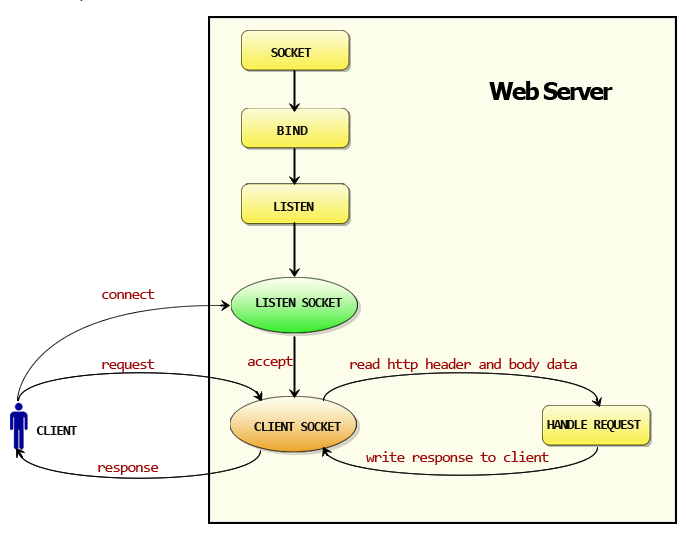

> #### socket建立流程

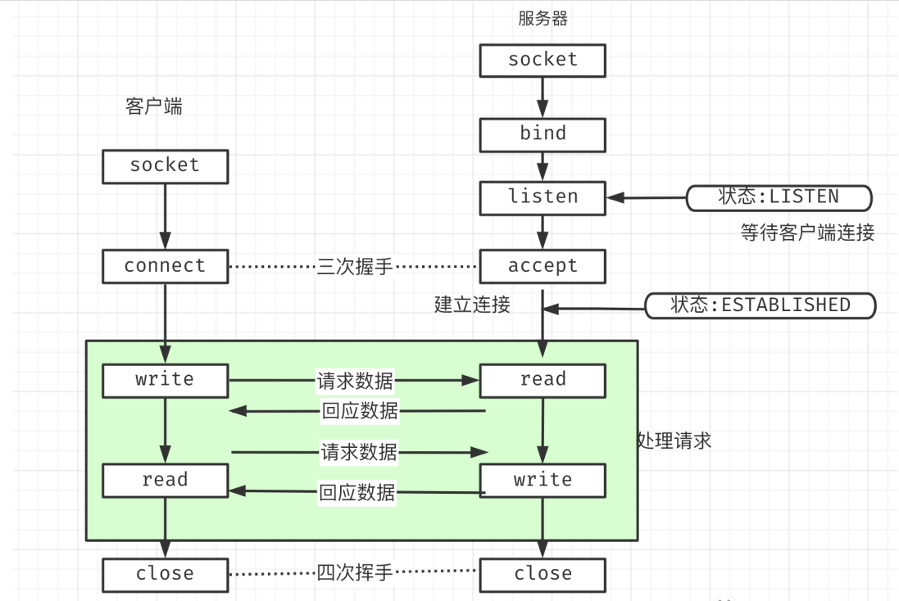

**重点：net/http全套服务：**

1. 注册路由

   ```
   http.HandleFunc("/", func(w http.ResponseWriter, r *http.Request) {
   })
   ```

2. ln, err := net.Listen(“tcp”, addr)做了初试化了socket, bind, listen的操作.

3. rw, e := l.Accept()进行accept, 等待客户端进行连接

4. go c.serve(ctx) 启动新的goroutine来处理本次请求. 同时主goroutine继续等待客户端连接, 进行高并发操作

5. h, _ := mux.Handler(r) 获取注册的路由, 然后拿到这个路由的handler, 然后将处理结果返回给客户端


>  #### question：

1. 如何监听端口？http.ListenAndServe

2. 如何接收客户端请求？http.ListenAndServe内部原理。**注意点：这里内部就有高并发体现了，用户的每一次请求都是在一个新的goroutine去服务**

3. 如何分配handler？http.ListenAndServe内部原理。Handle和HandleFunc函数可以向DefaultServeMux添加处理器，就是注册处理路由。

   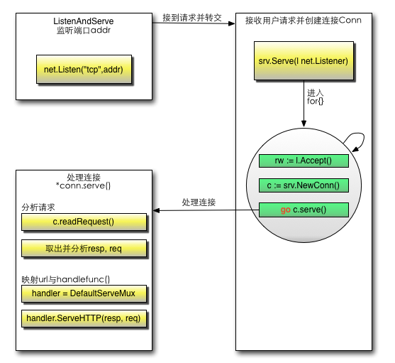

### 1 Gin

#### 1.1 初识Gin框架

> 下载安装Gin

```bash
go get -u github.com/gin-gonic/gin
```

> First demo

```go
//为什么使用http/net包就可以实现web服务端，框架的作用就是搭好这个舞台供你来实现
func sayHello(c *gin.Context) {
	c.JSON(200, gin.H{
		"message": "hello golang",
	})
}
func main() {
	r := gin.Default()        //返回默认的路由引擎
	r.GET("/hello", sayHello) //指定用户使用GET请求访问helllo时，执行sayHello函数
	//启动服务
	r.Run(":9090") //默认8080端口
}
```


#### 1.2 RESTful API

REST与技术无关，代表的是一种软件架构风格，REST是Representational State Transfer的简称。Gin框架支持开发RESTful API的开发。

简单来说，REST的含义就是客户端与Web服务器之间进行交互的时候，使用HTTP协议中的4个请求方法代表不同的动作。只要API程序遵循了REST风格，那就可以称其为RESTful API。目前在前后端分离的架构中，前后端基本都是通过RESTful API来进行交互。

- `GET`用来获取资源
- `POST`用来新建资源
- `PUT`用来更新资源
- `DELETE`用来删除资源。


#### 1.3 Gin渲染

##### HTML渲染

**易错点：多个模板模板解析,注意用r.LoadHTMLGlob**

```go
r:=gin.Default()	
r.LoadHTMLGlob("./templates/**/*")           //多个模板模板解析,注意用loadhtmlglob
r.GET("/posts/index", func(c *gin.Context) {
		//http请求
		c.HTML(http.StatusOK, "posts/index.tmpl", gin.H{//模板渲染
			"title": "posts/index",
		})
	})
r.GET("/users/index", func(c *gin.Context) { 
		//http请求
		c.HTML(http.StatusOK, "users/index.tmpl", gin.H{
			"title": "users/index",
		})
	})
r.Run()
```

> #### 自定义模板函数渲染

> ##### 定义模板：

```template
<!DOCTYPE html>
<html lang="zh-CN">
<head>
    <title>修改模板引擎的标识符</title>
</head>
<body>
<div>{{ . | safe }}</div>
</body>
</html>
```

> ##### 解析，渲染模板：

```go
r：=gin.Default()	
r.SetFuncMap(template.FuncMap{ //设置自定义函数，让模板知道有这个函数,一定要放在解析模板前面，顺序不能错！！！！！
		"curry": func(str string) template.HTML {
			return template.HTML(str)
		},
	})
	r.Static("/xxx", "./static")                 //一定要在解析模板前声明加载静态文件：html页面上用到的样式文件，css，js 图片
	r.LoadHTMLFiles("./templates/diyindex.tmpl") //单个模板解析
	r.GET("/diyindex", func(c *gin.Context) {
		c.HTML(http.StatusOK, "diyindex.tmpl", "<a href='https://liwenzhou.com'>李文周的博客</a>") //模板渲染之自定义函数渲染加上静态文件！！！！！！
	})
r.Run()
```


> #### 静态文件处理

**易错点：一定要在解析模板前加载静态文件**

```go
func main() {
	r := gin.Default()
	r.Static("/static", "./static")
	r.LoadHTMLGlob("templates/**/*")
   // ...
	r.Run(":8080")
}
```

> #### 补充文件路径处理

关于模板文件和静态文件的路径，我们需要根据公司/项目的要求进行设置。可以使用下面的函数获取当前执行程序的路径。

```go
func getCurrentPath() string {
	if ex, err := os.Executable(); err == nil {
		return filepath.Dir(ex)
	}
	return "./"
}
```

> #### 使用模板继承


#####  JSON渲染

**注意点： gin.H 是map[string]interface{}的缩写**

```go
r := gin.Default()
r.GET("/json01", func(c *gin.Context) {
		c.JSON(http.StatusOK, gin.H{"message": "hello world! map"}) //方式一，自己拼接json类型map,gin.H实质就是一个map,json渲染方式一
	})
r.GET("/json02", func(c *gin.Context) {
		var msg struct { //字段首字母必须大写
			Name    string `json:"name"` //要想返回结构体字段的小写，就要给结构体字段写tag,通过指定tag实现json序列化该字段时的key,做定制化操作
			Message string
			Age     int
		}
		msg.Name = "王坤"
		msg.Message = "hello stephen"
		msg.Age = 18
		c.JSON(http.StatusOK, msg) //方式二，使用结构体渲染json
	})
r.Run(":8080")
```

#####  XML渲染

**易错点:使用结构体的话注意需要使用具名的结构体类型**

```go
	r.GET("/someXML", func(c *gin.Context) {
		// 方式一：自己拼接JSON
		c.XML(http.StatusOK, gin.H{"message": "Hello world!"})
	})
	r.GET("/moreXML", func(c *gin.Context) {
		// 方法二：使用结构体
		type MessageRecord struct {
			Name    string
			Message string
			Age     int
		}
		var msg MessageRecord //注意需要使用具名的结构体类型
		msg.Name = "小王子"
		msg.Message = "Hello world!"
		msg.Age = 18
		c.XML(http.StatusOK, msg)
	})
```

##### YAMAL渲染

```go
r.GET("/someYAML", func(c *gin.Context) {
	c.YAML(http.StatusOK, gin.H{"message": "ok", "status": http.StatusOK})
})
```

##### protobuf渲染


#### 1.4 获取参数


#####  获取querystring参数

`querystring`指的是URL中`?`后面携带的参数，例如：`/user/search?username=小王子&address=沙河`，通过Query()或DefaultQuery()方法获得。 获取请求的querystring参数的方法如下：

```go
	r.GET("/getquery", func(c *gin.Context) {//获取querystring参数！！！！！！！
		// name:=c.Query("query")//第一种方式获取浏览器那边发请求携带的querystring参数,通过query来获取携带的参数
		// name := c.DefaultQuery("query", "wangkun") //第二种方式通过query来获取携带的参数，取不到就去后面的默认值
		age := c.DefaultQuery("age", "18")
		name, ok := c.GetQuery("query") //第三种方式，根据取不到，第二个就返回布尔值
		if !ok {
			name = "wangkun"
		}
		c.JSON(http.StatusOK, gin.H{
			"name": name,
			"age":  age,
		})
	})
```


#####  获取form参数

当前端请求的数据通过form表单提交时，一次请求对应一次响应 获取form参数，表单参数可以通过PostForm()方法获取

```go
	r.LoadHTMLGlob("./templates/form/*")
	r.GET("/login", func(c *gin.Context) {
		c.HTML(http.StatusOK, "login.html", nil)
	})
	r.POST("/login", func(c *gin.Context) { //获取form表单用post提交请求方式！！！！！！
		//username := c.DefaultPostForm("username", "库里")// DefaultPostForm取不到值时会返回指定的默认值
		username := c.PostForm("username")
		password := c.PostForm("password")
		c.HTML(http.StatusOK, "index.html", gin.H{ //输出json结果给调用方
			"Name":     username,
			"Password": password,
		})
	})
```

```html
<!DOCTYPE html>
<head>
    <title>登陆页面</title>
</head>
<body>
<form action="/login" method="post" novalidate autocomplete="off">
    <div>
        <label for="username">username:</label>
        <input type="text" name="username" id="username">
    </div>
    <div>
        <label for="password">password:</label>
        <input type="password" name="password" id="password">
    </div>
    <div>
       
        <input type="submit" value="登录">
    </div>
</form>
</body>
```

```html
<!DOCTYPE html>
<head>
<title>跳转页面</title>
</head>
<body>
<h1>hello,{{ .Name }}!</h1>
<p>你的密码是：{{ .Password }}</p>
</body>
```


#####  获取json参数

当前端请求的数据通过JSON提交时。**注意点与form的形式不同**

```go
r.POST("/json", func(c *gin.Context) {
	// 注意：下面为了举例子方便，暂时忽略了错误处理
	b, _ := c.GetRawData()  // 从c.Request.Body读取请求数据
	// 定义map或结构体
	var m map[string]interface{}
	// 反序列化
	_ = json.Unmarshal(b, &m)

	c.JSON(http.StatusOK, m)
})
```


##### 获取path参数

请求的参数通过URL路径传递，例如：`/user/search/小王子/沙河`,通过context的Param方法获得。 **注意点：区别于querystring的不同**

```go
	r.GET("/path/:name/:age/*action", func(c *gin.Context) { //获取path参数!!!!!!
		name := c.Param("name")
		age := c.Param("age")
        action := c.Param("action")
		c.JSON(http.StatusOK, gin.H{
			"name": name,
			"age":  age,
            "action":  action,
		})
	})
```


##### 参数绑定

.ShouldBind()的强大功能：它能够基于请求自动提取`JSON`、`form表单`和`QueryString`类型的数据，并把值绑定到指定的结构体对象。

```go
type Login struct {
		User     string `form:"user" json:"user" binding:"required"`//因为这里c.ShouldBind传递的只是结构体名称的地址（因为涉及修改所以必须传递地址），并不知道具体的字段对应的取值，所以要用反射，
		Password string `form:"password" json:"password" binding:"required"`
	}
//绑定querystring参数示例
	r.GET("/bindquerystring", func(c *gin.Context) {//querystring参数绑定
		var l Login
		err := c.ShouldBind(&l)
		if err == nil {
			c.JSON(http.StatusOK, gin.H{
				"user":     l.User,
				"password": l.Password,
			})
		} else {
			c.JSON(http.StatusOK, gin.H{
				"error": err.Error(),
			})
		}
	})

//绑定form表单示例
r.LoadHTMLGlob("./templates/form/*")
	r.GET("/bindlogin", func(c *gin.Context) {
		c.HTML(http.StatusOK, "login.html", nil)
	})
	r.POST("/login", func(c *gin.Context) {
		var l Login
		err := c.ShouldBind(&l)
		if err == nil {
			c.JSON(http.StatusOK, gin.H{
				"user":     l.User,
				"password": l.Password,
			})
		} else {
			c.JSON(http.StatusOK, gin.H{
				"error": err.Error(),
			})
		}
	})
// 绑定JSON的示例 ({"user": "q1mi", "password": "123456"})
	r.POST("/loginJSON", func(c *gin.Context) {
		var l Login
		if err := c.ShouldBind(&l); err == nil {
			fmt.Printf("login info:%#v\n", login)
			c.JSON(http.StatusOK, gin.H{
				"user":     l.User,
				"password": l.Password,
			})
		} else {
			c.JSON(http.Status
                   BadRequest, gin.H{"error": err.Error()})
		}
	})

```


#### 1.5 文件上传


##### 单个文件上传

```go
r.LoadHTMLFiles("./templates/file/index.html")
	r.GET("/file", func(c *gin.Context) {
		c.HTML(http.StatusOK, "index.html", nil)
	})
	r.POST("/upload", func(c *gin.Context) { //上传一个文件
		file, _ := c.FormFile("f1") //从请求中读文件，参数和对应html中定义的一样
		//将读取的文件保存到本地（服务端本地），首先要制定保存地址，有两种方式
		// dst:=fmt.Sprintf("./%s",file.Filename)
		dst := path.Join("./", file.Filename)
		_ = c.SaveUploadedFile(file, dst)
		c.JSON(http.StatusOK, gin.H{
			"status": "ok",
		})
	})
```


##### 多个文件上传

```go
r.MaxMultipartMemory = 8 << 20
	r.LoadHTMLFiles("./templates/file/multiindex.html")
	r.GET("/file", func(c *gin.Context) {
		c.HTML(http.StatusOK, "multiindex.html", nil)
	})
	r.POST("/upload", func(c *gin.Context) { //上传多个文件
		form, _ := c.MultipartForm() //从请求中读多个文件，无参数
		files := form.File["file"]
		//将读取的文件循环保存到本地（服务端本地），再循环体内制定保存地址
		for index, file := range files {

			dst := fmt.Sprintf("./%s_%d", file.Filename, index)
			_ = c.SaveUploadedFile(file, dst)
		}
		c.JSON(http.StatusOK, gin.H{
			"status": "ok",
		})
	})
```


#### 1.6 重定向

```go
//对内，外
r.GET("/cross", func(c *gin.Context) { //内部、外部重定向均支持
		c.Redirect(http.StatusMovedPermanently, "http://www.sogo.com")
	})
//路由重定向
	r.GET("/a", func(c *gin.Context) {
		c.Request.URL.Path = "/b" //指定重定向的地址
		r.HandleContext(c)        //，转向指定的路由
	})
	r.GET("/b", func(c *gin.Context) {
		c.JSON(http.StatusOK, gin.H{
			"status": "ok",
		})
	})
```


#### 1.7 Gin路由


##### 普通路由

路由：给个地址就给你条路

不同情况的路由：Get(),Post(),Put(),Delete(),Head(),Any()，NoRoute()

```go
r.GET("/index", func(c *gin.Context) {...})
r.GET("/login", func(c *gin.Context) {...})
r.POST("/login", func(c *gin.Context) {...})
r.Any("/test", func(c *gin.Context) {...})//可以匹配所有请求方法的Any方法
r.NoRoute(func(c *gin.Context) {//为没有配置处理函数的路由添加处理程序，默认情况下它返回404代码，为没有匹配到路由的请求都返回views/404.html页面
		c.HTML(http.StatusNotFound, "views/404.html", nil)
	})
```


##### 路由组

路由组：拥有共同URL前缀的路由划分为一个路由组。习惯性一对{}包裹同组的路由，这只是为了看着清晰，你用不用{}包裹功能上没什么区别。

```go
func main() {
	r := gin.Default()
	shopGroup := r.Group("/shop")
	{
		shopGroup.GET("/index", func(c *gin.Context) {...})
		shopGroup.GET("/cart", func(c *gin.Context) {...})
		shopGroup.POST("/checkout", func(c *gin.Context) {...})
	}
	r.Run()
}
```

同时路由组也支持嵌套：

```go
shopGroup := r.Group("/shop")
	{
		shopGroup.GET("/index", func(c *gin.Context) {...})
		shopGroup.GET("/cart", func(c *gin.Context) {...})
		shopGroup.POST("/checkout", func(c *gin.Context) {...})
		// 嵌套路由组
		xx := shopGroup.Group("xx")
		xx.GET("/oo", func(c *gin.Context) {...})
	}
```

#####  路由拆分与注册

> #### 路由拆分成单独文件或包

文件目录：

```bash
gin_demo
├── go.mod
├── go.sum
├── main.go
└── routers.go
```

```bash
gin_demo
├── go.mod
├── go.sum
├── main.go
└── routers
    └── routers.go
```

```go
package routers

import (
	"net/http"

	"github.com/gin-gonic/gin"
)

func helloHandler(c *gin.Context) {
	c.JSON(http.StatusOK, gin.H{
		"message": "Hello q1mi!",
	})
}

// SetupRouter 配置路由信息
func SetupRouter() *gin.Engine {
	r := gin.Default()
	r.GET("/hello", helloHandler)
	return r
}
```

```go
package main

import (
	"fmt"
	"gin_demo/routers"
)

func main() {
	r := routers.SetupRouter()
	if err := r.Run(); err != nil {
		fmt.Println("startup service failed, err:%v\n", err)
	}
}
```


> #### 路由拆分成多个文件

```bash
gin_demo
├── go.mod
├── go.sum
├── main.go
└── routers
    ├── blog.go
    └── shop.go
```

```go
func main() {
	r := gin.Default()
	routers.LoadBlog(r)
	routers.LoadShop(r)
	if err := r.Run(); err != nil {
		fmt.Println("startup service failed, err:%v\n", err)
	}
}
```

```go
func LoadBlog(e *gin.Engine) {
	e.GET("/post", postHandler)
  e.GET("/comment", commentHandler)
  ...
}
```

```go
func LoadShop(e *gin.Engine)  {
	e.GET("/hello", helloHandler)
  e.GET("/goods", goodsHandler)
  e.GET("/checkout", checkoutHandler)
  ...
}
```

> #### 路由分到不同app

```bash
gin_demo
├── app
│   ├── blog
│   │   ├── handler.go
│   │   └── router.go
│   └── shop
│       ├── handler.go
│       └── router.go
├── go.mod
├── go.sum
├── main.go
└── routers
    └── routers.go
```


#### 1.8 Gin中间件


##### 定义中间件

定义中间件，Gin中的中间件必须是一个gin.HandlerFunc类型，一般用闭包形式，因为在执行中间件之前还可以执行一些其他操作

```go
func m1(doCheck bool) gin.HandlerFunc {
	//执行一些其他准备工作
	return func(c *gin.Context) {
		if doCheck {
			c.JSON(http.StatusOK, gin.H{
				"msa": "ok",
			})
		}
	}
}
func m2() gin.HandlerFunc { //统计请求处理函数的耗时的中间件
	//执行一些其他准备工作
	return func(c *gin.Context) {
		fmt.Println("m1 in")
		start := time.Now() //开始计时
		c.Next()            //调用后续处理函数，这里直接去别的函数了，千万注意！！！！
		//c.Abort()//阻止调用后续的处理函数
		cost := time.Since(start)
		fmt.Printf("cost:%v\n", cost)
		fmt.Println("m1 out")
	}
}
func m3() gin.HandlerFunc { //统计请求处理函数的耗时的中间件
	//执行一些其他准备工作
	return func(c *gin.Context) {
		fmt.Println("m2 in")
		c.Next() //调用后续处理函数，这里直接去别的函数了，千万注意！！！！
		fmt.Println("m2 out")
	}
}

```


##### 注册中间件

1. 为全局路由注册中间件:`r.Use(StatCost())`
2. 为单个路由注册中间件：`r.get("XXX",中间件1，中间件2.....) `**注意点：{有中间件执行先后顺序}**
3. 为路由组注册中间件：

```go
//写法一
shopGroup := r.Group("/shop", StatCost())
{
    shopGroup.GET("/index", func(c *gin.Context) {...})
    ...
}
```

```go
//写法二
shopGroup := r.Group("/shop")
shopGroup.Use(StatCost())
{
    shopGroup.GET("/index", func(c *gin.Context) {...})
    ...
}
```


##### 中间件注意事项

1. `gin.Default()`默认使用了`Logger`和`Recovery`中间件，其中：

   - `Logger`中间件将日志写入`gin.DefaultWriter`，即使配置了`GIN_MODE=release`。

   - `Recovery`中间件会recover任何`panic`。如果有panic的话，会写入500响应码。

     如果不想使用上面两个默认的中间件，可以使用`gin.New()`新建一个没有任何默认中间件的路由。

2. gin中间件中使用goroutine：

​        当在中间件或`handler`中启动新的`goroutine`时，**不能使用**原始的上下文（c *gin.Context），必须使用其只读副本（`c.Copy()`）。


##### 中间件相关函数

1. 在中间件函数中通过再次调用`c.Next()`实现嵌套调用


2. 调用`c.Abort()`中断整个调用链条，从当前函数返回
3. `c.Set()`和`c.Get()`这两个方法多用于在多个函数之间通过`c`传递数据的，比如我们可以在认证中间件中获取当前请求的相关信息（userID等）通过`c.Set()`存入`c`，然后在后续处理业务逻辑的函数中通过`c.Get()`来获取当前请求的用户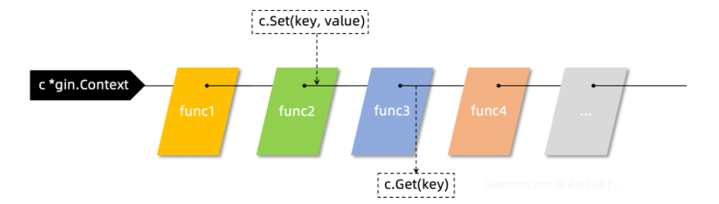

```go
// 定义中间
func MiddleWare() gin.HandlerFunc {
    return func(c *gin.Context) {
        t := time.Now()
        fmt.Println("中间件开始执行了")
        // 设置变量到Context的key中，可以通过Get()取
        c.Set("request", "中间件")
        // 执行函数
        c.Next()
        // 中间件执行完后续的一些事情
        status := c.Writer.Status()
        fmt.Println("中间件执行完毕", status)
        t2 := time.Since(t)
        fmt.Println("time:", t2)
    }
}

func main() {
    // 1.创建路由
    // 默认使用了2个中间件Logger(), Recovery()
    r := gin.Default()
    // 注册中间件
    r.Use(MiddleWare())
    // {}为了代码规范
    {
        r.GET("/ce", func(c *gin.Context) {
            // 取值
            req, _ := c.Get("request")
            fmt.Println("request:", req)
            // 页面接收
            c.JSON(200, gin.H{"request": req})
        })

    }
    r.Run()
}
```


#### 1.9 Cookie

##### why

http协议是无状态的，每次请求都是独立的。这里的状态可以理解为客户端和服务器在某次会话中产生的数据，无状态独立就表示这些数据不会被保留。那如何“保持状态呢”？

##### what

在Internet中，cookie指小量信息，由web服务器创建，将信息存储在客户端的数据文件。

网络用户习惯称为cookies，指某些网站为了辨别用户身份，进行session跟踪而存储在用户本地终端上的数据，这些数据通常会经过加密处理。

##### how

cookie是由服务器端生成，发送给user-agent（这里一般指浏览器），浏览器会将cookie的key/value保存到某个目录下的文本文件内，下次请求统一网站时就发送该cookie给服务器（这里前提是浏览器设置为启用cookie）。

cookie的key/value可以有服务器端开发自己定义，这样服务器可以知道该用户是否是合法用户以及是否需要重新登陆等，服务器可以设置或读取cookie中包含的信息，借此来维护用户跟服务器会话中的状态。

cookie的特点：

1. 浏览器发送请求时会自动携带该站点之前存储的cookie信息。
2. cookie数据可以配置过期时间，过期的cookie会被系统清除。
3. cookie是针对单个域名的，不同域名之间的cookie相互独立。
4. 服务端可以设置cookie数据。

##### Gin框架操作Cookie

模拟实现权限验证中间件：

- 有2个路由，login和home
- login用于设置cookie
- home是访问查看信息的请求
- 在请求home之前，先跑中间件代码，检验是否存在cookie

```go
//定义中间件
func MiddleWare() gin.HandlerFunc {
	return func(c *gin.Context) {
		cookie, err := c.Cookie("a") //获取客户端cookie并校验
		if err == nil {
			if cookie == "13" {
				c.Next()
				return
			}
		}
		c.JSON(http.StatusUnauthorized, gin.H{
			"error": "err",
		})
		c.Abort() // 若验证不通过，不再调用后续的函数处理
		return
	}
}
func main() {
	r := gin.Default() //1.创建路由
	r.GET("/login", func(c *gin.Context) {
		c.SetCookie("a", "13", 60, "/", "localhost", false, true) //有服务端给客户端设置cookie,这里注意域名为localhost，不要写成127.0.0.1
		c.String(200, "Login success!!!")
	})
	r.GET("/home", MiddleWare(), func(c *gin.Context) {
		c.JSON(200, gin.H{
			"data": "home",
		})
	})
	r.Run(":8080")
}

```


#### 1.10 Session

##### why

Cookie虽然保证了“保持状态”的需求，但缺点是：本身只最大支持4096字节，以及本身存在安全性。因此Session出来了，支持更多的字节，并且它保存在服务器，有较高的安全性。

##### what

用户登陆成功之后，我们在服务端为每个用户创建一个特定的session和一个唯一的标识，它们一一对应。其中：

- Session是在服务端保存的一个数据结构，用来跟踪用户的状态，这个数据可以保存在集群、数据库、文件中；
- 唯一标识通常称为`Session ID`会写入用户的Cookie中。

这样该用户后续再次访问时，请求会自动携带Cookie数据（其中包含了`Session ID`），服务器通过该`Session ID`就能找到与之对应的Session数据，也就知道来的人是“谁”。

总结而言：Cookie弥补了HTTP无状态的不足，让服务器知道来的人是“谁”；但是Cookie以文本的形式保存在本地，自身安全性较差；所以我们就通过Cookie识别不同的用户，对应的在服务端为每个用户保存一个Session数据，该Session数据中能够保存具体的用户数据信息。


### 2 GORM

#### 2.1 前言

ORM: Object Relational Mapping 程序中的对象或者实例和关系数据库之间的一种映射  优点：提高开发效率  缺点：牺牲执行性能和灵活性，弱化SQL能力

go中映射关系：1. 数据表---结构体 2. 数据行---结构体实例 3. 字段---结构体字段

#### 2.2连接MySQL

```go
import (
  "github.com/jinzhu/gorm"
  _ "github.com/jinzhu/gorm/dialects/mysql"//连接不同的数据库都需要导入对应数据的驱动程序，GORM已经贴心的为我们包装了一些驱动程序
)

func main() {
  db, err := gorm.Open("mysql", "user:password@(localhost)/dbname?charset=utf8mb4&parseTime=True&loc=Local")
  defer db.Close()
}
```

#### 2.3 GORM基本示例

```go
type UserInfo struct {
	Id   string
	Name string
	Age  int
}

func main() {
	db, err := gorm.Open("mysql", "root:123456@tcp(127.0.0.1:3306)/sql_test?charset=utf8mb4&parseTime=True") //连接mysql数据库
	if err != nil {
		panic(err)
	}
	defer db.Close()

	db.AutoMigrate(&UserInfo{}) //创建表 自动迁移 把结构体和数据表进行对应
	//创建
	u1 := UserInfo{"7", "wangkun", 22} //创建数据行
	db.Create(&u1)
	//查询
	var u UserInfo
	db.First(&u) //把查询的第一行数据给到u
	fmt.Println(u)
	var uu UserInfo
	db.Find(&uu, "id=?", "8") //把查询的第一行数据给到u
	fmt.Println(uu)
	//更新
	db.Model(&u).Update("name", "wk")
	//删除
	db.Delete(&u)
}
```

#### 2.4 GORM Model

   在使用orm工具时，我们要在代码中定义模型（Models）来与数据库中的数据表进行映射。在GORM中，模型通常是正常定义的结构体（结构体的字段就对应数据表中的字段，一个结构体实例就对应数据表中的一行）、基本go类型或它们的指针。

##### gorm.Model

 为方便模型定义，GORM内置了一个gorm.Model结构体。我们可以在构造自己的结构体的时候选择继承内置结构体或者自己完全定义一个模型。**注意点：gorm默认用Id作为主键。**

```go
// gorm.Model 定义
type Model struct {
  ID        uint `gorm:"primary_key"`
  CreatedAt time.Time
  UpdatedAt time.Time
  DeletedAt *time.Time
}
```

```go
// 不使用gorm.Model，自行定义模型
type User struct {
  ID   int
  Name string
}
```

##### 结构体标记（tags）

gorm支持以下tags(可选项)：


##### Model的约束

1. 主键：GORM 默认会使用名为ID的字段作为表的主键

   ```go
   type User struct {
     ID   string // 名为`ID`的字段会默认作为表的主键
     Name string
   }
   
   // 使用`AnimalID`作为主键
   type Animal struct {
     AnimalID int64 `gorm:"primary_key"`
     Name     string
     Age      int64
   }
   ```

2. 表名：默认就是结构体名称的复数

   ```go
   type User struct {} // 默认表名是 `users`
   
   // 将 User 的表名设置为 `profiles`
   func (User) TableName() string {
     return "profiles"
   }
   
   func (u User) TableName() string {
     if u.Role == "admin" {
       return "admin_users"
     } else {
       return "users"
     }
   }
   
   // 禁用默认表名的复数形式，如果置为 true，则 `User` 的默认表名是 `user`
   db.SingularTable(true)
   ```

3. 列名: 由字段名称进行下划线分割来生成

   ```go
   type User struct {
     ID        uint      // column name is `id`
     Name      string    // column name is `name`
     Birthday  time.Time // column name is `birthday`
     CreatedAt time.Time // column name is `created_at`
   }
   ```

​      可以使用结构体tag指定列名：(用的多)

```go
type Animal struct {
  AnimalId    int64     `gorm:"column:beast_id"`         // set column name to `beast_id`
  Birthday    time.Time `gorm:"column:day_of_the_beast"` // set column name to `day_of_the_beast`
  Age         int64     `gorm:"column:age_of_the_beast"` // set column name to `age_of_the_beast`
}
```


##### 时间戳跟踪

> ####  CreatedAt

如果模型有 `CreatedAt`字段，该字段的值将会是初次创建记录的时间。

```go
db.Create(&user) // `CreatedAt`将会是当前时间

// 可以使用`Update`方法来改变`CreateAt`的值
db.Model(&user).Update("CreatedAt", time.Now())
```

> #### UpdatedAt

如果模型有`UpdatedAt`字段，该字段的值将会是每次更新记录的时间。

```go
db.Save(&user) // `UpdatedAt`将会是当前时间

db.Model(&user).Update("name", "jinzhu") // `UpdatedAt`将会是当前时间
```

> #### DeletedAt

如果模型有`DeletedAt`字段，调用`Delete`删除该记录时，将会设置`DeletedAt`字段为当前时间，而不是直接将记录从数据库中删除。


#### 2.5 GORM CRUD

 

##### 创建

>1.定义模型

```go
type User struct {
	ID           int64
	Name         string
	Age          int64
}
```

2.使用NewRecord()判断记录是否存在，为空就用Create()创建，防止结构体过大，传入指针比较好

```go
user := User{Name: "q1mi", Age: 18}
db.NewRecord(user) // 主键为空返回`true`
db.Create(&user)   // 创建user
db.NewRecord(user) // 创建`user`后返回`false`
```

3.默认值的使用：可以通过 tag 定义字段的默认值，在创建记录时候生成的 SQL 语句会排除没有值或值为 零值 的字段，所有字段的零值, 比如`0`, `""`,`false`或者其它`零值`，都不会保存到数据库内，但会使用他们的默认值。如果你想避免这种情况，可以考虑使用指针或实现 `Scanner/Valuer`接口

```go
type User struct {
  ID   int64
  Name string `gorm:"default:'小王子'"`
  Age  int64
}
var user = User{Name: "", Age: 99}
db.Create(&user)//代码实际执行的SQL语句是INSERT INTO users("age") values('99');，排除了零值字段Name，而在数据库中这一条数据会使用设置的默认值小王子作为Name字段的值。
```

**易错点：这里注意小王子因为字符型要打单引号，否则数据库创建不了，也不会报错！！！！！！！！**

4.使用指针方式实现零值存入数据库

```go
// 使用指针
type User struct {
  ID   int64
  Name *string `gorm:"default:'小王子'"`
  Age  int64
}
user := User{Name: new(string), Age: 18))}
db.Create(&user)  // 此时数据库中该条记录name字段的值就是''
```

使用Scanner/Valuer接口方式实现零值存入数据库

```go
// 使用 Scanner/Valuer
type User struct {
	ID int64
	Name sql.NullString `gorm:"default:'小王子'"` // sql.NullString 实现了Scanner/Valuer接口
	Age  int64
}
user := User{Name: sql.NullString{"", true}, Age:18}
db.Create(&user)  // 此时数据库中该条记录name字段的值就是''
```


#####  查询

> #### 一般查询

```go
var (
		u1 NbaInfo
		u2 NbaInfo
		u3 NbaInfo
		u4 []NbaInfo
		u5 NbaInfo
	)
	db.First(&u1)       //根据主键查询第一条记录 SELECT * FROM nabinfos ORDER BY id LIMIT 1;
	db.Take(&u2)        //随机获取一条记录 SELECT * FROM nabinfos LIMIT 1;
	db.Last(&u3)        //根据主键获取最后一条记录  SELECT * FROM nabinfos ORDER BY id DESC LIMIT 1;
	db.Find(&u4)        //查询所有记录   SELECT * FROM nabinfos;
	db.First(&u5, "30") //查询指定的某条记录   SELECT * FROM nabinfos WHERE id="30";
```

> #### where条件

```go
var (
		u1 NbaInfo
		u2 []NbaInfo
		u3 []NbaInfo
		u4 []NbaInfo
		u5 []NbaInfo
		u6 []NbaInfo
		//u7 []NbaInfo
		u8    []NbaInfo
		u66   []NbaInfo
		u666  []NbaInfo
		u6666 []NbaInfo
		u9    []NbaInfo
	)
	db.Where("age = ?", 33).First(&u1)                 //查询第一条匹配到的记录  SELECT * FROM nbainfos WHERE age=33 limit 1;
	db.Where("age = ?", 33).Find(&u2)                  // 查询所有相匹配的记录 SELECT * FROM nbainfos WHERE age=33;
	db.Where("age <> ?", 33).Find(&u3)                 // <> SELECT * FROM nbainfos WHERE age <> 33;
	db.Where("age IN (?)", []int{33, 30}).Find(&u4)    // IN SELECT * FROM nbainfos WHERE age in (33,30);
	db.Where("name LIKE ?", "%ur%").Find(&u5)          // LIKE SELECT * FROM nbainfos WHERE name LIKE '%ur%'
	db.Where("age = ? AND id > ?", 33, "31").Find(&u6) // AND SELECT * FROM nbainfos WHERE age=33 AND id>31;
	// db.Where("updated_at > ?",)                         // Time SELECT * FROM nbainfos WHERE  updated_at > '2000-01-01 00:00:00';
	db.Where("id BETWEEN ? AND ?", "10", "30").Find(&u8) // BETWEEN SELECT * FROM nbainfos WHERE id BETWEEN 10 AND 30;
```

```go
//where结合struct&map查询
	db.Where(&NbaInfo{Age: 33, Id: "31"}).Find(&u66)                    // AND SELECT * FROM nbainfos WHERE age=33 AND id=31;
	db.Where(map[string]interface{}{"Age": 33, "Id": "31"}).Find(&u666) // AND SELECT * FROM nbainfos WHERE age=33 AND id=31;
	db.Where(&NbaInfo{Age: 33, Id: ""}).Find(&u6666)                    //当通过结构体查询时，gorm只通过非零值字段，如果字段为0，false,''或其他零值，将不构成查询条件,可以通过指针或实现scanner、valuer接口来避免这个问题。 SELECT *FROM nbainfos WHERE AGE = 33;
	//主键的切片放在where中
	db.Where([]string{"30", "11"}).Find(&u9)   // SELECT * FROM nbainfos WHERE id IN (30,11);
```

> #### NOT条件

```go
var (
		u1 NbaInfo
		u2 []NbaInfo
		u3 []NbaInfo
		u4 []NbaInfo
		u5 NbaInfo
	)
	db.Not("name", "curry").First(&u1)          //SELECT * FROM nbainfos WHERE NAME <>"curry" LIMIT 1;
	db.Not("age", []int{30, 33}).Find(&u2)      //SELECT * FROM nbainfos WHERE age NOT IN (30,33);
	db.Not([]string{"7", "30", "11"}).Find(&u3) // SELECT * FROM nbainfos WHERE id NOT IN ("7","30","11");
	db.Not([]string{}).Find(&u4)                //SELECT * FROM nbainfos;
	db.Not("name = ?", "curry").First(&u5)      //SELECT * FROM nbainfos WHERE NOT(name ="curry");
```

> #### OR条件

```go
	db.Where("name = ?", "curry").Or("name = ?", "klay").Find(&u1)// SELECT * FROM nbainfos WHERE name = 'curry' OR name = 'klay';
	db.Where("name = 'curry'").Or(NbaInfo{Name: "klay"}).Find(&u2)// Struct  SELECT * FROM nbainfos WHERE name = 'curry' OR name = 'klay';
	db.Where("name = 'curry'").Or(map[string]interface{}{"name": "klay"}).Find(&u3)//Map  SELECT * FROM users WHERE name = 'jinzhu' OR name = 'jinzhu 2';

```

> #### 内联条件

> #### 额外查询选项

> #### FirstOrInit

> #### FirstOrCreate

> #### 高级查询

> #### Pluck和Scan


##### 链式操作

> #### 基本示例

> #### 立即执行方法

> #### 范围

> #### 多个立即执行方法


#####  更新

> #### 更新所有字段

> #### 更新修改字段

> #### 更新选定字段

> #### 无Hooks更新

> #### 批量更新

> #### 使用sql表达式更新

> #### 修改Hooks中的值

> #### 其他更新选项


#####  删除

> #### 删除记录

> #### 批量删除

> #### 软删除

> #### 物理删除


---

---

#                                             Ⅴ 数据库学习

---

---

## 1 Mysql


### 1.1 连接数据库

`database/sql`包提供了保证SQL或类SQL数据库的泛用接口，并不提供具体的数据库驱动。使用`database/sql`包时必须注入（至少）一个数据库驱动。

> ##### 下载驱动依赖

```bash
go get -u github.com/go-sql-driver/mysql
```

> ##### 使用驱动

```go
func Open(driverName, dataSourceName string) (*DB, error)
```

```go
// 定义一个全局对象db
var db *sql.DB

// 定义一个初始化数据库的函数
func initDB() (err error) {
	dsn := "user:password@tcp(127.0.0.1:3306)/sql_test?charset=utf8mb4&parseTime=True"
	db, err = sql.Open("mysql", dsn)//注意！！！这里不要使用:=，我们是给全局变量赋值，然后在main函数中使用全局变量db。Open函数可能只是验证其参数格式是否正确，实际上并不创建与数据库的连接。如果要检查数据源的名称是否真实有效，应该调用Ping方法。
	if err != nil {
		return err
	}
	err = db.Ping()// 尝试与数据库建立连接（校验dsn是否正确）
	if err != nil {
		return err
	}
	return nil
}

func main() {
	err := initDB() // 调用输出化数据库的函数
	if err != nil {
		fmt.Printf("init db failed,err:%v\n", err)
		return
	}
}
```

**注意点：返回的DB对象可以安全地被多个goroutine并发使用，并且维护其自己的空闲连接池。因此，Open函数应该仅被调用一次，很少需要关闭这个DB对象。**

**易错点:主逻辑中使用 defer 最后关闭连接是没有问题的。如果是在模块化开发，我们把一些数据库连接的操作封装到函数中，就不能带有 defer。由于 defer 是在逻辑的最后执行的，实际上到 return 的时候，返回的已经是 null**

> ##### SetMaxOpenConns

```go
func (db *DB) SetMaxOpenConns(n int)//设置与数据库建立连接的最大数目
```

> ##### SetMaxIdleConns

```go
func (db *DB) SetMaxIdleConns(n int)//设置连接池中的最大闲置连接数
```


### 1.2 CRUD


>##### 查询

单行查询：`func (db *DB) QueryRow(query string, args ...interface{}) *Row`返回一行结果（即Row）参数args表示query中的占位参数。

```go
// 查询单条数据示例
func queryRowDemo() {
	sqlStr := "select id, name, age from user where id=?"
	var u user
	// 非常重要：确保QueryRow之后调用Scan方法，否则持有的数据库链接不会被释放
	err := db.QueryRow(sqlStr, 1).Scan(&u.id, &u.name, &u.age)
	if err != nil {
		fmt.Printf("scan failed, err:%v\n", err)
		return
	}
	fmt.Printf("id:%d name:%s age:%d\n", u.id, u.name, u.age)
}
```

多行查询：`func (db *DB) Query(query string, args ...interface{}) (*Rows, error)`执行一次查询，返回多行结果（即Rows），一般用于执行select命令。参数args表示query中的占位参数。

```go
// 查询多条数据示例
func queryMultiRowDemo() {
	sqlStr := "select id, name, age from user where id > ?"
	rows, err := db.Query(sqlStr, 0)
	if err != nil {
		fmt.Printf("query failed, err:%v\n", err)
		return
	}
	// 非常重要：关闭rows释放持有的数据库链接
	defer rows.Close()

	// 循环读取结果集中的数据
	for rows.Next() {
		var u user
		err := rows.Scan(&u.id, &u.name, &u.age)
		if err != nil {
			fmt.Printf("scan failed, err:%v\n", err)
			return
		}
		fmt.Printf("id:%d name:%s age:%d\n", u.id, u.name, u.age)
	}
}
```


**插入、更新和删除操作都使用`Exec`方法。`func (db *DB) Exec(query string, args ...interface{}) (Result, error)`返回的Result是对已执行的SQL命令的总结。参数args表示query中的占位参数。**

> ##### 插入

```go
// 插入数据
func insertRowDemo() {
	sqlStr := "insert into user(name, age) values (?,?)"
	ret, err := db.Exec(sqlStr, "王五", 38)
	if err != nil {
		fmt.Printf("insert failed, err:%v\n", err)
		return
	}
	theID, err := ret.LastInsertId() // 新插入数据的id
	if err != nil {
		fmt.Printf("get lastinsert ID failed, err:%v\n", err)
		return
	}
	fmt.Printf("insert success, the id is %d.\n", theID)
}
```

> ##### 更新

```go
// 更新数据
func updateRowDemo() {
	sqlStr := "update user set age=? where id = ?"
	ret, err := db.Exec(sqlStr, 39, 3)
	if err != nil {
		fmt.Printf("update failed, err:%v\n", err)
		return
	}
	n, err := ret.RowsAffected() // 操作影响的行数
	if err != nil {
		fmt.Printf("get RowsAffected failed, err:%v\n", err)
		return
	}
	fmt.Printf("update success, affected rows:%d\n", n)
}
```

> ##### 删除

```go
// 删除数据
func deleteRowDemo() {
	sqlStr := "delete from user where id = ?"
	ret, err := db.Exec(sqlStr, 3)
	if err != nil {
		fmt.Printf("delete failed, err:%v\n", err)
		return
	}
	n, err := ret.RowsAffected() // 操作影响的行数
	if err != nil {
		fmt.Printf("get RowsAffected failed, err:%v\n", err)
		return
	}
	fmt.Printf("delete success, affected rows:%d\n", n)
}
```


### 1.3 MYSQL预处理


> ##### what

普通SQL语句执行过程：

1. 客户端对SQL语句进行占位符替换得到完整的SQL语句。
2. 客户端发送完整SQL语句到MySQL服务端
3. MySQL服务端执行完整的SQL语句并将结果返回给客户端。

预处理执行过程：

1. 把SQL语句分成两部分，命令部分与数据部分。

2. 先把命令部分发送给MySQL服务端，MySQL服务端进行SQL预处理。

3. 然后把数据部分发送给MySQL服务端，MySQL服务端对SQL语句进行占位符替换。

4. MySQL服务端执行完整的SQL语句并将结果返回给客户端。

   

> ##### why

1. 优化MySQL服务器重复执行SQL的方法，可以提升服务器性能，提前让服务器编译，一次编译多次执行，节省后续编译的成本。

2. 避免SQL注入问题。

   

> ##### sql注入问题

**我们任何时候都不应该自己拼接SQL语句！**

```go
// 一个自行拼接SQL语句的示例，编写一个根据name字段查询user表的函数
func sqlInjectDemo(name string) {
	sqlStr := fmt.Sprintf("select id, name, age from user where name='%s'", name)
	..........
}
```

输入以下字符串都会引发注入问题：

```go
sqlInjectDemo("xxx' or 1=1#")
sqlInjectDemo("xxx' union select * from user #")
sqlInjectDemo("xxx' and (select count(*) from user) <10 #")
```


> ##### how

`database/sql`中使用下面的`Prepare`方法来实现预处理操作,返回一个准备好的状态用于之后的查询和命令。返回值可以同时执行多个查询和命令。

```go
func (db *DB) Prepare(query string) (*Stmt, error)
```

```go
// 预处理查询示例
func prepareQueryDemo() {
	sqlStr := "select id, name, age from user where id > ?"
	stmt, err := db.Prepare(sqlStr)
	if err != nil {
		fmt.Printf("prepare failed, err:%v\n", err)
		return
	}
	defer stmt.Close()
	rows, err := stmt.Query(0)
	if err != nil {
		fmt.Printf("query failed, err:%v\n", err)
		return
	}
	defer rows.Close()
	// 循环读取结果集中的数据
	for rows.Next() {
		var u user
		err := rows.Scan(&u.id, &u.name, &u.age)
		if err != nil {
			fmt.Printf("scan failed, err:%v\n", err)
			return
		}
		fmt.Printf("id:%d name:%s age:%d\n", u.id, u.name, u.age)
	}
}
```

```go
// 预处理插入示例
func prepareInsertDemo() {
	sqlStr := "insert into user(name, age) values (?,?)"
	stmt, err := db.Prepare(sqlStr)
	if err != nil {
		fmt.Printf("prepare failed, err:%v\n", err)
		return
	}
	defer stmt.Close()
	_, err = stmt.Exec("小王子", 18)
	if err != nil {
		fmt.Printf("insert failed, err:%v\n", err)
		return
	}
	_, err = stmt.Exec("沙河娜扎", 18)
	if err != nil {
		fmt.Printf("insert failed, err:%v\n", err)
		return
	}
	fmt.Println("insert success.")
}
```


### 1.4 事务


> ##### what

一个最小的不可再分的工作单元；通常一个事务对应一个完整的业务(例如银行账户转账业务，该业务就是一个最小的工作单元)，同时这个完整的业务需要执行多次的DML(insert、update、delete)语句共同联合完成。A转账给B，这里面就需要执行两次update操作。

**注意点：在MySQL中只有使用了`Innodb`数据库引擎的数据库或表才支持事务。事务处理可以用来维护数据库的完整性，保证成批的SQL语句要么全部执行，要么全部不执行。**


> ##### 事务的特性

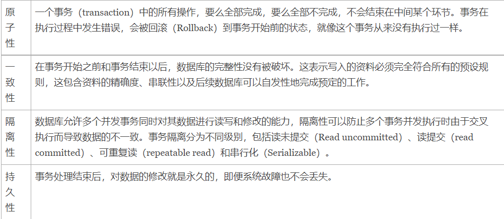


> ##### how

```go
// 开始事务 func (db *DB) Begin() (*Tx, error)
// 提交事务 func (tx *Tx) Commit() error
// 回滚事务 func (tx *Tx) Rollback() error
```

```go
// 事务操作示例
func transactionDemo() {
	tx, err := db.Begin() // 开启事务
	if err != nil {
		if tx != nil {
			tx.Rollback() // 回滚
		}
		fmt.Printf("begin trans failed, err:%v\n", err)
		return
	}
	sqlStr1 := "Update user set age=30 where id=?"
	ret1, err := tx.Exec(sqlStr1, 2)
	if err != nil {
		tx.Rollback() // 回滚
		fmt.Printf("exec sql1 failed, err:%v\n", err)
		return
	}
	affRow1, err := ret1.RowsAffected()
	if err != nil {
		tx.Rollback() // 回滚
		fmt.Printf("exec ret1.RowsAffected() failed, err:%v\n", err)
		return
	}

	sqlStr2 := "Update user set age=40 where id=?"
	ret2, err := tx.Exec(sqlStr2, 3)
	if err != nil {
		tx.Rollback() // 回滚
		fmt.Printf("exec sql2 failed, err:%v\n", err)
		return
	}
	affRow2, err := ret2.RowsAffected()
	if err != nil {
		tx.Rollback() // 回滚
		fmt.Printf("exec ret1.RowsAffected() failed, err:%v\n", err)
		return
	}

	fmt.Println(affRow1, affRow2)
	if affRow1 == 1 && affRow2 == 1 {
		fmt.Println("事务提交啦...")
		tx.Commit() // 提交事务
	} else {
		tx.Rollback()
		fmt.Println("事务回滚啦...")
	}

	fmt.Println("exec trans success!")
}
```


## 2 Mysql进阶


### 2.1 连接数据库

> ##### 安装sqlx

```go
go get github.com/jmoiron/sqlx
```

> ##### 连接

```go
var db *sqlx.DB

func initDB() (err error) {
	dsn := "user:password@tcp(127.0.0.1:3306)/sql_test?charset=utf8mb4&parseTime=True"
	// 也可以使用MustConnect连接不成功就panic
	db, err = sqlx.Connect("mysql", dsn)
	if err != nil {
		fmt.Printf("connect DB failed, err:%v\n", err)
		return
	}
	db.SetMaxOpenConns(20)
	db.SetMaxIdleConns(10)
	return
}
```

### 2.2 CRUD

**注意点：sqlx相比sql实现了对数据的批量处理**

> ##### 查询

单行：

```go
// 查询单条数据示例
func queryRowDemo() {
	sqlStr := "select id, name, age from user where id=?"
	var u user
	err := db.Get(&u, sqlStr, 1)
	if err != nil {
		fmt.Printf("get failed, err:%v\n", err)
		return
	}
	fmt.Printf("id:%d name:%s age:%d\n", u.ID, u.Name, u.Age)
}
```

多行：

```go
// 查询多条数据示例
func queryMultiRowDemo() {
	sqlStr := "select id, name, age from user where id > ?"
	var users []user
	err := db.Select(&users, sqlStr, 0)
	if err != nil {
		fmt.Printf("query failed, err:%v\n", err)
		return
	}
	fmt.Printf("users:%#v\n", users)
}
```

NamedQuery: 

```go
func namedQuery(){
	sqlStr := "SELECT * FROM user WHERE name=:name"
	// 使用map做命名查询
	rows, err := db.NamedQuery(sqlStr, map[string]interface{}{"name": "七米"})
	if err != nil {
		fmt.Printf("db.NamedQuery failed, err:%v\n", err)
		return
	}
	defer rows.Close()
	for rows.Next(){
		var u user
		err := rows.StructScan(&u)
		if err != nil {
			fmt.Printf("scan failed, err:%v\n", err)
			continue
		}
		fmt.Printf("user:%#v\n", u)
	}

	u := user{
		Name: "七米",
	}
	// 使用结构体命名查询，根据结构体字段的 db tag进行映射
	rows, err = db.NamedQuery(sqlStr, u)
	if err != nil {
		fmt.Printf("db.NamedQuery failed, err:%v\n", err)
		return
	}
	defer rows.Close()
	for rows.Next(){
		var u user
		err := rows.StructScan(&u)
		if err != nil {
			fmt.Printf("scan failed, err:%v\n", err)
			continue
		}
		fmt.Printf("user:%#v\n", u)
	}
}
```


> 插入，更新，删除

```go
// 插入数据
func insertRowDemo() {
	sqlStr := "insert into user(name, age) values (?,?)"
	ret, err := db.Exec(sqlStr, "沙河小王子", 19)
	if err != nil {
		fmt.Printf("insert failed, err:%v\n", err)
		return
	}
	theID, err := ret.LastInsertId() // 新插入数据的id
	if err != nil {
		fmt.Printf("get lastinsert ID failed, err:%v\n", err)
		return
	}
	fmt.Printf("insert success, the id is %d.\n", theID)
}

// 更新数据
func updateRowDemo() {
	sqlStr := "update user set age=? where id = ?"
	ret, err := db.Exec(sqlStr, 39, 6)
	if err != nil {
		fmt.Printf("update failed, err:%v\n", err)
		return
	}
	n, err := ret.RowsAffected() // 操作影响的行数
	if err != nil {
		fmt.Printf("get RowsAffected failed, err:%v\n", err)
		return
	}
	fmt.Printf("update success, affected rows:%d\n", n)
}

// 删除数据
func deleteRowDemo() {
	sqlStr := "delete from user where id = ?"
	ret, err := db.Exec(sqlStr, 6)
	if err != nil {
		fmt.Printf("delete failed, err:%v\n", err)
		return
	}
	n, err := ret.RowsAffected() // 操作影响的行数
	if err != nil {
		fmt.Printf("get RowsAffected failed, err:%v\n", err)
		return
	}
	fmt.Printf("delete success, affected rows:%d\n", n)
}
```

NamedExec:

```go
func insertUserDemo()(err error){
	sqlStr := "INSERT INTO user (name,age) VALUES (:name,:age)"
	_, err = db.NamedExec(sqlStr,
		map[string]interface{}{
			"name": "七米",
			"age": 28,
		})
	return
}
```

### 2.3 批量CRUD

> ##### 自行拼接语句构造批量插入

```go
// BatchInsertUsers 自行构造批量插入的语句
func BatchInsertUsers(users []*User) error {
	// 存放 (?, ?) 的slice
	valueStrings := make([]string, 0, len(users))
	// 存放values的slice
	valueArgs := make([]interface{}, 0, len(users) * 2)
	// 遍历users准备相关数据
	for _, u := range users {
		// 此处占位符要与插入值的个数对应
		valueStrings = append(valueStrings, "(?, ?)")
		valueArgs = append(valueArgs, u.Name)
		valueArgs = append(valueArgs, u.Age)
	}
	// 自行拼接要执行的具体语句
	stmt := fmt.Sprintf("INSERT INTO user (name, age) VALUES %s",
		strings.Join(valueStrings, ","))
	_, err := DB.Exec(stmt, valueArgs...)
	return err
}
```

>##### sqlx.In的批量插入

**前提：结构体需要实现`driver.Valuer`接口：**

```go
func (u User) Value() (driver.Value, error) {
	return []interface{}{u.Name, u.Age}, nil
}
```

```go
// BatchInsertUsers2 使用sqlx.In帮我们拼接语句和参数, 注意传入的参数是[]interface{}
func BatchInsertUsers2(users []interface{}) error {
	query, args, _ := sqlx.In(
		"INSERT INTO user (name, age) VALUES (?), (?), (?)",
		users..., // 如果arg实现了 driver.Valuer, sqlx.In 会通过调用 Value()来展开它
	)
    fmt.Println(query) // 查看生成的querystring INSERT INTO user (name, age) VALUES (?, ?), (?, ?), (?, ?)
	fmt.Println(args)  // 查看生成的args  [七米 18 q1mi 28 小王子 38]
	_, err := DB.Exec(query, args...)
	return err
}
```


> ##### 使用NamedExec实现批量插入

```go
// BatchInsertUsers3 使用NamedExec实现批量插入
func BatchInsertUsers3(users []*User) error {
	_, err := DB.NamedExec("INSERT INTO user (name, age) VALUES (:name, :age)", users)
	return err
}
```

```go
func main() {
	err := initDB()
	if err != nil {
		panic(err)
	}
	defer DB.Close()
	u1 := User{Name: "七米", Age: 18}
	u2 := User{Name: "q1mi", Age: 28}
	u3 := User{Name: "小王子", Age: 38}

	// 方法1
	users := []*User{&u1, &u2, &u3}
	err = BatchInsertUsers(users)
	if err != nil {
		fmt.Printf("BatchInsertUsers failed, err:%v\n", err)
	}

	// 方法2
	users2 := []interface{}{u1, u2, u3}
	err = BatchInsertUsers2(users2)
	if err != nil {
		fmt.Printf("BatchInsertUsers2 failed, err:%v\n", err)
	}

	// 方法3
	users3 := []*User{&u1, &u2, &u3}
	err = BatchInsertUsers3(users3)
	if err != nil {
		fmt.Printf("BatchInsertUsers3 failed, err:%v\n", err)
	}
}
```

> #####  sqlx.In的查询示例


### 2.4 事务

```go
func transactionDemo2()(err error) {
	tx, err := db.Beginx() // 开启事务
	if err != nil {
		fmt.Printf("begin trans failed, err:%v\n", err)
		return err
	}
	defer func() {
		if p := recover(); p != nil {
			tx.Rollback()
			panic(p) // re-throw panic after Rollback
		} else if err != nil {
			fmt.Println("rollback")
			tx.Rollback() // err is non-nil; don't change it
		} else {
			err = tx.Commit() // err is nil; if Commit returns error update err
			fmt.Println("commit")
		}
	}()

	sqlStr1 := "Update user set age=20 where id=?"

	rs, err := tx.Exec(sqlStr1, 1)
	if err!= nil{
		return err
	}
	n, err := rs.RowsAffected()
	if err != nil {
		return err
	}
	if n != 1 {
		return errors.New("exec sqlStr1 failed")
	}
	sqlStr2 := "Update user set age=50 where i=?"
	rs, err = tx.Exec(sqlStr2, 5)
	if err!=nil{
		return err
	}
	n, err = rs.RowsAffected()
	if err != nil {
		return err
	}
	if n != 1 {
		return errors.New("exec sqlStr1 failed")
	}
	return err
}
```

## 3 MongoDB


## 4 Redis


---

---


---


---

---

# Ⅵ Go杂记


## 1 Go语言代码建议

### 1.1 指导原则

1. 简单性
2. 可读性：能够理解程序正在做什么，以此来更好地维护它代码的读取次数比写入次数多，一段代码在其生命周期内会被读取数百上千次。
3. 生产力：语言必须拓展，软件工程的目标：编写可读及可维护的代码。因此，你的大部分职业生涯可能不是项目的唯一作者，因此要遵循项目自身风格。


### 1.2 标识符

> 好的名字是描述性的

1. 好的名字是描述变量或常量的应用，what
2. 描述函数的结果或方法的行为，what
3. 描述包的目的而不是内容 , what

> 标识符长度

1. 短变量名称在声明和上次使用之间的距离很短时，效果比较好
2. 长变量名称需证明自己的合理性：名称越长，需要提供的价值越高
3. 不要在变量名称中包含类型名称
4. 常量应该描述持有的值，而不是如何使使用
5. 对于循环和分支使用单字母变量，参数和返回值使用单个字，函数和包级声明使用多个单词
6. 方法，接口，和包使用单个词
7. 包的名称是调用者用来引用名称的一部分
8. 重要原则：命名大多数都是要考虑上下文的

> 要有一致的命名风格

好名字的隐藏属性是可以预测的。比如：第一次遇到改名字读者就能够理解名字的是，当遇见常见的名字是，应该能够认为自从上次看到这个名字以来它没有改变意义。例如：db这个变量下意识就会认为它是数据库参数

1. 对于方法接收器：在该类型的每个方法上使用相同的接收者名称。Go 语言样式规定接收器具有单个字母名称或从其类型派生的首字母缩略词。 你可能会发现接收器的名称有时会与方法中参数的名称冲突。 在这种情况下，请考虑将参数名称命名稍长，并且不要忘记一致地使用此新参数名称。
2. 有些单字母变量传统上与循环和计数相关联，例如i,j和k通常是for循环归纳变量（如果发现自己有很多层嵌套循环，i,j和K都无法满足的时候，这个时候可能就是要将函数分解成更小的函数了）。n通常与计数器或累加器相关联，v是通用编码函数中值的常用简写，k通常用于map的键，s通常用作字符串类型参数的简写。

> 使用一致的声明样式

Go语言有很多种声明样式：

- `var x int = 1`

- `var x = 1`

- `var x int; x = 1`

- `var x = int(1)`

- `x := 1`

  但建议是：

  1. 在没有初始化的情况下声明变量时，请使用var语法
  2. 声明并初始化变量时，请使用：=


### 1.3 注释


> 注释应该做的事情：

1. 注释解释其作用：what

2. 注释解释其如何做的：how

3. 注释解释其原因：why

   

> 关于变量和常量的注释应描述其内容而非其目的


> 公共符号始终要注释

- 任何既不明显也不简短的公共功能必须予以注释。
- 无论长度或复杂程度如何，对库中的任何函数都必须进行注释


### 1.4 包的设计


> 一个好的包从名字开始

1. 在一个项目中，好的包名应该是唯一的，
2. 包的名称应该描述其提供的服务是什么，目的是什么


>避免使用类似 `base` 、`common` 或 `util` 的包名称

[一点点]重复比错误的抽象的性价比高很多。


>尽早 `return` 而不是深度嵌套

Go 语言更喜欢使用 `guard clauses` 并尽早返回错误。

```go
func (***)函数名(***) (***){
    if 条件1{
        return 1
    }
    if 条件2{
        
    }
    return  2
}
```

```go
func (***)函数名(***) (***){
    if !条件1{
          if 条件2{
        
    }
    return  2
    }
    
    return 1
 
}
```


> 让零值更有用

**始终设置变量为已知默认值的属性对于程序的安全性和正确性非常重要**

1. 对于 `sync.Mutex` 类型。`sync.Mutex` 包含两个未公开的整数字段，它们用来表示互斥锁的内部状态。 每当声明 `sync.Mutex` 时，其字段会被设置为 `0` 初始值。`sync.Mutex` 利用此属性来编写，使该类型可直接使用而无需初始化。

```golang
type MyInt struct {
    mu  sync.Mutex
    val int
}

func main() {
    var i MyInt

    // i.mu is usable without explicit initialisation.
    i.mu.Lock()
    i.val++
    i.mu.Unlock()
}
```

2. 另一个利用零值的类型是 `bytes.Buffer`。您可以声明 `bytes.Buffer` 然后就直接写入而无需初始化。

```golang
func main() {
    var b bytes.Buffer
    b.WriteString("Hello, world!\n")
    io.Copy(os.Stdout, &b)
}
```


>避免包级别状态

**在 Go 语言中有两种很好的方法可以实现松散耦合:**

1. 使用接口来描述函数或方法所需的行为。
2. 避免使用全局状态。


### 1.5 项目结构


> 保持main包内容尽可能的少

`main` 函数和 `main` 包的内容应尽可能少。 这是因为 `main.main` 充当单例; 程序中只能有一个 `main` 函数，包括 `tests`。

因为 `main.main` 是一个单例，假设 `main` 函数中需要执行很多事情,`main.main` 只会在 `main.main` 或 `main.init` 中调用它们并且只调用一次。 这使得为 `main.main` 编写代码测试变得很困难，因此你应该将所有业务逻辑从 `main` 函数中移出，最好是从 `main` 包中移出。

**注意点：`main` 应该做解析 `flags`，开启数据库连接、开启日志等，然后将执行交给更高一级的对象。**


> 考虑更少，更大的包

```go
贴士:
来自 Java？
如果您来自 Java 或 C#，请考虑这一经验法则 – Java 包相当于单个 .go 源文件。 - Go 语言包相当于整个 Maven 模块或 .NET 程序集。
```

- 开始时使用一个 `.go` 文件。为该文件指定与文件夹名称相同的名称。例如: `package http` 应放在名为 `http` 的目录中名为 `http.go` 的文件中。
- 随着包的增长，您可能决定将各种职责任务拆分为不同的文件。例如：`messages.go` 包含 `Request` 和 `Response` 类型，`client.go` 包含 `Client` 类型，`server.go`包含 `Server` 类型。
- 如果你的文件中 `import` 的声明类似，请考虑将它们组合起来。或者确定 `import` 集之间的差异并移动它们。
- 不同的文件应该负责包的不同区域。`messages.go` 可能负责网络的 `HTTP` 请求和响应，`http.go` 可能包含底层网络处理逻辑，`client.go` 和 `server.go` 实现 `HTTP` 业务逻辑请求的实现或路由等等。

**注意点：Go编译器并行编译每个包**


### 1.6 API设计


> 设计难以被误用的API

**注意点：具有多个相同类型参数的API难以正确使用。**

```golang
func Max(a, b int) int//Max 是可交换的; 参数的顺序无关紧要
func CopyFile(to, from string) error//Max 是可交换的; 参数的顺序无关紧要
```

`Max` 是可交换的; 参数的顺序无关紧要

```golang
type Source string

func (src Source) CopyTo(dest string) error {
    return CopyFile(dest, string(src))
}

func main() {
    var from Source = "presentation.md"
    from.CopyTo("/tmp/backup")
}
```


>让函数定义它们所需的行为


## 3 TonyBai每天一个小妙招


###   3.1 Go1.17版本的那些新特性


> ### 新的语法特性

- **支持将切片转换为数组指针**

通过数组切片化，我们可以将一个数组转换为切片。转换后，数组将成为转换后的切片的底层数组，通过切片，我们可以直接改变数组中的元素，就像下面代码这样：

```go

a := [3]int{11, 12, 13}
b := a[:] // 通过切片化将数组a转换为切片b
b[1] += 10
fmt.Printf("%v\n", a) // [11 22 13]
```

但反过来就不行了。在 Go 1.17 版本之前，Go 并不支持将切片再转换回数组类型.在 Go 1.17 版本中，我们可以像下面代码这样将一个切片转换为数组类型指针，不用再借助 unsafe 包的“黑魔法”了：

```go

b := []int{11, 12, 13}
p := (*[3]int)(b) // 将切片转换为数组类型指针
p[1] = p[1] + 10
fmt.Printf("%v\n", b) // [11 22 13]
```

不过，这里你要注意的是，Go 会通过**运行时而不是编译器**去对这类切片到数组指针的转换代码做检查，如果发现越界行为，就会触发运行时 panic。Go 运行时实施检查的一条原则就是“**转换后的数组长度不能大于原切片的长度**”，注意这里是切片的长度（len），而不是切片的容量（cap）。

```go

var b = []int{11, 12, 13}
var p = (*[4]int)(b) // cannot convert slice with length 3 to pointer to array with length 4
var p = (*[0]int)(b) // ok，*p = []
var p = (*[1]int)(b) // ok，*p = [11]
var p = (*[2]int)(b) // ok，*p = [11, 12]
var p = (*[3]int)(b) // ok，*p = [11, 12, 13]
var p = (*[3]int)(b[:1]) // cannot convert slice with length 1 to pointer to array with length 3 
```

另外，nil 切片或 cap 为 0 的 empty 切片都可以被转换为一个长度为 0 的数组指针，比如：

```go

var b1 []int // nil切片
p1 := (*[0]int)(b1)
var b2 = []int{} // empty切片
p2 := (*[0]int)(b2)
```


> ### Go Module 构建模式的变化


Go 1.17 版本中，Go Module 最重要的一个变化就是 **pruned module graph**，即**修剪的 module 依赖图**。要理解这个概念，我们先来讲什么是**完整 module 依赖图**。

在 Go 1.17 之前的版本中，某个 module 的依赖图是由这个 module 的直接依赖以及所有间接依赖组成的。这样，无论某个间接依赖是否真正为原 module 的构建做出贡献，Go 命令在解决依赖时都会读取每个依赖的 go.mod，包括那些没有被真正使用到的 module，这样形成的 module 依赖图被称为**完整 module 依赖图（complete module graph）**。

从 Go 1.17 的版本开始，Go 不再使用“完整 module 依赖图”，而是引入了 pruned module graph，也就是修剪的 module 依赖图。修剪的 module 依赖图就是在完整 module 依赖图的基础上，将那些对构建完全没有“贡献”的间接依赖 module 修剪掉后，剩余的依赖图。使用修剪后的 module 依赖图进行构建，有助于避免下载或阅读那些不必要的 go.mod 文件，这样 Go 命令可以不去获取那些不相关的依赖关系，从而在日常开发中节省时间。


在这个示例中，main module 中的 lazy.go 导入了 module a 的 package x，后者则导入了 module b 中的 package b。并且，module a 还有一个 package y，这个包导入了 module c 的 package c。通过 go mod graph 命令，我们可以得到 main module 的完整 module 依赖图，也就是上图的右上角的那张。

现在问题来了！package y 是因为自身是 module a 的一部分而被 main module 依赖的，它自己没有为 main module 的构建做出任何“代码级贡献”，同理，package y 所依赖的 module c 亦是如此。但是在 Go 1.17 之前的版本中，如果 Go 编译器找不到 module c，那么 main module 的构建也会失败，这会让开发者们觉得不够合理！

现在，我**们直观地看一下在 Go 1.16.5 下，这个示例的 go.mod** 是怎样的：

```go

module example.com/lazy

go 1.15

require example.com/a v0.1.0

replace (
  example.com/a v0.1.0 => ./a
  example.com/b v0.1.0 => ./b
  example.com/c v0.1.0 => ./c1
  example.com/c v0.2.0 => ./c2
)
```

我们只需要关注 require 块中的内容就可以了，下面的 replace 块主要是为了示例能找到各种依赖 module 而设置的。我们知道，在 Go 1.16 及以前支持 Go Module 的版本建立的 Go Module 中，在 go.mod 经过 go mod tidy 后，require 块中保留的都是 main module 的直接依赖，在某些情况下，也会记录 indirect 依赖，这些依赖会在行尾用 indirect 指示符明示。但在这里，我们看不到 main module 的间接依赖以及它们的版本，我们可以用 **go mod graph 来查看 module 依赖图**：

```go

$go mod graph
example.com/lazy example.com/a@v0.1.0
example.com/a@v0.1.0 example.com/b@v0.1.0
example.com/a@v0.1.0 example.com/c@v0.1.0
```

这个 go mod graph 的输出，和我们在上面图中右上角画的 module graph 是一致的。此时，如果我们将 replace 中的第三行（example.com/c v0.1.0 => ./c1 这一行）删除，也就是让 Go 编译器找不到 module c@v0.1.0，那么我们构建 main modue 时就会得到下面的错误提示：

```go

$go build
go: example.com/a@v0.1.0 requires
  example.com/c@v0.1.0: missing go.sum entry; to add it:
  go mod download example.com/c
```

**现在我们将执行权限交给 Go 1.17** 看看会怎样！这个时候，我们需要对 go.mod 做一些修改，也就是将 go.mod 中的 go 1.15 改为 go 1.17，这样 Go 1.17 才能起到作用。接下来，我们执行 go mod tidy，让 Go 1.17 重新构建 go.mod：

```go

$go mod tidy
$cat go.mod

module example.com/lazy

go 1.17

require example.com/a v0.1.0

require example.com/b v0.1.0 // indirect

replace (
  example.com/a v0.1.0 => ./a
  example.com/b v0.1.0 => ./b
  example.com/c v0.1.0 => ./c1
  example.com/c v0.2.0 => ./c2
)
```

我们看到执行 go mod tidy 之后，go.mod 发生了变化：增加了一个 require 语句块，记录了 main module 的间接依赖

我们也同样将 go.mod replace 块中的第三行（example.com/c v0.1.0 => ./c1 这一行）删除，再来用 go 1.17 构建一次 main module。这一次我们没有看到 Go 编译器的错误提示。也就是说在构建过程中，Go 编译器看到的 main module 依赖图中并没有 module c@v0.1.0。这是因为 module c 并没有为 main module 的构建提供“代码级贡献”，所以 Go 命令把它从 module 依赖图中剪除了。这一次，Go 编译器使用的真实的依赖图是上图右下角的那张。这种将那些对构建完全没有“贡献”的间接依赖 module 从构建时使用的依赖图中修剪掉的过程，就被称为 **module 依赖图修剪（pruned module graph）**。

**但 module 依赖图修剪也带来了一个副作用，那就是 go.mod 文件 size 的变大。**因为从 Go 1.17 版本开始，每次调用 go mod tidy，Go 命令都会对 main module 的依赖做一次深度扫描（deepening scan），并将 main module 的所有直接和间接依赖都记录在 go.mod 中。考虑到依赖的内容较多，go 1.17 会将直接依赖和间接依赖分别放在多个不同的 require 块中。

所以，在 Go 1.17 版本中，go.mod 中存储了 main module 的所有依赖 module 列表，这似乎也是 Go 项目第一次有了项目依赖的完整列表。不知道会不会让你想起其他主流语言构架系统中的那个 lock 文件呢？虽然 go.mod 并不是 lock 文件，但有了完整依赖列表，至少我们可以像其他语言的 lock 文件那样，知晓当前 Go 项目所有依赖的精确版本了。

在讲解下一个重要变化之前，我还要提一点小变化，那就是**在 Go 1.17 版本中，go get 已经不再被用来安装某个命令的可执行文件了。如果你依旧使用 go get 安装，Go 命令会提示错误。**新版本中，我们需要使用 go install 来安装，并且使用 go install 安装时还要用 @vx.y.z 明确要安装的命令的二进制文件的版本，或者是使用 @latest 来安装最新版本


> ### Go编译器的变化


Go 1.17 版本的一些重要新特性就介绍到这里了，除了上面这些重要变化之外，Go 1.17 还有很多变更与改进，如果你还意犹未尽，建议你去认真读读：[Go 1.17 Release Notes - The Go Programming Language](https://go.dev/doc/go1.17)


### 3.2 Go语言中常用的代码优化点

> ### 第一点：使用 pkg/errors 而不是官方 error 库

其实我们可以思考一下，我们在一个项目中使用错误机制，最核心的几个需求是什么？我觉得主要是这两点：

- 附加信息：我们希望错误出现的时候能附带一些描述性的错误信息，甚至这些信息是可以嵌套的；
- 附加堆栈：我们希望错误不仅仅打印出错误信息，也能打印出这个错误的堆栈信息，让我们可以知道出错的具体代码。

在 Go 语言的演进过程中，error 传递的信息太少一直是被诟病的一点。使用官方的 error 库，我们只能打印一条简单的错误信息，而没有更多的信息辅助快速定位错误。所以，我推荐你**在应用层使用 github.com/pkg/errors 来替换官方的 error 库**。因为使用 pkg/errors，我们不仅能传递出标准库 error 的错误信息，还能传递出抛出 error 的堆栈信息。

我们看一个例子直观感受一下。假设我们有一个项目叫 errdemo，他有 sub1,sub2 两个子包。sub1 和 sub2 两个包都有 Diff 和 IoDiff 两个函数。


我们设计的这个程序，在 sub2.go 和 sub1.go 中都抛出了错误，且错误信息都为 diff error。我们看下使用标准库 error 和 pkg/errors 都能返回什么信息：

```go\

// sub2.go
package sub2
import (
    "errors"
)
func Diff(foo int, bar int) error {
    return errors.New("diff error")
}


// sub1.go
package sub1

import (
    "errdemo/sub1/sub2"
    "fmt"
    "errors"
)
func Diff(foo int, bar int) error {
    if foo < 0 {
        return errors.New("diff error")
    }
    if err := sub2.Diff(foo, bar); err != nil {
        return err
    }
    return nil
}

// main.go
package main

import (
    "errdemo/sub1"
    "fmt"
)
func main() {
    err := sub1.Diff(1, 2)
    fmt.Println(err)
}
```

在这三段代码中，我们很不幸地将 sub1.go 中的 Diff 返回的 error 和 sub2.go 中 Diff 返回的 error，都定义为同样的字符串“diff error”：


这个时候，在 main.go 中，我们是无论如何都不能通过这个错误信息，来判断这个 error 到底是从 sub1 还是 sub2 中抛出的，调试的时候会带来很大的困扰。

而使用 github.com/pkg/errors ，就不同了，它可以把错误的堆栈信息也打印出来。而且，我们所有的代码都不需要进行修改，只需要将 import 地方进行对应的修改就可以了。

比如，在这段代码中，我们只需要在 main.go 中使用fmt.Printf("%+v", err) 就可以了：

```go

// sub2.go
package sub2
import (
    "github.com/pkg/errors"
)
func Diff(foo int, bar int) error {
    return errors.New("diff error")
}


// sub1.go
package sub1

import (
    "errdemo/sub1/sub2"
    "fmt"
    "github.com/pkg/errors"
)
func Diff(foo int, bar int) error {
    if foo < 0 {
        return errors.New("diff error")
    }
    if err := sub2.Diff(foo, bar); err != nil {
        return err
    }
    return nil
}

// main.go
package main

import (
    "errdemo/sub1"
    "fmt"
)
func main() {
    err := sub1.Diff(1, 2)
    fmt.Printf("%+v", err)
}
```


我们可以看到，除了"diff error" 的错误信息之外，pkg/errors 还将堆栈打印出来了，我们能明确地看到是 sub2.go 中第 7 行抛出的错误。

那么，github.com/pkg/errors 是怎么实现这个功能的呢？其实，它的原理非常简单，它就是利用了 fmt 包的一个特性。fmt 包在打印 error 之前会判断当前打印的对象是否实现了 Formatter 接口，这个 formatter 接口只有一个 format 方法。如果要输出的对象实现了这个 Formatter 接口，则调用对象的 Format 方法来打印信息：

而 github.com/pkg/errors 中提供的各种初始化 error 方法（包括 errors.New）封装了一个 fundamental 结构，这个结构就是实现了 Formatter 接口：

我们可以看到，这个 fundamental 结构中带着 error 的信息和堆栈信息。并且实现了 Format 方法。在 Format 方法中，判断调用 fmt.Printf 函数的第一个参数，如果是 +v，则打印错误内容和堆栈信息，如果是 v 或者 s，则打印错误内容，如果是 q，则打印转义后的信息：

所以说，我们在实际的工作项目中，我建议你尽量使用 pkg/errors 而不是官方 error 库，这样我们能在错误出现的时候获取更多的错误信息，更快地定位问题。


> ### 第二点：在初始化 slice 的时候尽量补全 cap


当我们要创建一个 slice 结构，并且往 slice 中 append 元素的时候，我们可能有两种写法来初始化这个 slice。

方法一，直接使用[]int 的方式来初始化：

```go

package main

import "fmt"

func main() {
    arr := []int{}
    arr = append(arr, 1, 2, 3, 4, 5)
    fmt.Println(arr)
}
```

方法二，使用 make 关键字来初始化：

```go

package main

import "fmt"

func main() {
   arr := make([]int, 0, 5)
   arr = append(arr, 1, 2, 3, 4, 5)
   fmt.Println(arr)
}
```

我们可以看到，方法二相较于方法一，就只有一个区别：**在初始化[]int slice 的时候在 make 中设置了 cap 的长度，就是 slice 的大小**。而且，这两种方法对应的功能和输出结果是没有任何差别的，但是实际运行的时候，方法二会比方法一少运行了一个 growslice 的命令，**能够提升我们程序的运行性能**,具体我们可以打印汇编码查看一下。


> ### 第三点：初始化一个类的时候，如果类的构造参数较多，尽量使用 Option 写法


当我们遇到一定要初始化一个类的时候，大部分时候，我们都会使用类似下列的 New 方法：

```go

package newdemo

type Foo struct {
   name string
   id int
   age int

   db interface{}
}

func NewFoo(name string, id int, age int, db interface{}) *Foo {
   return &Foo{
      name: name,
      id:   id,
      age:  age,
      db:   db,
   }
}
```

在这段代码中，我们定义一个 NewFoo 方法，其中存放初始化 Foo 结构所需要的各种字段属性。

这个写法乍看之下是没啥问题的，但是一旦 Foo 结构内部的字段发生了变化，增加或者减少了，那么这个初始化函数 NewFoo 就怎么看怎么别扭了。

参数继续增加？那么所有调用了这个 NewFoo 方法的地方也都需要进行修改，且按照代码整洁的逻辑，参数多于 5 个，这个函数就很难使用了。而且，如果这 5 个参数都是可有可无的参数，就是有的参数可以不填写，有默认值，比如 age 这个字段，即使我们不填写，在后续的业务逻辑中可能也没有很多影响，那么我在实际调用 NewFoo 的时候，age 这个字段还需要传递 0 值：

这里其实有一种更好的写法：**使用 Option 写法来进行改造。**

Option 写法，顾名思义，就是将所有可选的参数作为一个可选方式，一般我们会设计一个“函数类型”来代表这个 Option，然后配套将所有可选字段设计为一个这个函数类型的具体实现。在具体的使用的时候，使用可变字段的方式来控制有多少个函数类型会被执行。比如上述的代码，我们会改造为:

```go

type Foo struct {
    name string
    id int
    age int

    db interface{}
}

// FooOption 代表可选参数
type FooOption func(foo *Foo)

// WithName 代表Name为可选参数
func WithName(name string) FooOption {
   return func(foo *Foo) {
      foo.name = name
   }
}

// WithAge 代表age为可选参数
func WithAge(age int) FooOption {
   return func(foo *Foo) {
      foo.age = age
   }
}

// WithDB 代表db为可选参数
func WithDB(db interface{}) FooOption {
   return func(foo *Foo) {
      foo.db = db
   }
}

// NewFoo 代表初始化
func NewFoo(id int, options ...FooOption) *Foo {
   foo := &Foo{
      name: "default",
      id:   id,
      age:  10,
      db:   nil,
   }
   for _, option := range options {
      option(foo)
   }
   return foo
}
```

现在我们来解释下上面的这段代码，我们创建了一个 FooOption 的函数类型，这个函数类型代表的函数结构是 func(foo *Foo) 。这个结构很简单，就是将 foo 指针传递进去，能让内部函数进行修改。

然后我们针对三个初始化字段 name，age，db 定义了三个返回了 FooOption 的函数，负责修改它们：

WithName；WithAge；WithDB。

以 WithName 为例，这个函数参数为 string，返回值为 FooOption。在返回值的 FooOption 中，根据参数修改了 Foo 指针。

顺便说一下，这种函数我们一般都以 With 开头，表示我这次初始化“带着”这个字段。而最后 NewFoo 函数的参数，我们就改造为两个部分：一个部分是“非 Option”字段，就是必填字段，假设我们的 Foo 结构实际上只有一个必填字段 id，而其他字段皆是选填的；第二个部分就是其他所有选填字段，我们使用一个可变参数 options 替换：

在具体的 NewFoo 实现中，也变化成 2 个步骤：

- 按照默认值初始化一个 foo 对象；

- 遍历 options 改造这个 foo 对象。

这种 Option 的写法在很多著名的库中都有使用到，比如 gorm, go-redis 等。所以我们要把这种方式熟悉起来，一旦我们需要对一个比较复杂的类进行初始化的时候，这种方法应该是最优的方式了。


> ### 第四点：巧用大括号控制变量作用域


在写 Go 的过程中，你一定有过为 := 和 = 烦恼的时刻。一个变量，到写的时候，我还要记得前面是否已经定义过了，如果没有定义过，使用 := ，如果已经定义过，使用 =。

当然很多时候你可能并不会犯这种错误，如果变量命名得比较好的话，我们是很容易记得这个变量前面是否有定义过的。但是更多时候，对于 err 这种通用的变量名字，你可能就不一定记得了。

**这个时候，巧妙使用大括号，就能很好避免这个问题。**

我举一个我之前写过的一个命令行工具的例子。我们都知道写命令行工具，对传递的参数的解析需要有一些逻辑：“如果参数中有某个字段，那么就解析并存储到变量中，如果没有，就记录 error”，这里我就使用了大括号，将每个参数的解析和处理错误的逻辑都封装起来。代码大概是这样的：

```go

var name string
var folder string
var mod string
...
{
   prompt := &survey.Input{
      Message: "请输入目录名称：",
   }
   err := survey.AskOne(prompt, &name)
   if err != nil {
      return err
   }

   ...
}
{
   prompt := &survey.Input{
      Message: "请输入模块名称(go.mod中的module, 默认为文件夹名称)：",
   }
   err := survey.AskOne(prompt, &mod)
   if err != nil {
      return err
   }
   ...
}
{
   // 获取hade的版本
   client := github.NewClient(nil)
   prompt := &survey.Input{
      Message: "请输入版本名称(参考 https://github.com/gohade/hade/releases，默认为最新版本)：",
   }
   err := survey.AskOne(prompt, &version)
   if err != nil {
      return err
   }
   ...
}
```

我简单解释下这段代码。首先，整段代码的作用是解析出三个变量 name、mod、version。最开始我们先定义这三个变量，然后使用三个大括号，分别将这三个变量的解析逻辑封装在里面。这样，每个大括号里面的 err 变量的作用域就完全局限在括号中了。所以，我们每次都可以直接使用 := 来创建一个新的 err 并处理它，不用再额外思考这个 err 变量是否前面已经创建过了。

你可以自己观察一下，大括号在代码语义上还有一个好处，就是归类和展示。归类的意思就是，这个大括号里面的变量和逻辑是一个完整的部分，他们内部创建的变量不会泄漏到外部。这个等于告诉后续的阅读者，你在阅读的时候，如果对这个逻辑不感兴趣，可以不阅读里面的内容；如果你感兴趣，就可以进入里面进行阅读。基本上所有 IDE 都支持对大括号封装的内容进行压缩。这里我使用的是 Goland，压缩后，我的命令行的主体逻辑就更清晰了：所以，使用大括号，结合 IDE，你的代码的可读性能得到很大的提升。总结


### 3.3 作为Go Module的作者，你应该知道的几件事


> ### 仓库布局：是单 module 还是多 module

**如果没有单一仓库（monorepo）的强约束**，那么在默认情况下，你选择一个仓库管理一个 module 是不会错的，这是管理 Go Module 的最简单的方式，也是最常用的标准方式。这种方式下，module 维护者维护起来会很方便，module 的使用者在引用 module 下面的包时，也可以很容易地确定包的导入路径。举个简单的例子，我们在 github.com/bigwhite/srsm 这个仓库下管理着一个 Go Module（srsm 是 single repo single module 的缩写）。通常情况下，module path 与仓库地址保持一致，都是 github.com/bigwhite/srsm，这点会体现在 go.mod 中：

```go
// go.mod
module github.com/bigwhite/srsm

go 1.17
```

然后我们对仓库打 tag，这个 tag 也会成为 Go Module 的版本号，这样，对仓库的版本管理其实就是对 Go Module 的版本管理。

如果这个仓库下的布局是这样的：

```go
./srsm
├── go.mod
├── go.sum
├── pkg1/
│   └── pkg1.go
└── pkg2/
    └── pkg2.go
```

那么这个 module 的使用者可以很轻松地确定 pkg1 和 pkg2 两个包的导入路径，一个是 github.com/bigwhite/srsm/pkg1，另一个则是 github.com/bigwhite/srsm/pkg2。

如果 module 演进到了 v2.x.x 版本，那么以 pkg1 包为例，它的包的导入路径就变成了 github.com/bigwhite/srsm/v2/pkg1。

**如果组织层面要求采用单一仓库（monorepo）模式**，也就是所有 Go Module 都必须放在一个 repo 下，那我们只能使用单 repo 下管理多个 Go Module 的方法了。记得 Go Module 的设计者 Russ Cox 曾说过：**“在单 repo 多 module 的布局下，添加 module、删除 module，以及对 module 进行版本管理，都需要相当谨慎和深思熟虑，因此，管理一个单 module 的版本库，几乎总是比管理现有版本库中的多个 module 要容易和简单**”。

我们也用一个例子来感受一下这句话的深意。这里是一个单 repo 多 module 的例子，我们假设 repo 地址是 github.com/bigwhite/srmm。这个 repo 下的结构布局如下（srmm 是 single repo multiple modules 的缩写）：

```go

./srmm
├── module1
│   ├── go.mod
│   └── pkg1
│       └── pkg1.go
└── module2
    ├── go.mod
    └── pkg2
        └── pkg2.go
```

srmm 仓库下面有两个 Go Module，分为位于子目录 module1 和 module2 的下面，这两个目录也是各自 module 的根目录（module root）。这种情况下，module 的 path 也不能随意指定，必须包含子目录的名字。我们以 module1 为例分析一下，它的 path 是 github.com/bigwhite/srmm/module1，只有这样，Go 命令才能根据用户导入包的路径，找到对应的仓库地址和在仓库中的相对位置。同理，module1 下的包名同样是以 module path 为前缀的，比如：github.com/bigwhite/srmm/module1/pkg1。

在单仓库多 module 模式下，各个 module 的版本是独立维护的。因此，我们在通过打 tag 方式发布某个 module 版本时，tag 的名字必须包含子目录名。比如：如果我们要发布 module1 的 v1.0.0 版本，我们不能通过给仓库打 v1.0.0 这个 tag 号来发布 module1 的 v1.0.0 版本，正确的作法应该是打 module1/v1.0.0 这个 tag 号。你现在可能觉得这样理解起来也没有多复杂，但当各个 module 的主版本号升级时，你就会感受到这种方式带来的繁琐了，这个我们稍后再细说。


> ### 发布Go Module

当我们的 module 完成开发与测试，module 便可以发布了。发布的步骤也十分简单，就是为 repo 打上 tag 并推送到代码服务器上就好了。如果采用单 repo 单 module 管理方式，那么我们给 repo 打的 tag 就是 module 的版本。如果采用的是单 repo 多 module 的管理方式，那么我们就需要注意在 tag 中加上各个 module 的子目录名，这样才能起到发布某个 module 版本的作用，否则 module 的用户通过 go get xxx@latest 也无法看到新发布的 module 版本。而且，这里还有一个需要你特别注意的地方，如果你在发布正式版之前先发布了 alpha 或 beta 版给大家公测使用，那么你一定要提醒你的 module 的使用者，让他们通过 go get 指定公测版本号来显式升级依赖，比如：

```go

$go get github.com/bigwhite/srsm@v1.1.0-beta.1
```

这样，go get 工具才会将使用者项目依赖的 github.com/bigwhite/srsm 的版本更新为 v1.1.0-beta.1。而我们通过go get github.com/bigwhite/srsm@latest，是不会获取到像上面 v1.1.0-beta.1 这样的发布前的公测版本的。多数情况下，Go Module 的维护者可以正确地发布 Go Module。但人总是会犯错的，作为 Go Module 的作者或维护者，我们偶尔也会出现这样的低级错误：**将一个处于 broken 状态的 module 发布了出去**。那一旦出现这样的情况，我们该怎么做呢？我们继续向下看。


> ### 作废特定版本的 Go Module

我们先来看看如果发布了错误的 module 版本会对 module 的使用者带去什么影响。我们直接来看一个例子。假设 bitbucket.org/bigwhite/m1 是我维护的一个 Go Module，它目前已经演进到 v1.0.1 版本了，并且有两个使用者 c1 和 c2，你可以看下这个示意图，能更直观地了解 m1 当前的状态：


某一天，我一不小心，就把一个处于 broken 状态的 module 版本，m1@v1.0.2 发布出去了！此时此刻，m1 的 v1.0.2 版本还只存在于它的源仓库站点上，也就是 bitbucket/bigwhite/m1 中，在任何一个 GoProxy 服务器上都还没有这个版本的缓存。这个时候，依赖 m1 的两个项目 c1 和 c2 依赖的仍然是 m1@v1.0.1 版本。也就是说，如果没有显式升级 m1 的版本，c1 和 c2 的构建就不会受到处于 broken 状态的 module v1.0.2 版本的影响，这也是 Go Module 最小版本选择的优点。而且，由于 m1@v1.0.2 还没有被 GoProxy 服务器缓存，在 GOPROXY 环境变量开启的情况下，go list 是查不到 m1 有可升级的版本的：

```go

// 以c2为例：
$go list -m -u all
github.com/bigwhite/c2
bitbucket.org/bigwhite/m1 v1.0.1
```

但如若我们绕开 GOPROXY，那么 go list 就可以查找到 m1 的最新版本为 v1.0.2（我们通过设置 GONOPROXY 来让 go list 查询 m1 的源仓库而不是代理服务器上的缓存）：

```go

$GONOPROXY="bitbucket.org/bigwhite/m1" go list -m -u all
github.com/bigwhite/c2
bitbucket.org/bigwhite/m1 v1.0.1 [v1.0.2]
```

之后，如果某个 m1 的消费者，比如 c2，通过 go get bitbucket.org/bigwhite/m1@v1.0.2 对 m1 的依赖版本进行了显式更新，那就会触发 GOPROXY 对 m1@v1.0.2 版本的缓存。这样一通操作后，module proxy 以及 m1 的消费者的当前的状态就会变成这样：


由于 Goproxy 服务已经缓存了 m1 的 v1.0.2 版本，这之后，m1 的其他消费者，比如 c1 就能够在 GOPROXY 开启的情况下查询到 m1 存在新版本 v1.0.2，即便它是 broken 的：

```go

// 以c1为例：
$go list -m -u all
github.com/bigwhite/c1
bitbucket.org/bigwhite/m1 v1.0.1 [v1.0.2]
```


但是，一旦 broken 的 m1 版本（v1.0.2）进入到 GoProxy 的缓存，那么它的“危害性”就会“大肆传播”开。这时 module m1 的新消费者都将受到影响！比如这里我们引入一个新的消费者 c3，c3 的首次构建就会因 m1 的损坏而报错：


到这里，糟糕的情况已经出现了！那我们怎么作废掉 m1@v1.0.2 版本来修复这个问题呢？如果在 GOPATH 时代，废掉一个之前发的包版本是分分钟的事情，因为那时包消费者依赖的都是 latest commit。包作者只要 fix 掉问题、提交并重新发布就可以了。但是在 Go Module 时代，作废掉一个已经发布了的 Go Module 版本还真不是一件能轻易做好的事情。这很大程度是源于大量 Go Module 代理服务器的存在，Go Module 代理服务器会将已发布的 broken 的 module 缓存起来。下面我们来看看可能的问题解决方法。


> ### 修复 broken 版本并重新发布


要解决掉这个问题，Go Module 作者有一个很直接的解决方法，就是：**修复 broken 的 module 版本并重新发布**。它的操作步骤也很简单：m1 的作者只需要删除掉远程的 tag: v1.0.2，在本地 fix 掉问题，然后重新 tag v1.0.2 并 push 发布到 bitbucket 上的仓库中就可以了。

但这样做真的能生效么？理论上，如果 m1 的所有消费者，都通过 m1 所在代码托管服务器（bitbucket）来获取 m1 的特定版本，那么这种方法还真能解决掉这个问题。对于已经 get 到 broken v1.0.2 的消费者来说，他们只需清除掉本地的 module cache（go clean -modcache），然后再重新构建就可以了；对于 m1 的新消费者，他们直接得到的就是重新发布后的 v1.0.2 版本。

但现实的情况时，现在大家都是通过 Goproxy 服务来获取 module 的。

所以，一旦一个 module 版本被发布，当某个消费者通过他配置的 goproxy 获取这个版本时，这个版本就会在被缓存在对应的代理服务器上。后续 m1 的消费者通过这个 goproxy 服务器获取那个版本的 m1 时，请求不会再回到 m1 所在的源代码托管服务器。这样，即便 m1 的源服务器上的 v1.0.2 版本得到了重新发布，散布在各个 goproxy 服务器上的 broken v1.0.2 也依旧存在，并且被“传播”到各个 m1 消费者的开发环境中，而重新发布后的 v1.0.2 版本却得不到“传播”的机会，我们还是用一张图来直观展示下这种“窘境”：


因此，从消费者的角度看，m1 的 v1.0.2 版本依旧是那个 broken 的版本，这种解决措施无效！

那你可能会问，如果 m1 的作者删除了 bitbucket 上的 v1.0.2 这个发布版本，各大 goproxy 服务器上的 broken v1.0.2 版本是否也会被同步删除呢？遗憾地告诉你：不会。

Goproxy 服务器当初的一个设计目标，就是尽可能地缓存更多 module。所以，即便某个 module 的源码仓库都被删除了，这个 module 的各个版本依旧会缓存在 goproxy 服务器上，这个 module 的消费者依然可以正常获取这个 module，并顺利构建。因此，goproxy 服务器当前的实现都没有主动删掉某个 module 缓存的特性。当然了，这可能也不是绝对的，毕竟不同 goproxy 服务的实现有所不同。那这种问题该怎么解决呢？

这种情况下，Go 社区更为常见的解决方式就是发布 module 的新 patch 版本


> ### 发布 module 的新 patch 版本


我们依然以上面的 m1 为例，现在我们废除掉 v1.0.2，在本地修正问题后，直接打 v1.0.3 标签，并发布 push 到远程代码服务器上。这样 m1 的消费者以及 module proxy 的整体状态就变成这个样子了：


在这样的状态下，我们分别看看 m1 的消费者的情况：

- 对于依赖 m1@v1.0.1 版本的 c1，在未手工更新依赖版本的情况下，它仍然可以保持成功的构建；
- 对于 m1 的新消费者，比如 c4，它首次构建时使用的就是 m1 的最新 patch 版 v1.0.3，跨过了作废的 v1.0.2，并成功完成构建；
- 对于之前曾依赖 v1.0.2 版本的消费者 c2 来说，这个时候他们需要手工介入才能解决问题，也就是需要在 c2 环境中手工升级依赖版本到 v1.0.3，这样 c2 也会得到成功构建。

那这样，我们错误版本的问题就得到了缓解。从 Go 1.16 版本开始，Go Module 作者还可以在 go.mod 中使用新增加的retract 指示符，标识出哪些版本是作废的且不推荐使用的。retract 的语法形式如下：

```go

// go.mod
retract v1.0.0           // 作废v1.0.0版本
retract [v1.1.0, v1.2.0] // 作废v1.1.0和v1.2.0两个版本
```

我们还用 m1 为例，我们将 m1 的 go.mod 更新为如下内容：

```go

//m1的go.mod
module bitbucket.org/bigwhite/m1

go 1.17

retract v1.0.2
```

然后将 m1 放入 v1.0.3 标签中并发布。现在 m1 的消费者 c2 要查看 m1 是否有最新版本时，可以查看到以下内容（c2 本地环境使用 go1.17 版本）：

```go

$GONOPROXY=bitbucket.org/bigwhite/m1 go list -m -u all
... ...
bitbucket.org/bigwhite/m1 v1.0.2 (retracted) [v1.0.3]
```

从 go list 的输出结果中，我们看到了 v1.0.2 版本上有了 retracted 的提示，提示这个版本已经被 m1 的作者作废了，不应该再使用，应升级为 v1.0.3。但 retracted 仅仅是一个提示作用，并不影响 go build 的结果，c2 环境（之前在 go.mod 中依赖 m1 的 v1.0.2）下的 go build 不会自动绕过 v1.0.2，除非显式更新到 v1.0.3。不过，上面的这个 retract 指示符适合标记要作废的独立的 minor 和 patch 版本，如果要提示用某个 module 的某个大版本整个作废，我们用 Go 1.17 版本引入的 Deprecated 注释行更适合。下面是使用 Deprecated 注释行的例子：

```go

// Deprecated: use bitbucket.org/bigwhite/m1/v2 instead.
module bitbucket.org/bigwhite/m1
```


> ### 升级 module 的 major 版本号


随着 module 的演化，总有一天 module 会出现不兼容以前版本的 change，这就到了需要升级 module 的 major 版本号的时候了。在前面的讲解中，我们学习了 Go Module 的语义导入版本机制，也就是 Go Module 规定：**如果同一个包的新旧版本是兼容的，那么它们的包导入路径应该是相同的**。反过来说，如果新旧两个包不兼容，那么应该采用不同的导入路径。而且，我们知道，Go 团队采用了将“major 版本”作为导入路径的一部分的设计。这种设计支持在同一个项目中，导入同一个 repo 下的不同 major 版本的 module，比如：

```go

import (
    "bitbucket.org/bigwhite/m1/pkg1"   // 导入major版本号为v0或v1的module下的pkg1
    pkg1v2 "bitbucket.org/bigwhite/m1/v2/pkg1" // 导入major版本号为v2的module下的pkg1
)
```

我们可以认为：**在同一个 repo 下，不同 major 号的 module 就是完全不同的 module**，甚至同一 repo 下，不同 major 号的 module 可以相互导入。这样一来，对于 module 作者 / 维护者而言，升级 major 版本号，也就意味着高版本的代码要与低版本的代码彻底分开维护，通常 Go 社区会采用为新的 major 版本建立新的 major 分支的方式，来将不同 major 版本的代码分离开，这种方案被称为“major branch”的方案。major branch 方案对于多数 gopher 来说，是一个过渡比较自然的方案，它通过建立 vN 分支并基于 vN 分支打 vN.x.x 的 tag 的方式，做 major 版本的发布。

那么，采用这种方案的 Go Module 作者升级 major 版本号时要怎么操作呢？我们以将 bitbucket.org/bigwhite/m1 的 major 版本号升级到 v2 为例看看。首先，我们要建立 v2 代码分支并切换到 v2 分支上操作，然后修改 go.mod 文件中的 module path，增加 v2 后缀：

```go

//go.mod
module bitbucket.org/bigwhite/m1/v2

go 1.17
```

这里要特别注意一点，如果 module 内部包间有相互导入，那么在升级 major 号的时候，这些包的 import 路径上也要增加 v2，否则，就会存在在高 major 号的 module 代码中，引用低 major 号的 module 代码的情况，**这也是 module 作者最容易忽略的事情**。

这样一通操作后，我们就将 repo 下的 module 分为了两个 module 了，一个是原先的 v0/v1 module，在 master/main 分支上；新建的 v2 分支承载了 major 号为 2 的 module 的代码。major 号升级的这个操作过程还是很容易出错的，你操作时一定要谨慎。对于消费者而言，在它依赖的 module 进行 major 版本号升级后，他们只需要在这个依赖 module 的 import 路径的后面，增加 /vN 就可以了（这里是 /v2），当然代码中也要针对不兼容的部分进行修改，然后 go 工具就会自动下载相关 module。

早期 Go 团队还提供了利用子目录分割不同 major 版本的方案，我们也看看这种方式怎么样。我们还是以 bitbucket.org/bigwhite/m1 为例，如果这个 module 已经演化到 v3 版本了，那么这个 module 所在仓库的目录结构应该是这样的：

```go

# tree m1
m1
├── pkg1
│   └── pkg1.go
├── go.mod
├── v2
│   ├── pkg1 
│   │   └── pkg1.go
│   └── go.mod
└── v3
    ├── pkg1 
    │   └── pkg1.go
    └── go.mod
```

这里我们直接用 vN 作为子目录名字，在代码仓库中将不同版本 module 放置在不同的子目录中，这样，go 命令就会将仓库内的子目录名与 major 号匹配并找到对应版本的 module。从描述上看，似乎这种通过子目录方式来实现 major 版本号升级，会更“简单”一些。但我总感觉这种方式有些“怪”，而且，其他主流语言也很少有用这种方式进行 major 版本号升级的。另外一旦使用这种方式，我们似乎也很难利用 git 工具在不同 major 版本之间进行代码的 merge 了。目前 Go 文档中似乎也不再提这种方案了，**我个人也建议你尽量使用 major 分支方案。**

在实际操作中，也有一些 Go Module 的仓库，始终将 master 或 main 分支作为最高 major 版本的分支，然后建立低版本分支来维护低 major 版本的 module 代码，比如：etcd、go-redis等。这种方式本质上和前面建立 major 分支的方式是一样的，并且这种方式更符合一个 Go Module 演化的趋势和作者的意图，也就是低版本的 Go Module 随着时间的推移将渐渐不再维护，而最新最高版本的 Go Module 是 module 作者最想让使用者使用的版本。

**但在单 repo 多 module 管理方式下，升级 module 的 major 版本号有些复杂，我们需要分为两种情况来考虑。**

**第一种情况：**repo 下的所有 module 统一进行版本发布。

在这种情况下，我们只需要向上面所说的那样建立 vN 版本分支就可以了，在 vN 分支上对 repo 下所有 module 进行演进，统一打 tag 并发布。当然 tag 要采用带有 module 子目录名的那种方式，比如：module1/v2.0.0。etcd 项目对旗下的 Go Module 的统一版本发布，就是用的这种方式。如果翻看一下 etcd 的项目，你会发现 etcd 只会建立少量的像 release-3.4、release-3.5 这样的 major 分支，基于这些分支，etcd 会统一发布 moduleName/v3.4.x 和 moduleName/v3.5.x 版本。

**第二个情况：**repo 下的 module 各自独立进行版本发布。

在这种情况下，简单创建一个 major 号分支来维护 module 的方式，就会显得不够用了，我们很可能需要建立 major 分支矩阵。假设我们的一个 repo 下管理了多个 module，从 m1 到 mN，那么 major 号需要升级时，我们就需要将 major 版本号与 module 做一个组合，形成下面的分支矩阵：


### 3.4 如何拉取私有的Go Module


> ### 问题？


- 在某 module 尚未发布到类似 GitHub 这样的网站前，如何 import 这个本地的 module？
- 如何拉取私有 module？


> ### 导入本地 module


Go Module 从 Go 1.11 版本开始引入到 Go 中，现在它已经成为了 Go 语言的依赖管理与构建的标准，因此，我也一直建议你彻底抛弃 Gopath 构建模式，全面拥抱 Go Module 构建模式。

**不过，如果我们的项目依赖的是本地正在开发、尚未发布到公共站点上的 Go Module，那么我们应该如何做呢？**

假设你有一个项目，这个项目中的 module a 依赖 module b，而 module b 是你另外一个项目中的 module，它本来是要发布到github.com/user/b上的。但此时此刻，module b 还没有发布到公共托管站点上，它源码还在你的开发机器上。也就是说，go 命令无法在github.com/user/b上找到并拉取 module a 的依赖 module b，这时，如果你针对 module a 所在项目使用 go mod tidy 命令，就会收到类似下面这样的报错信息：

```go

$go mod tidy
go: finding module for package github.com/user/b
github.com/user/a imports
    github.com/user/b: cannot find module providing package github.com/user/b: module github.com/user/b: reading https://goproxy.io/github.com/user/b/@v/list: 404 Not Found
    server response:
    not found: github.com/user/b@latest: terminal prompts disabled
    Confirm the import path was entered correctly.
    If this is a private repository, see https://golang.org/doc/faq#git_https for additional information.
```

这个时候，我们就可以借助 go.mod 的 replace 指示符，来解决这个问题。解决的步骤是这样的：

首先，我们需要在 module a 的 go.mod 中的 require 块中，手工加上这一条（这也可以通过 go mod edit 命令实现）：

```go

require github.com/user/b v1.0.0
```

注意了，这里的 v1.0.0 版本号是一个“假版本号”，目的是满足 go.mod 中 require 块的语法要求。然后，我们再在 module a 的 go.mod 中使用 replace，将上面对 module b v1.0.0 的依赖，替换为本地路径上的 module b:

```go

replace github.com/user/b v1.0.0 => module b的本地源码路径
```

这样修改之后，go 命令就会让 module a 依赖你本地正在开发、尚未发布到代码托管网站的 module b 的源码了。而且，如果 module b 已经提交到类 GitHub 的站点上，但 module b 的作者正在本地开发新版本，那么上面这种方法，也同样适合 module b 的作者在本地测试验证 module b 的最新版本源码。虽然“伪造”go.mod 文件内容，可以解决上述这两个场景中的问题，**但显然这种方法也是有“瑕疵”的。**

首先，这个方法中，require 指示符将github.com/user/b v1.0.0替换为一个本地路径下的 module b 的源码版本，但这个本地路径是因开发者环境而异的。前面课程中我们讲过，go.mod 文件通常是要上传到代码服务器上的，这就意味着，另外一个开发人员下载了这份代码后，极大可能是无法成功编译的，他要想完成 module a 的编译，就得将 replace 后面的本地路径改为适配自己环境下的路径。于是，每当开发人员 pull 代码后，第一件事就是要修改 module a 的 go.mod 中的 replace 块，每次上传代码前，可能也要将 replace 路径复原，这是一个很糟心的事情。但即便如此，目前 Go 版本（最新为 Go 1.17.x）也没有一个完美的应对方案。针对这个问题，Go 核心团队在 Go 社区的帮助下，在预计 2022 年 2 月发布的 Go 1.18 版本中加入了 Go 工作区（Go workspace，也译作 Go 工作空间）辅助构建机制。基于这个机制，我们可以将多个本地路径放入同一个 workspace 中，这样，在这个 workspace 下各个 module 的构建将优先使用 workspace 下的 module 的源码。工作区配置数据会放在一个名为 go.work 的文件中，这个文件是开发者环境相关的，因此并不需要提交到源码服务器上，这就解决了上面“伪造 go.mod”方案带来的那些问题。


> ### 拉取私有 module 的需求与参考方案

Go 1.11 版本引入 Go Module 构建模式后，用 Go 命令拉取项目依赖的公共 Go Module，已不再是“痛点”，我们只需要在每个开发机上为环境变量 GOPROXY，配置一个高效好用的公共 GOPROXY 服务，就可以轻松拉取所有公共 Go Module 了：


但随着公司内 Go 使用者和 Go 项目的增多，“重造轮子”的问题就出现了。抽取公共代码放入一个独立的、可被复用的内部私有仓库成为了必然，这样我们就有了**拉取私有 Go Module 的需求**。

一些公司或组织的所有代码，都放在公共 vcs 托管服务商那里（比如 github.com），私有 Go Module 则直接放在对应的公共 vcs 服务的 private repository（私有仓库）中。如果你的公司也是这样，那么拉取托管在公共 vcs 私有仓库中的私有 Go Module，也很容易，见下图：


也就是说，只要我们在每个开发机上，配置公共 GOPROXY 服务拉取公共 Go Module，同时再把私有仓库配置到 GOPRIVATE 环境变量，就可以了。这样，所有私有 module 的拉取，都会直连代码托管服务器，不会走 GOPROXY 代理服务，也不会去 GOSUMDB 服务器做 Go 包的 hash 值校验。当然，这个方案有一个前提，那就是每个开发人员都需要具有访问公共 vcs 服务上的私有 Go Module 仓库的权限，凭证的形式不限，可以是 basic auth 的 user 和 password，也可以是 personal access token（类似 GitHub 那种），只要按照公共 vcs 的身份认证要求提供就可以了。

不过，更多的公司 / 组织，可能会将私有 Go Module 放在公司 / 组织内部的 vcs（代码版本控制）服务器上，就像下面图中所示：


那么这种情况，我们该如何让 Go 命令，自动拉取内部服务器上的私有 Go Module 呢？这里给出两个参考方案。

**第一个方案是通过直连组织公司内部的私有 Go Module 服务器拉取。**


在这个方案中，我们看到，公司内部会搭建一个内部 goproxy 服务（也就是上图中的 in-house goproxy）。这样做有两个目的，一是为那些无法直接访问外网的开发机器，以及 ci 机器提供拉取外部 Go Module 的途径，二来，由于 in-house goproxy 的 cache 的存在，这样做还可以加速公共 Go Module 的拉取效率。另外，对于私有 Go Module，开发机只需要将它配置到 GOPRIVATE 环境变量中就可以了，这样，Go 命令在拉取私有 Go Module 时，就不会再走 GOPROXY，而会采用直接访问 vcs（如上图中的 git.yourcompany.com）的方式拉取私有 Go Module。这个方案十分适合内部有完备 IT 基础设施的公司。这类型的公司内部的 vcs 服务器都可以通过域名访问（比如 git.yourcompany.com/user/repo），因此，公司内部员工可以像访问公共 vcs 服务那样，访问内部 vcs 服务器上的私有 Go Module。

**第二种方案，是将外部 Go Module 与私有 Go Module 都交给内部统一的 GOPROXY 服务去处理：**


在这种方案中，开发者只需要把 GOPROXY 配置为 in-house goproxy，就可以统一拉取外部 Go Module 与私有 Go Module。但由于 go 命令默认会对所有通过 goproxy 拉取的 Go Module，进行 sum 校验（默认到 sum.golang.org)，而我们的私有 Go Module 在公共 sum 验证 server 中又没有数据记录。因此，开发者需要将私有 Go Module 填到 GONOSUMDB 环境变量中，这样，go 命令就不会对其进行 sum 校验了。不过这种方案有一处要注意：in-house goproxy 需要拥有对所有 private module 所在 repo 的访问权限，才能保证每个私有 Go Module 都拉取成功。你可以对比一下上面这两个参考方案，看看你更倾向于哪一个，我推荐第二个方案。在第二个方案中，我们可以**将所有复杂性都交给 in-house goproxy 这个节点**，开发人员可以无差别地拉取公共 module 与私有 module，心智负担降到最低。


# Ⅶ Go小练手


## TonyBaiGo语言第一课

白老师github:[bigwhite (Tony Bai) · GitHub](https://github.com/bigwhite)

### 1 跟踪函数调用链：理解代码更直观


#### 1.1  使用 defer 可以跟踪函数的执行过程

```GO

// trace.go
package main
  
func Trace(name string) func() {
    println("enter:", name)
    return func() {
        println("exit:", name)
    }
}

func foo() {
    defer Trace("foo")()
    bar()
}

func bar() {
    defer Trace("bar")()
}

func main() {
    defer Trace("main")()
    foo()
}
```

```GO
enter: main
enter: foo
enter: bar
exit: bar
exit: foo
exit: main
```

我们在每个函数的入口处都使用 defer 设置了一个 deferred 函数。根据第 23 讲中讲解的 defer 的运作机制，Go 会在 defer 设置 deferred 函数时对 defer 后面的表达式进行求值来确定defer函数。

我们以 foo 函数中的defer Trace("foo")()这行代码为例，Go 会对 defer 后面的表达式Trace("foo")()进行求值。**由于这个表达式包含一个函数调用Trace("foo")，所以这个函数会被执行**。上面的 Trace 函数只接受一个参数，˙这个参数代表函数名，Trace 会首先打印进入某函数的日志，比如：“enter: foo”。然后返回一个闭包函数，这个闭包函数一旦被执行，就会输出离开某函数的日志。**在 foo 函数中，这个由 Trace 函数返回的闭包函数就被设置为了 deferred 函数**，于是当 foo 函数返回后，这个闭包函数就会被执行，输出“exit: foo”的日志。

我们会发现这里还是有一些**“瑕疵”**，也就是离我们期望的“跟踪函数调用链”的实现还有一些不足之处。这里我列举了几点：

- 调用 Trace 时需手动显式传入要跟踪的函数名；

- 如果是并发应用，不同 Goroutine 中函数链跟踪混在一起无法分辨；

- 输出的跟踪结果缺少层次感，调用关系不易识别；

- 对要跟踪的函数，需手动调用 Trace 函数。

  

#### 1.2 自动获取所跟踪函数的函数名

一旦实现了自动获取函数名，所有支持函数调用链跟踪的函数都只需使用下面调用形式的 Trace 函数就可以了：

```GO
defer Trace()()
```

新版 Trace 函数的实现以及它的使用方法

```GO
func Trace() func() {
    pc, _, _, ok := runtime.Caller(1)
    if !ok {
        panic("not found caller")
    }

    fn := runtime.FuncForPC(pc)
    name := fn.Name()

    println("enter:", name)
    return func() { println("exit:", name) }
}

func foo() {
    defer Trace()()
    bar()
}

func bar() {
    defer Trace()()
}

func main() {
    defer Trace()()
    foo()
}
```

​	在这一版Trace函数中，我们通过runtime.Caller函数获得当**前Goroutine的函数调用栈**上的信息，runtime.Caller的参数标识是要获取的哪一个栈帧上的信息，当参数为0时，返回的是Caller函数的调用者的函数信息，在这里就是 Trace 函数。但我们需要的是 Trace 函数的调用者的信息，于是我们传入 1。Caller 函数有四个返回值：第一个返回值代表的是程序计数（pc）；第二个和第三个参数代表对应函数所在的源文件名以及所在行数，这里我们暂时不需要；最后一个参数代表是否能成功获取这些信息，如果获取失败，我们抛出 panic。接下来，我们通过 runtime.FuncForPC 函数和程序计数器（PC）得到被跟踪函数的函数名称。

```go
enter: main.main
enter: main.foo
enter: main.bar
exit: main.bar
exit: main.foo
exit: main.main
```


#### 1.3 增加 Goroutine 标识

上面的 Trace 函数在面对只有一个 Goroutine 的时候，还是可以支撑的，但当程序中并发运行多个 Goroutine 的时候，多个函数调用链的出入口信息输出就会混杂在一起，无法分辨。接下来我们还继续对 Trace 函数进行改造，让它支持多 Goroutine 函数调用链的跟踪。我们的方案就是在**输出的函数出入口信息时，带上一个在程序每次执行时能唯一区分 Goroutine 的 Goroutine ID**。

但Goroutine 也没有 ID 信息啊！的确如此，Go 核心团队为了避免**Goroutine ID 的滥用**，故意没有将 Goroutine ID 暴露给开发者。但在 Go 标准库的 h2_bundle.go 中，我们却发现了一个获取 Goroutine ID 的标准方法：

```go

// $GOROOT/src/net/http/h2_bundle.go
var http2goroutineSpace = []byte("goroutine ")

func http2curGoroutineID() uint64 {
    bp := http2littleBuf.Get().(*[]byte)
    defer http2littleBuf.Put(bp)
    b := *bp
    b = b[:runtime.Stack(b, false)]
    // Parse the 4707 out of "goroutine 4707 ["
    b = bytes.TrimPrefix(b, http2goroutineSpace)
    i := bytes.IndexByte(b, ' ')
    if i < 0 {
        panic(fmt.Sprintf("No space found in %q", b))
    }
    b = b[:i]
    n, err := http2parseUintBytes(b, 10, 64)
    if err != nil {
        panic(fmt.Sprintf("Failed to parse goroutine ID out of %q: %v", b, err))
    }
    return n
}
```

不过，由于 http2curGoroutineID 不是一个导出函数，我们无法直接使用。我们可以把它复制出来改造一下：

```go

// trace2/trace.go
var goroutineSpace = []byte("goroutine ")

func curGoroutineID() uint64 {
    b := make([]byte, 64)
    b = b[:runtime.Stack(b, false)]
    // Parse the 4707 out of "goroutine 4707 ["
    b = bytes.TrimPrefix(b, goroutineSpace)
    i := bytes.IndexByte(b, ' ')
    if i < 0 {
        panic(fmt.Sprintf("No space found in %q", b))
    }
    b = b[:i]
    n, err := strconv.ParseUint(string(b), 10, 64)
    if err != nil {
        panic(fmt.Sprintf("Failed to parse goroutine ID out of %q: %v", b, err))
    }
    return n
}
```

这里，我们改造了两个地方。一个地方是通过直接创建一个 byte 切片赋值给 b，替代原 http2curGoroutineID 函数中从一个 pool 池获取 byte 切片的方式，另外一个是使用 strconv.ParseUint 替代了原先的 http2parseUintBytes。改造后，我们就可以直接使用 curGoroutineID 函数来获取 Goroutine 的 ID 信息了。

在 Trace 函数中添加 Goroutine ID 信息的输出

```go

// trace2/trace.go
func Trace() func() {
    pc, _, _, ok := runtime.Caller(1)
    if !ok {
        panic("not found caller")
    }

    fn := runtime.FuncForPC(pc)
    name := fn.Name()

    gid := curGoroutineID()
    fmt.Printf("g[%05d]: enter: [%s]\n", gid, name)
    return func() { fmt.Printf("g[%05d]: exit: [%s]\n", gid, name) }
}
```

我们输出的 Goroutine ID 为 5 位数字，如果 ID 值不足 5 位，则左补零，这一切都是 Printf 函数的格式控制字符串“%05d”帮助我们实现的。这样对齐 Goroutine ID 的位数，为的是输出信息格式的一致性更好。如果你的 Go 程序中 Goroutine 的数量超过了 5 位数可以表示的数值范围，也可以自行调整控制字符串。

接下来，我们也要对示例进行一些调整，将这个程序由单 Goroutine 改为多 Goroutine 并发的，这样才能验证支持多 Goroutine 的新版 Trace 函数是否好用：

```go

// trace2/trace.go
func A1() {
    defer Trace()()
    B1()
}

func B1() {
    defer Trace()()
    C1()
}

func C1() {
    defer Trace()()
    D()
}

func D() {
    defer Trace()()
}

func A2() {
    defer Trace()()
    B2()
}
func B2() {
    defer Trace()()
    C2()
}
func C2() {
    defer Trace()()
    D()
}

func main() {
    var wg sync.WaitGroup
    wg.Add(1)
    go func() {
        A2()
        wg.Done()
    }()

    A1()
    wg.Wait()
}
```

新示例程序共有两个 Goroutine，main groutine 的调用链为A1 -> B1 -> C1 -> D，而另外一个 Goroutine 的函数调用链为A2 -> B2 -> C2 -> D。我们来看一下这个程序的执行结果是否和原代码中两个 Goroutine 的调用链一致：

```go

g[00001]: enter: [main.A1]
g[00001]: enter: [main.B1]
g[00018]: enter: [main.A2]
g[00001]: enter: [main.C1]
g[00001]: enter: [main.D]
g[00001]: exit: [main.D]
g[00001]: exit: [main.C1]
g[00001]: exit: [main.B1]
g[00001]: exit: [main.A1]
g[00018]: enter: [main.B2]
g[00018]: enter: [main.C2]
g[00018]: enter: [main.D]
g[00018]: exit: [main.D]
g[00018]: exit: [main.C2]
g[00018]: exit: [main.B2]
g[00018]: exit: [main.A2]
```

但由于 Go 运行时对 Goroutine 调度顺序的不确定性，各个 Goroutine 的输出还是会存在交织在一起的问题，这会给你查看某个 Goroutine 的函数调用链跟踪信息带来阻碍。这里我提供一个小技巧：**你可以将程序的输出重定向到一个本地文件中，然后通过 Goroutine ID 过滤出（可使用 grep 工具）你想查看的 groutine 的全部函数跟踪信息。**


#### 1.4 让输出的跟踪信息更具层次感

```go
// trace3/trace.go

func printTrace(id uint64, name, arrow string, indent int) {
    indents := ""
    for i := 0; i < indent; i++ {
        indents += "    "
    }
    fmt.Printf("g[%05d]:%s%s%s\n", id, indents, arrow, name)
}

var mu sync.Mutex
var m = make(map[uint64]int)

func Trace() func() {
    pc, _, _, ok := runtime.Caller(1)
    if !ok {
        panic("not found caller")
    }

    fn := runtime.FuncForPC(pc)
    name := fn.Name()
    gid := curGoroutineID()

    mu.Lock()
    indents := m[gid]    // 获取当前gid对应的缩进层次
    m[gid] = indents + 1 // 缩进层次+1后存入map
    mu.Unlock()
    printTrace(gid, name, "->", indents+1)
    return func() {
        mu.Lock()
        indents := m[gid]    // 获取当前gid对应的缩进层次
        m[gid] = indents - 1 // 缩进层次-1后存入map
        mu.Unlock()
        printTrace(gid, name, "<-", indents)
    }
}
```

我们使用了一个 map 类型变量 m 来保存每个 Goroutine 当前的缩进信息：m 的 key 为 Goroutine 的 ID，值为缩进的层次。然后，考虑到 Trace 函数可能在并发环境中运行，根据我们在第 16 讲中提到的“map 不支持并发写”的注意事项，我们增加了一个 sync.Mutex 实例 mu 用于同步对 m 的写操作。

在这一版的 Trace 函数实现中，我们也把输出出入口跟踪信息的操作提取到了一个独立的函数 printTrace 中，这个函数会根据传入的 Goroutine ID、函数名、箭头类型与缩进层次值，按预定的格式拼接跟踪信息并输出。

```go

g[00001]:    ->main.A1
g[00001]:        ->main.B1
g[00001]:            ->main.C1
g[00001]:                ->main.D
g[00001]:                <-main.D
g[00001]:            <-main.C1
g[00001]:        <-main.B1
g[00001]:    <-main.A1
g[00018]:    ->main.A2
g[00018]:        ->main.B2
g[00018]:            ->main.C2
g[00018]:                ->main.D
g[00018]:                <-main.D
g[00018]:            <-main.C2
g[00018]:        <-main.B2
g[00018]:    <-main.A2
```


#### 1.5 利用代码生成自动注入 Trace 函数

要实现向目标代码中的函数 / 方法自动注入 Trace 函数，我们首先要做的就是将上面 Trace 函数相关的代码打包到一个 module 中以方便其他 module 导入。

1. **将 Trace 函数放入一个独立的 module 中**

我们创建一个名为 instrument_trace 的目录，进入这个目录后，通过 go mod init 命令创建一个名为 instrument_trace 的 module,接下来，我们将最新版的 trace.go 放入到该目录下，将包名改为 trace，并仅保留 Trace 函数、Trace 使用的函数以及包级变量，其他函数一律删除掉。这样，一个独立的 trace 包就提取完毕了。

**作为 trace 包的作者，我们有义务告诉大家如何使用 trace 包。**在 Go 中，通常我们会用一个 example_test.go 文件来编写使用 trace 包的演示代码，下面就是我们为 trace 包提供的 example_test.go 文件：

```go

// instrument_trace/example_test.go
package trace_test
  
import (
    trace "github.com/bigwhite/instrument_trace"
)

func a() {
    defer trace.Trace()()
    b()
}

func b() {
    defer trace.Trace()()
    c()
}

func c() {
    defer trace.Trace()()
    d()
}

func d() {
    defer trace.Trace()()
}

func ExampleTrace() {
    a()
    // Output:
    // g[00001]:    ->github.com/bigwhite/instrument_trace_test.a
    // g[00001]:        ->github.com/bigwhite/instrument_trace_test.b
    // g[00001]:            ->github.com/bigwhite/instrument_trace_test.c
    // g[00001]:                ->github.com/bigwhite/instrument_trace_test.d
    // g[00001]:                <-github.com/bigwhite/instrument_trace_test.d
    // g[00001]:            <-github.com/bigwhite/instrument_trace_test.c
    // g[00001]:        <-github.com/bigwhite/instrument_trace_test.b
    // g[00001]:    <-github.com/bigwhite/instrument_trace_test.a
}
```

在 example_test.go 文件中，我们用 ExampleXXX 形式的函数表示一个示例，go test 命令会扫描 example_test.go 中的以 Example 为前缀的函数并执行这些函数。每个 ExampleXXX 函数需要包含预期的输出，就像上面 ExampleTrace 函数尾部那样，我们在一大段注释中提供这个函数执行后的预期输出，预期输出的内容从// Output:的下一行开始。go test 会将 ExampleTrace 的输出与预期输出对比，如果不一致，会报测试错误。从这一点，我们可以看出 example_test.go 也是 trace 包单元测试的一部分。

现在 Trace 函数已经被放入到独立的包中了，接下来我们就来看看如何将它自动注入到要跟踪的函数中去。

2. **自动注入 Trace 函数**

现在，我们在 instrument_trace module 下面增加一个命令行工具，这个工具可以以一个 Go 源文件为单位，自动向这个 Go 源文件中的所有函数注入 Trace 函数。

我们再根据带有可执行文件的 Go 项目布局，在 instrument_trace module 中增加 cmd/instrument 目录，这个工具的 main 包就放在这个目录下，而真正实现自动注入 Trace 函数的代码呢，被我们放在了 instrumenter 目录下

```go

$tree ./instrument_trace -F
./instrument_trace
├── Makefile
├── cmd/
│   └── instrument/
│       └── main.go  # instrument命令行工具的main包
├── example_test.go
├── go.mod
├── go.sum
├── instrumenter/    # 自动注入逻辑的相关结构
│   ├── ast/
│   │   └── ast.go
│   └── instrumenter.go
└── trace.go
```

main.go源码：

```go

//  instrument_trace/cmd/instrument/main.go

... ...

var (
    wrote bool
)

func init() {
    flag.BoolVar(&wrote, "w", false, "write result to (source) file instead of stdout")
}

func usage() {
    fmt.Println("instrument [-w] xxx.go")
    flag.PrintDefaults()
}

func main() {
    fmt.Println(os.Args)
    flag.Usage = usage
    flag.Parse() // 解析命令行参数

    if len(os.Args) < 2 { // 对命令行参数个数进行校验
        usage()
        return
    }

    var file string
    if len(os.Args) == 3 {
        file = os.Args[2]
    }

    if len(os.Args) == 2 {
        file = os.Args[1]
    }
    if filepath.Ext(file) != ".go" { // 对源文件扩展名进行校验
        usage()
        return
    }

    var ins instrumenter.Instrumenter // 声明instrumenter.Instrumenter接口类型变量
    
    // 创建以ast方式实现Instrumenter接口的ast.instrumenter实例
    ins = ast.New("github.com/bigwhite/instrument_trace", "trace", "Trace") 
    newSrc, err := ins.Instrument(file) // 向Go源文件所有函数注入Trace函数
    if err != nil {
        panic(err)
    }

    if newSrc == nil {
        // add nothing to the source file. no change
        fmt.Printf("no trace added for %s\n", file)
        return
    }

    if !wrote {
        fmt.Println(string(newSrc))  // 将生成的新代码内容输出到stdout上
        return
    }

    // 将生成的新代码内容写回原Go源文件
    if err = ioutil.WriteFile(file, newSrc, 0666); err != nil {
        fmt.Printf("write %s error: %v\n", file, err)
        return
    }
    fmt.Printf("instrument trace for %s ok\n", file)
}
```

作为命令行工具，instrument 使用标准库的 flag 包实现对命令行参数（这里是 -w）的解析，通过 os.Args 获取待注入的 Go 源文件路径。在完成对命令行参数个数与值的校验后，instrument 程序声明了一个 instrumenter.Instrumenter 接口类型变量 ins，然后创建了一个实现了 Instrumenter 接口类型的 ast.instrumenter 类型的实例，并赋值给变量 ins。

instrumenter.Instrumenter 接口类型的声明放在了 instrumenter/instrumenter.go 中：

```go

type Instrumenter interface {
    Instrument(string) ([]byte, error)
}
```

这里我们看到，这个接口类型的方法列表中只有一个方法 Instrument，**这个方法接受一个 Go 源文件路径，返回注入了 Trace 函数的新源文件内容以及一个 error 类型值，作为错误状态标识。我们之所以要抽象出一个接口类型，考虑的就是注入 Trace 函数的实现方法不一，为后续的扩展做好预留。**

在这个例子中，我们默认提供了一种自动注入 Trace 函数的实现，那就是 ast.instrumenter，它注入 Trace 的实现原理是这样的：


从原理图中我们可以清楚地看到，在这一实现方案中，我们先将传入的 Go 源码转换为抽象语法树。因为 Go 语言是开源编程语言，所以它的抽象语法树的操作包也和语言一起开放给了 Go 开发人员，我们可以基于 Go 标准库以及Go 实验工具库提供的 ast 相关包，快速地构建基于 AST 的应用，**这里的 ast.instrumenter 就是一个应用 AST 的典型例子**。

一旦我们通过 ast 相关包解析 Go 源码得到相应的抽象语法树后，我们便可以操作这棵语法树，并按我们的逻辑在语法树中注入我们的 Trace 函数，最后我们再将修改后的抽象语法树转换为 Go 源码，就完成了整个自动注入的工作了。

下面是 ast.instrumenter 的 Instructment 方法的代码：

```go

// instrument_trace/instrumenter/ast/ast.go

func (a instrumenter) Instrument(filename string) ([]byte, error) {
    fset := token.NewFileSet()
    curAST, err := parser.ParseFile(fset, filename, nil, parser.ParseComments) // 解析Go源码，得到AST
    if err != nil {
        return nil, fmt.Errorf("error parsing %s: %w", filename, err)
    }

    if !hasFuncDecl(curAST) { // 如果整个源码都不包含函数声明，则无需注入操作，直接返回。
        return nil, nil
    }

    // 在AST上添加包导入语句
    astutil.AddImport(fset, curAST, a.traceImport)

    // 向AST上的所有函数注入Trace函数
    a.addDeferTraceIntoFuncDecls(curAST)

    buf := &bytes.Buffer{}
    err = format.Node(buf, fset, curAST) // 将修改后的AST转换回Go源码
    if err != nil {
        return nil, fmt.Errorf("error formatting new code: %w", err)
    }
    return buf.Bytes(), nil // 返回转换后的Go源码
}
```

通过代码，我们看到 Instrument 方法的基本步骤与上面原理图大同小异。

- go/scanner包提供词法分析功能，将源代码转换为一系列的token，以供go/parser使用
- go/parser包提供语法分析功能，将这些token转换为AST

Instrument 首先通过 go/paser 的 ParserFile 函数对传入的 Go 源文件中的源码进行解析，并得到对应的抽象语法树 AST，然后向 AST 中导入 Trace 函数所在的包，并向这个 AST 的所有函数声明注入 Trace 函数调用。

实际的注入操作发生在 instrumenter 的 addDeferTraceIntoFuncDecls 方法中，我们来看一下这个方法的实现：

```go

// instrument_trace/instrumenter/ast/ast.go

func (a instrumenter) addDeferTraceIntoFuncDecls(f *ast.File) {
    for _, decl := range f.Decls { // 遍历所有声明语句
        fd, ok := decl.(*ast.FuncDecl) // 类型断言：是否为函数声明
        if ok { 
            // 如果是函数声明，则注入跟踪设施
            a.addDeferStmt(fd)
        }
    }
}
```

这个方法的逻辑十分清晰，就是遍历语法树上所有声明语句，如果是函数声明，就调用 instrumenter 的 addDeferStmt 方法进行注入，如果不是，就直接返回。addDeferStmt 方法的实现如下：

```go

// instrument_trace/instrumenter/ast/ast.go

func (a instrumenter) addDeferTraceIntoFuncDecls(f *ast.File) {
    for _, decl := range f.Decls { // 遍历所有声明语句
        fd, ok := decl.(*ast.FuncDecl) // 类型断言：是否为函数声明
        if ok { 
            // 如果是函数声明，则注入跟踪设施
            a.addDeferStmt(fd)
        }
    }
}
```

这个方法的逻辑十分清晰，就是遍历语法树上所有声明语句，如果是函数声明，就调用 instrumenter 的 addDeferStmt 方法进行注入，如果不是，就直接返回。addDeferStmt 方法的实现如下：

```go

// instrument_trace/instrumenter/ast/ast.go

func (a instrumenter) addDeferStmt(fd *ast.FuncDecl) (added bool) {
    stmts := fd.Body.List

    // 判断"defer trace.Trace()()"语句是否已经存在
    for _, stmt := range stmts {
        ds, ok := stmt.(*ast.DeferStmt)
        if !ok {
            // 如果不是defer语句，则继续for循环
            continue
        }

        // 如果是defer语句，则要进一步判断是否是defer trace.Trace()()
        ce, ok := ds.Call.Fun.(*ast.CallExpr)
        if !ok {
            continue
        }

        se, ok := ce.Fun.(*ast.SelectorExpr)
        if !ok {
            continue
        }

        x, ok := se.X.(*ast.Ident)
        if !ok {
            continue
        }
        if (x.Name == a.tracePkg) && (se.Sel.Name == a.traceFunc) {
            // defer trace.Trace()()已存在，返回
            return false
        }
    }

    // 没有找到"defer trace.Trace()()"，注入一个新的跟踪语句
    // 在AST上构造一个defer trace.Trace()()
    ds := &ast.DeferStmt{
        Call: &ast.CallExpr{
            Fun: &ast.CallExpr{
                Fun: &ast.SelectorExpr{
                    X: &ast.Ident{
                        Name: a.tracePkg,
                    },
                    Sel: &ast.Ident{
                        Name: a.traceFunc,
                    },
                },
            },
        },
    }

    newList := make([]ast.Stmt, len(stmts)+1)
    copy(newList[1:], stmts)
    newList[0] = ds // 注入新构造的defer语句
    fd.Body.List = newList
    return true
}
```

虽然 addDeferStmt 函数体略长，但逻辑也很清晰，就是先判断函数是否已经注入了 Trace，如果有，则略过；如果没有，就构造一个 Trace 语句节点，并将它插入到 AST 中。Instrument 的最后一步就是将注入 Trace 后的 AST 重新转换为 Go 代码，这就是我们期望得到的带有 Trace 特性的 Go 代码了。


> ### **利用instrument工具注入跟踪代码**

这里，我在 instrument_trace 项目的 examples 目录下建立了一个名为 demo 的项目，我们就来看看如何使用 instrument 工具为 demo 项目下的 demo.go 文件自动注入跟踪设施。demo.go 文件内容很简单：

```go

// instrument_trace/examples/demo/demo.go

package main

func foo() {
    bar()
}

func bar() {
}

func main() {
    foo()
}
```

我们首先构建一下 instrument_trace 下的 instrument 工具：

```go

$cd instrument_trace
$go build instrument_trace/cmd/instrument

```

接下来，我们使用 instrument 工具向 examples/demo/demo.go 源文件中的函数自动注入跟踪设施：

```go
$instrument -w  examples/demo/demo.go
```

注入后的 demo.go 文件变为了下面这个样子：

```go
package main
  
import "github.com/bigwhite/instrument_trace"

func foo() {
    defer trace.Trace()()
    bar()
}

func bar() {
    defer trace.Trace()()
}

func main() {
    defer trace.Trace()()
    foo()
}
```

此时，如果我们再对已注入 Trace 函数的 demo.go 执行一次 instrument 命令，由于 instrument 会判断 demo.go 各个函数已经注入了 Trace，demo.go 的内容将保持不变。

由于instrument_trace 并没有真正上传到 github.com 上，所以如果你要运行 demo.go，我们可以为它配置一个下面这样的 go.mod：

```go
module demo

go 1.17

require instrument_trace v1.0.0

replace instrument_trace v1.0.0 => ../../
```

```go

$go run demo.go
g[00001]:    ->main.main
g[00001]:        ->main.foo
g[00001]:            ->main.bar
g[00001]:            <-main.bar
g[00001]:        <-main.foo
g[00001]:    <-main.main
```


#### 1.6 小结及改进

关于这个实战项目，有两点注意事项要和你交代清楚：

- 第一，在代码中注入函数调用跟踪代码**仅适用于日常调试代码和阅读理解代码时使用**，被注入了跟踪设施的代码是不适合上生产环境的；
- 第二，我在这里使用到了 Go 核心团队不推荐使用的 Goroutine id，这也是由这个实战项目的性质所决定的。如果你的代码是上生产，我建议还是尽量听从 Go 核心团队的建议，**不要依赖 Goroutine ID。**

改进：

- 通过 instrument 命令行工具对 Go 源文件进行注入后，defer trace.Trace()() 就会成为 Go 源码的一部分被编译进最终的可执行文件中。我们在小结中也提到了，开启了 Trace 的代码不要上生产环境，这样我们在构建上生产的应用之前需要手工删掉这些 Trace 代码，操作起来十分繁琐易错。所以，这里我想请你为 Trace 增加一个开关功能，有了这个开关后，日常开发调试过程中编译出的程序中的 Trace 是起作用的，但为生产环境编译出的可执行程序中虽然也包含 Trace，但 Trace 不会真正起作用（提示：使用 build tag）


### 2 实现一个轻量级的线程池


#### 2.1 workerpool 的实现原理

workerpool 的工作逻辑通常都很简单，所以即便是用于生产环境的 workerpool 实现，代码规模也都在千行左右。

当然，workerpool 有很多种实现方式，这里为了更好地演示 Go 并发模型的应用模式，以及并发原语间的协作，我们采用完全基于 channel+select 的实现方案，不使用其他数据结构，也不使用 sync 包提供的各种同步结构，比如 Mutex、RWMutex，以及 Cond 等。

**workerpool 的实现主要分为三个部分：**

- pool 的创建与销毁；

- pool 中 worker（Goroutine）的管理；

- task 的提交与调度。

  

后两部分是 pool 的“精髓”所在，这两部分的原理我也用一张图表示了出来：


**pool 对 worker 的管理：**

capacity 是 pool 的一个属性，代表整个 pool 中 worker 的最大容量。我们使用一个带缓冲的 channel：active，作为 worker 的“计数器”，这种 channel 使用模式就是上面讲到过的

当 active channel 可写时，我们就创建一个 worker，用于处理用户通过 Schedule 函数提交的待处理的请求。当 active channel 满了的时候，pool 就会停止 worker 的创建，直到某个 worker 因故退出，active channel 又空出一个位置时，pool 才会创建新的 worker 填补那个空位。

这张图里，我们把用户要提交给 workerpool 执行的请求抽象为一个 Task。Task 的提交与调度也很简单：Task 通过 Schedule 函数提交到一个 task channel 中，已经创建的 worker 将从这个 task channel 中读取 task 并执行。


#### 2.2 workerpool的一个最小可行实现

我们先建立 workerpool 目录作为实战项目的源码根目录，然后为这个项目创建 go module：

```go
$mkdir workerpool1
$cd workerpool1
```

我们创建 pool.go 作为 workpool 包的主要源码文件。在这个源码文件中，我们定义了 Pool 结构体类型，这个类型的实例代表一个 workerpool：

```go
type Pool struct {
    capacity int         // workerpool大小

    active chan struct{} // 对应上图中的active channel
    tasks  chan Task     // 对应上图中的task channel

    wg   sync.WaitGroup  // 用于在pool销毁时等待所有worker退出
    quit chan struct{}   // 用于通知各个worker退出的信号channel
}
```

workerpool 包对外主要提供三个 API，它们分别是：

- workerpool.New：用于创建一个 pool 类型实例，并将 pool 池的 worker 管理机制运行起来；
- workerpool.Free：用于销毁一个 pool 池，停掉所有 pool 池中的 worker；
- pool.Schedule：这是 pool 类型的一个导出方法，workerpool 包的用户通过该方法向 pool 池提交待执行的任务（Task）。

先来看看 workerpool.New 是如何创建一个 pool 实例的：

```go

func New(capacity int) *Pool {
    if capacity <= 0 {
        capacity = defaultCapacity
    }
    if capacity > maxCapacity { 
        capacity = maxCapacity
    } 

    p := &Pool{
        capacity: capacity,
        tasks:    make(chan Task),
        quit:     make(chan struct{}),
        active:   make(chan struct{}, capacity),
    }

    fmt.Printf("workerpool start\n")

    go p.run()

    return p
}
```

New 函数接受一个参数 capacity 用于指定 workerpool 池的容量，这个参数用于控制 workerpool 最多只能有 capacity 个 worker，共同处理用户提交的任务请求。函数开始处有一个对 capacity 参数的“防御性”校验，当用户传入不合理的值时，函数 New 会将它纠正为合理的值。

Pool 类型实例变量 p 完成初始化后，我们创建了一个新的 Goroutine，用于对 workerpool 进行管理，这个 Goroutine 执行的是 Pool 类型的 run 方法：

```go

func (p *Pool) run() { 
    idx := 0 

    for { 
        select { 
        case <-p.quit:
            return
        case p.active <- struct{}{}:
            // create a new worker
            idx++
            p.newWorker(idx)
        } 
    } 
}
```

run 方法内是一个无限循环，循环体中使用 select 监视 Pool 类型实例的两个 channel：quit 和 active。这种在 for 中使用 select 监视多个 channel 的实现，在 Go 代码中十分常见，是一种惯用法。

当接收到来自 quit channel 的退出“信号”时，这个 Goroutine 就会结束运行。而当 active channel 可写时，run 方法就会创建一个新的 worker Goroutine。 此外，为了方便在程序中区分各个 worker 输出的日志，我这里将一个从 1 开始的变量 idx 作为 worker 的编号，并把它以参数的形式传给创建 worker 的方法。

我们再将创建新的 worker goroutine 的职责，封装到一个名为 newWorker 的方法中：

```go

func (p *Pool) newWorker(i int) {
    p.wg.Add(1)
    go func() {
        defer func() {
            if err := recover(); err != nil {
                fmt.Printf("worker[%03d]: recover panic[%s] and exit\n", i, err)
                <-p.active
            }
            p.wg.Done()
        }()

        fmt.Printf("worker[%03d]: start\n", i)

        for {
            select {
            case <-p.quit:
                fmt.Printf("worker[%03d]: exit\n", i)
                <-p.active
                return
            case t := <-p.tasks:
                fmt.Printf("worker[%03d]: receive a task\n", i)
                t()
            }
        }
    }()
}
```

我们看到，在创建一个新的 worker goroutine 之前，newWorker 方法会先调用 p.wg.Add 方法将 WaitGroup 的等待计数加一。由于每个 worker 运行于一个独立的 Goroutine 中，newWorker 方法通过 go 关键字创建了一个新的 Goroutine 作为 worker。

新 worker 的核心，依然是一个基于 for-select 模式的循环语句，在循环体中，新 worker 通过 select 监视 quit 和 tasks 两个 channel。和前面的 run 方法一样，当接收到来自 quit channel 的退出“信号”时，这个 worker 就会结束运行。tasks channel 中放置的是用户通过 Schedule 方法提交的请求，新 worker 会从这个 channel 中获取最新的 Task 并运行这个 Task。

Task 是一个对用户提交的请求的抽象，它的本质就是一个函数类型:

```go
type Task func()
```

这样，用户通过 Schedule 方法实际上提交的是一个函数类型的实例。

在新 worker 中，为了防止用户提交的 task 抛出 panic，进而导致整个 workerpool 受到影响，我们在 worker 代码的开始处，使用了 defer+recover 对 panic 进行捕捉，捕捉后 worker 也是要退出的，于是我们还通过<-p.active更新了 worker 计数器。并且一旦 worker goroutine 退出，p.wg.Done 也需要被调用，这样可以减少 WaitGroup 的 Goroutine 等待数量。

我们再来看 workerpool 提供给用户提交请求的导出方法 Schedule：

```go

var ErrWorkerPoolFreed    = errors.New("workerpool freed")       // workerpool已终止运行

func (p *Pool) Schedule(t Task) error {
    select {
    case <-p.quit:
        return ErrWorkerPoolFreed
    case p.tasks <- t:
        return nil
    }
}
```

Schedule 方法的核心逻辑，是将传入的 Task 实例发送到 workerpool 的 tasks channel 中。但考虑到现在 workerpool 已经被销毁的状态，我们这里通过一个 select，检视 quit channel 是否有“信号”可读，如果有，就返回一个哨兵错误 ErrWorkerPoolFreed。如果没有，一旦 p.tasks 可写，提交的 Task 就会被写入 tasks channel，以供 pool 中的 worker 处理。

这里要注意的是，这里的 Pool 结构体中的 **tasks 是一个无缓冲的 channel，如果 pool 中 worker 数量已达上限**，而且 worker 都在处理 task 的状态，那么 Schedule 方法就会阻塞，直到有 worker 变为 idle 状态来读取 tasks channel，schedule 的调用阻塞才会解除。

至此，workerpool 的最小可行实现的主要逻辑都实现完了。我们来验证一下它是否能按照我们的预期逻辑运行。

现在我们建立一个使用 workerpool 的项目 demo1：

```go
$mkdir demo1
$cd demo1
$go mod init demo1
```

由于我们要引用本地的 module，所以我们需要手工修改一下 demo1 的 go.mod 文件，并利用 **replace 指示符将 demo1 对 workerpool （这里demo1和workerpool的概念上都是module，你的go mod里module叫什么这里就对应什么）的引用指向本地 workerpool1 路径**：

```go

module demo1

go 1.17

require github.com/bigwhite/workerpool v1.0.0

replace github.com/bigwhite/workerpool v1.0.0 => ../workerpool1
```

然后创建 demo1 的 main.go 文件，源码如下：

```go

package main
  
import (
    "time"
    "github.com/bigwhite/workerpool"
)

func main() {
    p := workerpool.New(5)

    for i := 0; i < 10; i++ {
        err := p.Schedule(func() {
            time.Sleep(time.Second * 3)
        })
        if err != nil {
            println("task: ", i, "err:", err)
        }
    }

    p.Free()
}
```

这个示例程序创建了一个 capacity 为 5 的 workerpool 实例，并连续向这个 workerpool 提交了 10 个 task，每个 task 的逻辑很简单，只是 Sleep 3 秒后就退出。main 函数在提交完任务后，调用 workerpool 的 Free 方法销毁 pool，pool 会等待所有 worker 执行完 task 后再退出。

```go

workerpool start
worker[005]: start
worker[005]: receive a task
worker[003]: start
worker[003]: receive a task
worker[004]: start
worker[004]: receive a task
worker[001]: start
worker[002]: start
worker[001]: receive a task
worker[002]: receive a task
worker[004]: receive a task
worker[005]: receive a task
worker[003]: receive a task
worker[002]: receive a task
worker[001]: receive a task
worker[001]: exit
worker[005]: exit
worker[002]: exit
worker[003]: exit
worker[004]: exit
workerpool freed
```

不过，目前的 workerpool 实现好比“铁板一块”，虽然我们可以通过 capacity 参数可以指定 workerpool 容量，但我们无法对 workerpool 的行为进行定制。

比如当 workerpool 中的 worker 数量已达上限，而且 worker 都在处理 task 时，用户调用 Schedule 方法将阻塞，如果用户不想阻塞在这里，以我们目前的实现是做不到的。

那我们可以怎么改进呢？我们可以尝试在上面实现的基础上，为 workerpool 添加功能选项（functional option）机制。

#### 2.3 添加功能选项机制

**功能选项机制，可以让某个包的用户可以根据自己的需求，通过设置不同功能选项来定制包的行为。**Go 语言中实现功能选项机制有多种方法，但 Go 社区目前使用最为广泛的一个方案，是 Go 语言之父 Rob Pike 在 2014 年在博文《自引用函数与选项设计》中论述的一种，这种方案也被后人称为“功能选项（functional option）”方案。

首先，我们将 workerpool1 目录拷贝一份形成 workerpool2 目录，我们将在这个目录下为 workerpool 包添加功能选项机制。

然后，我们在 workerpool2 目录下创建 option.go 文件，在这个文件中，我们定义用于代表功能选项的类型 Option：

```go
type Option func(*Pool)
```

我们看到，这个 Option 实质是一个接受 *Pool 类型参数的函数类型。那么如何运用这个 Option 类型呢？别急，马上你就会知道。现在我们先要做的是，明确给 workerpool 添加什么功能选项。这里我们为 workerpool 添加两个功能选项：Schedule 调用是否阻塞，以及是否预创建所有的 worker。

为了支持这两个功能选项，我们需要在 Pool 类型中增加两个 bool 类型的字段，字段的具体含义，我也在代码中注释了：

```g
type Pool struct {
    ... ...
    preAlloc bool // 是否在创建pool的时候就预创建workers，默认值为：false

    // 当pool满的情况下，新的Schedule调用是否阻塞当前goroutine。默认值：true
    // 如果block = false，则Schedule返回ErrNoWorkerAvailInPool
    block  bool
    ... ...
}
```

针对这两个字段，我们在 option.go 中添加两个功能选项，WithBlock 与 WithPreAllocWorkers：

```go'

func WithBlock(block bool) Option {
    return func(p *Pool) {
        p.block = block
    }
}

func WithPreAllocWorkers(preAlloc bool) Option {
    return func(p *Pool) {
        p.preAlloc = preAlloc
    }
}
```

我们看到，这两个功能选项实质上是两个返回闭包函数的函数。

为了支持将这两个 Option 传给 workerpool，我们还需要改造一下 workerpool 包的 New 函数，改造后的 New 函数代码如下：

```go

func New(capacity int, opts ...Option) *Pool {
    ... ...
    for _, opt := range opts {
        opt(p)
    }

    fmt.Printf("workerpool start(preAlloc=%t)\n", p.preAlloc)

    if p.preAlloc {
        // create all goroutines and send into works channel
        for i := 0; i < p.capacity; i++ {
            p.newWorker(i + 1)
            p.active <- struct{}{}
        }
    }

    go p.run()

    return p
}
```

新版 New 函数除了接受 capacity 参数之外，还在它的参数列表中增加了一个类型为 Option 的可变长参数 opts。在 New 函数体中，我们通过一个 for 循环，将传入的 Option 运用到 Pool 类型的实例上。

新版 New 函数还会根据 preAlloc 的值来判断是否预创建所有的 worker，如果需要，就调用 newWorker 方法把所有 worker 都创建出来。newWorker 的实现与上一版代码并没有什么差异，这里就不再详说了。

但由于 preAlloc 选项的加入，Pool 的 run 方法的实现有了变化，我们来看一下：

```go

 func (p *Pool) run() {
     idx := len(p.active)
 
     if !p.preAlloc {
     loop:
         for t := range p.tasks {
             p.returnTask(t)
             select {
             case <-p.quit:
                 return
             case p.active <- struct{}{}:
                 idx++
                 p.newWorker(idx)
             default:
                 break loop
             }
         }
     }
 
     for {
         select {
         case <-p.quit:
             return
         case p.active <- struct{}{}:
             // create a new worker
             idx++
             p.newWorker(idx)
         }
     }
 }
```

新版 run 方法在 preAlloc=false 时，会根据 tasks channel 的情况在适合的时候创建 worker（第 4 行~ 第 18 行)，直到 active channel 写满，才会进入到和第一版代码一样的调度逻辑中（第 20 行~ 第 29 行）。而且，提供给用户的 Schedule 函数也因 WithBlock 选项，有了一些变化：

```go

 func (p *Pool) Schedule(t Task) error {
     select {
     case <-p.quit:
         return ErrWorkerPoolFreed
     case p.tasks <- t:
         return nil
     default:
         if p.block {
             p.tasks <- t
             return nil
         }
         return ErrNoIdleWorkerInPool
     }
 }
```

Schedule 在 tasks chanel 无法写入的情况下，进入 default 分支。在 default 分支中，Schedule 根据 block 字段的值，决定究竟是继续阻塞在 tasks channel 上，还是返回 ErrNoIdleWorkerInPool 错误。和第一版 worker 代码一样，我们也来验证一下新增的功能选项是否好用。我们建立一个使用新版 workerpool 的项目 demo2，demo2 的 go.mod 与 demo1 的 go.mod 相似：

```go

module demo2

go 1.17

require github.com/bigwhite/workerpool v1.0.0

replace github.com/bigwhite/workerpool v1.0.0 => ../workerpool2
```

demo2的main.go文件如下：

```go

package main
  
import (
    "fmt"
    "time"

    "github.com/bigwhite/workerpool"
)

func main() {
    p := workerpool.New(5, workerpool.WithPreAllocWorkers(false), workerpool.WithBlock(false))

    time.Sleep(time.Second * 2)
    for i := 0; i < 10; i++ {
        err := p.Schedule(func() {
            time.Sleep(time.Second * 3)
        })
        if err != nil {
            fmt.Printf("task[%d]: error: %s\n", i, err.Error())
        }
    }

    p.Free()
}
```

在 demo2 中，我们使用 workerpool 包提供的功能选项，设置了我们期望的 workerpool 的运作行为，包括不要预创建 worker，以及不要阻塞 Schedule 调用。

考虑到 Goroutine 调度的次序的不确定性，这里我在创建 workerpool 与真正开始调用 Schedule 方法之间，做了一个 Sleep，尽量减少 Schedule 都返回失败的频率（但这仍然无法保证这种情况不会发生）。

运行 demo2，我们会得到这个结果：

```go

workerpool start(preAlloc=false)
task[1]: error: no idle worker in pool
worker[001]: start
task[2]: error: no idle worker in pool
task[4]: error: no idle worker in pool
task[5]: error: no idle worker in pool
task[6]: error: no idle worker in pool
task[7]: error: no idle worker in pool
task[8]: error: no idle worker in pool
task[9]: error: no idle worker in pool
worker[001]: receive a task
worker[002]: start
worker[002]: exit
worker[001]: receive a task
worker[001]: exit
workerpool freed(preAlloc=false)
```

不过，由于 Goroutine 调度的不确定性，这个结果仅仅是很多种结果的一种。我们看到，仅仅 001 这个 worker 收到了 task，其余的 worker 都因为 worker 尚未创建完毕，而返回了错误，而不是像 demo1 那样阻塞在 Schedule 调用上。


### 3 实现一个TCP服务

#### 3.1 什么是网络编程

什么是网络编程呢？网络编程的范围很大，因为我们熟知的网络是分层的，OSI 规定了七层参考模型，而实际上我们使用的主流网络模型实现，是 TCP/IP 模型，它只有四层：

通常来说，我们更多关注 OSI 网络模型中的传输层（四层）与应用层（七层），也就是 TCP/IP 网络模型中的最上面两层。

TCP/IP 网络模型，实现了两种传输层协议：TCP 和 UDP。TCP 是面向连接的流协议，为通信的两端提供稳定可靠的数据传输服务；而 UDP 则提供了一种无需建立连接就可以发送数据包的方法。两种协议各有擅长的应用场景。

我们日常开发中使用最多的是 TCP 协议。基于 TCP 协议，我们实现了各种各样的满足用户需求的应用层协议。比如，我们常用的 HTTP 协议就是应用层协议的一种，而且是使用得最广泛的一种。而基于 HTTP 的 Web 编程就是一种针对应用层的网络编程。我们还可以**基于传输层暴露给开发者的编程接口，实现应用层的自定义应用协议。**

这个传输层暴露给开发者的编程接口，究竟是什么呢？目前各大主流操作系统平台中，最常用的传输层暴露给用户的网络编程接口，就是套接字（socket)。**直接基于 socket 编程实现应用层通信业务，也是最常见的一种网络编程形式。**所以，这一节课，我们就使用一个基于 socket 网络编程的例子，我们先来看看这个例子对应的实际问题是什么。

#### 3.2 问题描述

我们面临的实际问题是这样的：**实现一个基于 TCP 的自定义应用层协议的通信服务端**。仅仅这一句话，你可能还不是很清楚，我们展开说明一下。我们的输入，是一个基于传输层自定义的应用层协议规范。由于 TCP 是面向连接的流协议传输机制，数据流本身没有明显的边界，这样定义协议时，就需要自行定义确定边界的方法，因此，基于 TCP 的自定义应用层协议通常有两种常见的定义模式：

- 二进制模式：采用长度字段标识独立数据包的边界。采用这种方式定义的常见协议包括 MQTT（物联网最常用的应用层协议之一）、SMPP（短信网关点对点接口协议）等；
- 文本模式：采用特定分隔符标识流中的数据包的边界，常见的包括 HTTP 协议等。

相比之下，二进制模式要比文本模式编码更紧凑也更高效，所以我们这个问题中的自定义协议也采用了二进制模式，协议规范内容如下图：


关于协议内容的分析，我们放到设计与实现的那一讲中再细说，这里我们再看一下使用这个协议的通信两端的通信流程：


我们看到，这是一个典型的“请求 / 响应”通信模型。连接由客户端发起，建立连接后，客户端发起请求，服务端收到请求后处理并返回响应，就这样一个请求一个响应的进行下去，直到客户端主动断开连接为止。**而我们的任务，就是实现支持这个协议通信的服务端。**


#### 3.3 TCP Socket 编程模型

TCP Socket 诞生以来，它的编程模型，也就是网络 I/O 模型已几经演化。网络 I/O 模型定义的是应用线程与操作系统内核之间的交互行为模式。我们通常用**阻塞（Blocking）/非阻塞（Non-Blocking）**来描述网络 I/O 模型。

**阻塞 / 非阻塞，是以内核是否等数据全部就绪后，才返回（给发起系统调用的应用线程）来区分的。**如果内核一直等到全部数据就绪才返回，这种行为模式就称为**阻塞**。如果内核查看数据就绪状态后，即便没有就绪也立即返回错误（给发起系统调用的应用线程），那么这种行为模式则称为**非阻塞**。

常用的网络 I/O 模型包括下面这几种：

- 阻塞 I/O(Blocking I/O)

阻塞 I/O 是最常用的模型，这个模型下应用线程与内核之间的交互行为模式是这样的：

我们看到，在阻塞 I/O 模型下，当用户空间应用线程，向操作系统内核发起 I/O 请求后（一般为操作系统提供的 I/O 系列系统调用），内核会尝试执行这个 I/O 操作，并等所有数据就绪后，将数据从内核空间拷贝到用户空间，最后系统调用从内核空间返回。而在这个期间内，用户空间应用线程将阻塞在这个 I/O 系统调用上，无法进行后续处理，只能等待。

因此，在这样的模型下，一个线程仅能处理一个网络连接上的数据通信。即便连接上没有数据，线程也只能阻塞在对 Socket 的读操作上（以等待对端的数据）。虽然这个模型对应用整体来说是低效的，但对开发人员来说，这个模型却是最容易实现和使用的，所以，各大平台在默认情况下都将 Socket 设置为阻塞的。

- 非阻塞 I/O（Non-Blocking I/O）

非阻塞 I/O 模型下，应用线程与内核之间的交互行为模式是这样的：


和阻塞 I/O 模型正相反，**在非阻塞模型下**，当用户空间线程向操作系统内核发起 I/O 请求后，内核会执行这个 I/O 操作，如果这个时候数据尚未就绪，就会立即将“未就绪”的状态以错误码形式（比如：EAGAIN/EWOULDBLOCK），返回给这次 I/O 系统调用的发起者。而后者就会根据系统调用的返回状态来决定下一步该怎么做。

在非阻塞模型下，位于用户空间的 I/O 请求发起者通常会通过轮询的方式，去一次次发起 I/O 请求，直到读到所需的数据为止。不过，这样的轮询是对 CPU 计算资源的极大浪费，因此，非阻塞 I/O 模型单独应用于实际生产的比例并不高。

- I/O 多路复用（I/O Multiplexing）

为了避免非阻塞 I/O 模型轮询对计算资源的浪费，同时也考虑到阻塞 I/O 模型的低效，开发人员首选的网络 I/O 模型，逐渐变成了建立在内核提供的多路复用函数 select/poll 等（以及性能更好的 epoll 等函数）基础上的 **I/O 多路复用模型**。这个模型下，应用线程与内核之间的交互行为模式如下图：

从图中我们看到，在这种模型下，应用线程首先将需要进行 I/O 操作的 Socket，都添加到多路复用函数中（这里以 select 为例），然后阻塞，等待 select 系统调用返回。当内核发现有数据到达时，对应的 Socket 具备了通信条件，这时 select 函数返回。然后用户线程会针对这个 Socket 再次发起网络 I/O 请求，比如一个 read 操作。由于数据已就绪，这次网络 I/O 操作将得到预期的操作结果。我们看到，相比于阻塞模型一个线程只能处理一个 Socket 的低效，I/O 多路复用模型中，一个应用线程可以同时处理多个 Socket。同时，I/O 多路复用模型由内核实现可读 / 可写事件的通知，避免了非阻塞模型中轮询，带来的 CPU 计算资源浪费的问题。目前，主流网络服务器采用的都是“I/O 多路复用”模型，有的也结合了多线程。不过，I/O 多路复用模型在支持更多连接、提升 I/O 操作效率的同时，也给使用者带来了不小的复杂度，以至于后面出现了许多高性能的 I/O 多路复用框架，比如：libevent、libev、libuv等，以帮助开发者简化开发复杂性，降低心智负担。

那么，在这三种 socket 编程模型中，Go 语言使用的是哪一种呢？我们继续往下看。

#### 3.4 Go语言socket编程模型

Go 语言设计者考虑得更多的是 Gopher 的开发体验。前面我们也说过，阻塞 I/O 模型是对开发人员最友好的，也是心智负担最低的模型，而 I/O 多路复用的这种通过回调割裂执行流的模型，对开发人员来说还是过于复杂了，于是 **Go 选择了为开发人员提供阻塞 I/O 模型**，Gopher 只需在 Goroutine 中以最简单、最易用的“阻塞 I/O 模型”的方式，进行 Socket 操作就可以了。

再加上，Go 没有使用基于线程的并发模型，而是使用了开销更小的 Goroutine 作为基本执行单元，这让每个 Goroutine 处理一个 TCP 连接成为可能，并且在高并发下依旧表现出色。

不过，网络 I/O 操作都是系统调用，Goroutine 执行 I/O 操作的话，一旦阻塞在系统调用上，就会导致 M 也被阻塞，为了解决这个问题，Go 设计者将这个“复杂性”隐藏在 Go 运行时中，他们在运行时中实现了网络轮询器（netpoller)，netpoller 的作用，就是只阻塞执行网络 I/O 操作的 Goroutine，但不阻塞执行 Goroutine 的线程（也就是 M）。

这样一来，对于 Go 程序的用户层（相对于 Go 运行时层）来说，它眼中看到的 goroutine 采用了“阻塞 I/O 模型”进行网络 I/O 操作，Socket 都是“阻塞”的。

但实际上，这样的“假象”，是通过 Go 运行时中的 netpoller I/O 多路复用机制，“模拟”出来的，对应的、真实的底层操作系统 Socket，实际上是非阻塞的。只是运行时拦截了针对底层 Socket 的系统调用返回的错误码，并通过 netpoller 和 Goroutine 调度，让 Goroutine“阻塞”在用户层所看到的 Socket 描述符上。

比如：当用户层针对某个 Socket 描述符发起read操作时，如果这个 Socket 对应的连接上还没有数据，运行时就会将这个 Socket 描述符加入到 netpoller 中监听，同时发起此次读操作的 Goroutine 会被挂起。直到 Go 运行时收到这个 Socket 数据可读的通知，Go 运行时才会重新唤醒等待在这个 Socket 上准备读数据的那个 Goroutine。而这个过程，从 Goroutine 的视角来看，就像是 read 操作一直阻塞在那个Socket 描述符上一样。而且，Go 语言在网络轮询器（netpoller）中采用了 I/O 多路复用的模型。考虑到最常见的多路复用系统调用 select 有比较多的限制，比如：监听 Socket 的数量有上限（1024）、时间复杂度高，等等，Go 运行时选择了在不同操作系统上，使用操作系统各自实现的高性能多路复用函数，比如：Linux 上的 epoll、Windows 上的 iocp、FreeBSD/MacOS 上的 kqueue、Solaris 上的 event port 等，这样可以最大程度提高 netpoller 的调度和执行性能。


#### 3.5 基于socket的网络I/O操作

> ### socket 监听（listen）与接收连接（accept）

socket 编程的核心在于服务端，而服务端有着自己一套相对固定的套路：Listen+Accept。在这套固定套路的基础上，我们的服务端程序通常采用一个 Goroutine 处理一个连接，它的大致结构如下：

```go

 func handleConn(c net.Conn) {
     defer c.Close()
     for {
         // read from the connection
         // ... ...
         // write to the connection
         //... ...
     }
 }
 
 func main() {
     l, err := net.Listen("tcp", ":8888")
     if err != nil {
         fmt.Println("listen error:", err)
         return
     }
 
     for {
         c, err := l.Accept()
         if err != nil {
             fmt.Println("accept error:", err)
             break
         }
         // start a new goroutine to handle
         // the new connection.
         go handleConn(c)
     }
 }
```

在这个服务端程序中，我们在第 12 行使用了 net 包的 Listen 函数绑定（bind）服务器端口 8888，并将它转换为监听状态，Listen 返回成功后，这个服务会进入一个循环，并调用 net.Listener 的 Accept 方法接收新客户端连接。

在没有新连接的时候，这个服务会阻塞在 Accept 调用上，直到有客户端连接上来，Accept 方法将返回一个 net.Conn 实例。通过这个 net.Conn，我们可以和新连上的客户端进行通信。这个服务程序启动了一个新 Goroutine，并将 net.Conn 传给这个 Goroutine，这样这个 Goroutine 就专职负责处理与这个客户端的通信了。

而 net.Listen 函数很少报错，除非是监听的端口已经被占用，那样程序将输出类似这样的错误：

```go

bind: address already in use
```

当服务程序启动成功后，我们可以通过 netstat 命令，查看端口的监听情况：

```go

$netstat -an|grep 8888    
tcp46       0      0  *.8888                 *.*                    LISTEN     
```


> ### 向服务端建立 TCP 连接

一旦服务端按照上面的Listen + Accept结构成功启动，客户端便可以使用net.Dial或net.DialTimeout向服务端发起连接建立的请求：

```go

conn, err := net.Dial("tcp", "localhost:8888")
conn, err := net.DialTimeout("tcp", "localhost:8888", 2 * time.Second)
```

Dial 函数向服务端发起 TCP 连接，这个函数会一直阻塞，直到连接成功或失败后，才会返回。而 DialTimeout 带有超时机制，如果连接耗时大于超时时间，这个函数会返回超时错误。 对于客户端来说，连接的建立还可能会遇到几种特殊情形。

**第一种情况：网络不可达或对方服务未启动。**

如果传给Dial的服务端地址是网络不可达的，或者服务地址中端口对应的服务并没有启动，端口未被监听（Listen），Dial几乎会立即返回类似这样的错误：

```go

dial error: dial tcp :8888: getsockopt: connection refused
```

**第二种情况：对方服务的 listen backlog 队列满。**

当对方服务器很忙，瞬间有大量客户端尝试向服务端建立连接时，服务端可能会出现 listen backlog 队列满，接收连接（accept）不及时的情况，这就会导致客户端的Dial调用阻塞，直到服务端进行一次 accept，从 backlog 队列中腾出一个槽位，客户端的 Dial 才会返回成功。而且，不同操作系统下 backlog 队列的长度是不同的，在 macOS 下，这个默认值如下：

```go

$sysctl -a|grep kern.ipc.somaxconn
kern.ipc.somaxconn: 128
```

**第三种情况：若网络延迟较大，Dial 将阻塞并超时。**

如果网络延迟较大，TCP 连接的建立过程（三次握手）将更加艰难坎坷，会经历各种丢包，时间消耗自然也会更长，这种情况下，Dial函数会阻塞。如果经过长时间阻塞后依旧无法建立连接，那么Dial也会返回类似getsockopt: operation timed out的错误。在连接建立阶段，多数情况下Dial是可以满足需求的，即便是阻塞一小会儿也没事。但对于那些需要有严格的连接时间限定的 Go 应用，如果一定时间内没能成功建立连接，程序可能会需要执行一段“错误”处理逻辑，所以，这种情况下，我们使用DialTimeout函数更适合。

> ### 全双工通信

一旦客户端调用 Dial 成功，我们就在客户端与服务端之间建立起了一条全双工的通信通道。通信双方通过各自获得的 Socket，可以在向对方发送数据包的同时，接收来自对方的数据包。下图展示了系统层面对这条全双工通信通道的实现原理：

任何一方的操作系统，都会为已建立的连接分配一个发送缓冲区和一个接收缓冲区。以客户端为例，客户端会通过成功连接服务端后得到的 conn（封装了底层的 socket）向服务端发送数据包。这些数据包会先进入到己方的发送缓冲区中，之后，这些数据会被操作系统内核通过网络设备和链路，发到服务端的接收缓冲区中，服务端程序再通过代表客户端连接的 conn 读取服务端接收缓冲区中的数据，并处理。反之，服务端发向客户端的数据包也是先后经过服务端的发送缓冲区、客户端的接收缓冲区，最终到达客户端的应用的。理解了这个通信原理，我们再理解下面的 Socket 操作就容易许多了。

> ### socket读操作

连接建立起来后，我们就要在连接上进行读写以完成业务逻辑。我们前面说过，Go 运行时隐藏了 I/O 多路复用的复杂性。Go 语言使用者只需采用 **Goroutine+ 阻塞 I/O 模型**，就可以满足大部分场景需求。Dial 连接成功后，会返回一个 net.Conn 接口类型的变量值，这个接口变量的底层类型为一个 *TCPConn：

```go

//$GOROOT/src/net/tcpsock.go
type TCPConn struct {
    conn
}
```

TCPConn 内嵌了一个非导出类型：conn（封装了底层的 socket），因此，TCPConn“继承”了conn类型的Read和Write方法，后续通过Dial函数返回值调用的Read和Write方法都是 net.conn 的方法，它们分别代表了对 socket 的读和写。

接下来，我们先来通过几个场景来总结一下 Go 中从 socket 读取数据的行为特点

**首先是 Socket 中无数据的场景。**连接建立后，如果客户端未发送数据，服务端会阻塞在 Socket 的读操作上，这和前面提到的“阻塞 I/O 模型”的行为模式是一致的。执行该这个操作的 Goroutine 也会被挂起。Go 运行时会监视这个 Socket，直到它有数据读事件，才会重新调度这个 Socket 对应的 Goroutine 完成读操作。

**第二种情况是 Socket 中有部分数据**。如果 Socket 中有部分数据就绪，且数据数量小于一次读操作期望读出的数据长度，那么读操作将会成功读出这部分数据，并返回，而不是等待期望长度数据全部读取后，再返回。举个例子，服务端创建一个长度为 10 的切片作为接收数据的缓冲区，等待 Read 操作将读取的数据放入切片。当客户端在已经建立成功的连接上，成功写入两个字节的数据（比如：hi）后，服务端的 Read 方法将成功读取数据，并返回n=2，err=nil，而不是等收满 10 个字节后才返回。

**第三种情况是 Socket 中有足够数据**。如果连接上有数据，且数据长度大于等于一次Read操作期望读出的数据长度，那么Read将会成功读出这部分数据，并返回。这个情景是最符合我们对Read的期待的了。我们以上面的例子为例，当客户端在已经建立成功的连接上，成功写入 15 个字节的数据后，服务端进行第一次Read时，会用连接上的数据将我们传入的切片缓冲区（长度为 10）填满后返回：n = 10, err = nil。这个时候，内核缓冲区中还剩 5 个字节数据，当服务端再次调用Read方法时，就会把剩余数据全部读出。

**最后一种情况是设置读操作超时**。有些场合，对 socket 的读操作的阻塞时间有严格限制的，但由于 Go 使用的是阻塞 I/O 模型，如果没有可读数据，Read 操作会一直阻塞在对 Socket 的读操作上。这时，我们可以通过 net.Conn 提供的 SetReadDeadline 方法，设置读操作的超时时间，当超时后仍然没有数据可读的情况下，Read 操作会解除阻塞并返回超时错误，这就给 Read 方法的调用者提供了进行其他业务处理逻辑的机会。SetReadDeadline 方法接受一个绝对时间作为超时的 deadline，一旦通过这个方法设置了某个 socket 的 Read deadline，那么无论后续的 Read 操作是否超时，只要我们不重新设置 Deadline，那么后面与这个 socket 有关的所有读操作，都会返回超时失败错误。

下面是结合 SetReadDeadline 设置的服务端一般处理逻辑：

```go

func handleConn(c net.Conn) {
    defer c.Close()
    for {
        // read from the connection
        var buf = make([]byte, 128)
        c.SetReadDeadline(time.Now().Add(time.Second))
        n, err := c.Read(buf)
        if err != nil {
            log.Printf("conn read %d bytes,  error: %s", n, err)
            if nerr, ok := err.(net.Error); ok && nerr.Timeout() {
                // 进行其他业务逻辑的处理
                continue
            }
            return
        }
        log.Printf("read %d bytes, content is %s\n", n, string(buf[:n]))
    }
}
```

如果我们要取消超时设置，可以使用 SetReadDeadline（time.Time{}）实现。

> ### socket写操作

通过 net.Conn 实例的 Write 方法，我们可以将数据写入 Socket。当 Write 调用的返回值 n 的值，与预期要写入的数据长度相等，且 err = nil 时，我们就执行了一次成功的 Socket 写操作，这是我们在调用 Write 时遇到的最常见的情形。和 Socket 的读操作一些特殊情形相比，Socket 写操作遇到的特殊情形同样不少，我们也逐一看一下。

**第一种情况：写阻塞。**TCP 协议通信两方的操作系统内核，都会为这个连接保留数据缓冲区，调用 Write 向 Socket 写入数据，实际上是将数据写入到操作系统协议栈的数据缓冲区中。TCP 是全双工通信，因此每个方向都有独立的数据缓冲。当发送方将对方的接收缓冲区，以及自身的发送缓冲区都写满后，再调用 Write 方法就会出现阻塞的情况。

我们来看一个具体例子。这个例子的客户端代码如下：

```go

func main() {
    log.Println("begin dial...")
    conn, err := net.Dial("tcp", ":8888")
    if err != nil {
        log.Println("dial error:", err)
        return
    }
    defer conn.Close()
    log.Println("dial ok")

    data := make([]byte, 65536)
    var total int
    for {
        n, err := conn.Write(data)
        if err != nil {
            total += n
            log.Printf("write %d bytes, error:%s\n", n, err)
            break
        }
        total += n
        log.Printf("write %d bytes this time, %d bytes in total\n", n, total)
    }

    log.Printf("write %d bytes in total\n", total)
}
```

客户端每次调用 Write 方法向服务端写入 65536 个字节，并在 Write 方法返回后，输出此次 Write 的写入字节数和程序启动后写入的总字节数量。服务端的处理程序逻辑，我也摘录了主要部分，你可以看一下：

```go

... ...
func handleConn(c net.Conn) {
    defer c.Close()
    time.Sleep(time.Second * 10)
    for {
        // read from the connection
        time.Sleep(5 * time.Second)
        var buf = make([]byte, 60000)
        log.Println("start to read from conn")
        n, err := c.Read(buf)
        if err != nil {
            log.Printf("conn read %d bytes,  error: %s", n, err)
            if nerr, ok := err.(net.Error); ok && nerr.Timeout() {
                continue
            }
        }

        log.Printf("read %d bytes, content is %s\n", n, string(buf[:n]))
    }
}
... ...
```

我们可以看到，服务端在前 10 秒中并不读取数据，因此当客户端一直调用 Write 方法写入数据时，写到一定量后就会发生阻塞。你可以看一下客户端的执行输出：

```go

2022/01/14 14:57:33 begin dial...
2022/01/14 14:57:33 dial ok
2022/01/14 14:57:33 write 65536 bytes this time, 65536 bytes in total
... ...
2022/01/14 14:57:33 write 65536 bytes this time, 589824 bytes in total
2022/01/14 14:57:33 write 65536 bytes this time, 655360 bytes in total  <-- 之后，写操作将阻塞
```

后续当服务端每隔 5 秒进行一次读操作后，内核 socket 缓冲区腾出了空间，客户端就又可以写入了：

```go

服务端：

2022/01/14 15:07:01 accept a new connection
2022/01/14 15:07:16 start to read from conn
2022/01/14 15:07:16 read 60000 bytes, content is
2022/01/14 15:07:21 start to read from conn
2022/01/14 15:07:21 read 60000 bytes, content is
2022/01/14 15:07:26 start to read from conn
2022/01/14 15:07:26 read 60000 bytes, content is
....


客户端(得以继续写入)：

2022/01/14 15:07:01 write 65536 bytes this time, 720896 bytes in total
2022/01/14 15:07:06 write 65536 bytes this time, 786432 bytes in total
2022/01/14 15:07:16 write 65536 bytes this time, 851968 bytes in total
2022/01/14 15:07:16 write 65536 bytes this time, 917504 bytes in total
2022/01/14 15:07:27 write 65536 bytes this time, 983040 bytes in total
2022/01/14 15:07:27 write 65536 bytes this time, 1048576 bytes in total
.... ...
```

**第二种情况：写入部分数据**。Write 操作存在写入部分数据的情况，比如上面例子中，当客户端输出日志停留在“write 65536 bytes this time, 655360 bytes in total”时，我们杀掉服务端，这时我们就会看到客户端输出以下日志：

```go

...
2022/01/14 15:19:14 write 65536 bytes this time, 655360 bytes in total
2022/01/14 15:19:16 write 24108 bytes, error:write tcp 127.0.0.1:62245->127.0.0.1:8888: write: broken pipe
2022/01/14 15:19:16 write 679468 bytes in total
```

显然，Write并不是在 655360 这个地方阻塞的，而是后续又写入 24108 个字节后发生了阻塞，服务端 Socket 关闭后，我们看到客户端又写入 24108 字节后，才返回的broken pipe错误。由于这 24108 字节数据并未真正被服务端接收到，程序需要考虑妥善处理这些数据，以防数据丢失。

**第三种情况：写入超时。**如果我们非要给 Write 操作增加一个期限，可以调用 SetWriteDeadline 方法。比如，我们可以将上面例子中的客户端源码拷贝一份，然后在新客户端源码中的 Write 调用之前，增加一行超时时间设置代码：

```go

conn.SetWriteDeadline(time.Now().Add(time.Microsecond * 10))
```

然后先后启动服务端与新客户端，我们可以看到写入超时的情况下，Write 方法的返回结果：

```go

客户端输出：

2022/01/14 15:26:34 begin dial...
2022/01/14 15:26:34 dial ok
2022/01/14 15:26:34 write 65536 bytes this time, 65536 bytes in total
... ...
2022/01/14 15:26:34 write 65536 bytes this time, 655360 bytes in total
2022/01/14 15:26:34 write 24108 bytes, error:write tcp 127.0.0.1:62325->127.0.0.1:8888: i/o timeout
2022/01/14 15:26:34 write 679468 bytes in total
```

我们可以看到，在 Write 方法写入超时时，依旧存在数据部分写入（仅写入 24108 个字节）的情况。另外，和 SetReadDeadline 一样，只要我们通过 SetWriteDeadline 设置了写超时，那无论后续 Write 方法是否成功，如果不重新设置写超时或取消写超时，后续对 Socket 的写操作都将以超时失败告终。综合上面这些例子，虽然 Go 给我们提供了阻塞 I/O 的便利，但在调用Read和Write时，依旧要综合函数返回的n和err的结果以做出正确处理。

不过，前面说的 Socket 读与写都是限于单 Goroutine 下的操作，如果多个 Goroutine 并发读或写一个 socket 会发生什么呢？我们继续往下看。

> ### socket并发读写


Goroutine 的网络编程模型，决定了存在着不同 Goroutine 间共享conn的情况，那么conn的读写是否是 Goroutine 并发安全的呢？不过，在深入这个问题之前，我们先从应用的角度上，看看并发 read 操作和 write 操作的 Goroutine 安全的必要性。

对于 Read 操作而言，由于 TCP 是面向字节流，conn.Read无法正确区分数据的业务边界，因此，多个 Goroutine 对同一个 conn 进行 read 的意义不大，Goroutine 读到不完整的业务包，反倒增加了业务处理的难度。

但对于 Write 操作而言，倒是有多个 Goroutine 并发写的情况。不过 conn 读写是否是 Goroutine 安全的测试并不是很好做，我们先深入一下运行时代码，从理论上给这个问题定个性。

首先，net.conn只是*netFD 的外层包裹结构，最终 Write 和 Read 都会落在其中的fd字段上：

```go

//$GOROOT/src/net/net.go
type conn struct {
    fd *netFD
}
```

另外，netFD 在不同平台上有着不同的实现，我们以net/fd_posix.go中的netFD为例看看：

```go

// $GOROOT/src/net/fd_unix.go

// Network file descriptor.
type netFD struct {
    pfd poll.FD 
    
    // immutable until Close
    family      int
    sotype      int
    isConnected bool // handshake completed or use of association with peer
    net         string
    laddr       Addr
    raddr       Addr
}  


```

netFD 中最重要的字段是 poll.FD 类型的 pfd，它用于表示一个网络连接。我也把它的结构摘录了一部分：

```go

// $GOROOT/src/internal/poll/fd_unix.go

// FD is a file descriptor. The net and os packages use this type as a
// field of a larger type representing a network connection or OS file.
type FD struct {
    // Lock sysfd and serialize access to Read and Write methods.
    fdmu fdMutex
    
    // System file descriptor. Immutable until Close.
    Sysfd int
    
    // I/O poller.
    pd pollDesc 

    // Writev cache.
    iovecs *[]syscall.Iovec
    ... ...    
}
```

我们看到，FD类型中包含了一个运行时实现的fdMutex类型字段。从它的注释来看，这个fdMutex用来串行化对字段Sysfd的 Write 和 Read 操作。也就是说，所有对这个 FD 所代表的连接的 Read 和 Write 操作，都是由fdMutex来同步的。从FD的 Read 和 Write 方法的实现，也证实了这一点：

```go

// $GOROOT/src/internal/poll/fd_unix.go

func (fd *FD) Read(p []byte) (int, error) {
    if err := fd.readLock(); err != nil {
        return 0, err
    }
    defer fd.readUnlock()
    if len(p) == 0 {
        // If the caller wanted a zero byte read, return immediately
        // without trying (but after acquiring the readLock).
        // Otherwise syscall.Read returns 0, nil which looks like
        // io.EOF.
        // TODO(bradfitz): make it wait for readability? (Issue 15735)
        return 0, nil
    }
    if err := fd.pd.prepareRead(fd.isFile); err != nil {
        return 0, err
    }
    if fd.IsStream && len(p) > maxRW {
        p = p[:maxRW]
    }
    for {
        n, err := ignoringEINTRIO(syscall.Read, fd.Sysfd, p)
        if err != nil {
            n = 0
            if err == syscall.EAGAIN && fd.pd.pollable() {
                if err = fd.pd.waitRead(fd.isFile); err == nil {
                    continue
                }
            }
        }
        err = fd.eofError(n, err)
        return n, err
    }
}

func (fd *FD) Write(p []byte) (int, error) {
    if err := fd.writeLock(); err != nil {
        return 0, err
    }
    defer fd.writeUnlock()
    if err := fd.pd.prepareWrite(fd.isFile); err != nil {
        return 0, err
    }
    var nn int
    for {
        max := len(p)
        if fd.IsStream && max-nn > maxRW {
            max = nn + maxRW
        }
        n, err := ignoringEINTRIO(syscall.Write, fd.Sysfd, p[nn:max])
        if n > 0 {
            nn += n
        }
        if nn == len(p) {
            return nn, err
        }
        if err == syscall.EAGAIN && fd.pd.pollable() {
            if err = fd.pd.waitWrite(fd.isFile); err == nil {
                continue
            }
        }
        if err != nil {
            return nn, err
        }
        if n == 0 {
            return nn, io.ErrUnexpectedEOF
        }
    }
}
```

你看，每次 Write 操作都是受 lock 保护，直到这次数据全部写完才会解锁。因此，在应用层面，要想保证多个 Goroutine 在一个conn上 write 操作是安全的，需要一次 write 操作完整地写入一个“业务包”。一旦将业务包的写入拆分为多次 write，那也无法保证某个 Goroutine 的某“业务包”数据在conn发送的连续性。

同时，我们也可以看出即便是 Read 操作，也是有 lock 保护的。多个 Goroutine 对同一conn的并发读，不会出现读出内容重叠的情况，但就像前面讲并发读的必要性时说的那样，一旦采用了不恰当长度的切片作为 buf，很可能读出不完整的业务包，这反倒会带来业务上的处理难度。

比如一个完整数据包：world，当 Goroutine 的读缓冲区长度 < 5 时，就存在这样一种可能：一个 Goroutine 读出了“worl”，而另外一个 Goroutine 读出了"d"。


> ### socket关闭

通常情况下，当客户端需要断开与服务端的连接时，客户端会调用 net.Conn 的 Close 方法关闭与服务端通信的 Socket。如果客户端主动关闭了 Socket，那么服务端的Read调用将会读到什么呢？这里要分“有数据关闭”和“无数据关闭”两种情况。

“有数据关闭”是指在客户端关闭连接（Socket）时，Socket 中还有服务端尚未读取的数据。在这种情况下，服务端的 Read 会成功将剩余数据读取出来，最后一次 Read 操作将得到io.EOF错误码，表示客户端已经断开了连接。如果是在“无数据关闭”情形下，服务端调用的 Read 方法将直接返回io.EOF。

不过因为 Socket 是全双工的，客户端关闭 Socket 后，如果服务端 Socket 尚未关闭，这个时候服务端向 Socket 的写入操作依然可能会成功，因为数据会成功写入己方的内核 socket 缓冲区中，即便最终发不到对方 socket 缓冲区也会这样。因此，当发现对方 socket 关闭后，己方应该正确合理处理自己的 socket，再继续 write 已经没有任何意义了。

#### 3.6 建立对协议的抽象

解决 Go 语言学习“最后一公里”的实用思路就是“理解问题” -> “技术预研与储备” -> “设计与实现”的三角循环，并且我们也完成了“理解问题”和“技术预研与储备”这两个环节，按照“三角循环”中的思路，这一讲我们应该针对实际问题进行一轮设计与实现了。

我们的目标是实现一个基于 TCP 的自定义应用层协议的通信服务端，要完成这一目标，我们需要建立协议的抽象、实现协议的打包与解包、服务端的组装、验证与优化等工作。一步一步来，我们先在程序世界建立一个对上一讲中自定义应用层协议的抽象。

程序是对现实世界的抽象。对于现实世界的自定义应用协议规范，我们需要在程序世界建立起对这份协议的抽象。在进行抽象之前，我们先建立这次实现要用的源码项目 tcp-server-demo1，建立的步骤如下：

```go

$mkdir tcp-server-demo1
$cd tcp-server-demo1
$go mod init github.com/bigwhite/tcp-server-demo1
go: creating new go.mod: module github.com/bigwhite/tcp-server-demo1
```

为了方便学习，我这里再将上一讲中的自定义协议规范贴出来对照参考：

在这个协议规范中，我们看到：请求包和应答包的第一个字段（totalLength）都是包的总长度，它就是用来标识包边界的那个字段，也是在应用层用于“分割包”的最重要字段。请求包与应答包的第二个字段也一样，都是 commandID，这个字段用于标识包类型，这里我们定义四种包类型：

- 连接请求包（值为 0x01）

- 消息请求包（值为 0x02）

- 连接响应包（值为 0x81）

- 消息响应包（值为 0x82）换为对应的代码就是：

- ```go
  
  const (
      CommandConn   = iota + 0x01 // 0x01，连接请求包
      CommandSubmit               // 0x02，消息请求包
  )
  
  const (
      CommandConnAck   = iota + 0x80 // 0x81，连接请求的响应包
      CommandSubmitAck               // 0x82，消息请求的响应包
  )
  ```

  请求包与应答包的第三个字段都是 ID，ID 是每个连接上请求包的消息流水号，顺序累加，步长为 1，循环使用，多用来请求发送方后匹配响应包，所以要求一对请求与响应消息的流水号必须相同。请求包与响应包唯一的不同之处，就在于最后一个字段：请求包定义了有效载荷（payload），这个字段承载了应用层需要的业务数据；而响应包则定义了请求包的响应状态字段（result），这里其实简化了响应状态字段的取值，成功的响应用 0 表示，如果是失败的响应，无论失败原因是什么，我们都用 1 来表示。明确了应用层协议的各个字段定义之后，我们接下来就看看如何建立起对这个协议的抽象

> ### 建立 Frame 和 Packet 抽象

首先我们要知道，TCP 连接上的数据是一个没有边界的字节流，但在业务层眼中，没有字节流，只有各种协议消息。因此，无论是从客户端到服务端，还是从服务端到客户端，业务层在连接上看到的都应该是一个挨着一个的协议消息流。现在我们建立第一个抽象：Frame。每个 Frame 表示一个协议消息，这样在业务层眼中，连接上的字节流就是由一个接着一个 Frame 组成的，如下图所示：


我们的自定义协议就封装在这一个个的 Frame 中。协议规定了将 Frame 分割开来的方法，那就是利用每个 Frame 开始处的 totalLength，每个 Frame 由一个 totalLength 和 Frame 的负载（payload）构成，比如你可以看看下图中左侧的 Frame 结构：


这样，我们通过 Frame header: totalLength 就可以将 Frame 之间隔离开来。在这个基础上，我们建立协议的第二个抽象：Packet。我们将 Frame payload 定义为一个 Packet。上图右侧展示的就是 Packet 的结构。Packet 就是业务层真正需要的消息，每个 Packet 由 Packet 头和 Packet Body 部分组成。Packet 头就是 commandID，用于标识这个消息的类型；而 ID 和 payload（packet payload）或 result 字段组成了 Packet 的 Body 部分，对业务层有价值的数据都包含在 Packet Body 部分。那么到这里，我们就通过 Frame 和 Packet 两个类型结构，完成了程序世界对我们私有协议规范的抽象。接下来，我们要做的就是基于 Frame 和 Packet 这两个概念，实现的对我们私有协议的解包与打包操作。

> ### 协议的解包与打包

所谓协议的解包（decode），就是指识别 TCP 连接上的字节流，将一组字节“转换”成一个特定类型的协议消息结构，然后这个消息结构会被业务处理逻辑使用。

而打包（encode）刚刚好相反，是指将一个特定类型的消息结构转换为一组字节，然后这组字节数据会被放在连接上发送出去。

具体到我们这个自定义协议上，解包就是指字节流 -> Frame，打包是指Frame -> 字节流。你可以看一下针对这个协议的服务端解包与打包的流程图：


我们看到，TCP 流数据先后经过 frame decode 和 packet decode，得到应用层所需的 packet 数据，而业务层回复的响应，则先后经过 packet 的 encode 与 frame 的 encode，写入 TCP 数据流中。到这里，我们实际上已经完成了协议抽象的设计与解包打包原理的设计过程了。接下来，我们先来看看私有协议部分的相关代码实现。

> ### Frame的实现

前面说过，协议部分最重要的两个抽象是 Frame 和 Packet，于是我们就在项目中建立 frame 包与 packet 包，分别与两个协议抽象对应。frame 包的职责是提供识别 TCP 流边界的编解码器，我们可以很容易为这样的编解码器，定义出一个统一的接口类型 StreamFrameCodec：

```go

// tcp-server-demo1/frame/frame.go

type FramePayload []byte

type StreamFrameCodec interface {
    Encode(io.Writer, FramePayload) error   // data -> frame，并写入io.Writer
    Decode(io.Reader) (FramePayload, error) // 从io.Reader中提取frame payload，并返回给上层
}
```

StreamFrameCodec 接口类型有两个方法 Encode 与 Decode。Encode 方法用于将输入的 Frame payload 编码为一个 Frame，然后写入 io.Writer 所代表的输出（outbound）TCP 流中。而 Decode 方法正好相反，它从代表输入（inbound）TCP 流的 io.Reader 中读取一个完整 Frame，并将得到的 Frame payload 解析出来并返回。这里，我们给出一个针对我们协议的 StreamFrameCodec 接口的实现

```go

// tcp-server-demo1/frame/frame.go

var ErrShortWrite = errors.New("short write")
var ErrShortRead = errors.New("short read")

type myFrameCodec struct{}

func NewMyFrameCodec() StreamFrameCodec {
    return &myFrameCodec{}
}

func (p *myFrameCodec) Encode(w io.Writer, framePayload FramePayload) error {
    var f = framePayload
    var totalLen int32 = int32(len(framePayload)) + 4

    err := binary.Write(w, binary.BigEndian, &totalLen)
    if err != nil {
        return err
    }

    n, err := w.Write([]byte(f)) // write the frame payload to outbound stream
    if err != nil {
        return err
    }
  
    if n != len(framePayload) {
        return ErrShortWrite
    }

    return nil
}

func (p *myFrameCodec) Decode(r io.Reader) (FramePayload, error) {
    var totalLen int32
    err := binary.Read(r, binary.BigEndian, &totalLen)
    if err != nil {
        return nil, err
    }

    buf := make([]byte, totalLen-4)
    n, err := io.ReadFull(r, buf)
    if err != nil {
        return nil, err
    }
  
    if n != int(totalLen-4) {
        return nil, ErrShortRead
    }

    return FramePayload(buf), nil
}
```

在在这段实现中，有三点事项需要我们注意：

- 网络字节序使用大端字节序（BigEndian），因此无论是 Encode 还是 Decode，我们都是用 binary.BigEndian；
- binary.Read 或 Write 会根据参数的宽度，读取或写入对应的字节个数的字节，这里 totalLen 使用 int32，那么 Read 或 Write 只会操作数据流中的 4 个字节；
- 这里没有设置网络 I/O 操作的 Deadline，io.ReadFull 一般会读满你所需的字节数，除非遇到 EOF 或 ErrUnexpectedEOF。

在工程实践中，保证打包与解包正确的最有效方式就是**编写单元测试**，StreamFrameCodec 接口的 Decode 和 Encode 方法的参数都是接口类型，这让我们可以很容易为 StreamFrameCodec 接口的实现编写测试用例。下面是我为 myFrameCodec 编写了两个测试用例：

```go

// tcp-server-demo1/frame/frame_test.go

func TestEncode(t *testing.T) {
    codec := NewMyFrameCodec()
    buf := make([]byte, 0, 128)
    rw := bytes.NewBuffer(buf)

    err := codec.Encode(rw, []byte("hello"))
    if err != nil {
        t.Errorf("want nil, actual %s", err.Error())
    }

    // 验证Encode的正确性
    var totalLen int32
    err = binary.Read(rw, binary.BigEndian, &totalLen)
    if err != nil {
        t.Errorf("want nil, actual %s", err.Error())
    }

    if totalLen != 9 {
        t.Errorf("want 9, actual %d", totalLen)
    }

    left := rw.Bytes()
    if string(left) != "hello" {
        t.Errorf("want hello, actual %s", string(left))
    }
}

func TestDecode(t *testing.T) {
    codec := NewMyFrameCodec()
    data := []byte{0x0, 0x0, 0x0, 0x9, 'h', 'e', 'l', 'l', 'o'}

    payload, err := codec.Decode(bytes.NewReader(data))
    if err != nil {
        t.Errorf("want nil, actual %s", err.Error())
    }

    if string(payload) != "hello" {
        t.Errorf("want hello, actual %s", string(payload))
    }
}
```

我们看到，测试 Encode 方法，我们其实不需要建立真实的网络连接，只要用一个满足 io.Writer 的 bytes.Buffer 实例“冒充”真实网络连接就可以了，同时 bytes.Buffer 类型也实现了 io.Reader 接口，我们可以很方便地从中读取出 Encode 后的内容，并进行校验比对。为了提升测试覆盖率，我们还需要尽可能让测试覆盖到所有可测的错误执行分支上。这里，我模拟了 Read 或 Write 出错的情况，让执行流进入到 Decode 或 Encode 方法的错误分支中：

```go

type ReturnErrorWriter struct {
    W  io.Writer
    Wn int // 第几次调用Write返回错误
    wc int // 写操作次数技术
}

func (w *ReturnErrorWriter) Write(p []byte) (n int, err error) {
    w.wc++
    if w.wc >= w.Wn {
        return 0, errors.New("write error")
    }
    return w.W.Write(p)
}

type ReturnErrorReader struct {
    R  io.Reader
    Rn int // 第几次调用Read返回错误
    rc int // 读操作次数技术
}

func (r *ReturnErrorReader) Read(p []byte) (n int, err error) {
    r.rc++
    if r.rc >= r.Rn {
        return 0, errors.New("read error")
    }
    return r.R.Read(p)
}

func TestEncodeWithWriteFail(t *testing.T) {
    codec := NewMyFrameCodec()
    buf := make([]byte, 0, 128)
    w := bytes.NewBuffer(buf)

    // 模拟binary.Write返回错误
    err := codec.Encode(&ReturnErrorWriter{
        W:  w,
        Wn: 1,
    }, []byte("hello"))
    if err == nil {
        t.Errorf("want non-nil, actual nil")
    }

    // 模拟w.Write返回错误
    err = codec.Encode(&ReturnErrorWriter{
        W:  w,
        Wn: 2,
    }, []byte("hello"))
    if err == nil {
        t.Errorf("want non-nil, actual nil")
    }
}

func TestDecodeWithReadFail(t *testing.T) {
    codec := NewMyFrameCodec()
    data := []byte{0x0, 0x0, 0x0, 0x9, 'h', 'e', 'l', 'l', 'o'}

    // 模拟binary.Read返回错误
    _, err := codec.Decode(&ReturnErrorReader{
        R:  bytes.NewReader(data),
        Rn: 1,
    })
    if err == nil {
        t.Errorf("want non-nil, actual nil")
    }

    // 模拟io.ReadFull返回错误
    _, err = codec.Decode(&ReturnErrorReader{
        R:  bytes.NewReader(data),
        Rn: 2,
    })
    if err == nil {
        t.Errorf("want non-nil, actual nil")
    }
}
```

为了实现错误分支的测试，我们在测试代码源文件中创建了两个类型：ReturnErrorWriter 和 ReturnErrorReader，它们分别实现了 io.Writer 与 io.Reader。我们可以控制在第几次调用这两个类型的 Write 或 Read 方法时，返回错误，这样就可以让 Encode 或 Decode 方法按照我们的意图，进入到不同错误分支中去。有了这两个用例，我们的 frame 包的测试覆盖率（通过 go test -cover . 可以查看）就可以达到 90% 以上了。

> ### Packet 的实现

接下来，我们再看看 Packet 这个抽象的实现。和 Frame 不同，Packet 有多种类型（这里只定义了 Conn、submit、connack、submit ack)。所以我们要先抽象一下这些类型需要遵循的共同接口：

```go

// tcp-server-demo1/packet/packet.go

type Packet interface {
    Decode([]byte) error     // []byte -> struct
    Encode() ([]byte, error) //  struct -> []byte
}
```

其中，Decode 是将一段字节流数据解码为一个 Packet 类型，可能是 conn，可能是 submit 等，具体我们要根据解码出来的 commandID 判断。而 Encode 则是将一个 Packet 类型编码为一段字节流数据。考虑到篇幅与复杂性，我们这里只完成 submit 和 submitack 类型的 Packet 接口实现，省略了 conn 流程，也省略 conn 以及 connack 类型的实现，你可以课后自己思考一下有 conn 流程时代码应该如何调整。

```go

// tcp-server-demo1/packet/packet.go

type Submit struct {
    ID      string
    Payload []byte
}

func (s *Submit) Decode(pktBody []byte) error {
    s.ID = string(pktBody[:8])
    s.Payload = pktBody[8:]
    return nil
}

func (s *Submit) Encode() ([]byte, error) {
    return bytes.Join([][]byte{[]byte(s.ID[:8]), s.Payload}, nil), nil
}

type SubmitAck struct {
    ID     string
    Result uint8
}

func (s *SubmitAck) Decode(pktBody []byte) error {
    s.ID = string(pktBody[0:8])
    s.Result = uint8(pktBody[8])
    return nil
}

func (s *SubmitAck) Encode() ([]byte, error) {
    return bytes.Join([][]byte{[]byte(s.ID[:8]), []byte{s.Result}}, nil), nil
}
```

这里各种类型的编解码被调用的前提，是明确数据流是什么类型的，因此我们需要在包级提供一个导出的函数 Decode，这个函数负责从字节流中解析出对应的类型（根据 commandID），并调用对应类型的 Decode 方法：

```go

// tcp-server-demo1/packet/packet.go

func Decode(packet []byte) (Packet, error) {
  commandID := packet[0]
  pktBody := packet[1:]

  switch commandID {
  case CommandConn:
    return nil, nil
  case CommandConnAck:
    return nil, nil
  case CommandSubmit:
    s := Submit{}
    err := s.Decode(pktBody)
    if err != nil {
      return nil, err
    }
    return &s, nil
  case CommandSubmitAck:
    s := SubmitAck{}
    err := s.Decode(pktBody)
    if err != nil {
      return nil, err
    }
    return &s, nil
  default:
    return nil, fmt.Errorf("unknown commandID [%d]", commandID)
  }
}
```

同样，我们也需要包级的 Encode 函数，根据传入的 packet 类型调用对应的 Encode 方法实现对象的编码：

```go

// tcp-server-demo1/packet/packet.go

func Encode(p Packet) ([]byte, error) {
  var commandID uint8
  var pktBody []byte
  var err error

  switch t := p.(type) {
  case *Submit:
    commandID = CommandSubmit
    pktBody, err = p.Encode()
    if err != nil {
      return nil, err
    }
  case *SubmitAck:
    commandID = CommandSubmitAck
    pktBody, err = p.Encode()
    if err != nil {
      return nil, err
    }
  default:
    return nil, fmt.Errorf("unknown type [%s]", t)
  }
  return bytes.Join([][]byte{[]byte{commandID}, pktBody}, nil), nil
}
```

不过，对 packet 包中各个类型的 Encode 和 Decode 方法的测试，与 frame 包的相似，这里我就把为 packet 包编写单元测试的任务就交给你自己完成了，如果有什么问题欢迎在留言区留言。好了，万事俱备，只欠东风！下面我们就来编写服务端的程序结构，将 tcp conn 与 Frame、Packet 连接起来。

#### 3.7 服务端的组装

在上一讲中，我们按照每个连接一个 Goroutine 的模型，给出了典型 Go 网络服务端程序的结构，这里我们就以这个结构为基础，将 Frame、Packet 加进来，形成我们的第一版服务端实现：

```go

// tcp-server-demo1/cmd/server/main.go

package main

import (
  "fmt"
  "net"

  "github.com/bigwhite/tcp-server-demo1/frame"
  "github.com/bigwhite/tcp-server-demo1/packet"
)

func handlePacket(framePayload []byte) (ackFramePayload []byte, err error) {
  var p packet.Packet
  p, err = packet.Decode(framePayload)
  if err != nil {
    fmt.Println("handleConn: packet decode error:", err)
    return
  }

  switch p.(type) {
  case *packet.Submit:
    submit := p.(*packet.Submit)
    fmt.Printf("recv submit: id = %s, payload=%s\n", submit.ID, string(submit.Payload))
    submitAck := &packet.SubmitAck{
      ID:     submit.ID,
      Result: 0,
    }
    ackFramePayload, err = packet.Encode(submitAck)
    if err != nil {
      fmt.Println("handleConn: packet encode error:", err)
      return nil, err
    }
    return ackFramePayload, nil
  default:
    return nil, fmt.Errorf("unknown packet type")
  }
}

func handleConn(c net.Conn) {
  defer c.Close()
  frameCodec := frame.NewMyFrameCodec()

  for {
    // decode the frame to get the payload
    framePayload, err := frameCodec.Decode(c)
    if err != nil {
      fmt.Println("handleConn: frame decode error:", err)
      return
    }

    // do something with the packet
    ackFramePayload, err := handlePacket(framePayload)
    if err != nil {
      fmt.Println("handleConn: handle packet error:", err)
      return
    }

    // write ack frame to the connection
    err = frameCodec.Encode(c, ackFramePayload)
    if err != nil {
      fmt.Println("handleConn: frame encode error:", err)
      return
    }
  }
}

func main() {
  l, err := net.Listen("tcp", ":8888")
  if err != nil {
    fmt.Println("listen error:", err)
    return
  }

  for {
    c, err := l.Accept()
    if err != nil {
      fmt.Println("accept error:", err)
      break
    }
    // start a new goroutine to handle the new connection.
    go handleConn(c)
  }
}
```

这个程序的逻辑非常清晰，服务端程序监听 8888 端口，并在每次调用 Accept 方法后得到一个新连接，服务端程序将这个新连接交到一个新的 Goroutine 中处理。新 Goroutine 的主函数为 handleConn，有了 Packet 和 Frame 这两个抽象的加持，这个函数同样拥有清晰的代码调用结构：

```go

// handleConn的调用结构

read frame from conn
    ->frame decode
      -> handle packet
        -> packet decode
        -> packet(ack) encode
    ->frame(ack) encode
write ack frame to conn
```

到这里，一个基于 TCP 的自定义应用层协议的经典阻塞式的服务端就完成了。不过这里的服务端依旧是一个简化的实现，比如我们这里没有考虑支持优雅退出、没有捕捉某个链接上出现的可能导致整个程序退出的 panic 等，这些我也想作为作业留给你。接下来，我们就来验证一下这个服务端实现是否能正常工作。

#### 3.8 验证测试

要验证服务端的实现是否可以正常工作，我们需要实现一个自定义应用层协议的客户端。这里，我们同样基于 frame、packet 两个包，实现了一个自定义应用层协议的客户端。下面是客户端的 main 函数：

```go

// tcp-server-demo1/cmd/client/main.go
func main() {
    var wg sync.WaitGroup
    var num int = 5

    wg.Add(5)

    for i := 0; i < num; i++ {
        go func(i int) {
            defer wg.Done()
            startClient(i)
        }(i + 1)
    }
    wg.Wait()
}
```

我们看到，客户端启动了 5 个 Goroutine，模拟 5 个并发连接。startClient 函数是每个连接的主处理函数，我们来看一下：

```go

func startClient(i int) {
    quit := make(chan struct{})
    done := make(chan struct{})
    conn, err := net.Dial("tcp", ":8888")
    if err != nil {
        fmt.Println("dial error:", err)
        return
    }
    defer conn.Close()
    fmt.Printf("[client %d]: dial ok", i)

    // 生成payload
    rng, err := codename.DefaultRNG()
    if err != nil {
        panic(err)
    }

    frameCodec := frame.NewMyFrameCodec()
    var counter int

    go func() {
        // handle ack
        for {
            select {
            case <-quit:
                done <- struct{}{}
                return
            default:
            }

            conn.SetReadDeadline(time.Now().Add(time.Second * 1))
            ackFramePayLoad, err := frameCodec.Decode(conn)
            if err != nil {
                if e, ok := err.(net.Error); ok {
                    if e.Timeout() {
                        continue
                    }
                }
                panic(err)
            }

            p, err := packet.Decode(ackFramePayLoad)
            submitAck, ok := p.(*packet.SubmitAck)
            if !ok {
                panic("not submitack")
            }
            fmt.Printf("[client %d]: the result of submit ack[%s] is %d\n", i, submitAck.ID, submitAck.Result)
        }
    }()

    for {
        // send submit
        counter++
        id := fmt.Sprintf("%08d", counter) // 8 byte string
        payload := codename.Generate(rng, 4)
        s := &packet.Submit{
            ID:      id,
            Payload: []byte(payload),
        }

        framePayload, err := packet.Encode(s)
        if err != nil {
            panic(err)
        }

        fmt.Printf("[client %d]: send submit id = %s, payload=%s, frame length = %d\n",
            i, s.ID, s.Payload, len(framePayload)+4)

        err = frameCodec.Encode(conn, framePayload)
        if err != nil {
            panic(err)
        }

        time.Sleep(1 * time.Second)
        if counter >= 10 {
            quit <- struct{}{}
            <-done
            fmt.Printf("[client %d]: exit ok", i)
            return
        }
    }
}
```

关于 startClient 函数，我们需要简单说明几点。

首先，startClient 函数启动了两个 Goroutine，一个负责向服务端发送 submit 消息请求，另外一个 Goroutine 则负责读取服务端返回的响应；

其次，客户端发送的 submit 请求的负载（payload）是由第三方包 github.com/lucasepe/codename 负责生成的，这个包会生成一些对人类可读的随机字符串，比如：firm-iron、 moving-colleen、game-nova 这样的字符串；

另外，负责读取服务端返回响应的 Goroutine，使用 SetReadDeadline 方法设置了读超时，这主要是考虑该 Goroutine 可以在收到退出通知时，能及时从 Read 阻塞中跳出来。

好了，现在我们就来构建和运行一下这两个程序。我在 tcp-server-demo1 目录下提供了 Makefile，如果你使用的是 Linux 或 macOS 操作系统，可以直接敲入 make 构建两个程序，如果你是在 Windows 下构建，可以直接敲入下面的 go build 命令构建：

```go

$make
go build github.com/bigwhite/tcp-server-demo1/cmd/server
go build github.com/bigwhite/tcp-server-demo1/cmd/client
```

构建成功后，我们先来启动 server 程序

```go

$./server
server start ok(on *.8888)
```

然后，我们启动 client 程序，启动后 client 程序便会向服务端建立 5 条连接，并发送 submit 请求，client 端的部分日志如下：

```go

$./client
[client 5]: dial ok
[client 1]: dial ok
[client 5]: send submit id = 00000001, payload=credible-deathstrike-33e1, frame length = 38
[client 3]: dial ok
[client 1]: send submit id = 00000001, payload=helped-lester-8f15, frame length = 31
[client 4]: dial ok
[client 4]: send submit id = 00000001, payload=strong-timeslip-07fa, frame length = 33
[client 3]: send submit id = 00000001, payload=wondrous-expediter-136e, frame length = 36
[client 5]: the result of submit ack[00000001] is 0
[client 1]: the result of submit ack[00000001] is 0
[client 3]: the result of submit ack[00000001] is 0
[client 2]: dial ok
... ...
[client 3]: send submit id = 00000010, payload=bright-monster-badoon-5719, frame length = 39
[client 4]: send submit id = 00000010, payload=crucial-wallop-ec2d, frame length = 32
[client 2]: send submit id = 00000010, payload=pro-caliban-c803, frame length = 29
[client 1]: send submit id = 00000010, payload=legible-shredder-3d81, frame length = 34
[client 5]: send submit id = 00000010, payload=settled-iron-monger-bf78, frame length = 37
[client 3]: the result of submit ack[00000010] is 0
[client 4]: the result of submit ack[00000010] is 0
[client 1]: the result of submit ack[00000010] is 0
[client 2]: the result of submit ack[00000010] is 0
[client 5]: the result of submit ack[00000010] is 0
[client 4]: exit ok
[client 1]: exit ok
[client 3]: exit ok
[client 5]: exit ok
[client 2]: exit ok
```

client 在每条连接上发送 10 个 submit 请求后退出。这期间服务端会输出如下日志：

```go

recv submit: id = 00000001, payload=credible-deathstrike-33e1
recv submit: id = 00000001, payload=helped-lester-8f15
recv submit: id = 00000001, payload=wondrous-expediter-136e
recv submit: id = 00000001, payload=strong-timeslip-07fa
recv submit: id = 00000001, payload=delicate-leatherneck-4b12
recv submit: id = 00000002, payload=certain-deadpool-779d
recv submit: id = 00000002, payload=clever-vapor-25ce
recv submit: id = 00000002, payload=causal-guardian-4f84
recv submit: id = 00000002, payload=noted-tombstone-1b3e
... ...
recv submit: id = 00000010, payload=settled-iron-monger-bf78
recv submit: id = 00000010, payload=pro-caliban-c803
recv submit: id = 00000010, payload=legible-shredder-3d81
handleConn: frame decode error: EOF
handleConn: frame decode error: EOF
handleConn: frame decode error: EOF
handleConn: frame decode error: EOF
handleConn: frame decode error: EOF
```

#### 3.9 Go 程序优化的基本套路


### 4 构建一个web服务


#### 4.1 预热：最简单的 HTTP 服务

我们首先按下面步骤建立一个 simple-http-server 目录，并创建一个名为 simple-http-server 的 Go Module：

```go
$mkdir simple-http-server
$cd simple-http-server
$go mod init simple-http-server
```

由于这个 HTTP 服务比较简单，我们采用最简项目布局，也就是在 simple-http-server 目录下创建一个 main.go 源文件：

```go

  package main
 
  import "net/http"
  
  func main() {
      http.HandleFunc("/", func(w http.ResponseWriter, r *http.Request){
          w.Write([]byte("hello, world"))
      })
      http.ListenAndServe(":8080", nil)
 }
```

这些代码就是一个最简单的 HTTP 服务的实现了。在这个实现中，我们只使用了 Go 标准库的 http 包。可能你现在对 http 包还不熟悉，但没有关系，你现在只需要大致了解上面代码的结构与原理就可以了。

这段代码里，你要注意两个重要的函数，一个是 ListenAndServe，另一个是 HandleFunc。

你会看到，代码的第 9 行，我们通过 http 包提供的 ListenAndServe 函数，建立起一个 HTTP 服务，这个服务监听本地的 8080 端口。客户端通过这个端口与服务建立连接，发送 HTTP 请求就可以得到相应的响应结果。那么服务端是如何处理客户端发送的请求的呢？我们看上面代码中的第 6 行。在这一行中，我们为这个服务设置了一个处理函数。这个函数的函数原型是这样的：

```go
func(w http.ResponseWriter, r *http.Request)
```

这个函数里有两个参数，w 和 r。第二个参数 r 代表来自客户端的 HTTP 请求，第一个参数 w 则是用来操作返回给客户端的应答的，基于 http 包实现的 HTTP 服务的处理函数都要符合这一原型。

你也发现了，在这个例子中，所有来自客户端的请求，无论请求的 URI 路径（RequestURI）是什么，请求都会被我们设置的处理函数处理。为什么会这样呢？

这是因为，我们通过 http.HandleFunc 设置这个处理函数时，传入的模式字符串为“/”。HTTP 服务器在收到请求后，会将请求中的 URI 路径与设置的模式字符串进行**最长前缀匹配**，并执行匹配到的模式字符串所对应的处理函数。在这个例子中，我们仅设置了“/”这一个模式字符串，并且所有请求的 URI 都能与之匹配，自然所有请求都会被我们设置的处理函数处理。

接着，我们再来编译运行一下这个程序，直观感受一下 HTTP 服务处理请求的过程。我们首先按下面步骤来编译并运行这个程序：

```go

$cd simple-http-server
$go build
$./simple-http-server
```

接下来，我们用 curl 命令行工具模拟客户端，向上述服务建立连接并发送 http 请求：

```go

$curl localhost:8080/
hello, world
```

我们看到，curl 成功得到了 http 服务返回的“hello, world”响应数据。到此，我们的 HTTP 服务就构建成功了。当然了，真实世界的 Web 服务不可能像上述例子这么简单，这仅仅是一个“预热”。我想让你知道，使用 Go 构建 Web 服务是非常容易的。并且，这样的预热也能让你初步了解实现代码的结构，先有一个技术铺垫。


#### 4.2 图书管理 API 服务

首先，我们先来明确一下我们的业务逻辑。在这个实战小项目中，我们模拟的是真实世界的一个书店的图书管理后端服务。这个服务为平台前端以及其他客户端，提供针对图书的 CRUD（创建、检索、更新与删除）的基于 HTTP 协议的 API。API 采用典型的 RESTful 风格设计，这个服务提供的 API 集合如下:


这个 API 服务的逻辑并不复杂。简单来说，我们通过 id 来唯一标识一本书，对于图书来说，这个 id 通常是 ISBN 号。至于客户端和服务端中请求与响应的数据，我们采用放在 HTTP 协议包体（Body）中的 Json 格式数据来承载。


#### 4.3 项目建立与布局设计

我们按照下面步骤创建一个名为 bookstore 的 Go 项目并创建对应的 Go Module：

```go

$mkdir bookstore
$cd bookstore
$go mod init bookstore
go: creating new go.mod: module bookstore
```

通过上面的业务逻辑说明，我们可以把这个服务大体拆分为两大部分，一部分是 HTTP 服务器，用来对外提供 API 服务；另一部分是图书数据的存储模块，所有的图书数据均存储在这里。

同时，这是一个以构建可执行程序为目的的 Go 项目，我们参考 Go 项目布局标准一讲中的项目布局，把这个项目的结构布局设计成这样：

```go

├── cmd/
│   └── bookstore/         // 放置bookstore main包源码
│       └── main.go
├── go.mod                 // module bookstore的go.mod
├── go.sum
├── internal/              // 存放项目内部包的目录
│   └── store/
│       └── memstore.go     
├── server/                // HTTP服务器模块
│   ├── middleware/
│   │   └── middleware.go
│   └── server.go          
└── store/                 // 图书数据存储模块
    ├── factory/
    │   └── factory.go
    └── store.go
```


#### 4.4 项目 main 包

main 包是主要包，为了搞清楚各个模块之间的关系，我在这里给出了 main 包的实现逻辑图：


```go

  package main
 
  import (
      _ "bookstore/internal/store"
      "bookstore/server"
      "bookstore/store/factory"
      "context"
      "log"
      "os"
      "os/signal"
      "syscall"
      "time"
 )
 
 func main() {
     s, err := factory.New("mem") // 创建图书数据存储模块实例
     if err != nil {
         panic(err)
     }
 
     srv := server.NewBookStoreServer(":8080", s) // 创建http服务实例
 
     errChan, err := srv.ListenAndServe() // 运行http服务
     if err != nil {
         log.Println("web server start failed:", err)
         return
     }
     log.Println("web server start ok")
 
     c := make(chan os.Signal, 1)
     signal.Notify(c, syscall.SIGINT, syscall.SIGTERM)
 
     select { // 监视来自errChan以及c的事件
     case err = <-errChan:
         log.Println("web server run failed:", err)
         return
     case <-c:
         log.Println("bookstore program is exiting...")
         ctx, cf := context.WithTimeout(context.Background(), time.Second)
         defer cf()
         err = srv.Shutdown(ctx) // 优雅关闭http服务实例
     }
 
     if err != nil {
         log.Println("bookstore program exit error:", err)
         return
     }
     log.Println("bookstore program exit ok")
 }
```

在 Go 中，main 包不仅包含了整个程序的入口，它还是整个程序中主要模块初始化与组装的场所。那对应在我们这个程序中，主要模块就是第 16 行的创建图书存储模块实例，以及第 21 行创建 HTTP 服务模块实例。而且，你还要注意的是，第 21 行创建 HTTP 服务模块实例的时候，我们把图书数据存储实例 s 作为参数，传递给了 NewBookStoreServer 函数。这两个实例的创建原理，我们等会再来细细探讨。

这里，我们重点来看 main 函数的后半部分（第 30 行~ 第 42 行），这里表示的是，我们通过监视系统信号实现了 http 服务实例的优雅退出。

所谓优雅退出，指的就是程序有机会等待其他的事情处理完再退出。比如尚未完成的事务处理、清理资源（比如关闭文件描述符、关闭 socket）、保存必要中间状态、内存数据持久化落盘，等等。如果你经常用 Go 来编写 http 服务，那么 http 服务如何优雅退出，就是你经常要考虑的问题。

在这个问题的具体实现上，我们通过 signal 包的 Notify 捕获了 SIGINT、SIGTERM 这两个系统信号。这样，当这两个信号中的任何一个触发时，我们的 http 服务实例都有机会在退出前做一些清理工作。然后，我们再使用 http 服务实例（srv）自身提供的 Shutdown 方法，来实现 http 服务实例内部的退出清理工作，包括：立即关闭所有 listener、关闭所有空闲的连接、等待处于活动状态的连接处理完毕，等等。当 http 服务实例的清理工作完成后，我们整个程序就可以正常退出了。接下来，我们再重点看看构成 bookstore 程序的两个主要模块：图书数据存储模块与 HTTP 服务模块的实现。我们按照 main 函数中的初始化顺序，先来看看图书数据存储模块。


#### 4.5 图书数据存储模块（store)

图书数据存储模块的职责很清晰，就是用来**存储整个 bookstore 的图书数据**的。图书数据存储有很多种实现方式，最简单的方式莫过于在内存中创建一个 map，以图书 id 作为 key，来保存图书信息，我们在这一讲中也会采用这种方式。但如果我们要考虑上生产环境，数据要进行持久化，那么最实际的方式就是通过 Nosql 数据库甚至是关系型数据库，实现对图书数据的存储与管理。考虑到对多种存储实现方式的支持，我们将针对图书的有限种存储操作，放置在一个接口类型 Store 中，如下源码所示：

```go

// store/store.go

 type Book struct {
     Id      string   `json:"id"`      // 图书ISBN ID
     Name    string   `json:"name"`    // 图书名称
     Authors []string `json:"authors"` // 图书作者
     Press   string   `json:"press"`   // 出版社
 }
 
 type Store interface {
     Create(*Book) error        // 创建一个新图书条目
     Update(*Book) error        // 更新某图书条目
     Get(string) (Book, error)  // 获取某图书信息
     GetAll() ([]Book, error)   // 获取所有图书信息
     Delete(string) error       // 删除某图书条目
 }
```

这里，我们建立了一个对应图书条目的抽象数据类型 Book，以及针对 Book 存取的接口类型 Store。这样，对于想要进行图书数据操作的一方来说，他只需要得到一个满足 Store 接口的实例，就可以实现对图书数据的存储操作了，不用再关心图书数据究竟采用了何种存储方式。这就实现了图书存储操作与底层图书数据存储方式的解耦。而且，这种面向接口编程也是 Go 组合设计哲学的一个重要体现。那我们具体如何创建一个满足 Store 接口的实例呢？我们可以参考《设计模式》提供的多种创建型模式，选择一种 Go 风格的工厂模式（创建型模式的一种）来实现满足 Store 接口实例的创建。我们看一下 store/factory 包的源码：

```go

// store/factory/factory.go

 var (
     providersMu sync.RWMutex
     providers   = make(map[string]store.Store)
 )
 
 func Register(name string, p store.Store) {
     providersMu.Lock()
    defer providersMu.Unlock()
     if p == nil {
         panic("store: Register provider is nil")
     }
 
     if _, dup := providers[name]; dup {
         panic("store: Register called twice for provider " + name)
     }
     providers[name] = p
 }
 
 func New(providerName string) (store.Store, error) {
     providersMu.RLock()
     p, ok := providers[providerName]
     providersMu.RUnlock()
     if !ok {
         return nil, fmt.Errorf("store: unknown provider %s", providerName)
     }
 
     return p, nil
 }
```

这段代码实际上是效仿了 Go 标准库的 database/sql 包采用的方式，factory 包采用了一个 map 类型数据，对工厂可以“生产”的、满足 Store 接口的实例类型进行管理。factory 包还提供了 Register 函数，让各个实现 Store 接口的类型可以把自己“注册”到工厂中来。

一旦注册成功，factory 包就可以“生产”出这种满足 Store 接口的类型实例。而依赖 Store 接口的使用方，只需要调用 factory 包的 New 函数，再传入期望使用的图书存储实现的名称，就可以得到对应的类型实例了。

在项目的 internal/store 目录下，我们还提供了一个基于内存 map 的 Store 接口的实现，我们具体看一下这个实现是怎么自注册到 factory 包中的：

```go

// internal/store/memstore.go

 package store
  
 import (
     mystore "bookstore/store"
     factory "bookstore/store/factory"
     "sync"
 )
  
 func init() {
     factory.Register("mem", &MemStore{
         books: make(map[string]*mystore.Book),
     })
 }
 
 type MemStore struct {
     sync.RWMutex
     books map[string]*mystore.Book
 }
```

从 memstore 的代码来看，它是在包的 init 函数中调用 factory 包提供的 Register 函数，把自己的实例以“mem”的名称注册到 factory 中的。这样做有一个好处，依赖 Store 接口进行图书数据管理的一方，只要导入 internal/store 这个包，就可以自动完成注册动作了。理解了这个之后，我们再看下面 main 包中，创建图书数据存储模块实例时采用的代码，是不是就豁然开朗了？

```go

import (
    ... ...
    _ "bookstore/internal/store" // internal/store将自身注册到factory中
)

func main() {
    s, err := factory.New("mem") // 创建名为"mem"的图书数据存储模块实例
    if err != nil {
        panic(err)
    }
    ... ...
}
```

至于 memstore.go 中图书数据存储的具体逻辑，就比较简单了，我这里就不详细分析了.


#### 4.6 HTTP 服务模块（server)

HTTP 服务模块的职责是**对外提供 HTTP API 服务，处理来自客户端的各种请求，并通过 Store 接口实例执行针对图书数据的相关操作。**这里，我们抽象处理一个 server 包，这个包中定义了一个 BookStoreServer 类型如下：

```go

// server/server.go

 type BookStoreServer struct {
     s   store.Store
     srv *http.Server
 }
```

我们看到，这个类型实质上就是一个标准库的 http.Server，并且组合了来自 store.Store 接口的能力。server 包提供了 NewBookStoreServer 函数，用来创建一个 BookStoreServer 类型实例：

```go

// server/server.go

 func NewBookStoreServer(addr string, s store.Store) *BookStoreServer {
     srv := &BookStoreServer{
         s: s,
         srv: &http.Server{
             Addr: addr,
         },
     }
 
     router := mux.NewRouter()
     router.HandleFunc("/book", srv.createBookHandler).Methods("POST")
     router.HandleFunc("/book/{id}", srv.updateBookHandler).Methods("POST")
     router.HandleFunc("/book/{id}", srv.getBookHandler).Methods("GET")
     router.HandleFunc("/book", srv.getAllBooksHandler).Methods("GET")
     router.HandleFunc("/book/{id}", srv.delBookHandler).Methods("DELETE")
 
     srv.srv.Handler = middleware.Logging(middleware.Validating(router))
     return srv
 }
```

我们看到函数 NewBookStoreServer 接受两个参数，一个是 HTTP 服务监听的服务地址，另外一个是实现了 store.Store 接口的类型实例。这种函数原型的设计是 Go 语言的一种惯用设计方法，也就是接受一个接口类型参数，返回一个具体类型。返回的具体类型组合了传入的接口类型的能力。

这个时候，和前面预热时实现的简单 http 服务一样，我们还需为 HTTP 服务器设置请求的处理函数。

由于这个服务请求 URI 的模式字符串比较复杂，标准库 http 包内置的 URI 路径模式匹配器（ServeMux，也称为路由管理器）不能满足我们的需求，因此在这里，我们需要借助一个第三方包 github.com/gorilla/mux 来实现我们的需求。

在上面代码的第 11 行到第 16 行，我们针对不同 URI 路径模式设置了不同的处理函数。我们以 createBookHandler 和 getBookHandler 为例来看看这些处理函数的实现：

```go

// server/server.go

  func (bs *BookStoreServer) createBookHandler(w http.ResponseWriter, req *http.Request) {
      dec := json.NewDecoder(req.Body)
      var book store.Book
      if err := dec.Decode(&book); err != nil {
          http.Error(w, err.Error(), http.StatusBadRequest)
          return
      }
  
      if err := bs.s.Create(&book); err != nil {
          http.Error(w, err.Error(), http.StatusBadRequest)
          return
      }
  }

  func (bs *BookStoreServer) getBookHandler(w http.ResponseWriter, req *http.Request) {
      id, ok := mux.Vars(req)["id"]
      if !ok {
          http.Error(w, "no id found in request", http.StatusBadRequest)
          return
      }
  
     book, err := bs.s.Get(id)
     if err != nil {
         http.Error(w, err.Error(), http.StatusBadRequest)
         return
     }
 
     response(w, book)
 }

 func response(w http.ResponseWriter, v interface{}) {
     data, err := json.Marshal(v)
     if err != nil {
         http.Error(w, err.Error(), http.StatusInternalServerError)
         return
     }
     w.Header().Set("Content-Type", "application/json")
     w.Write(data)
 }
```

这些处理函数的实现都大同小异，都是先获取 http 请求包体数据，然后通过标准库 json 包将这些数据，解码（decode）为我们需要的 store.Book 结构体实例，再通过 Store 接口对图书数据进行存储操作。如果我们是获取图书数据的请求，那么处理函数将通过 response 函数，把取出的图书数据编码到 http 响应的包体中，并返回给客户端。

然后，在 NewBookStoreServer 函数实现的尾部，我们还看到了这样一行代码：

```go

     srv.srv.Handler = middleware.Logging(middleware.Validating(router))
```

这行代码的意思是说，我们在 router 的外围包裹了两层 middleware。什么是 middleware 呢？对于我们的上下文来说，这些 middleware 就是一些通用的 http 处理函数。我们看一下这里的两个 middleware，也就是 Logging 与 Validating 函数的实现：

```go

// server/middleware/middleware.go

  func Logging(next http.Handler) http.Handler {
     return http.HandlerFunc(func(w http.ResponseWriter, req *http.Request) {
         log.Printf("recv a %s request from %s", req.Method, req.RemoteAddr)
         next.ServeHTTP(w, req)
     })
 }
 
 func Validating(next http.Handler) http.Handler {
     return http.HandlerFunc(func(w http.ResponseWriter, req *http.Request) {
         contentType := req.Header.Get("Content-Type")
         mediatype, _, err := mime.ParseMediaType(contentType)
         if err != nil {
             http.Error(w, err.Error(), http.StatusBadRequest)
             return
         }
         if mediatype != "application/json" {
             http.Error(w, "invalid Content-Type", http.StatusUnsupportedMediaType)
             return
         }
         next.ServeHTTP(w, req)
     })
 }
```

我们看到，Logging 函数主要用来输出每个到达的 HTTP 请求的一些概要信息，而 Validating 则会对每个 http 请求的头部进行检查，检查 Content-Type 头字段所表示的媒体类型是否为 application/json。这些通用的 middleware 函数，会被串联到每个真正的处理函数之前，避免我们在每个处理函数中重复实现这些逻辑。

创建完 BookStoreServer 实例后，我们就可以调用其 ListenAndServe 方法运行这个 http 服务了，显然这个方法的名字是仿效 http.Server 类型的同名方法，我们的实现是这样的：

```go

// server/server.go

 func (bs *BookStoreServer) ListenAndServe() (<-chan error, error) {
     var err error
     errChan := make(chan error)
     go func() {
         err = bs.srv.ListenAndServe()
         errChan <- err
     }()
 
     select {
     case err = <-errChan:
         return nil, err
     case <-time.After(time.Second):
         return errChan, nil
     }
 }
```

我们看到，这个函数把 BookStoreServer 内部的 http.Server 的运行，放置到一个单独的轻量级线程 Goroutine 中。这是因为，http.Server.ListenAndServe 会阻塞代码的继续运行，如果不把它放在单独的 Goroutine 中，后面的代码将无法得到执行。为了检测到 http.Server.ListenAndServe 的运行状态，我们再通过一个 channel（位于第 5 行的 errChan），在新创建的 Goroutine 与主 Goroutine 之间建立的通信渠道。通过这个渠道，这样我们能及时得到 http server 的运行状态。


#### 4.7 编译、运行与验证

到这里，bookstore 项目的大部分重要代码我们都分析了一遍，是时候将程序跑起来看看了。不过，因为我们在程序中引入了一个第三方依赖包，所以在构建项目之前，我们需要执行下面这个命令，让 Go 命令自动分析依赖项和版本，并更新 go.mod：

```go

$go mod tidy
go: finding module for package github.com/gorilla/mux
go: found github.com/gorilla/mux in github.com/gorilla/mux v1.8.0
```

完成后，我们就可以按下面的步骤来构建并执行 bookstore 了：

```go

$go build bookstore/cmd/bookstore
$./bookstore
2021/10/05 16:08:36 web server start ok
```

如果你看到上面这个输出的日志，说明我们的程序启动成功了。现在，我们就可以像前面一样使用 curl 命令行工具，模仿客户端向 bookstore 服务发起请求了，比如创建一个新书条目：

```go

$curl -X POST -H "Content-Type:application/json" -d '{"id": "978-7-111-55842-2", "name": "The Go Programming Language", "authors":["Alan A.A.Donovan", "Brian W. Kergnighan"],"press": "Pearson Education"}' localhost:8080/book
```

此时服务端会输出如下日志，表明我们的 bookstore 服务收到了客户端请求。

```go

2021/10/05 16:09:10 recv a POST request from [::1]:58021
```

接下来，我们再来获取一下这本书的信息：

```go

$curl -X GET -H "Content-Type:application/json" localhost:8080/book/978-7-111-55842-2
{"id":"978-7-111-55842-2","name":"The Go Programming Language","authors":["Alan A.A.Donovan","Brian W. Kergnighan"],"press":"Pearson Education"}
```


